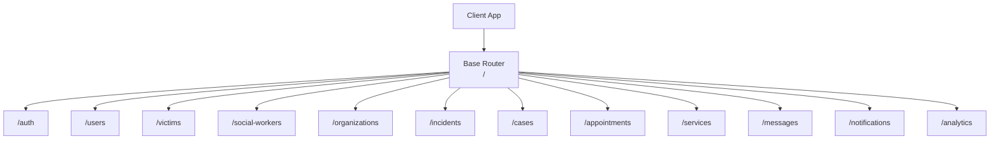
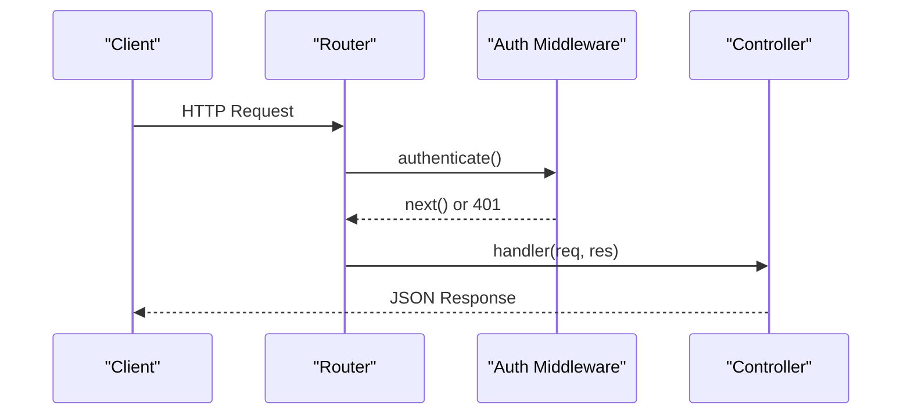
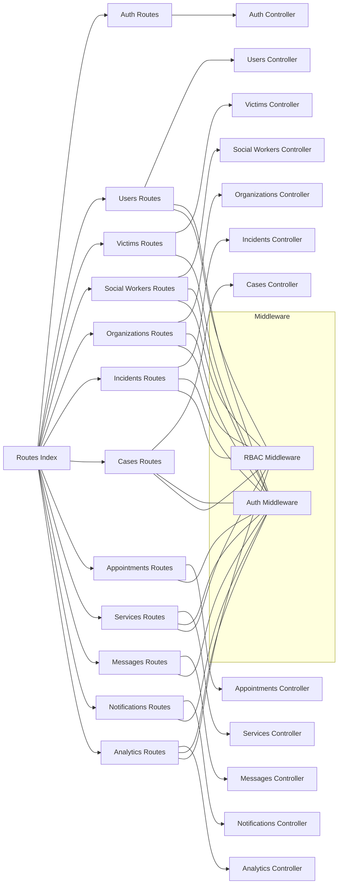
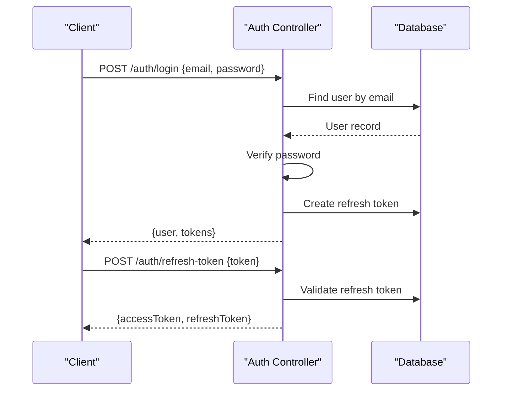

# API Reference

<cite>
**Referenced Files in This Document**
- [index.ts](file://backend-api/src/routes/index.ts)
- [auth.routes.ts](file://backend-api/src/routes/auth.routes.ts)
- [users.routes.ts](file://backend-api/src/routes/users.routes.ts)
- [victims.routes.ts](file://backend-api/src/routes/victims.routes.ts)
- [socialWorkers.routes.ts](file://backend-api/src/routes/socialWorkers.routes.ts)
- [organizations.routes.ts](file://backend-api/src/routes/organizations.routes.ts)
- [incidents.routes.ts](file://backend-api/src/routes/incidents.routes.ts)
- [cases.routes.ts](file://backend-api/src/routes/cases.routes.ts)
- [appointments.routes.ts](file://backend-api/src/routes/appointments.routes.ts)
- [services.routes.ts](file://backend-api/src/routes/services.routes.ts)
- [messages.routes.ts](file://backend-api/src/routes/messages.routes.ts)
- [notifications.routes.ts](file://backend-api/src/routes/notifications.routes.ts)
- [analytics.routes.ts](file://backend-api/src/routes/analytics.routes.ts)
- [auth.controller.ts](file://backend-api/src/controllers/auth.controller.ts)
- [auth.ts](file://backend-api/src/middleware/auth.ts)
</cite>

## Table of Contents
1. [Introduction](#introduction)
2. [Project Structure](#project-structure)
3. [Core Components](#core-components)
4. [Architecture Overview](#architecture-overview)
5. [Detailed Component Analysis](#detailed-component-analysis)
6. [Dependency Analysis](#dependency-analysis)
7. [Performance Considerations](#performance-considerations)
8. [Troubleshooting Guide](#troubleshooting-guide)
9. [Conclusion](#conclusion)
10. [Appendices](#appendices)

## Introduction
This document provides comprehensive API reference documentation for the SafeProtect Cameroon backend. It covers all REST endpoints grouped by feature: authentication, user management, victims, social workers, organizations, incidents, cases, appointments, services, messages, notifications, and analytics. For each endpoint group, you will find HTTP methods, URL patterns, authentication requirements, request/response schemas, validation rules, status codes, and example payloads. It also includes security considerations, best practices, rate limiting guidance, client integration examples, and troubleshooting tips.

## Project Structure
The API is organized as an Express application with modular route files that delegate to controllers. A central router mounts feature routes under a common base path. Authentication and authorization are enforced via middleware.

**Diagram sources**
- [index.ts:17-35](file://backend-api/src/routes/index.ts#L17-L35)

**Section sources**
- [index.ts:1-38](file://backend-api/src/routes/index.ts#L1-L38)

## Core Components
- Authentication: Register, login, refresh token, forgot password.
- Authorization: Bearer JWT access tokens validated by middleware; role-based access control (RBAC) using roles such as ADMIN, SOCIAL_WORKER, ORGANIZATION, VICTIM.
- Feature modules: Each domain has its own routes and controller functions.

Authentication flow highlights:
- Access tokens are validated on protected routes.
- Refresh tokens are stored server-side and rotated on use.

**Section sources**
- [auth.controller.ts:13-114](file://backend-api/src/controllers/auth.controller.ts#L13-L114)
- [auth.ts:5-19](file://backend-api/src/middleware/auth.ts#L5-L19)

## Architecture Overview
High-level request lifecycle:
- Client sends HTTP request to a feature route.
- Route applies authentication middleware to validate the Bearer token.
- Optional RBAC middleware checks the caller’s role against allowed roles.
- Controller handles business logic and returns JSON responses.

**Diagram sources**
- [auth.ts:5-19](file://backend-api/src/middleware/auth.ts#L5-L19)
- [index.ts:24-35](file://backend-api/src/routes/index.ts#L24-L35)

## Detailed Component Analysis

### Authentication
Endpoints:
- POST /auth/register
- POST /auth/login
- POST /auth/refresh-token
- POST /auth/forgot-password

Authentication: None required for register/login/refresh-token/forgot-password.

Request schemas:
- POST /auth/register
  - Body: name (string, required), email (string, required), phone (string, optional), password (string, required)
  - Validation: name/email/password must be present; email must be unique
  - Status: 201 Created on success; 400 Bad Request if validation fails; 500 Server Error on unexpected errors
  - Response: { user: UserWithoutPassword, tokens: { accessToken, refreshToken } }

- POST /auth/login
  - Body: email (string, required), password (string, required)
  - Validation: credentials must match a registered user
  - Status: 200 OK on success; 400 Bad Request for invalid credentials; 500 Server Error
  - Response: { user: UserWithoutPassword, tokens: { accessToken, refreshToken } }

- POST /auth/refresh-token
  - Body: token (string, required) — refresh token
  - Validation: token must exist and not be expired
  - Status: 200 OK on success; 400 Bad Request if missing; 401 Unauthorized if invalid/expired; 500 Server Error
  - Response: { accessToken, refreshToken }

- POST /auth/forgot-password
  - Body: none (or email depending on implementation)
  - Status: 200 OK (placeholder response)

Notes:
- Passwords are hashed before storage.
- Refresh tokens are persisted and rotated on successful refresh.

Example request/response references:
- Register: [auth.controller.ts:13-51](file://backend-api/src/controllers/auth.controller.ts#L13-L51)
- Login: [auth.controller.ts:54-82](file://backend-api/src/controllers/auth.controller.ts#L54-L82)
- Refresh Token: [auth.controller.ts:85-109](file://backend-api/src/controllers/auth.controller.ts#L85-L109)
- Forgot Password: [auth.controller.ts:112-114](file://backend-api/src/controllers/auth.controller.ts#L112-L114)

Security considerations:
- Use HTTPS for all requests.
- Store tokens securely on the client (e.g., httpOnly cookies or secure storage).
- Rotate refresh tokens on use and invalidate old ones after logout.

Rate limiting:
- Not implemented in code; recommended to add per-IP and per-user limits for auth endpoints.

**Section sources**
- [auth.routes.ts:6-9](file://backend-api/src/routes/auth.routes.ts#L6-L9)
- [auth.controller.ts:13-114](file://backend-api/src/controllers/auth.controller.ts#L13-L114)

### Users
Endpoints:
- GET /users
- GET /users/:id
- PUT /users/:id
- DELETE /users/:id

Authentication: Required (Bearer token).
Authorization: Admin only.

Request schemas:
- GET /users
  - Query: optional filters (implementation-dependent)
  - Response: Array of users (without sensitive fields)

- GET /users/:id
  - Path: id (string, required)
  - Response: User object (without sensitive fields)

- PUT /users/:id
  - Path: id (string, required)
  - Body: fields to update (e.g., name, email, phone, role)
  - Response: Updated user

- DELETE /users/:id
  - Path: id (string, required)
  - Response: Confirmation or deleted user

Status codes:
- 200 OK on success
- 401 Unauthorized if token missing/invalid
- 403 Forbidden if insufficient role
- 404 Not Found if user does not exist
- 400 Bad Request for validation errors
- 500 Server Error on unexpected failures

Example references:
- Routes: [users.routes.ts:9-13](file://backend-api/src/routes/users.routes.ts#L9-L13)

**Section sources**
- [users.routes.ts:1-16](file://backend-api/src/routes/users.routes.ts#L1-L16)

### Victims
Endpoints:
- GET /victims/me
- PUT /victims/me
- POST /victims
- GET /victims
- GET /victims/:id
- PUT /victims/:id
- DELETE /victims/:id

Authentication: Required.
Authorization:
- /me: current victim can access own profile
- POST/GET list: ADMIN or SOCIAL_WORKER
- GET/:id: authenticated user (implementation may restrict visibility)
- PUT/:id: authorized based on context
- DELETE/:id: ADMIN only

Request schemas:
- GET /victims/me
  - Response: Victim profile

- PUT /victims/me
  - Body: fields to update (name, phone, etc.)
  - Response: Updated victim profile

- POST /victims
  - Body: victim details (name, email, phone, etc.)
  - Response: Created victim

- GET /victims
  - Response: List of victims

- GET /victims/:id
  - Path: id (string, required)
  - Response: Victim profile

- PUT /victims/:id
  - Path: id (string, required)
  - Body: fields to update
  - Response: Updated victim

- DELETE /victims/:id
  - Path: id (string, required)
  - Response: Confirmation

Status codes:
- 200 OK on success
- 201 Created for creation
- 401 Unauthorized
- 403 Forbidden
- 404 Not Found
- 400 Bad Request
- 500 Server Error

Example references:
- Routes: [victims.routes.ts:9-17](file://backend-api/src/routes/victims.routes.ts#L9-L17)

**Section sources**
- [victims.routes.ts:1-20](file://backend-api/src/routes/victims.routes.ts#L1-L20)

### Social Workers
Endpoints:
- GET /social-workers/me
- PUT /social-workers/me
- POST /social-workers
- GET /social-workers
- GET /social-workers/:id
- PUT /social-workers/:id
- DELETE /social-workers/:id

Authentication: Required.
Authorization:
- /me: current social worker
- POST/GET list: ADMIN only
- GET/:id: authenticated user (visibility may vary)
- PUT/:id: authorized based on context
- DELETE/:id: ADMIN only

Request schemas:
- Similar structure to victims endpoints with social worker fields.

Status codes: Same as victims.

Example references:
- Routes: [socialWorkers.routes.ts:9-17](file://backend-api/src/routes/socialWorkers.routes.ts#L9-L17)

**Section sources**
- [socialWorkers.routes.ts:1-20](file://backend-api/src/routes/socialWorkers.routes.ts#L1-L20)

### Organizations
Endpoints:
- POST /organizations
- GET /organizations
- GET /organizations/:id
- PUT /organizations/:id
- DELETE /organizations/:id

Authentication: Required.
Authorization:
- POST/DELETE: ADMIN
- GET list/details: authenticated users
- PUT: ADMIN or ORGANIZATION role

Request schemas:
- POST /organizations
  - Body: organization details (name, contact, etc.)
  - Response: Created organization

- GET /organizations
  - Response: List of organizations

- GET /organizations/:id
  - Path: id (string, required)
  - Response: Organization details

- PUT /organizations/:id
  - Path: id (string, required)
  - Body: fields to update
  - Response: Updated organization

- DELETE /organizations/:id
  - Path: id (string, required)
  - Response: Confirmation

Status codes:
- 200 OK on success
- 201 Created for creation
- 401 Unauthorized
- 403 Forbidden
- 404 Not Found
- 400 Bad Request
- 500 Server Error

Example references:
- Routes: [organizations.routes.ts:9-14](file://backend-api/src/routes/organizations.routes.ts#L9-L14)

**Section sources**
- [organizations.routes.ts:1-17](file://backend-api/src/routes/organizations.routes.ts#L1-L17)

### Incidents
Endpoints:
- POST /incidents
- GET /incidents
- GET /incidents/victim/:victimId
- GET /incidents/:id
- PUT /incidents/:id
- DELETE /incidents/:id

Authentication: Required.
Authorization:
- POST: authenticated user (victim or authorized reporter)
- GET list: ADMIN or SOCIAL_WORKER
- GET by victim: authenticated user (victim or authorized)
- GET/:id: authenticated user
- PUT/:id: ADMIN or SOCIAL_WORKER
- DELETE/:id: ADMIN only

Request schemas:
- POST /incidents
  - Body: incident details (title, description, category, location, date/time, severity, etc.)
  - File upload: evidence (single file field named "evidence")
  - Response: Created incident

- GET /incidents
  - Query: optional filters (status, category, date range)
  - Response: List of incidents

- GET /incidents/victim/:victimId
  - Path: victimId (string, required)
  - Response: Incidents for victim

- GET /incidents/:id
  - Path: id (string, required)
  - Response: Incident details

- PUT /incidents/:id
  - Path: id (string, required)
  - Body: fields to update
  - Response: Updated incident

- DELETE /incidents/:id
  - Path: id (string, required)
  - Response: Confirmation

Status codes:
- 200 OK on success
- 201 Created for creation
- 401 Unauthorized
- 403 Forbidden
- 404 Not Found
- 400 Bad Request
- 500 Server Error

File upload note:
- Single file upload via multipart/form-data with field name "evidence".

Example references:
- Routes: [incidents.routes.ts:10-20](file://backend-api/src/routes/incidents.routes.ts#L10-L20)

**Section sources**
- [incidents.routes.ts:1-23](file://backend-api/src/routes/incidents.routes.ts#L1-L23)

### Cases
Endpoints:
- POST /cases
- GET /cases
- GET /cases/:id
- PUT /cases/:id/assign
- PUT /cases/:id/status
- PATCH /cases/:id
- POST /cases/:id/notes
- DELETE /cases/:id

Authentication: Required.
Authorization:
- POST: ADMIN or SOCIAL_WORKER
- GET list/details: authenticated user (may be filtered by role)
- PUT assign: ADMIN
- PUT status: ADMIN or SOCIAL_WORKER
- PATCH update: ADMIN or SOCIAL_WORKER
- POST notes: ADMIN or SOCIAL_WORKER
- DELETE: ADMIN

Request schemas:
- POST /cases
  - Body: case details (title, description, related incident, priority, etc.)
  - Response: Created case

- GET /cases
  - Query: filters (status, assignee, date range)
  - Response: List of cases

- GET /cases/:id
  - Path: id (string, required)
  - Response: Case details

- PUT /cases/:id/assign
  - Path: id (string, required)
  - Body: assigneeId (string, required)
  - Response: Updated case

- PUT /cases/:id/status
  - Path: id (string, required)
  - Body: status (enum)
  - Response: Updated case

- PATCH /cases/:id
  - Path: id (string, required)
  - Body: fields to update
  - Response: Updated case

- POST /cases/:id/notes
  - Path: id (string, required)
  - Body: note content
  - Response: Added note

- DELETE /cases/:id
  - Path: id (string, required)
  - Response: Confirmation

Status codes:
- 200 OK on success
- 201 Created for creation
- 401 Unauthorized
- 403 Forbidden
- 404 Not Found
- 400 Bad Request
- 500 Server Error

Example references:
- Routes: [cases.routes.ts:9-17](file://backend-api/src/routes/cases.routes.ts#L9-L17)

**Section sources**
- [cases.routes.ts:1-20](file://backend-api/src/routes/cases.routes.ts#L1-L20)

### Appointments
Endpoints:
- POST /appointments
- GET /appointments
- GET /appointments/:id
- PUT /appointments/:id
- PUT /appointments/:id/accept
- PUT /appointments/:id/reschedule
- PUT /appointments/:id/complete
- DELETE /appointments/:id

Authentication: Required.
Authorization:
- Most operations require appropriate roles (e.g., SOCIAL_WORKER to accept/complete; victim to create/view own).

Request schemas:
- POST /appointments
  - Body: title, description, scheduledAt, duration, participantIds, etc.
  - Response: Created appointment

- GET /appointments
  - Query: filters (date range, participant, status)
  - Response: List of appointments

- GET /appointments/:id
  - Path: id (string, required)
  - Response: Appointment details

- PUT /appointments/:id
  - Path: id (string, required)
  - Body: fields to update
  - Response: Updated appointment

- PUT /appointments/:id/accept
  - Path: id (string, required)
  - Response: Accepted appointment

- PUT /appointments/:id/reschedule
  - Path: id (string, required)
  - Body: new scheduledAt
  - Response: Rescheduled appointment

- PUT /appointments/:id/complete
  - Path: id (string, required)
  - Response: Completed appointment

- DELETE /appointments/:id
  - Path: id (string, required)
  - Response: Confirmation

Status codes:
- 200 OK on success
- 201 Created for creation
- 401 Unauthorized
- 403 Forbidden
- 404 Not Found
- 400 Bad Request
- 500 Server Error

Example references:
- Routes: [appointments.routes.ts:7-15](file://backend-api/src/routes/appointments.routes.ts#L7-L15)

**Section sources**
- [appointments.routes.ts:1-18](file://backend-api/src/routes/appointments.routes.ts#L1-L18)

### Services
Endpoints:
- POST /services
- GET /services
- GET /services/organization/:orgId
- GET /services/:id
- PUT /services/:id
- DELETE /services/:id

Authentication: Required.
Authorization:
- POST/PUT/DELETE: ADMIN or ORGANIZATION
- GET list/details: authenticated users

Request schemas:
- POST /services
  - Body: service details (name, description, orgId, availability, etc.)
  - Response: Created service

- GET /services
  - Query: filters (category, orgId)
  - Response: List of services

- GET /services/organization/:orgId
  - Path: orgId (string, required)
  - Response: Services for organization

- GET /services/:id
  - Path: id (string, required)
  - Response: Service details

- PUT /services/:id
  - Path: id (string, required)
  - Body: fields to update
  - Response: Updated service

- DELETE /services/:id
  - Path: id (string, required)
  - Response: Confirmation

Status codes:
- 200 OK on success
- 201 Created for creation
- 401 Unauthorized
- 403 Forbidden
- 404 Not Found
- 400 Bad Request
- 500 Server Error

Example references:
- Routes: [services.routes.ts:9-15](file://backend-api/src/routes/services.routes.ts#L9-L15)

**Section sources**
- [services.routes.ts:1-18](file://backend-api/src/routes/services.routes.ts#L1-L18)

### Messages
Endpoints:
- POST /messages
- GET /messages/threads
- GET /messages/:userId
- PUT /messages/:id/read

Authentication: Required.
Authorization:
- All endpoints require authentication; visibility typically scoped to participants.

Request schemas:
- POST /messages
  - Body: recipientId, content, attachments (optional)
  - Response: Created message

- GET /messages/threads
  - Query: filters (participant, lastN)
  - Response: Thread summaries

- GET /messages/:userId
  - Path: userId (string, required)
  - Response: Conversation with user

- PUT /messages/:id/read
  - Path: id (string, required)
  - Response: Marked as read

Status codes:
- 200 OK on success
- 201 Created for creation
- 401 Unauthorized
- 403 Forbidden
- 404 Not Found
- 400 Bad Request
- 500 Server Error

Example references:
- Routes: [messages.routes.ts:7-11](file://backend-api/src/routes/messages.routes.ts#L7-L11)

**Section sources**
- [messages.routes.ts:1-14](file://backend-api/src/routes/messages.routes.ts#L1-L14)

### Notifications
Endpoints:
- GET /notifications
- PUT /notifications/:id/read
- PUT /notifications/read-all

Authentication: Required.
Authorization:
- All endpoints require authentication; notifications scoped to the current user.

Request schemas:
- GET /notifications
  - Query: filters (unread, type, date range)
  - Response: List of notifications

- PUT /notifications/:id/read
  - Path: id (string, required)
  - Response: Marked as read

- PUT /notifications/read-all
  - Response: All marked as read

Status codes:
- 200 OK on success
- 401 Unauthorized
- 403 Forbidden
- 404 Not Found
- 400 Bad Request
- 500 Server Error

Example references:
- Routes: [notifications.routes.ts:7-10](file://backend-api/src/routes/notifications.routes.ts#L7-L10)

**Section sources**
- [notifications.routes.ts:1-13](file://backend-api/src/routes/notifications.routes.ts#L1-L13)

### Analytics
Endpoints:
- GET /analytics/dashboard
- GET /analytics/reports-by-time
- GET /analytics/reports-by-category
- GET /analytics/cases-by-status

Authentication: Required.
Authorization:
- Dashboard stats: all authenticated users
- Reports and detailed analytics: ADMIN or SOCIAL_WORKER

Request schemas:
- GET /analytics/dashboard
  - Query: optional time window
  - Response: Dashboard metrics

- GET /analytics/reports-by-time
  - Query: time range, granularity
  - Response: Time-series report data

- GET /analytics/reports-by-category
  - Query: category filters
  - Response: Category breakdown

- GET /analytics/cases-by-status
  - Query: status filters
  - Response: Status distribution

Status codes:
- 200 OK on success
- 401 Unauthorized
- 403 Forbidden
- 400 Bad Request
- 500 Server Error

Example references:
- Routes: [analytics.routes.ts:9-17](file://backend-api/src/routes/analytics.routes.ts#L9-L17)

**Section sources**
- [analytics.routes.ts:1-20](file://backend-api/src/routes/analytics.routes.ts#L1-L20)

## Dependency Analysis
Route-to-controller dependencies and middleware usage:

**Diagram sources**
- [index.ts:24-35](file://backend-api/src/routes/index.ts#L24-L35)
- [auth.ts:5-19](file://backend-api/src/middleware/auth.ts#L5-L19)

**Section sources**
- [index.ts:1-38](file://backend-api/src/routes/index.ts#L1-L38)
- [auth.ts:1-20](file://backend-api/src/middleware/auth.ts#L1-L20)

## Performance Considerations
- Pagination and filtering: Implement query parameters for large lists (users, incidents, cases, appointments).
- Database indexing: Ensure indexes on frequently queried fields (email, victimId, userId, status, timestamps).
- Caching: Cache read-heavy analytics and dashboard endpoints where appropriate.
- File uploads: Validate size and type for incident evidence; consider CDN or object storage.
- Rate limiting: Add per-endpoint and per-user limits, especially for auth and messaging.
- Connection pooling: Configure database connection pool settings for high concurrency.

[No sources needed since this section provides general guidance]

## Troubleshooting Guide
Common issues and resolutions:
- 401 Unauthorized
  - Cause: Missing or invalid Bearer token
  - Resolution: Ensure Authorization header is set correctly; refresh token if expired
  - Reference: [auth.ts:5-19](file://backend-api/src/middleware/auth.ts#L5-L19)

- 403 Forbidden
  - Cause: Insufficient role for the requested operation
  - Resolution: Verify user role and endpoint permissions
  - Reference: Role checks in various routes (e.g., users, incidents, cases)

- 400 Bad Request
  - Cause: Missing required fields or validation failure
  - Resolution: Check request body schema and constraints
  - Reference: Auth register/login validation

- 404 Not Found
  - Cause: Resource ID does not exist
  - Resolution: Verify IDs and resource existence

- 500 Server Error
  - Cause: Unexpected server-side error
  - Resolution: Check logs and stack traces; ensure database connectivity

Best practices:
- Always handle error responses gracefully on the client.
- Log correlation IDs for tracing requests across services.
- Use retries with exponential backoff for transient network errors.

**Section sources**
- [auth.ts:5-19](file://backend-api/src/middleware/auth.ts#L5-L19)
- [auth.controller.ts:13-114](file://backend-api/src/controllers/auth.controller.ts#L13-L114)

## Conclusion
The SafeProtect Cameroon backend exposes a comprehensive set of REST APIs covering authentication, user management, incident reporting, case management, messaging, appointments, services, notifications, and analytics. Endpoints are secured with JWT authentication and role-based access control. Clients should implement robust error handling, token refresh, and adhere to best practices for security and performance.

[No sources needed since this section summarizes without analyzing specific files]

## Appendices

### Authentication Flow Sequence

**Diagram sources**
- [auth.controller.ts:54-109](file://backend-api/src/controllers/auth.controller.ts#L54-L109)

### Example Requests and Responses
- Register
  - Request: POST /auth/register
  - Body: { name, email, phone?, password }
  - Response: 201 { user, tokens }
  - Reference: [auth.controller.ts:13-51](file://backend-api/src/controllers/auth.controller.ts#L13-L51)

- Login
  - Request: POST /auth/login
  - Body: { email, password }
  - Response: 200 { user, tokens }
  - Reference: [auth.controller.ts:54-82](file://backend-api/src/controllers/auth.controller.ts#L54-L82)

- Refresh Token
  - Request: POST /auth/refresh-token
  - Body: { token }
  - Response: 200 { accessToken, refreshToken }
  - Reference: [auth.controller.ts:85-109](file://backend-api/src/controllers/auth.controller.ts#L85-L109)

- Create Incident with Evidence
  - Request: POST /incidents
  - Headers: Content-Type: multipart/form-data
  - Body: form fields + evidence file
  - Response: 201 { incident }
  - Reference: [incidents.routes.ts:10-11](file://backend-api/src/routes/incidents.routes.ts#L10-L11)

- Get Dashboard Stats
  - Request: GET /analytics/dashboard
  - Headers: Authorization: Bearer <token>
  - Response: 200 { metrics }
  - Reference: [analytics.routes.ts:11-12](file://backend-api/src/routes/analytics.routes.ts#L11-L12)

[No additional sources beyond those cited above]