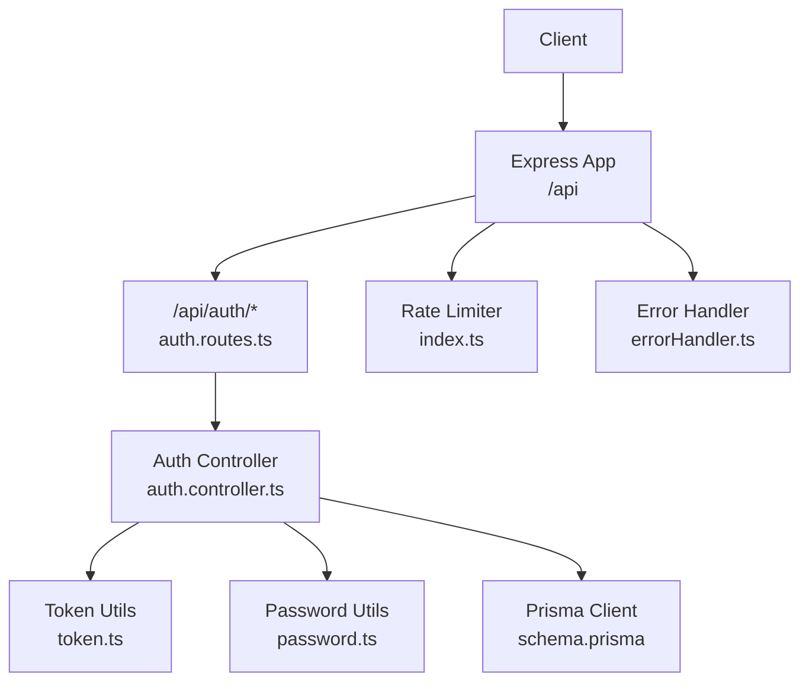
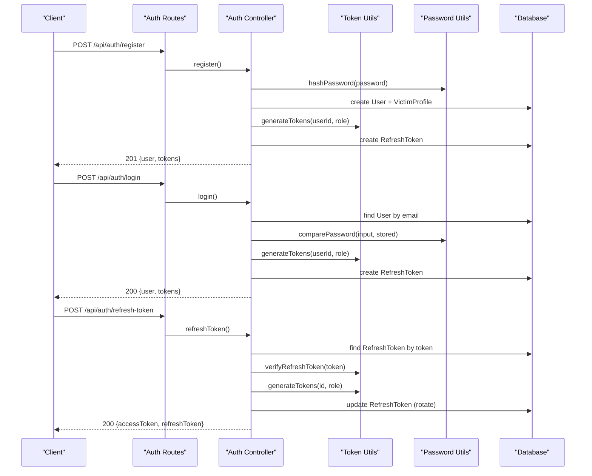
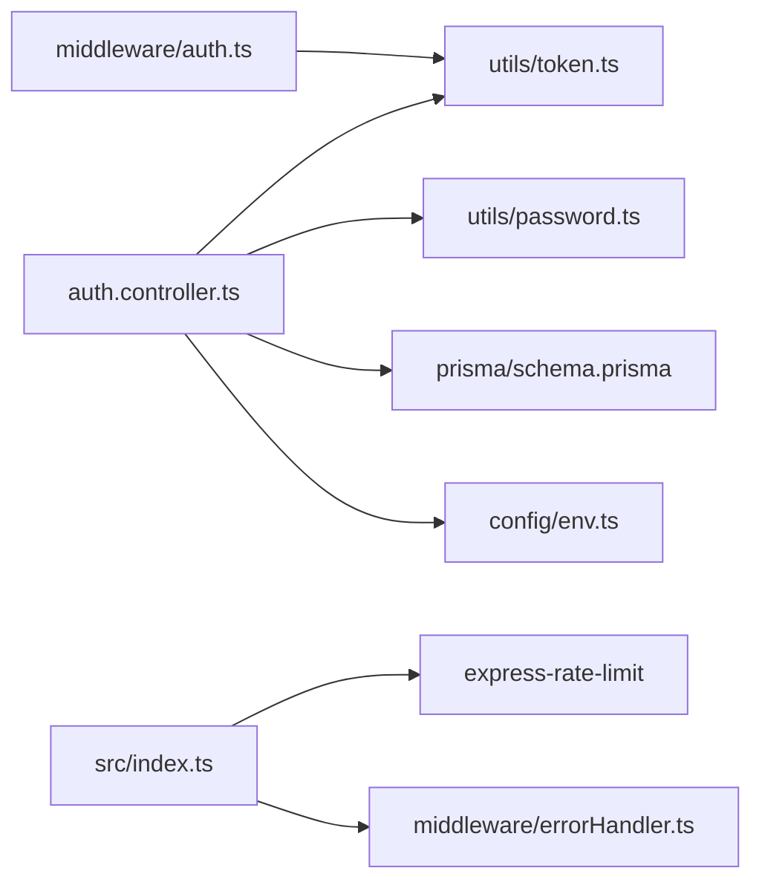

# Authentication Endpoints

<cite>
**Referenced Files in This Document**
- [auth.controller.ts](file://backend-api/src/controllers/auth.controller.ts)
- [auth.routes.ts](file://backend-api/src/routes/auth.routes.ts)
- [routes/index.ts](file://backend-api/src/routes/index.ts)
- [index.ts](file://backend-api/src/index.ts)
- [auth.ts](file://backend-api/src/middleware/auth.ts)
- [token.ts](file://backend-api/src/utils/token.ts)
- [password.ts](file://backend-api/src/utils/password.ts)
- [env.ts](file://backend-api/src/config/env.ts)
- [schema.prisma](file://backend-api/prisma/schema.prisma)
- [validate.ts](file://backend-api/src/middleware/validate.ts)
- [errorHandler.ts](file://backend-api/src/middleware/errorHandler.ts)
</cite>

## Table of Contents
1. [Introduction](#introduction)
2. [Project Structure](#project-structure)
3. [Core Components](#core-components)
4. [Architecture Overview](#architecture-overview)
5. [Detailed Component Analysis](#detailed-component-analysis)
6. [Dependency Analysis](#dependency-analysis)
7. [Performance Considerations](#performance-considerations)
8. [Troubleshooting Guide](#troubleshooting-guide)
9. [Conclusion](#conclusion)

## Introduction
This document provides comprehensive API documentation for authentication endpoints in the SafeProtect Cameroon system. It covers user registration, login, token refresh, and password reset functionality, including request/response schemas, validation rules, JWT handling, session management, security considerations, rate limiting, and best practices.

## Project Structure
Authentication is implemented as a set of Express routes under /api/auth, backed by controllers, middleware, utilities, and Prisma-managed database models. The application mounts all feature routers under /api, with the auth router mounted at /api/auth.

**Diagram sources**
- [index.ts:10-33](file://backend-api/src/index.ts#L10-L33)
- [routes/index.ts:15-35](file://backend-api/src/routes/index.ts#L15-L35)
- [auth.routes.ts:1-12](file://backend-api/src/routes/auth.routes.ts#L1-L12)
- [auth.controller.ts:1-115](file://backend-api/src/controllers/auth.controller.ts#L1-L115)
- [token.ts:1-17](file://backend-api/src/utils/token.ts#L1-L17)
- [password.ts:1-11](file://backend-api/src/utils/password.ts#L1-L11)
- [schema.prisma:47-68](file://backend-api/prisma/schema.prisma#L47-L68)
- [schema.prisma:200-208](file://backend-api/prisma/schema.prisma#L200-L208)

**Section sources**
- [index.ts:10-33](file://backend-api/src/index.ts#L10-L33)
- [routes/index.ts:15-35](file://backend-api/src/routes/index.ts#L15-L35)
- [auth.routes.ts:1-12](file://backend-api/src/routes/auth.routes.ts#L1-L12)

## Core Components
- Authentication controller: Implements register, login, refresh-token, and forgot-password handlers.
- Token utilities: Generate and verify access and refresh tokens using JWT.
- Password utilities: Hash and compare passwords securely.
- Environment configuration: Validates required environment variables (JWT secrets, port, database URL).
- Database schema: Defines User and RefreshToken models used by authentication flows.
- Middleware: Global rate limiter and error handler; optional authentication middleware for protected routes.

Key responsibilities:
- Input validation and sanitization are handled within controllers and shared validation middleware.
- Tokens are stored in-memory via JWT; refresh tokens are persisted to the database with expiration.
- Security headers are applied globally via Helmet; CORS is enabled.

**Section sources**
- [auth.controller.ts:13-114](file://backend-api/src/controllers/auth.controller.ts#L13-L114)
- [token.ts:4-16](file://backend-api/src/utils/token.ts#L4-L16)
- [password.ts:3-10](file://backend-api/src/utils/password.ts#L3-L10)
- [env.ts:6-13](file://backend-api/src/config/env.ts#L6-L13)
- [schema.prisma:47-68](file://backend-api/prisma/schema.prisma#L47-L68)
- [schema.prisma:200-208](file://backend-api/prisma/schema.prisma#L200-L208)

## Architecture Overview
The authentication flow uses short-lived access tokens and longer-lived refresh tokens. On successful login or registration, both tokens are issued and a refresh token record is created in the database. Protected endpoints require a Bearer access token validated by middleware.

**Diagram sources**
- [auth.routes.ts:6-9](file://backend-api/src/routes/auth.routes.ts#L6-L9)
- [auth.controller.ts:13-114](file://backend-api/src/controllers/auth.controller.ts#L13-L114)
- [token.ts:4-16](file://backend-api/src/utils/token.ts#L4-L16)
- [password.ts:3-10](file://backend-api/src/utils/password.ts#L3-L10)
- [schema.prisma:47-68](file://backend-api/prisma/schema.prisma#L47-L68)
- [schema.prisma:200-208](file://backend-api/prisma/schema.prisma#L200-L208)

## Detailed Component Analysis

### Base Information
- Base URL: /api/auth
- Content-Type: application/json
- All endpoints return JSON responses with an error field on failure and data fields on success.

**Section sources**
- [routes/index.ts:24-24](file://backend-api/src/routes/index.ts#L24-L24)
- [auth.routes.ts:6-9](file://backend-api/src/routes/auth.routes.ts#L6-L9)

### Register
- Method: POST
- URL: /api/auth/register
- Authentication: None
- Request body:
  - name: string, required
  - email: string, required, unique in database
  - phone: string, optional
  - password: string, required
- Validation:
  - Required fields enforced in controller
  - Email uniqueness checked against User model
- Success response (201):
  - user: object excluding password
  - tokens: { accessToken, refreshToken }
- Error responses:
  - 400: Missing required fields or email already in use
  - 500: Server error

Notes:
- Passwords are hashed before storage.
- A victim profile is created automatically upon registration.
- A refresh token is persisted with a 7-day expiry.

**Section sources**
- [auth.controller.ts:13-52](file://backend-api/src/controllers/auth.controller.ts#L13-L52)
- [schema.prisma:47-68](file://backend-api/prisma/schema.prisma#L47-L68)
- [schema.prisma:200-208](file://backend-api/prisma/schema.prisma#L200-L208)

### Login
- Method: POST
- URL: /api/auth/login
- Authentication: None
- Request body:
  - email: string, required
  - password: string, required
- Validation:
  - Credentials verified against stored hash
- Success response (200):
  - user: object excluding password
  - tokens: { accessToken, refreshToken }
- Error responses:
  - 400: Invalid credentials
  - 500: Server error

Notes:
- On success, a new refresh token is created and persisted.

**Section sources**
- [auth.controller.ts:54-83](file://backend-api/src/controllers/auth.controller.ts#L54-L83)
- [schema.prisma:47-68](file://backend-api/prisma/schema.prisma#L47-L68)
- [schema.prisma:200-208](file://backend-api/prisma/schema.prisma#L200-L208)

### Refresh Token
- Method: POST
- URL: /api/auth/refresh-token
- Authentication: None
- Request body:
  - token: string, required (refresh token)
- Validation:
  - Token must exist and not be expired
  - Token signature verified against refresh secret
- Success response (200):
  - tokens: { accessToken, refreshToken }
- Error responses:
  - 400: No token provided
  - 401: Invalid or expired refresh token

Notes:
- On refresh, the stored refresh token is rotated (updated with a new value and expiry).

**Section sources**
- [auth.controller.ts:85-110](file://backend-api/src/controllers/auth.controller.ts#L85-L110)
- [token.ts:14-16](file://backend-api/src/utils/token.ts#L14-L16)
- [schema.prisma:200-208](file://backend-api/prisma/schema.prisma#L200-L208)

### Forgot Password
- Method: POST
- URL: /api/auth/forgot-password
- Authentication: None
- Request body: Not defined in current implementation
- Response:
  - 200: { message: "Password reset link sent" }

Notes:
- Placeholder endpoint; actual email/reset logic not implemented.

**Section sources**
- [auth.controller.ts:112-114](file://backend-api/src/controllers/auth.controller.ts#L112-L114)

### Logout
- Method: Not implemented
- Notes:
  - There is no logout endpoint in the current codebase. Clients should clear locally stored tokens. If server-side invalidation is required, extend the refresh token store to support revocation.

**Section sources**
- [auth.routes.ts:6-9](file://backend-api/src/routes/auth.routes.ts#L6-L9)

### Accessing Protected Endpoints
- Authorization header: Bearer <accessToken>
- Middleware validates the access token and attaches user context to the request.
- Failure returns 401 Unauthorized or Invalid token.

**Section sources**
- [auth.ts:5-19](file://backend-api/src/middleware/auth.ts#L5-L19)

## Dependency Analysis
Authentication depends on:
- Express routing and middleware stack
- JWT library for token signing/verification
- bcryptjs for password hashing
- Prisma client for database operations
- Environment variables for secrets and configuration

**Diagram sources**
- [auth.controller.ts:1-115](file://backend-api/src/controllers/auth.controller.ts#L1-115)
- [token.ts:1-17](file://backend-api/src/utils/token.ts#L1-L17)
- [password.ts:1-11](file://backend-api/src/utils/password.ts#L1-L11)
- [schema.prisma:47-68](file://backend-api/prisma/schema.prisma#L47-L68)
- [schema.prisma:200-208](file://backend-api/prisma/schema.prisma#L200-L208)
- [env.ts:1-14](file://backend-api/src/config/env.ts#L1-L14)
- [auth.ts:1-20](file://backend-api/src/middleware/auth.ts#L1-L20)
- [index.ts:1-34](file://backend-api/src/index.ts#L1-L34)

**Section sources**
- [auth.controller.ts:1-115](file://backend-api/src/controllers/auth.controller.ts#L1-L115)
- [token.ts:1-17](file://backend-api/src/utils/token.ts#L1-L17)
- [password.ts:1-11](file://backend-api/src/utils/password.ts#L1-L11)
- [env.ts:1-14](file://backend-api/src/config/env.ts#L1-L14)
- [auth.ts:1-20](file://backend-api/src/middleware/auth.ts#L1-L20)
- [index.ts:1-34](file://backend-api/src/index.ts#L1-L34)

## Performance Considerations
- Token lifetimes:
  - Access tokens: short-lived (15 minutes) to minimize exposure window.
  - Refresh tokens: longer-lived (7 days) with rotation on each refresh.
- Database writes:
  - Registration and login write one refresh token per session; ensure indexes on token and userId columns for performance.
- Rate limiting:
  - Global rate limiter configured at 100 requests per 15-minute window. Consider tighter limits for sensitive endpoints like login and refresh-token.
- Password hashing:
  - Uses bcrypt with a high cost factor; acceptable for typical workloads but monitor CPU usage during peak loads.

[No sources needed since this section provides general guidance]

## Troubleshooting Guide
Common errors and causes:
- 400 Bad Request:
  - Missing required fields in register or login payloads.
  - Email already in use during registration.
  - No token provided in refresh-token request.
- 401 Unauthorized:
  - Invalid or expired refresh token.
  - Missing or malformed Authorization header on protected endpoints.
  - Invalid access token signature or expired token.
- 500 Internal Server Error:
  - Unexpected exceptions in controllers or database operations.

Debugging tips:
- Verify environment variables for JWT secrets and database URL.
- Check that the database contains valid User and RefreshToken records.
- Inspect global error handler output for stack traces.

**Section sources**
- [auth.controller.ts:13-114](file://backend-api/src/controllers/auth.controller.ts#L13-L114)
- [auth.ts:5-19](file://backend-api/src/middleware/auth.ts#L5-L19)
- [errorHandler.ts:3-8](file://backend-api/src/middleware/errorHandler.ts#L3-L8)

## Security Considerations
- HTTPS: Enforce TLS in production to protect tokens in transit.
- Secrets management: Store JWT_SECRET and JWT_REFRESH_SECRET securely via environment variables.
- Token storage: Clients should store tokens securely (e.g., secure HTTP-only cookies or secure storage).
- CSRF: If using cookies for tokens, implement CSRF protections.
- Input validation: Use robust validation schemas (e.g., Zod) for all inputs.
- Rate limiting: Apply stricter limits on authentication endpoints to mitigate brute-force attacks.
- Account lockout: Implement account lockout after repeated failed attempts to prevent credential stuffing.
- Session management: Rotate refresh tokens on use and invalidate old tokens when users log out or change roles.
- Sensitive data: Ensure responses exclude sensitive fields (e.g., password) from user objects.

[No sources needed since this section provides general guidance]

## Conclusion
The SafeProtect authentication system implements standard JWT-based flows with short-lived access tokens and rotating refresh tokens. While core endpoints for register, login, and refresh-token are fully implemented, logout and password reset are not yet complete. Adopting the security recommendations above will strengthen the system’s resilience against common threats.

[No sources needed since this section summarizes without analyzing specific files]