# API Architecture & Server Setup

<cite>
**Referenced Files in This Document**
- [index.ts](file://backend-api/src/index.ts)
- [env.ts](file://backend-api/src/config/env.ts)
- [database.ts](file://backend-api/src/config/database.ts)
- [schema.prisma](file://backend-api/prisma/schema.prisma)
- [routes/index.ts](file://backend-api/src/routes/index.ts)
- [errorHandler.ts](file://backend-api/src/middleware/errorHandler.ts)
- [auth.ts](file://backend-api/src/middleware/auth.ts)
- [rbac.ts](file://backend-api/src/middleware/rbac.ts)
- [validate.ts](file://backend-api/src/middleware/validate.ts)
- [upload.ts](file://backend-api/src/middleware/upload.ts)
- [token.ts](file://backend-api/src/utils/token.ts)
- [types/index.ts](file://backend-api/src/types/index.ts)
- [package.json](file://backend-api/package.json)
- [docker-compose.yml](file://backend-api/docker-compose.yml)
</cite>

## Table of Contents
1. Introduction
2. Project Structure
3. Core Components
4. Architecture Overview
5. Detailed Component Analysis
6. Dependency Analysis
7. Performance Considerations
8. Troubleshooting Guide
9. Conclusion

## Introduction
This document explains the Backend API architecture and server setup for the SafeProtect application. It covers Express.js initialization, middleware configuration (CORS, Helmet, rate limiting, JSON parsing), environment configuration with dotenv, database connection via Prisma, route organization, error handling, static file serving for uploads, and server startup. Security configurations, performance considerations, and deployment notes are also included.

## Project Structure
The backend is an Express.js application organized by feature:
- Entry point initializes the app, applies global middleware, mounts routes, and starts the server.
- Configuration manages environment variables and database client.
- Middleware provides authentication, authorization, validation, upload handling, and centralized error handling.
- Routes group endpoints by domain (auth, users, incidents, cases, appointments, services, messages, notifications, analytics).
- Utilities include token generation/verification and other helpers.
- Prisma schema defines the data model and relations.

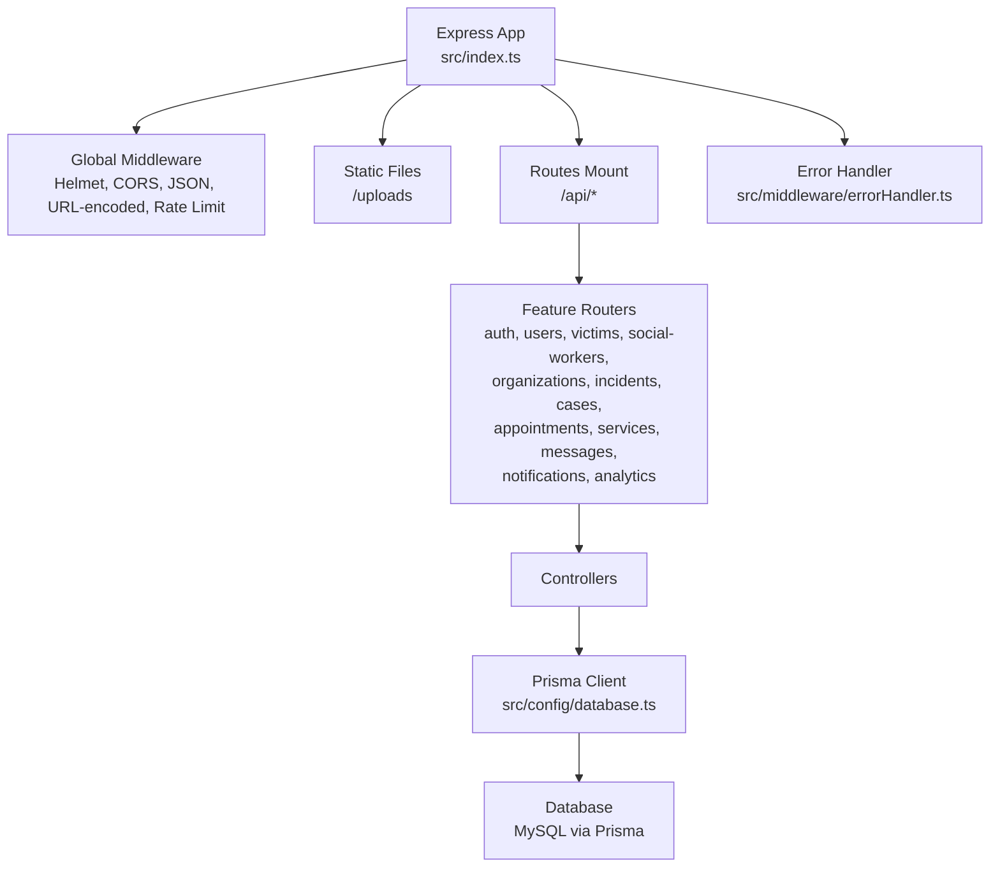

**Diagram sources**
- [index.ts:10-33](file://backend-api/src/index.ts#L10-L33)
- [routes/index.ts:15-37](file://backend-api/src/routes/index.ts#L15-L37)
- [database.ts:1-5](file://backend-api/src/config/database.ts#L1-L5)

**Section sources**
- [index.ts:10-33](file://backend-api/src/index.ts#L10-L33)
- [routes/index.ts:15-37](file://backend-api/src/routes/index.ts#L15-L37)

## Core Components
- Application bootstrap: Creates the Express app, registers security headers, CORS, body parsers, rate limiter, static files, routes, and error handler; then listens on a configured port.
- Environment configuration: Loads .env and validates required variables using Zod to ensure runtime safety.
- Database connection: Instantiates a single PrismaClient instance for use across controllers.
- Route organization: Central router mounts feature-specific routers under /api.
- Middleware:
  - Authentication: Validates Bearer tokens and attaches user context.
  - Authorization: Role-based access control based on roles from the token.
  - Validation: Uses Zod schemas to validate request bodies, queries, and params.
  - Uploads: Configures Multer disk storage for file uploads.
  - Error handling: Centralized error response formatter.
- Utilities: JWT token generation and verification using secrets from environment.

**Section sources**
- [index.ts:10-33](file://backend-api/src/index.ts#L10-L33)
- [env.ts:1-14](file://backend-api/src/config/env.ts#L1-L14)
- [database.ts:1-5](file://backend-api/src/config/database.ts#L1-L5)
- [routes/index.ts:15-37](file://backend-api/src/routes/index.ts#L15-L37)
- [auth.ts:5-19](file://backend-api/src/middleware/auth.ts#L5-L19)
- [rbac.ts:5-12](file://backend-api/src/middleware/rbac.ts#L5-L12)
- [validate.ts:4-17](file://backend-api/src/middleware/validate.ts#L4-L17)
- [upload.ts:1-20](file://backend-api/src/middleware/upload.ts#L1-L20)
- [errorHandler.ts:3-8](file://backend-api/src/middleware/errorHandler.ts#L3-L8)
- [token.ts:4-16](file://backend-api/src/utils/token.ts#L4-L16)

## Architecture Overview
The server follows a layered approach:
- Request enters Express, passes through global middleware (security, parsing, rate limiting).
- Static assets are served under /uploads.
- Requests to /api are routed to feature routers, which call controllers.
- Controllers interact with Prisma to read/write data.
- Errors are caught and normalized by the global error handler.

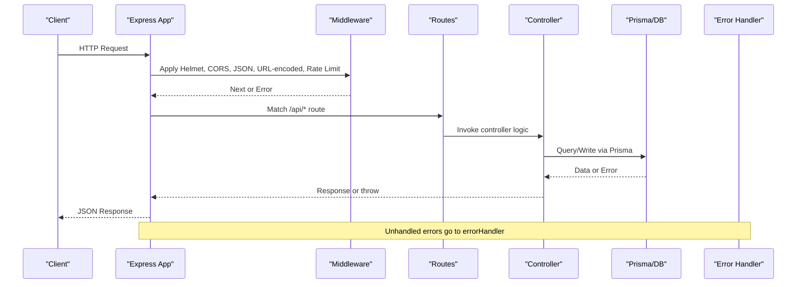

**Diagram sources**
- [index.ts:10-33](file://backend-api/src/index.ts#L10-L33)
- [routes/index.ts:15-37](file://backend-api/src/routes/index.ts#L15-L37)
- [errorHandler.ts:3-8](file://backend-api/src/middleware/errorHandler.ts#L3-L8)

## Detailed Component Analysis

### Express Initialization and Middleware
- Security headers via Helmet are applied globally.
- CORS is enabled for cross-origin requests.
- JSON and URL-encoded body parsing are registered.
- Rate limiting restricts requests to protect against abuse.
- Static files under /uploads are exposed for retrieved assets.
- The central error handler is mounted last to catch unhandled errors.

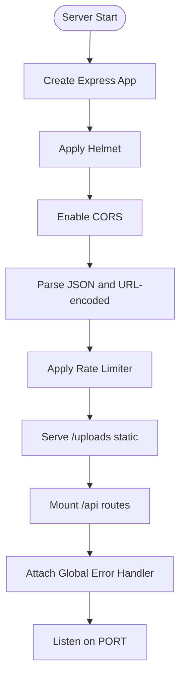

**Diagram sources**
- [index.ts:10-33](file://backend-api/src/index.ts#L10-L33)

**Section sources**
- [index.ts:10-33](file://backend-api/src/index.ts#L10-L33)

### Environment Configuration Management
- dotenv loads environment variables at startup.
- Zod validates required keys (PORT, DATABASE_URL, JWT_SECRET, JWT_REFRESH_SECRET) and provides defaults where applicable.
- All modules import the validated env object to ensure consistent configuration.

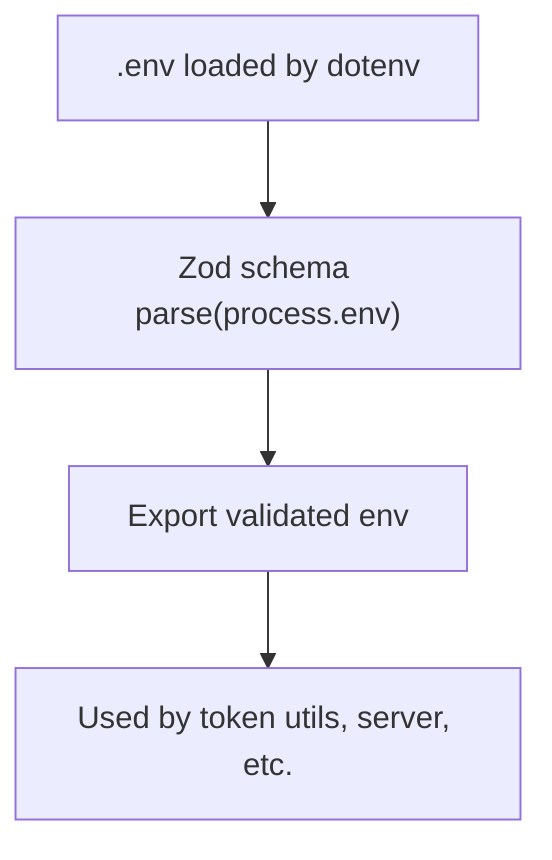

**Diagram sources**
- [env.ts:1-14](file://backend-api/src/config/env.ts#L1-L14)

**Section sources**
- [env.ts:1-14](file://backend-api/src/config/env.ts#L1-L14)

### Database Connection with Prisma
- A singleton PrismaClient is created and exported for reuse across controllers.
- The Prisma schema defines MySQL as the provider and reads the connection string from environment.
- Enums and models define core entities such as User, Victim, SocialWorker, Organization, Incident, Case, Appointment, Service, Message, Notification, AuditLog, RefreshToken.

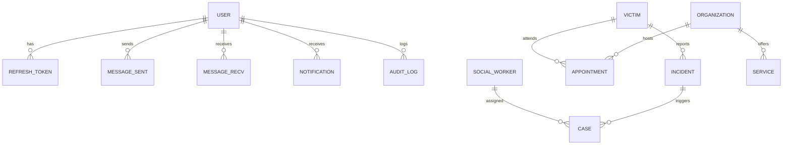

**Diagram sources**
- [schema.prisma:47-208](file://backend-api/prisma/schema.prisma#L47-L208)

**Section sources**
- [database.ts:1-5](file://backend-api/src/config/database.ts#L1-L5)
- [schema.prisma:1-208](file://backend-api/prisma/schema.prisma#L1-L208)

### Route Organization
- A central router aggregates feature routers under /api.
- Each feature router groups related endpoints (e.g., auth, users, incidents, cases, appointments, services, messages, notifications, analytics).
- A root endpoint returns API status and version.

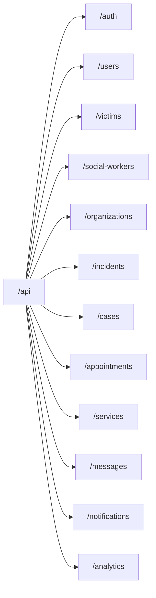

**Diagram sources**
- [routes/index.ts:15-37](file://backend-api/src/routes/index.ts#L15-L37)

**Section sources**
- [routes/index.ts:15-37](file://backend-api/src/routes/index.ts#L15-L37)

### Authentication and Authorization
- Authentication middleware checks for a valid Bearer token, verifies it, and attaches user info to the request.
- Authorization middleware enforces role-based access by comparing the authenticated user’s role against allowed roles.
- Token utilities generate short-lived access tokens and longer-lived refresh tokens, and verify them using environment secrets.

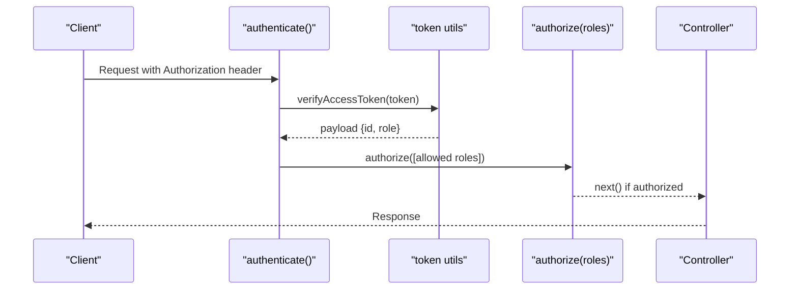

**Diagram sources**
- [auth.ts:5-19](file://backend-api/src/middleware/auth.ts#L5-L19)
- [rbac.ts:5-12](file://backend-api/src/middleware/rbac.ts#L5-L12)
- [token.ts:4-16](file://backend-api/src/utils/token.ts#L4-L16)

**Section sources**
- [auth.ts:5-19](file://backend-api/src/middleware/auth.ts#L5-L19)
- [rbac.ts:5-12](file://backend-api/src/middleware/rbac.ts#L5-L12)
- [token.ts:4-16](file://backend-api/src/utils/token.ts#L4-L16)
- [types/index.ts:4-9](file://backend-api/src/types/index.ts#L4-L9)

### Input Validation
- Validation middleware uses Zod schemas to validate request bodies, query parameters, and path parameters before reaching controllers.
- Invalid inputs return a 400 response with structured error details.

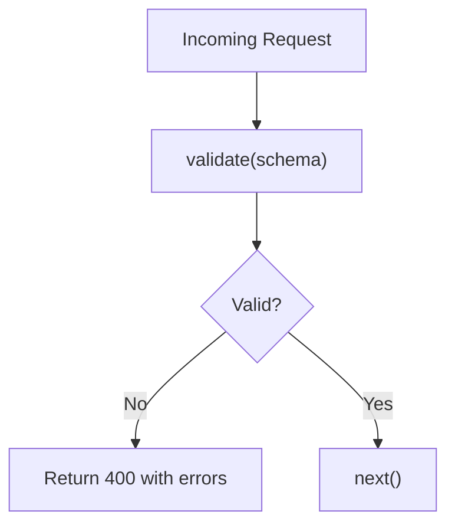

**Diagram sources**
- [validate.ts:4-17](file://backend-api/src/middleware/validate.ts#L4-L17)

**Section sources**
- [validate.ts:4-17](file://backend-api/src/middleware/validate.ts#L4-L17)

### File Uploads and Static Serving
- Multer is configured to store uploaded files on disk with unique filenames.
- The uploads directory is created automatically if missing.
- Static serving exposes the uploads folder under /uploads for retrieval.

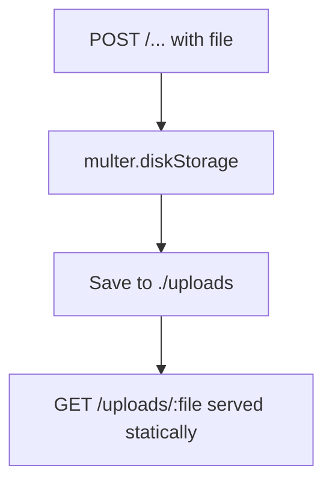

**Diagram sources**
- [upload.ts:1-20](file://backend-api/src/middleware/upload.ts#L1-L20)
- [index.ts:23-23](file://backend-api/src/index.ts#L23-L23)

**Section sources**
- [upload.ts:1-20](file://backend-api/src/middleware/upload.ts#L1-L20)
- [index.ts:23-23](file://backend-api/src/index.ts#L23-L23)

### Error Handling Strategy
- A global error handler catches thrown errors and formats responses with a consistent structure.
- Controllers should throw errors with appropriate status codes or return standardized error objects to be handled centrally.

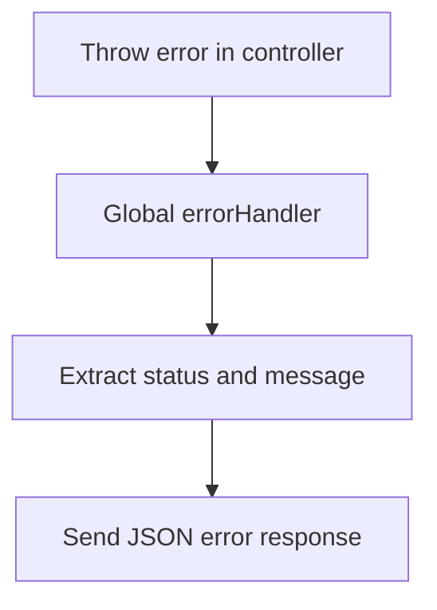

**Diagram sources**
- [errorHandler.ts:3-8](file://backend-api/src/middleware/errorHandler.ts#L3-L8)

**Section sources**
- [errorHandler.ts:3-8](file://backend-api/src/middleware/errorHandler.ts#L3-L8)

### Server Startup Process
- The application creates the Express app, configures middleware, mounts routes, and starts listening on a port derived from environment configuration.
- Scripts in package.json support development (nodemon), building TypeScript, and running the compiled output.

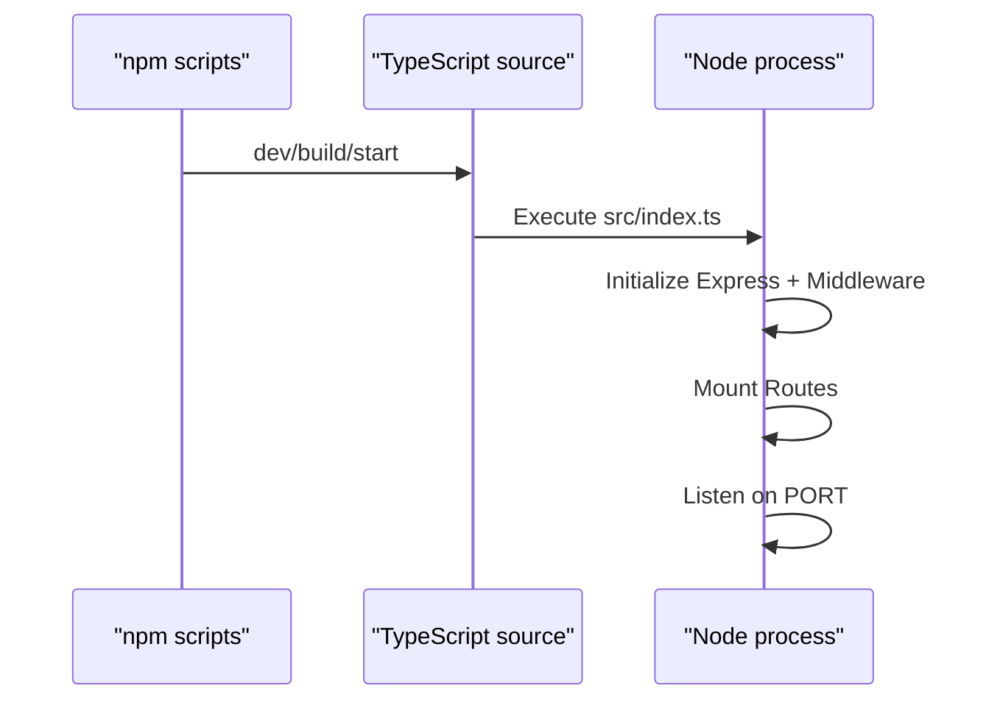

**Diagram sources**
- [index.ts:10-33](file://backend-api/src/index.ts#L10-L33)
- [package.json:6-12](file://backend-api/package.json#L6-L12)

**Section sources**
- [index.ts:10-33](file://backend-api/src/index.ts#L10-L33)
- [package.json:6-12](file://backend-api/package.json#L6-L12)

## Dependency Analysis
Key dependencies and their roles:
- express: Web framework.
- cors: Cross-origin resource sharing.
- helmet: Security headers.
- express-rate-limit: Request rate limiting.
- @prisma/client: Database client.
- jsonwebtoken: Token signing and verification.
- multer: File uploads.
- zod: Runtime validation for environment and request payloads.
- bcryptjs: Password hashing.

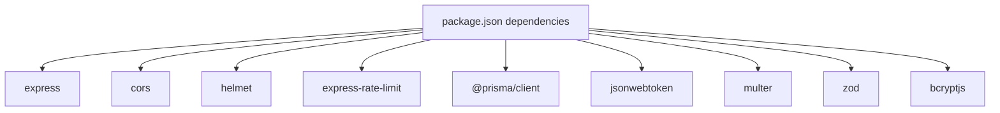

**Diagram sources**
- [package.json:14-26](file://backend-api/package.json#L14-L26)

**Section sources**
- [package.json:14-26](file://backend-api/package.json#L14-L26)

## Performance Considerations
- Rate limiting: Protects endpoints from abuse and reduces load spikes.
- Body parsing: Only necessary parsers are enabled to minimize overhead.
- Static files: Directly serve uploads without additional processing.
- Database: Ensure proper indexing on frequently queried fields (e.g., email, foreign keys) in Prisma schema and database.
- Connection pooling: Configure Prisma client options for production (connection limits, timeouts) to handle concurrent requests efficiently.
- Compression: Consider enabling gzip/brotli compression at the reverse proxy level for large responses.
- Caching: Introduce caching layers (e.g., Redis) for read-heavy endpoints like analytics or service listings.

[No sources needed since this section provides general guidance]

## Troubleshooting Guide
Common issues and resolutions:
- Missing environment variables: Ensure .env contains all required keys validated by the environment schema.
- Database connectivity: Verify DATABASE_URL points to a reachable MySQL instance; confirm credentials and network access.
- Authentication failures: Check that Authorization header uses Bearer scheme and token is valid; verify JWT secrets match those used for signing.
- Upload failures: Confirm uploads directory exists and write permissions are set; verify Multer configuration matches expected file types and sizes.
- Validation errors: Inspect Zod error details returned by the validation middleware to correct input payloads.
- Rate limit exceeded: Adjust rate limiter settings if legitimate traffic is being throttled.

**Section sources**
- [env.ts:6-13](file://backend-api/src/config/env.ts#L6-L13)
- [auth.ts:5-19](file://backend-api/src/middleware/auth.ts#L5-L19)
- [validate.ts:4-17](file://backend-api/src/middleware/validate.ts#L4-L17)
- [upload.ts:1-20](file://backend-api/src/middleware/upload.ts#L1-L20)
- [index.ts:17-21](file://backend-api/src/index.ts#L17-L21)

## Conclusion
The backend API is built on a secure, modular Express.js foundation with robust middleware for security, validation, and error handling. Environment configuration is validated at runtime, and Prisma provides a type-safe database layer. The route organization scales cleanly across features. For production, focus on securing environment variables, tuning rate limits and database connections, and adding caching and monitoring to optimize performance and reliability.