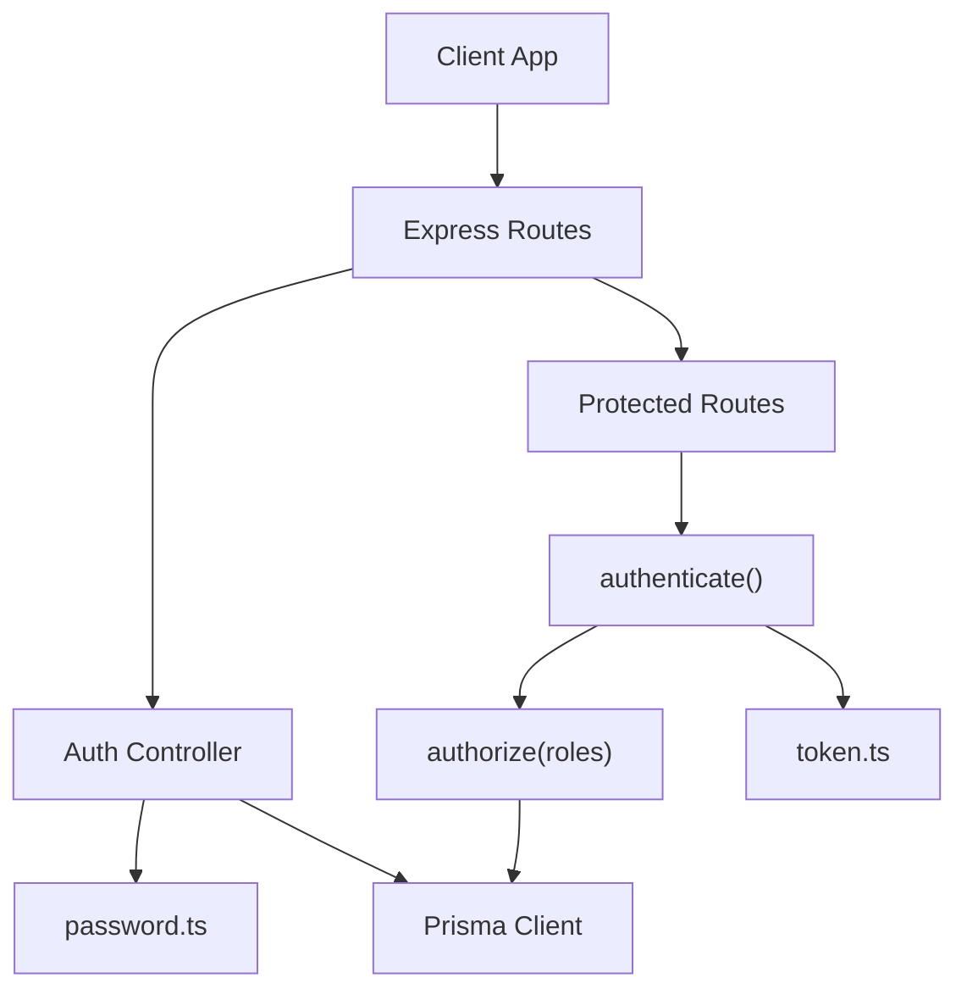
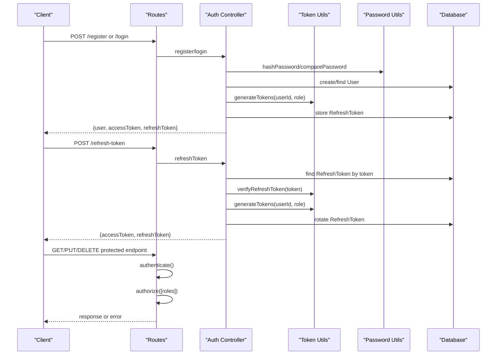
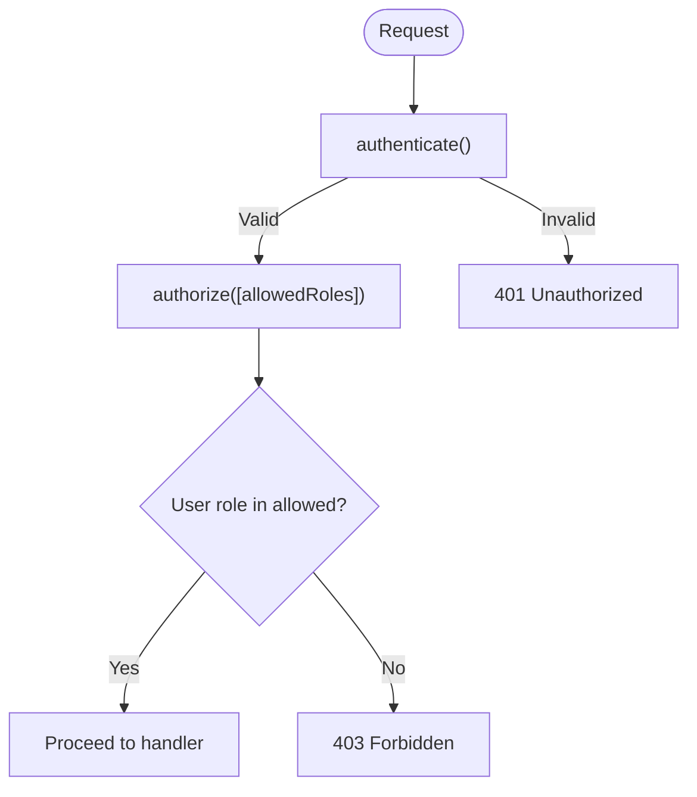
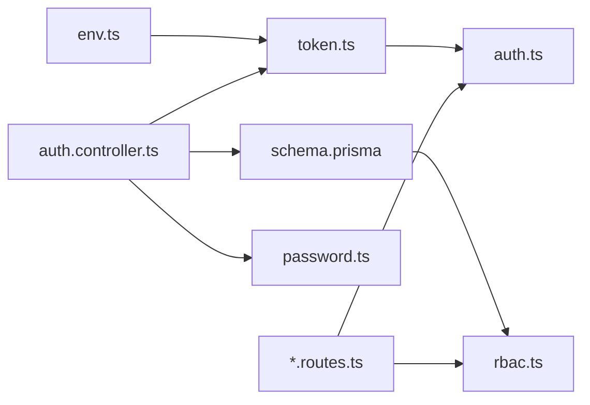

# Authentication & Authorization

<cite>
**Referenced Files in This Document**
- [auth.controller.ts](file://backend-api/src/controllers/auth.controller.ts)
- [token.ts](file://backend-api/src/utils/token.ts)
- [password.ts](file://backend-api/src/utils/password.ts)
- [env.ts](file://backend-api/src/config/env.ts)
- [auth.ts](file://backend-api/src/middleware/auth.ts)
- [rbac.ts](file://backend-api/src/middleware/rbac.ts)
- [auth.routes.ts](file://backend-api/src/routes/auth.routes.ts)
- [users.routes.ts](file://backend-api/src/routes/users.routes.ts)
- [socialWorkers.routes.ts](file://backend-api/src/routes/socialWorkers.routes.ts)
- [organizations.routes.ts](file://backend-api/src/routes/organizations.routes.ts)
- [schema.prisma](file://backend-api/prisma/schema.prisma)
</cite>

## Table of Contents
1. Introduction
2. Project Structure
3. Core Components
4. Architecture Overview
5. Detailed Component Analysis
6. Dependency Analysis
7. Performance Considerations
8. Troubleshooting Guide
9. Conclusion

## Introduction
This document explains the authentication and authorization system implemented in the backend API. It covers JWT token generation, validation, refresh flows; role-based access control (RBAC) middleware for Victim, Social Worker, Organization, and Admin roles; password hashing with bcrypt; secure token storage using a database-backed refresh token table; session management via short-lived access tokens; and security best practices to mitigate common vulnerabilities.

## Project Structure
The authentication and authorization logic is implemented in the backend API under src:
- Controllers handle user registration, login, token refresh, and password reset endpoints.
- Middleware enforces authentication and role-based authorization on protected routes.
- Utilities provide JWT signing/verification and password hashing.
- Configuration validates environment variables including JWT secrets.
- Routes wire controllers and apply middleware chains.
- Prisma schema defines the Role enum and RefreshToken model used by the auth flow.

**Diagram sources**
- [auth.routes.ts:1-12](file://backend-api/src/routes/auth.routes.ts#L1-L12)
- [users.routes.ts:1-16](file://backend-api/src/routes/users.routes.ts#L1-L16)
- [socialWorkers.routes.ts:1-20](file://backend-api/src/routes/socialWorkers.routes.ts#L1-L20)
- [organizations.routes.ts:1-17](file://backend-api/src/routes/organizations.routes.ts#L1-L17)
- [auth.ts:1-20](file://backend-api/src/middleware/auth.ts#L1-L20)
- [rbac.ts:1-13](file://backend-api/src/middleware/rbac.ts#L1-L13)
- [auth.controller.ts:1-115](file://backend-api/src/controllers/auth.controller.ts#L1-L115)
- [token.ts:1-17](file://backend-api/src/utils/token.ts#L1-L17)
- [password.ts:1-11](file://backend-api/src/utils/password.ts#L1-L11)

**Section sources**
- [auth.routes.ts:1-12](file://backend-api/src/routes/auth.routes.ts#L1-L12)
- [users.routes.ts:1-16](file://backend-api/src/routes/users.routes.ts#L1-L16)
- [socialWorkers.routes.ts:1-20](file://backend-api/src/routes/socialWorkers.routes.ts#L1-L20)
- [organizations.routes.ts:1-17](file://backend-api/src/routes/organizations.routes.ts#L1-L17)
- [auth.ts:1-20](file://backend-api/src/middleware/auth.ts#L1-L20)
- [rbac.ts:1-13](file://backend-api/src/middleware/rbac.ts#L1-L13)
- [auth.controller.ts:1-115](file://backend-api/src/controllers/auth.controller.ts#L1-L115)
- [token.ts:1-17](file://backend-api/src/utils/token.ts#L1-L17)
- [password.ts:1-11](file://backend-api/src/utils/password.ts#L1-L11)
- [schema.prisma:10-15](file://backend-api/prisma/schema.prisma#L10-L15)
- [schema.prisma:200-208](file://backend-api/prisma/schema.prisma#L200-L208)

## Core Components
- Authentication middleware extracts and verifies the Bearer access token, attaching user identity to the request.
- RBAC middleware checks that the authenticated user’s role is included in an allowed list per route.
- Auth controller implements register, login, refresh-token, and forgot-password endpoints.
- Token utilities sign and verify JWTs for access and refresh tokens.
- Password utilities hash and compare passwords using bcrypt.
- Environment configuration validates required secrets for JWT signing.
- Prisma schema defines Role values and the RefreshToken entity persisted in the database.

Key responsibilities:
- Short-lived access tokens protect API calls.
- Long-lived refresh tokens stored in the database enable secure re-authentication without exposing long-lived secrets.
- RBAC enforces least privilege across endpoints.

**Section sources**
- [auth.ts:1-20](file://backend-api/src/middleware/auth.ts#L1-L20)
- [rbac.ts:1-13](file://backend-api/src/middleware/rbac.ts#L1-L13)
- [auth.controller.ts:13-115](file://backend-api/src/controllers/auth.controller.ts#L13-L115)
- [token.ts:1-17](file://backend-api/src/utils/token.ts#L1-L17)
- [password.ts:1-11](file://backend-api/src/utils/password.ts#L1-L11)
- [env.ts:1-14](file://backend-api/src/config/env.ts#L1-L14)
- [schema.prisma:10-15](file://backend-api/prisma/schema.prisma#L10-L15)
- [schema.prisma:200-208](file://backend-api/prisma/schema.prisma#L200-L208)

## Architecture Overview
The system uses a stateless access token plus a stateful refresh token pattern:
- Access tokens are short-lived and verified per request by the authentication middleware.
- Refresh tokens are long-lived but stored server-side and rotated on each use.
- RBAC middleware restricts operations based on user roles defined in the schema.

**Diagram sources**
- [auth.controller.ts:13-115](file://backend-api/src/controllers/auth.controller.ts#L13-L115)
- [token.ts:1-17](file://backend-api/src/utils/token.ts#L1-L17)
- [password.ts:1-11](file://backend-api/src/utils/password.ts#L1-L11)
- [auth.ts:1-20](file://backend-api/src/middleware/auth.ts#L1-L20)
- [rbac.ts:1-13](file://backend-api/src/middleware/rbac.ts#L1-L13)
- [schema.prisma:200-208](file://backend-api/prisma/schema.prisma#L200-L208)

## Detailed Component Analysis

### JWT Token Implementation
- Generation: Access and refresh tokens are signed with separate secrets and different expiration times. The access token is short-lived; the refresh token is longer-lived.
- Validation: Access tokens are verified on every protected request; refresh tokens are verified before issuing new tokens.
- Rotation: On successful refresh, the stored refresh token is updated to a new value and expiry, limiting reuse risk.

Security notes:
- Separate secrets for access and refresh tokens reduce blast radius if one secret is compromised.
- Short access token lifetime minimizes exposure window.
- Server-side refresh token storage enables revocation and rotation.

**Section sources**
- [token.ts:4-16](file://backend-api/src/utils/token.ts#L4-L16)
- [env.ts:6-13](file://backend-api/src/config/env.ts#L6-L13)
- [auth.controller.ts:39-46](file://backend-api/src/controllers/auth.controller.ts#L39-L46)
- [auth.controller.ts:70-77](file://backend-api/src/controllers/auth.controller.ts#L70-L77)
- [auth.controller.ts:85-109](file://backend-api/src/controllers/auth.controller.ts#L85-L109)
- [schema.prisma:200-208](file://backend-api/prisma/schema.prisma#L200-L208)

### Role-Based Access Control (RBAC)
- Roles are defined in the schema: VICTIM, SOCIAL_WORKER, ORGANIZATION, ADMIN.
- The RBAC middleware accepts an array of allowed roles per route and denies access if the current user’s role is not included.
- Example usage:
  - Users endpoints require ADMIN.
  - Victims endpoints allow ADMIN and SOCIAL_WORKER for creation/listing; deletion restricted to ADMIN.
  - Organizations endpoints allow ADMIN and ORGANIZATION for updates.

Permission hierarchy overview:
- ADMIN can manage users, victims, social workers, organizations, and perform administrative actions.
- SOCIAL_WORKER can manage victims and cases within scope.
- ORGANIZATION can update its own organization profile.
- VICTIM has limited self-service endpoints.

**Diagram sources**
- [auth.ts:5-19](file://backend-api/src/middleware/auth.ts#L5-L19)
- [rbac.ts:5-11](file://backend-api/src/middleware/rbac.ts#L5-L11)
- [users.routes.ts:9-13](file://backend-api/src/routes/users.routes.ts#L9-L13)
- [socialWorkers.routes.ts:9-17](file://backend-api/src/routes/socialWorkers.routes.ts#L9-L17)
- [organizations.routes.ts:9-14](file://backend-api/src/routes/organizations.routes.ts#L9-L14)
- [schema.prisma:10-15](file://backend-api/prisma/schema.prisma#L10-L15)

**Section sources**
- [rbac.ts:1-13](file://backend-api/src/middleware/rbac.ts#L1-L13)
- [users.routes.ts:1-16](file://backend-api/src/routes/users.routes.ts#L1-L16)
- [socialWorkers.routes.ts:1-20](file://backend-api/src/routes/socialWorkers.routes.ts#L1-L20)
- [organizations.routes.ts:1-17](file://backend-api/src/routes/organizations.routes.ts#L1-L17)
- [schema.prisma:10-15](file://backend-api/prisma/schema.prisma#L10-L15)

### Password Hashing and Secure Storage
- Passwords are hashed using bcrypt with a strong salt factor before storage.
- Login compares provided password against stored hash.
- Responses sanitize user objects to exclude sensitive fields like password.

Best practices observed:
- Use bcrypt with appropriate cost factor.
- Never log or return password hashes.
- Store only hashes in the database.

**Section sources**
- [password.ts:1-11](file://backend-api/src/utils/password.ts#L1-L11)
- [auth.controller.ts:22-28](file://backend-api/src/controllers/auth.controller.ts#L22-L28)
- [auth.controller.ts:67-68](file://backend-api/src/controllers/auth.controller.ts#L67-L68)
- [auth.controller.ts:7-11](file://backend-api/src/controllers/auth.controller.ts#L7-L11)
- [schema.prisma:47-68](file://backend-api/prisma/schema.prisma#L47-L68)

### Session Management
- Stateless sessions via short-lived access tokens ensure no server-side session store is needed.
- Stateful refresh tokens are persisted in the database and rotated on each refresh to prevent replay attacks.
- Clients should store the access token in memory and the refresh token securely (e.g., httpOnly cookie or secure storage).

**Section sources**
- [token.ts:4-16](file://backend-api/src/utils/token.ts#L4-L16)
- [auth.controller.ts:85-109](file://backend-api/src/controllers/auth.controller.ts#L85-L109)
- [schema.prisma:200-208](file://backend-api/prisma/schema.prisma#L200-L208)

### Security Best Practices and Vulnerability Mitigation
- Separate JWT secrets for access and refresh tokens limit impact of key compromise.
- Short access token TTL reduces exposure window.
- Server-side refresh token storage enables rotation and revocation.
- RBAC ensures least privilege per endpoint.
- Input validation and sanitization in controllers avoid leaking sensitive data.

Recommended enhancements:
- Enforce HTTPS everywhere to protect tokens in transit.
- Implement rate limiting on auth endpoints to mitigate brute-force and credential stuffing.
- Add CSRF protection for cookie-based refresh tokens.
- Log failed attempts and implement account lockout policies.
- Validate and sanitize all inputs with a schema validator.
- Rotate JWT secrets periodically and support graceful migration.

[No sources needed since this section provides general guidance]

## Dependency Analysis
The following diagram shows how components depend on each other during authentication and authorization:

**Diagram sources**
- [env.ts:1-14](file://backend-api/src/config/env.ts#L1-L14)
- [token.ts:1-17](file://backend-api/src/utils/token.ts#L1-L17)
- [auth.ts:1-20](file://backend-api/src/middleware/auth.ts#L1-L20)
- [rbac.ts:1-13](file://backend-api/src/middleware/rbac.ts#L1-L13)
- [auth.controller.ts:1-115](file://backend-api/src/controllers/auth.controller.ts#L1-L115)
- [password.ts:1-11](file://backend-api/src/utils/password.ts#L1-L11)
- [schema.prisma:10-15](file://backend-api/prisma/schema.prisma#L10-L15)
- [schema.prisma:200-208](file://backend-api/prisma/schema.prisma#L200-L208)
- [users.routes.ts:1-16](file://backend-api/src/routes/users.routes.ts#L1-L16)
- [socialWorkers.routes.ts:1-20](file://backend-api/src/routes/socialWorkers.routes.ts#L1-L20)
- [organizations.routes.ts:1-17](file://backend-api/src/routes/organizations.routes.ts#L1-L17)

**Section sources**
- [env.ts:1-14](file://backend-api/src/config/env.ts#L1-L14)
- [token.ts:1-17](file://backend-api/src/utils/token.ts#L1-L17)
- [auth.ts:1-20](file://backend-api/src/middleware/auth.ts#L1-L20)
- [rbac.ts:1-13](file://backend-api/src/middleware/rbac.ts#L1-L13)
- [auth.controller.ts:1-115](file://backend-api/src/controllers/auth.controller.ts#L1-L115)
- [password.ts:1-11](file://backend-api/src/utils/password.ts#L1-L11)
- [schema.prisma:10-15](file://backend-api/prisma/schema.prisma#L10-L15)
- [schema.prisma:200-208](file://backend-api/prisma/schema.prisma#L200-L208)
- [users.routes.ts:1-16](file://backend-api/src/routes/users.routes.ts#L1-L16)
- [socialWorkers.routes.ts:1-20](file://backend-api/src/routes/socialWorkers.routes.ts#L1-L20)
- [organizations.routes.ts:1-17](file://backend-api/src/routes/organizations.routes.ts#L1-L17)

## Performance Considerations
- Keep access tokens small and short-lived to minimize payload size and verification overhead.
- Avoid unnecessary database queries in middleware; rely on token payload for user identity where possible.
- Cache frequently accessed role checks at the application level if needed, though RBAC here is lightweight.
- Ensure database indexes on refresh token lookups to maintain performance under load.

[No sources needed since this section provides general guidance]

## Troubleshooting Guide
Common issues and resolutions:
- 401 Unauthorized: Missing or malformed Authorization header; invalid or expired access token. Verify Bearer token format and token validity.
- 403 Forbidden: Authenticated user lacks required role for the endpoint. Confirm the user’s role and the allowed roles for the route.
- Invalid or expired refresh token: Check that the stored refresh token exists and has not expired; ensure rotation occurs on successful refresh.
- Email already in use: Registration fails due to duplicate email; validate uniqueness before creating accounts.
- Invalid credentials: Incorrect email or password; ensure password comparison uses the stored hash.

Operational tips:
- Log token verification errors with contextual details (without secrets).
- Monitor refresh token rotation failures and stale entries.
- Audit failed login attempts and consider rate limiting.

**Section sources**
- [auth.ts:5-19](file://backend-api/src/middleware/auth.ts#L5-L19)
- [rbac.ts:5-11](file://backend-api/src/middleware/rbac.ts#L5-L11)
- [auth.controller.ts:13-115](file://backend-api/src/controllers/auth.controller.ts#L13-L115)

## Conclusion
The system implements a robust, secure authentication and authorization flow using short-lived JWT access tokens and server-side refresh tokens with rotation. RBAC enforces least privilege across endpoints aligned with the defined roles. Passwords are securely hashed, and responses are sanitized to prevent leakage. Following the recommended enhancements will further harden the system against common threats and improve operational resilience.