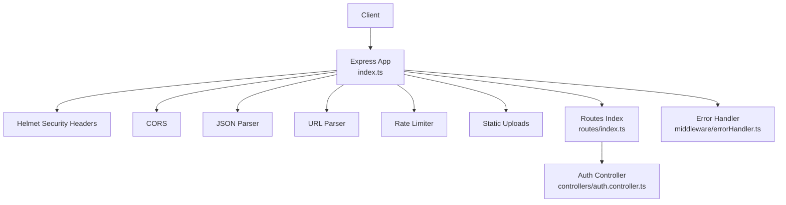
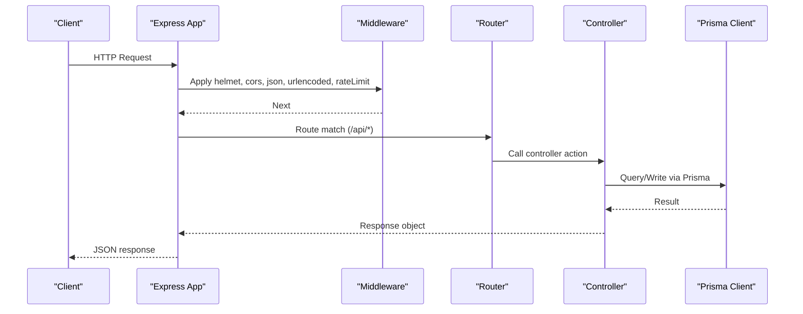
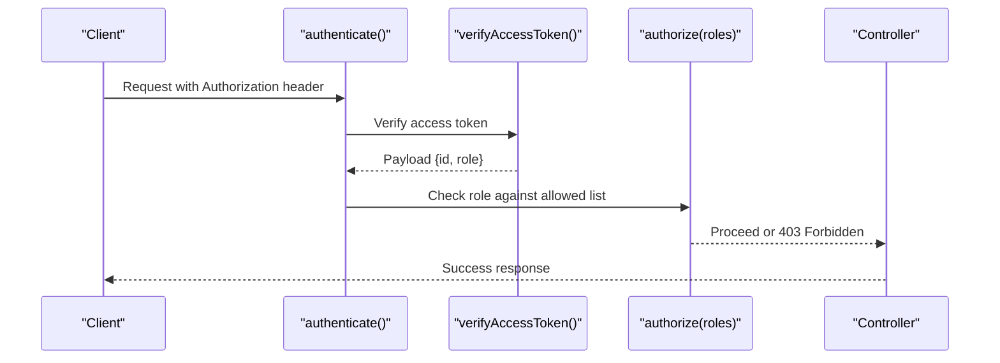
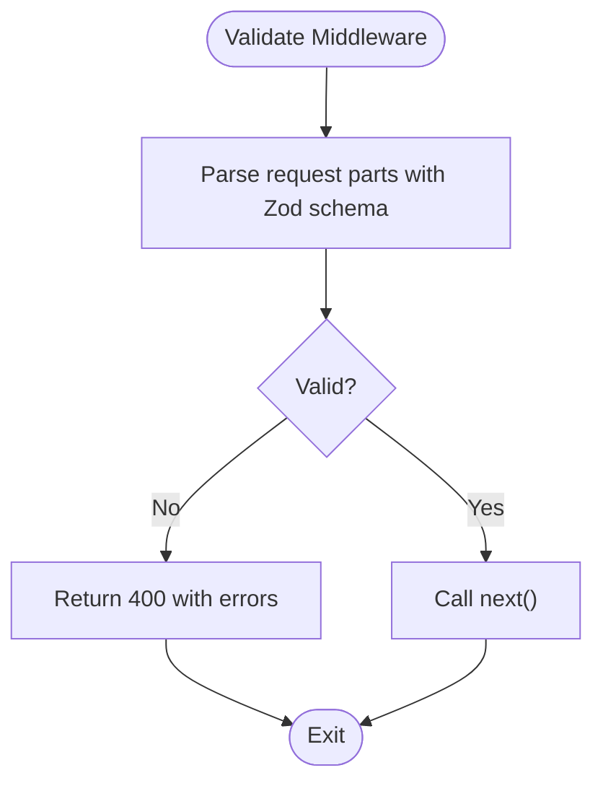
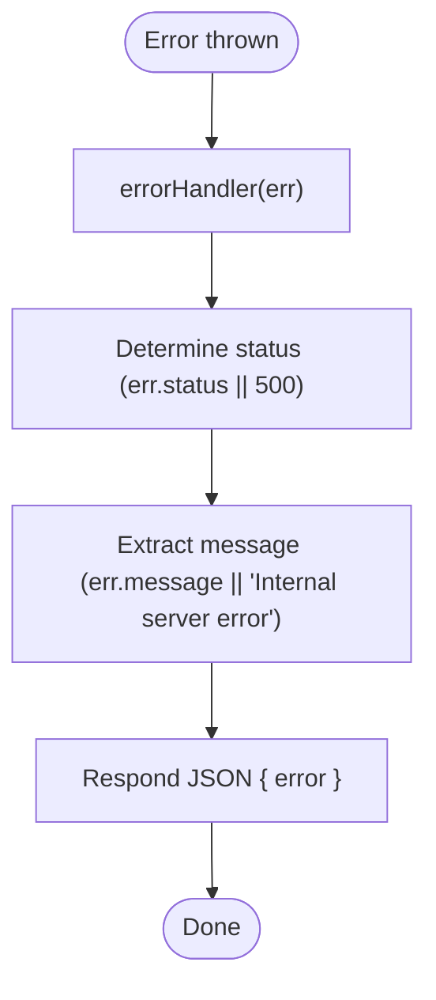
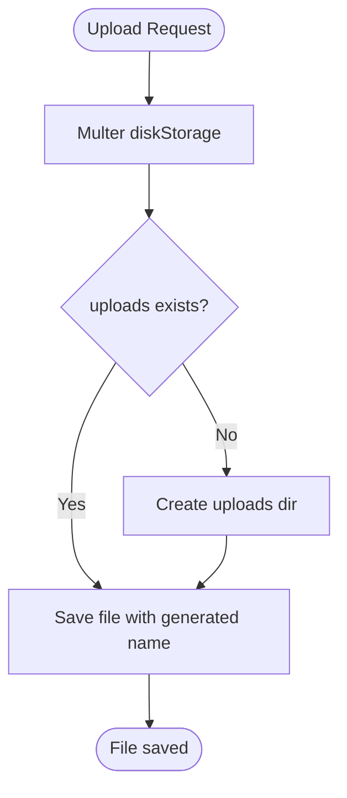
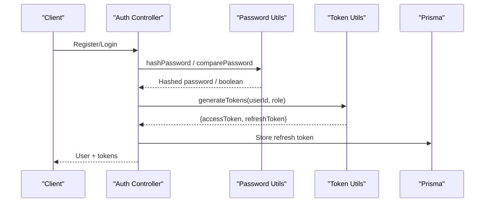
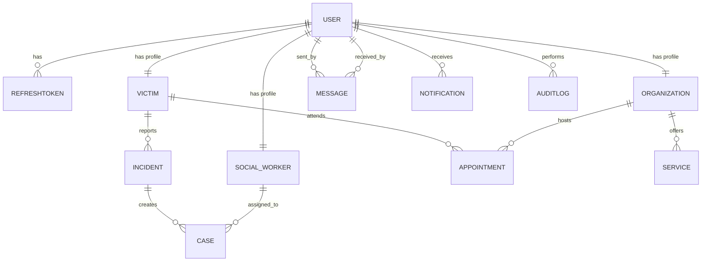
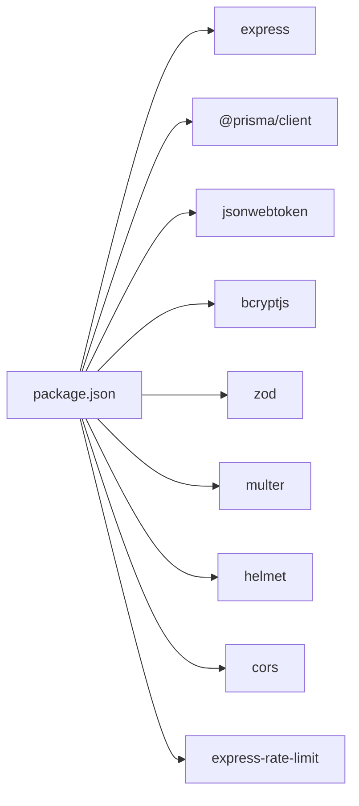

# Backend API

<cite>
**Referenced Files in This Document**
- [index.ts](file://backend-api/src/index.ts)
- [package.json](file://backend-api/package.json)
- [schema.prisma](file://backend-api/prisma/schema.prisma)
- [database.ts](file://backend-api/src/config/database.ts)
- [env.ts](file://backend-api/src/config/env.ts)
- [auth.ts](file://backend-api/src/middleware/auth.ts)
- [validate.ts](file://backend-api/src/middleware/validate.ts)
- [errorHandler.ts](file://backend-api/src/middleware/errorHandler.ts)
- [rbac.ts](file://backend-api/src/middleware/rbac.ts)
- [upload.ts](file://backend-api/src/middleware/upload.ts)
- [token.ts](file://backend-api/src/utils/token.ts)
- [password.ts](file://backend-api/src/utils/password.ts)
- [types/index.ts](file://backend-api/src/types/index.ts)
- [routes/index.ts](file://backend-api/src/routes/index.ts)
- [auth.controller.ts](file://backend-api/src/controllers/auth.controller.ts)
</cite>

## Table of Contents
1. [Introduction](#introduction)
2. [Project Structure](#project-structure)
3. [Core Components](#core-components)
4. [Architecture Overview](#architecture-overview)
5. [Detailed Component Analysis](#detailed-component-analysis)
6. [Dependency Analysis](#dependency-analysis)
7. [Performance Considerations](#performance-considerations)
8. [Troubleshooting Guide](#troubleshooting-guide)
9. [Conclusion](#conclusion)

## Introduction
This document describes the Backend API built with Express.js and TypeScript. It explains the MVC architecture, middleware pipeline (authentication, validation, error handling), RESTful design principles, request/response patterns, status code conventions, database layer using Prisma ORM, security implementation (JWT, bcrypt, Zod, RBAC), file uploads with Multer, rate limiting, CORS, and security headers. It also covers controller structure, service-layer patterns, and utility functions used across the API.

## Project Structure
The backend follows a feature-oriented MVC layout:
- Entry point initializes Express, global middleware, routes, and error handler.
- Routes group endpoints by domain and delegate to controllers.
- Controllers handle HTTP requests, orchestrate business logic, and return responses.
- Middleware provides cross-cutting concerns: authentication, authorization, validation, uploads, and error handling.
- Config centralizes environment variables and database client.
- Utils encapsulate reusable logic for tokens and passwords.
- Types define shared interfaces such as AuthRequest.

**Diagram sources**
- [index.ts:10-27](file://backend-api/src/index.ts#L10-L27)
- [routes/index.ts:15-35](file://backend-api/src/routes/index.ts#L15-L35)
- [auth.controller.ts:13-114](file://backend-api/src/controllers/auth.controller.ts#L13-L114)

**Section sources**
- [index.ts:1-34](file://backend-api/src/index.ts#L1-L34)
- [routes/index.ts:1-38](file://backend-api/src/routes/index.ts#L1-L38)

## Core Components
- Application bootstrap: Initializes Express, applies security headers, CORS, body parsers, rate limiter, static assets, routes, and global error handler.
- Environment configuration: Validates required environment variables with Zod at startup.
- Database client: Exports a singleton Prisma client instance.
- Authentication middleware: Extracts and verifies JWT access tokens, attaches user context.
- Authorization middleware: Enforces role-based access control based on roles defined in the schema.
- Validation middleware: Centralized input validation using Zod schemas.
- Error handler: Normalizes errors into consistent JSON responses.
- File upload middleware: Configures Multer disk storage under an uploads directory.
- Utilities: Token generation/verification and password hashing/comparison.

**Section sources**
- [index.ts:10-27](file://backend-api/src/index.ts#L10-L27)
- [env.ts:1-14](file://backend-api/src/config/env.ts#L1-L14)
- [database.ts:1-6](file://backend-api/src/config/database.ts#L1-L6)
- [auth.ts:5-19](file://backend-api/src/middleware/auth.ts#L5-L19)
- [rbac.ts:5-11](file://backend-api/src/middleware/rbac.ts#L5-L11)
- [validate.ts:4-16](file://backend-api/src/middleware/validate.ts#L4-L16)
- [errorHandler.ts:3-8](file://backend-api/src/middleware/errorHandler.ts#L3-L8)
- [upload.ts:10-19](file://backend-api/src/middleware/upload.ts#L10-L19)
- [token.ts:4-16](file://backend-api/src/utils/token.ts#L4-L16)
- [password.ts:3-10](file://backend-api/src/utils/password.ts#L3-L10)

## Architecture Overview
The API uses a layered approach:
- Presentation Layer: Express routes and controllers.
- Middleware Pipeline: Security, parsing, rate limiting, auth, validation, RBAC, error handling.
- Business Layer: Controllers coordinate operations; services can be introduced for complex logic.
- Data Access Layer: Prisma ORM over MySQL.

**Diagram sources**
- [index.ts:10-27](file://backend-api/src/index.ts#L10-L27)
- [routes/index.ts:15-35](file://backend-api/src/routes/index.ts#L15-L35)
- [auth.controller.ts:13-114](file://backend-api/src/controllers/auth.controller.ts#L13-L114)
- [database.ts:1-6](file://backend-api/src/config/database.ts#L1-L6)

## Detailed Component Analysis

### Authentication and Authorization
- JWT flow: Access tokens are short-lived; refresh tokens are persisted and rotated on use.
- Middleware extracts Bearer token, verifies signature, and attaches user info to the request.
- Role-based access control checks the user’s role against allowed roles per route.

**Diagram sources**
- [auth.ts:5-19](file://backend-api/src/middleware/auth.ts#L5-L19)
- [token.ts:10-12](file://backend-api/src/utils/token.ts#L10-L12)
- [rbac.ts:5-11](file://backend-api/src/middleware/rbac.ts#L5-L11)

**Section sources**
- [auth.ts:5-19](file://backend-api/src/middleware/auth.ts#L5-L19)
- [rbac.ts:5-11](file://backend-api/src/middleware/rbac.ts#L5-L11)
- [token.ts:4-16](file://backend-api/src/utils/token.ts#L4-L16)

### Input Validation with Zod
- A reusable validator middleware parses and validates request bodies, queries, and params against Zod schemas.
- On validation failure, returns 400 with structured error details.

**Diagram sources**
- [validate.ts:4-16](file://backend-api/src/middleware/validate.ts#L4-L16)

**Section sources**
- [validate.ts:4-16](file://backend-api/src/middleware/validate.ts#L4-L16)

### Error Handling
- Global error handler catches unhandled errors, logs them, and responds with a consistent JSON shape and appropriate status.

**Diagram sources**
- [errorHandler.ts:3-8](file://backend-api/src/middleware/errorHandler.ts#L3-L8)

**Section sources**
- [errorHandler.ts:3-8](file://backend-api/src/middleware/errorHandler.ts#L3-L8)

### File Uploads with Multer
- Disk storage configured to save files under an uploads directory with unique filenames.
- Directory is created if missing.

**Diagram sources**
- [upload.ts:5-19](file://backend-api/src/middleware/upload.ts#L5-L19)

**Section sources**
- [upload.ts:5-19](file://backend-api/src/middleware/upload.ts#L5-L19)

### Password Hashing and Token Management
- Passwords are hashed with bcrypt before storage and compared during login.
- Tokens are generated with distinct secrets for access and refresh tokens; refresh tokens are stored and rotated.

**Diagram sources**
- [auth.controller.ts:13-114](file://backend-api/src/controllers/auth.controller.ts#L13-L114)
- [password.ts:3-10](file://backend-api/src/utils/password.ts#L3-L10)
- [token.ts:4-16](file://backend-api/src/utils/token.ts#L4-L16)

**Section sources**
- [password.ts:3-10](file://backend-api/src/utils/password.ts#L3-L10)
- [token.ts:4-16](file://backend-api/src/utils/token.ts#L4-L16)
- [auth.controller.ts:13-114](file://backend-api/src/controllers/auth.controller.ts#L13-L114)

### RESTful API Design Principles
- Resource-oriented URLs grouped by domain under /api.
- Standard HTTP methods map to CRUD operations.
- Consistent JSON responses with meaningful status codes.
- Pagination, filtering, and sorting should be query parameters where applicable.

**Section sources**
- [routes/index.ts:15-35](file://backend-api/src/routes/index.ts#L15-L35)

### Request/Response Patterns and Status Codes
- Successful operations typically return 2xx with JSON payloads.
- Validation errors return 400 with structured error arrays.
- Authentication failures return 401; authorization failures return 403.
- Server errors return 500 with normalized messages.

**Section sources**
- [validate.ts:4-16](file://backend-api/src/middleware/validate.ts#L4-L16)
- [auth.ts:5-19](file://backend-api/src/middleware/auth.ts#L5-L19)
- [rbac.ts:5-11](file://backend-api/src/middleware/rbac.ts#L5-L11)
- [errorHandler.ts:3-8](file://backend-api/src/middleware/errorHandler.ts#L3-L8)

### Database Layer with Prisma ORM
- Single Prisma client instance exported for reuse.
- Schema defines entities, enums, and relationships for users, victims, social workers, organizations, incidents, cases, appointments, services, messages, notifications, audit logs, and refresh tokens.
- Connection string sourced from environment variables.

**Diagram sources**
- [schema.prisma:47-207](file://backend-api/prisma/schema.prisma#L47-L207)

**Section sources**
- [database.ts:1-6](file://backend-api/src/config/database.ts#L1-L6)
- [schema.prisma:1-208](file://backend-api/prisma/schema.prisma#L1-L208)

### Security Implementation
- Security headers via Helmet.
- CORS enabled for cross-origin requests.
- Rate limiting to mitigate abuse.
- JWT-based authentication with separate secrets for access and refresh tokens.
- Password hashing with bcrypt.
- Input validation with Zod.
- Role-based access control using roles defined in the schema.

**Section sources**
- [index.ts:12-21](file://backend-api/src/index.ts#L12-L21)
- [env.ts:6-13](file://backend-api/src/config/env.ts#L6-L13)
- [auth.ts:5-19](file://backend-api/src/middleware/auth.ts#L5-L19)
- [rbac.ts:5-11](file://backend-api/src/middleware/rbac.ts#L5-L11)
- [validate.ts:4-16](file://backend-api/src/middleware/validate.ts#L4-L16)
- [password.ts:3-10](file://backend-api/src/utils/password.ts#L3-L10)
- [token.ts:4-16](file://backend-api/src/utils/token.ts#L4-L16)

### Controller Structure and Service Layer Patterns
- Controllers encapsulate HTTP-specific logic: parsing inputs, calling utilities/services, and returning responses.
- The current codebase demonstrates controller-driven flows; service layer can be introduced to isolate business rules and improve testability.
- Shared types (e.g., AuthRequest) ensure type safety across middleware and controllers.

**Section sources**
- [auth.controller.ts:13-114](file://backend-api/src/controllers/auth.controller.ts#L13-L114)
- [types/index.ts:4-9](file://backend-api/src/types/index.ts#L4-L9)

## Dependency Analysis
Key runtime dependencies include Express, Prisma client, JWT, bcryptjs, Zod, Multer, Helmet, CORS, and express-rate-limit.

**Diagram sources**
- [package.json:14-25](file://backend-api/package.json#L14-L25)

**Section sources**
- [package.json:1-40](file://backend-api/package.json#L1-L40)

## Performance Considerations
- Use connection pooling provided by Prisma’s default settings; tune pool size based on workload and database capacity.
- Prefer specific field selection and eager loading only when necessary to reduce payload size.
- Cache frequently accessed read-only data (e.g., services) at the application level if appropriate.
- Monitor query performance with Prisma query logging in development.
- Keep rate limits reasonable to balance protection and usability.

[No sources needed since this section provides general guidance]

## Troubleshooting Guide
- Missing environment variables: Ensure DATABASE_URL, JWT_SECRET, and JWT_REFRESH_SECRET are set; env validation will fail early if missing.
- Authentication failures: Verify Authorization header format and token validity; check secret alignment between generation and verification.
- Validation errors: Inspect Zod error arrays returned on 400 responses to correct client payloads.
- Upload issues: Confirm uploads directory permissions and that Multer is attached to routes requiring file uploads.
- Rate limiting: If clients are throttled, adjust windowMs and max values to match expected traffic patterns.

**Section sources**
- [env.ts:6-13](file://backend-api/src/config/env.ts#L6-L13)
- [auth.ts:5-19](file://backend-api/src/middleware/auth.ts#L5-L19)
- [validate.ts:4-16](file://backend-api/src/middleware/validate.ts#L4-L16)
- [upload.ts:5-19](file://backend-api/src/middleware/upload.ts#L5-L19)
- [index.ts:17-21](file://backend-api/src/index.ts#L17-L21)

## Conclusion
The API implements a clear MVC structure with robust middleware for security, validation, and error handling. It leverages Prisma for type-safe database access, JWT for stateless authentication, bcrypt for secure password storage, Zod for input validation, and Multer for file uploads. Role-based access control enforces least privilege. Following the documented patterns ensures maintainability, scalability, and security.