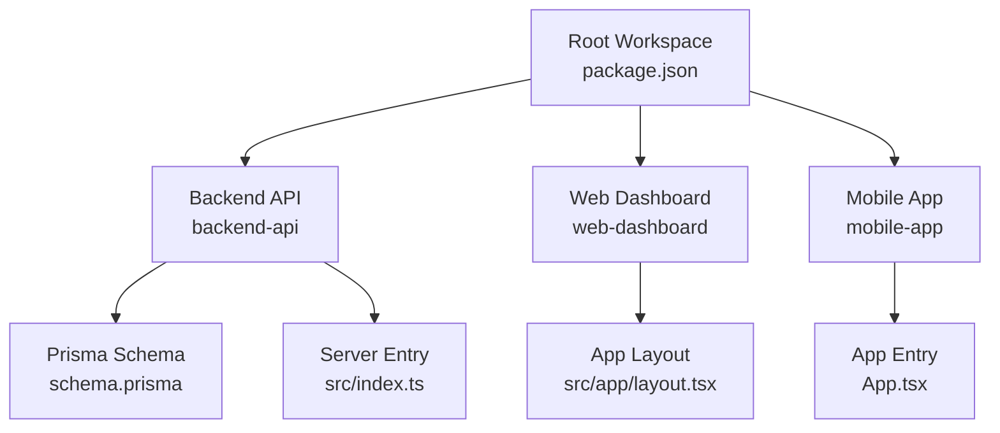
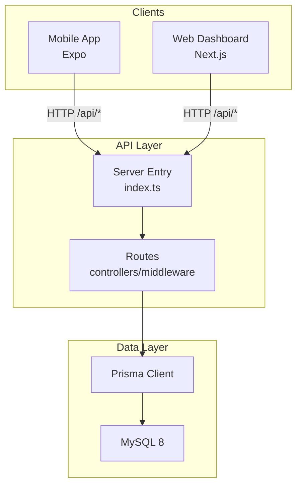
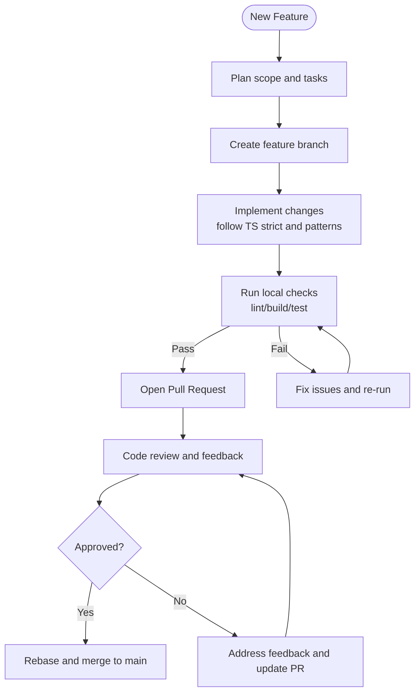
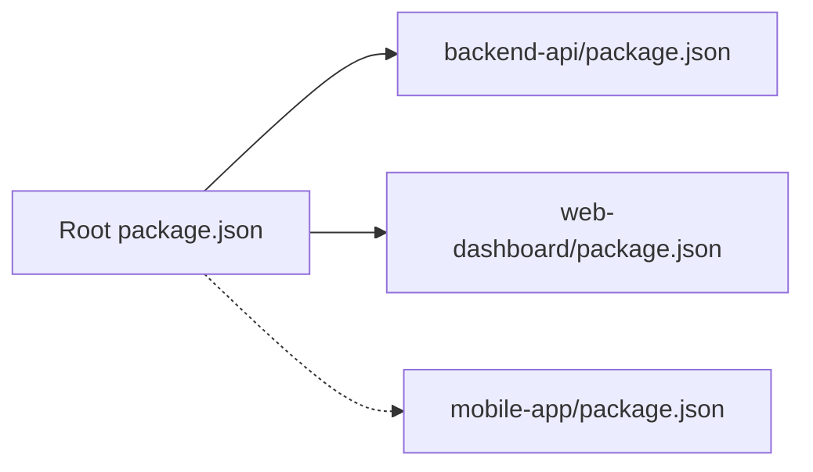

# Contributing Guide

<cite>
**Referenced Files in This Document**
- [README.md](file://README.md)
- [package.json](file://package.json)
- [backend-api/package.json](file://backend-api/package.json)
- [web-dashboard/package.json](file://web-dashboard/package.json)
- [mobile-app/package.json](file://mobile-app/package.json)
- [backend-api/tsconfig.json](file://backend-api/tsconfig.json)
- [web-dashboard/tsconfig.json](file://web-dashboard/tsconfig.json)
- [mobile-app/tsconfig.json](file://mobile-app/tsconfig.json)
- [backend-api/src/index.ts](file://backend-api/src/index.ts)
- [backend-api/src/config/env.ts](file://backend-api/src/config/env.ts)
- [backend-api/prisma/schema.prisma](file://backend-api/prisma/schema.prisma)
- [backend-api/src/controllers/messages.controller.ts](file://backend-api/src/controllers/messages.controller.ts)
- [web-dashboard/next.config.js](file://web-dashboard/next.config.js)
- [web-dashboard/src/app/layout.tsx](file://web-dashboard/src/app/layout.tsx)
- [mobile-app/App.tsx](file://mobile-app/App.tsx)
- [mobile-app/app.json](file://mobile-app/app.json)
</cite>

## Table of Contents
1. Introduction
2. Project Structure
3. Core Components
4. Architecture Overview
5. Detailed Component Analysis
6. Dependency Analysis
7. Performance Considerations
8. Troubleshooting Guide
9. Conclusion
10. Appendices

## Introduction
This guide explains how to contribute to SafeProtect Cameroon, a secure platform for child protection and gender-based violence case management. It covers development workflow, branch and commit conventions, pull request procedures, code review standards, coding style for TypeScript across the backend API, web dashboard, and mobile app, environment setup, testing expectations, documentation updates, community guidelines, issue reporting, feature requests, maintainer contacts, and security considerations.

SafeProtect is composed of three applications:
- Backend API (Express + Prisma + TypeScript)
- Web Dashboard (Next.js 14 + TypeScript)
- Mobile App (React Native + Expo + TypeScript)

The repository uses a root workspace that orchestrates scripts for backend and web; the mobile app is managed separately.

**Section sources**
- [README.md:9-18](file://README.md#L9-L18)
- [package.json:1-19](file://package.json#L1-L19)

## Project Structure
High-level layout:
- backend-api: Express server with controllers, routes, middleware, Prisma schema, and utilities
- web-dashboard: Next.js application with pages, components, and shared UI
- mobile-app: React Native app with screens, navigation, contexts, hooks, and services
- docs: Design and analysis documents
- Root package.json: Workspace scripts to run backend and web together

**Diagram sources**
- [package.json:6-14](file://package.json#L6-L14)
- [backend-api/src/index.ts:1-34](file://backend-api/src/index.ts#L1-L34)
- [backend-api/prisma/schema.prisma:144-183](file://backend-api/prisma/schema.prisma#L144-L183)
- [web-dashboard/src/app/layout.tsx:1-20](file://web-dashboard/src/app/layout.tsx#L1-L20)
- [mobile-app/App.tsx:1-18](file://mobile-app/App.tsx#L1-L18)

**Section sources**
- [README.md:9-18](file://README.md#L9-L18)
- [package.json:6-14](file://package.json#L6-L14)

## Core Components
- Backend API: Centralized entry point sets up security headers, CORS, JSON parsing, rate limiting, static uploads, routes, and error handling. Environment variables are validated at startup.
- Web Dashboard: Next.js app with strict TypeScript configuration and module path aliases.
- Mobile App: Expo-based app with authentication context and navigation stack.

Key responsibilities:
- Backend: Authentication, RBAC, validation, database access via Prisma, file uploads, messaging, analytics endpoints
- Web: Admin dashboard pages and charts
- Mobile: Victim and social worker flows, SOS, appointments, messaging

**Section sources**
- [backend-api/src/index.ts:1-34](file://backend-api/src/index.ts#L1-L34)
- [backend-api/src/config/env.ts:1-14](file://backend-api/src/config/env.ts#L1-L14)
- [web-dashboard/tsconfig.json:1-28](file://web-dashboard/tsconfig.json#L1-L28)
- [mobile-app/App.tsx:1-18](file://mobile-app/App.tsx#L1-L18)

## Architecture Overview
The system follows a layered architecture:
- Client layers: Mobile and Web dashboards consume the Backend API
- API layer: Express routes delegate to controllers, which use Prisma to interact with MySQL
- Data layer: Prisma schema defines entities and relationships

**Diagram sources**
- [backend-api/src/index.ts:1-34](file://backend-api/src/index.ts#L1-L34)
- [backend-api/prisma/schema.prisma:144-183](file://backend-api/prisma/schema.prisma#L144-L183)

## Detailed Component Analysis

### Development Workflow and Branch Management
- Create a feature branch from main for each change: feature/<short-description>, fix/<issue-id>, chore/<task>
- Keep branches small and focused; open PRs early for feedback
- Use conventional commits: type(scope): description (e.g., feat(api): add victim profile endpoint)
- Squash and rebase before merging to keep history clean
- Ensure all CI checks pass locally before pushing (lint, build, tests if present)

### Commit Message Conventions
- Types: feat, fix, docs, style, refactor, perf, test, chore, build, ci
- Scope: backend-api, web-dashboard, mobile-app, prisma, docs
- Format: type(scope): concise imperative summary
- Examples:
  - feat(backend-api): implement message threads retrieval
  - fix(web-dashboard): correct incident form category mapping
  - chore(mobile-app): update expo dependencies

### Pull Request Procedures
- Link related issues in PR description
- Provide a clear summary of changes and rationale
- Include screenshots or screen recordings for UI changes
- Confirm environment variables and migrations are updated if needed
- Request reviews from maintainers familiar with the affected modules
- Ensure PR is rebased on latest main and passes local checks

### Code Review Standards
- Readability and clarity over cleverness
- Follow TypeScript strict mode and project configs
- Validate inputs and handle errors consistently
- Avoid hard-coded secrets; use environment variables
- Keep functions small and single-purpose
- Add comments only when necessary; prefer self-documenting code

**Section sources**
- [backend-api/src/config/env.ts:1-14](file://backend-api/src/config/env.ts#L1-L14)
- [backend-api/src/controllers/messages.controller.ts:1-47](file://backend-api/src/controllers/messages.controller.ts#L1-L47)

### Coding Standards and Style Guidelines (TypeScript)
- Strict mode enabled across all apps
  - Backend: strict compiler options, ES target, CommonJS output
  - Web: strict, noEmit, moduleResolution bundler, path aliases @/*
  - Mobile: strict, base Expo config, path aliases @/*
- Naming conventions
  - Controllers, routes, services: camelCase
  - Components: PascalCase
  - Types/interfaces: PascalCase
  - Constants: UPPER_SNAKE_CASE where appropriate
- Formatting
  - Prefer consistent indentation and semicolons as per existing files
  - Align imports and organize by dependency groups
- Linting
  - Web includes a lint script; ensure it passes before submitting
  - Apply consistent ESLint rules aligned with Next.js defaults
- Testing
  - Add unit tests for new logic where feasible
  - For UI changes, consider manual verification steps in PR description

**Section sources**
- [backend-api/tsconfig.json:1-13](file://backend-api/tsconfig.json#L1-L13)
- [web-dashboard/tsconfig.json:1-28](file://web-dashboard/tsconfig.json#L1-L28)
- [mobile-app/tsconfig.json:1-13](file://mobile-app/tsconfig.json#L1-L13)
- [web-dashboard/package.json:5-10](file://web-dashboard/package.json#L5-L10)

### Module Organization and Architectural Patterns
- Backend API
  - Routes map to controllers; controllers orchestrate business logic and data access
  - Middleware handles auth, validation, error handling, and uploads
  - Prisma schema centralizes data model definitions
- Web Dashboard
  - Pages under app/(dashboard) for authenticated sections
  - Shared UI components in components/ui
  - API client and mock data in lib
- Mobile App
  - Screens grouped by role (victim, socialworker)
  - Shared components in components/shared
  - Navigation stacks define user flows
  - Contexts manage global state like authentication

[No sources needed since this diagram shows conceptual workflow, not actual code structure]

### Setup Instructions for Development Environment
Prerequisites:
- Node.js 18+
- MySQL 8 (or Docker)
- Expo Go for mobile testing

Backend API:
- Install dependencies
- Configure .env with DATABASE_URL, JWT_SECRET, JWT_REFRESH_SECRET
- Generate Prisma client, run migrations, seed demo data
- Start dev server

Web Dashboard:
- Install dependencies
- Set NEXT_PUBLIC_API_URL in .env.local
- Start dev server

Mobile App:
- Install dependencies
- Set EXPO_PUBLIC_API_URL in .env
- Start Expo dev server

Environment variables:
- Backend validates required env keys at startup
- Clients read API base URL from environment variables

**Section sources**
- [README.md:20-113](file://README.md#L20-L113)
- [backend-api/src/config/env.ts:1-14](file://backend-api/src/config/env.ts#L1-L14)
- [backend-api/package.json:6-13](file://backend-api/package.json#L6-L13)
- [web-dashboard/package.json:5-10](file://web-dashboard/package.json#L5-L10)
- [mobile-app/package.json:5-10](file://mobile-app/package.json#L5-L10)

### Testing Requirements Before Submission
- Run linters and build processes locally
- Verify API endpoints respond correctly using Postman or similar tools
- Validate UI flows on web and mobile emulators/devices
- Ensure environment variables are set and valid
- If adding features that touch data models, confirm Prisma migrations and seeds are updated

**Section sources**
- [web-dashboard/package.json:5-10](file://web-dashboard/package.json#L5-L10)
- [backend-api/package.json:6-13](file://backend-api/package.json#L6-L13)

### Documentation Update Procedures
- Update README sections when workflows or commands change
- Keep API endpoint tables current if routes change
- Reflect design tokens and roles in relevant sections
- Add diagrams for new complex flows

**Section sources**
- [README.md:127-143](file://README.md#L127-L143)
- [README.md:146-158](file://README.md#L146-L158)
- [README.md:116-124](file://README.md#L116-L124)

### Community Guidelines
- Be respectful and inclusive in discussions
- Focus on solutions and constructive feedback
- Respect privacy and confidentiality due to sensitive nature of data
- Report concerns about content or behavior to maintainers

### Issue Reporting Procedures
- Use clear titles and describe steps to reproduce
- Include environment details (Node version, OS, browser/device)
- Attach logs or screenshots when applicable
- Tag issues with labels (bug, enhancement, question)

### Feature Request Processes
- Describe the problem and proposed solution
- Explain impact on users and alignment with platform goals
- Provide examples or mockups if possible
- Discuss feasibility and alternatives in comments

### Maintainer Contact Information
- Open an issue labeled “maintainer-request” for urgent matters
- Reference relevant PRs or issues in messages
- For security-sensitive topics, follow the security section below

### Security Considerations for Contributions
- Never commit secrets; use environment variables
- Validate all inputs; avoid trusting client-side data
- Enforce RBAC on new endpoints
- Use parameterized queries via Prisma; avoid raw SQL injection risks
- Handle file uploads securely with size/type validation
- Log sensitive operations without exposing PII
- Protect victim data with least privilege access

**Section sources**
- [README.md:161-173](file://README.md#L161-L173)
- [backend-api/src/index.ts:12-27](file://backend-api/src/index.ts#L12-L27)
- [backend-api/src/config/env.ts:6-13](file://backend-api/src/config/env.ts#L6-L13)

## Dependency Analysis
Workspace scripts coordinate backend and web; mobile runs independently.

**Diagram sources**
- [package.json:6-14](file://package.json#L6-L14)
- [backend-api/package.json:6-13](file://backend-api/package.json#L6-L13)
- [web-dashboard/package.json:5-10](file://web-dashboard/package.json#L5-L10)
- [mobile-app/package.json:5-10](file://mobile-app/package.json#L5-L10)

**Section sources**
- [package.json:6-14](file://package.json#L6-L14)

## Performance Considerations
- Backend: Rate limiting configured; ensure pagination and selective field projection in Prisma queries
- Web: Leverage Next.js optimizations; minimize bundle size; use memoization where appropriate
- Mobile: Optimize images and lists; avoid unnecessary re-renders; use efficient navigation patterns

[No sources needed since this section provides general guidance]

## Troubleshooting Guide
Common issues and resolutions:
- Missing environment variables: Ensure .env files exist and contain required keys; backend validates them at startup
- Database connectivity: Verify MySQL is running and DATABASE_URL is correct; run Prisma generate and migrations
- API not reachable: Check port bindings and CORS settings; confirm clients use correct API base URL
- Build errors: Reinstall dependencies; ensure TypeScript versions align with project configs
- Mobile device cannot connect: Use emulator IP or LAN IP for API URL; restart Expo after changing env

**Section sources**
- [backend-api/src/config/env.ts:6-13](file://backend-api/src/config/env.ts#L6-L13)
- [backend-api/src/index.ts:12-27](file://backend-api/src/index.ts#L12-L27)
- [README.md:106-113](file://README.md#L106-L113)

## Conclusion
Contributing to SafeProtect requires adherence to strict TypeScript configurations, disciplined branching and commit practices, and careful attention to security and privacy. Follow the setup instructions, validate changes locally, and engage constructively during code reviews. Your contributions help protect vulnerable communities and improve case management workflows.

[No sources needed since this section summarizes without analyzing specific files]

## Appendices

### API Endpoints Summary
- Auth, Users, Victims, Social Workers, Organizations, Incidents, Cases, Appointments, Services, Messages, Notifications, Analytics

**Section sources**
- [README.md:127-143](file://README.md#L127-L143)

### User Roles and Platform Access
- Victim/Citizen: Mobile App
- Social Worker: Mobile App
- Admin: Web Dashboard
- Organization: Web Dashboard

**Section sources**
- [README.md:116-124](file://README.md#L116-L124)

### Database Entities and Relationships
- Key entities include User, Victim, SocialWorker, Organization, Incident, Case, Appointment, Service, Message, Notification

**Section sources**
- [backend-api/prisma/schema.prisma:144-183](file://backend-api/prisma/schema.prisma#L144-L183)

### Application Entrypoints and Configuration
- Backend server entry sets up middleware and routes
- Web dashboard layout defines metadata and root HTML
- Mobile app entry wraps navigation and auth context
- Expo app configuration defines app metadata and platform specifics

**Section sources**
- [backend-api/src/index.ts:1-34](file://backend-api/src/index.ts#L1-L34)
- [web-dashboard/src/app/layout.tsx:1-20](file://web-dashboard/src/app/layout.tsx#L1-L20)
- [mobile-app/App.tsx:1-18](file://mobile-app/App.tsx#L1-L18)
- [mobile-app/app.json:1-29](file://mobile-app/app.json#L1-L29)
- [web-dashboard/next.config.js:1-6](file://web-dashboard/next.config.js#L1-L6)