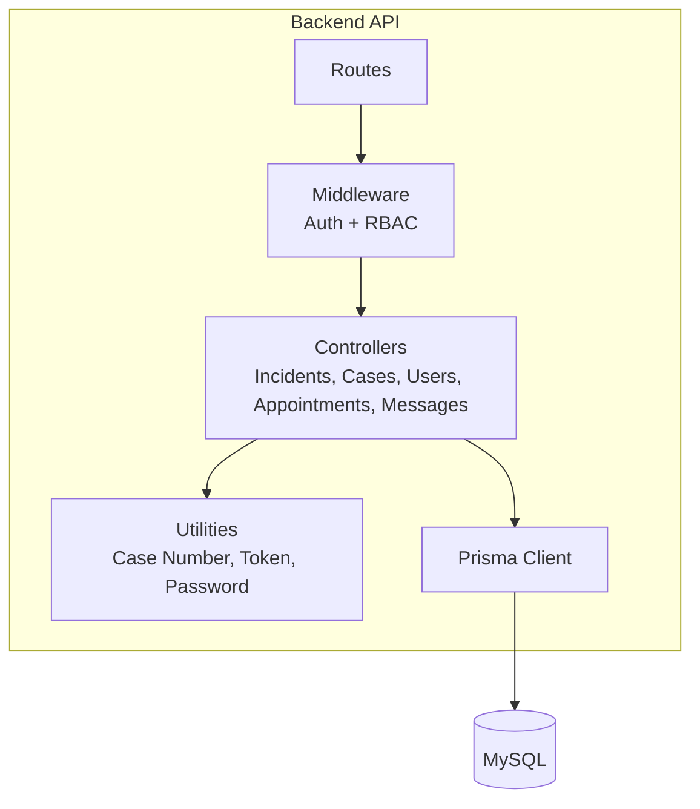
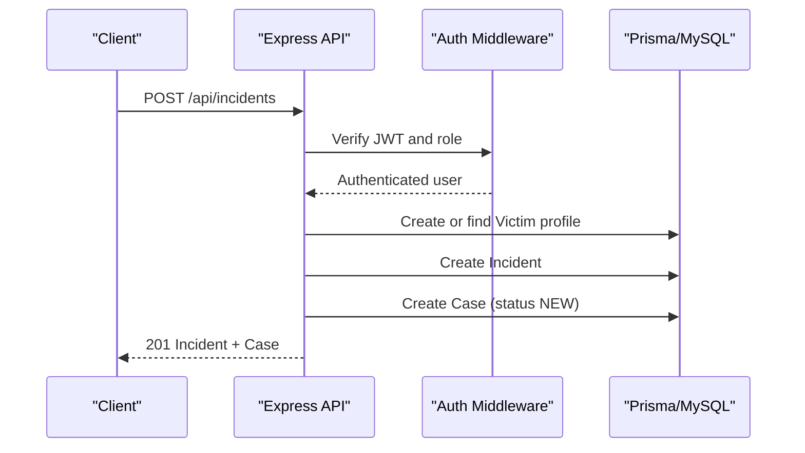
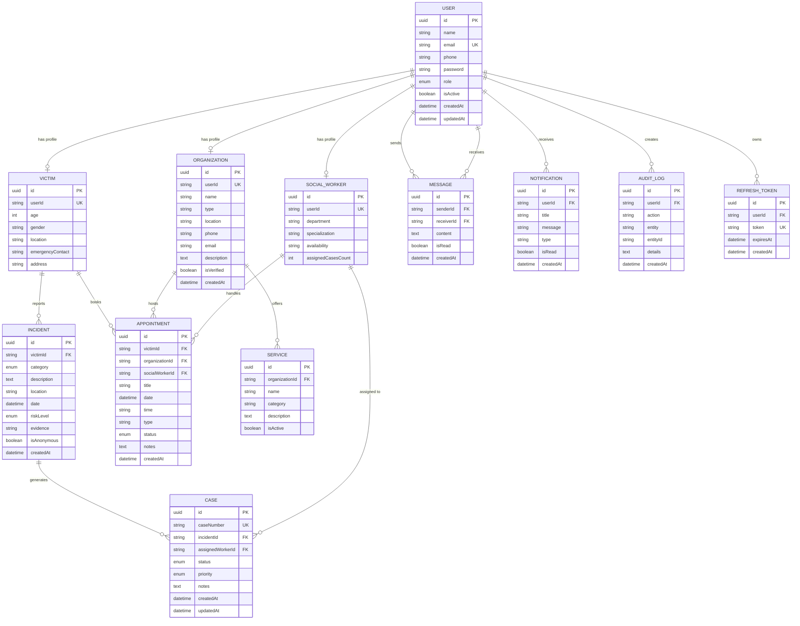
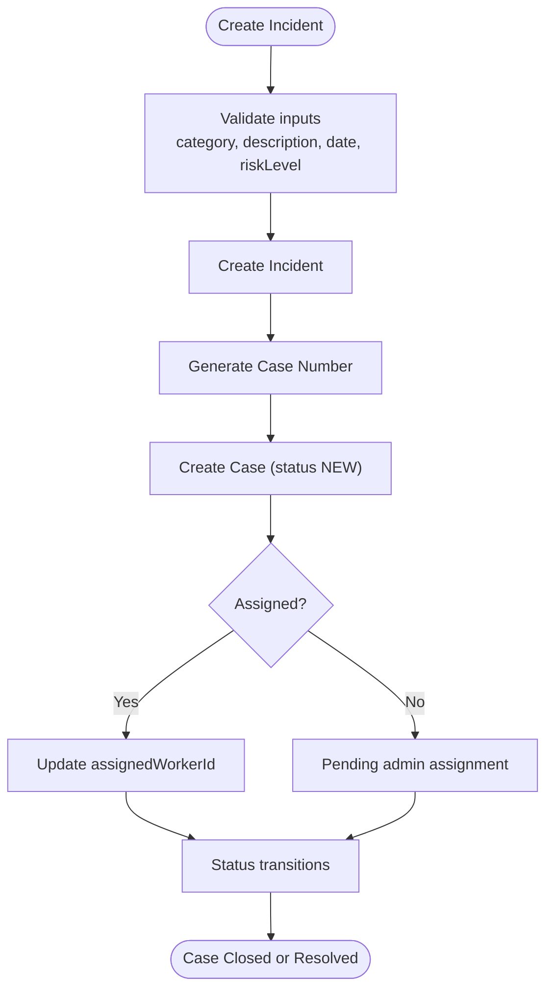
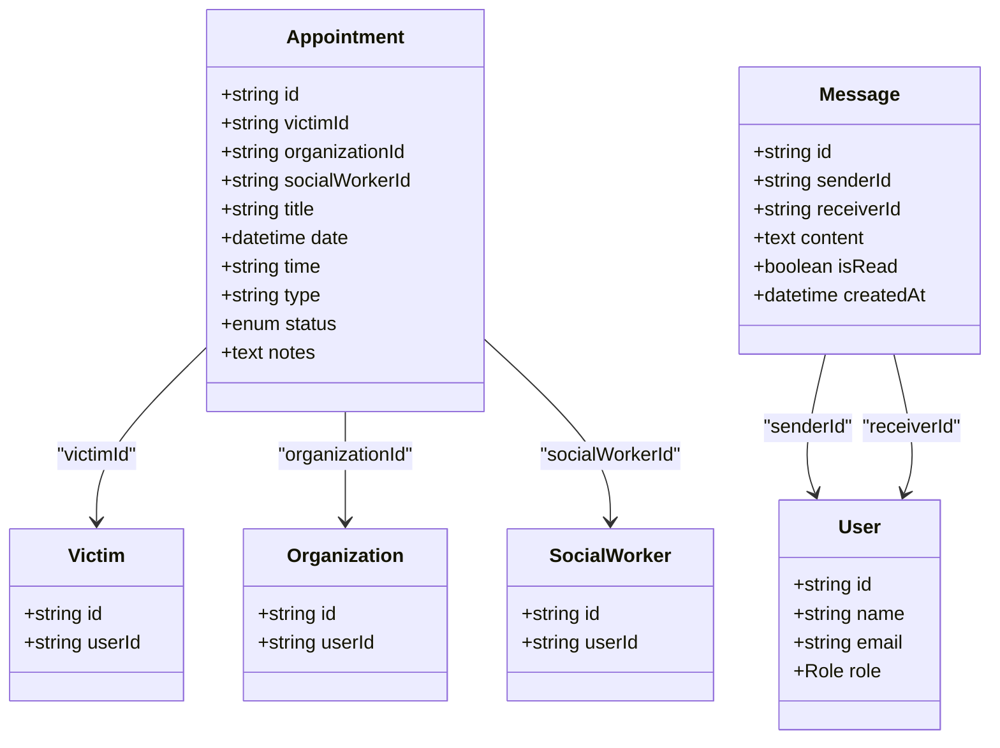
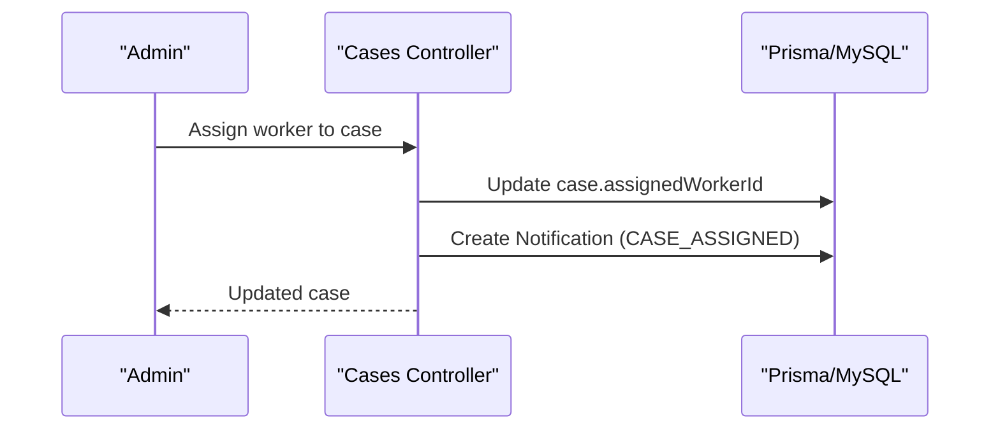
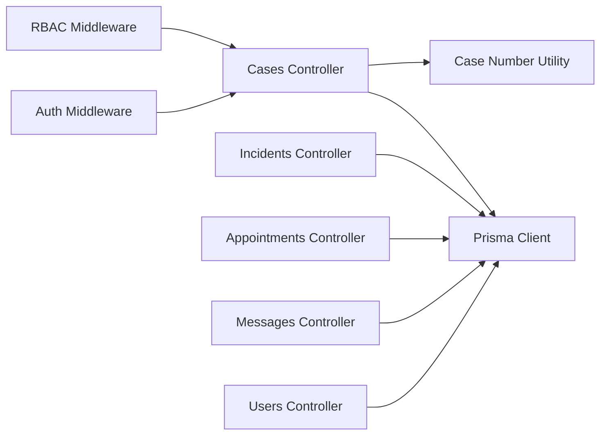

# Database Design

<cite>
**Referenced Files in This Document**
- [schema.prisma](file://backend-api/prisma/schema.prisma)
- [seed.ts](file://backend-api/prisma/seed.ts)
- [database.ts](file://backend-api/src/config/database.ts)
- [incidents.controller.ts](file://backend-api/src/controllers/incidents.controller.ts)
- [cases.controller.ts](file://backend-api/src/controllers/cases.controller.ts)
- [users.controller.ts](file://backend-api/src/controllers/users.controller.ts)
- [appointments.controller.ts](file://backend-api/src/controllers/appointments.controller.ts)
- [messages.controller.ts](file://backend-api/src/controllers/messages.controller.ts)
- [auth.ts](file://backend-api/src/middleware/auth.ts)
- [rbac.ts](file://backend-api/src/middleware/rbac.ts)
- [caseNumber.ts](file://backend-api/src/utils/caseNumber.ts)
- [uml-analysis.md](file://docs/uml-analysis.md)
</cite>

## Table of Contents
1. Introduction
2. Project Structure
3. Core Components
4. Architecture Overview
5. Detailed Component Analysis
6. Dependency Analysis
7. Performance Considerations
8. Troubleshooting Guide
9. Conclusion
10. Appendices

## Introduction
This document provides comprehensive data model documentation for SafeProtect Cameroon’s database schema. It covers all core entities, relationships, field definitions, constraints, indexes, migration strategy, seed data structure, validation rules, privacy measures, audit logging, and performance considerations. The system uses Prisma with MySQL to persist users, role-specific profiles, incidents, cases, appointments, messages, notifications, and audit logs.

## Project Structure
The backend API is organized around controllers, middleware, utilities, and a Prisma schema that defines the relational data model. Controllers implement business logic and enforce authorization and ownership rules. Middleware handles authentication and role-based access control. Utilities provide shared functionality such as case number generation.

**Diagram sources**
- [schema.prisma:1-208](file://backend-api/prisma/schema.prisma#L1-L208)
- [database.ts:1-6](file://backend-api/src/config/database.ts#L1-L6)

**Section sources**
- [schema.prisma:1-208](file://backend-api/prisma/schema.prisma#L1-L208)
- [database.ts:1-6](file://backend-api/src/config/database.ts#L1-L6)

## Core Components
The data model centers on these entities:
- User: Authentication and identity; linked to role-specific profiles.
- Victim: Sensitive personal information tied to a user.
- SocialWorker: Role profile for social workers managing cases and appointments.
- Organization: Role profile for organizations offering services and hosting appointments.
- Incident: Reportable events associated with victims.
- Case: Operational record derived from an incident with lifecycle status.
- Appointment: Scheduled interactions between victims, social workers, and organizations.
- Message: Direct communications between users.
- Notification: In-app alerts for users (e.g., case updates).
- AuditLog: Immutable records of actions for compliance.
- RefreshToken: Session tokens for authentication.

Key relationship patterns:
- One-to-one: User to Victim, SocialWorker, Organization (role-specific profiles).
- One-to-many: Victim to Incidents; Incident to Cases; SocialWorker to Cases; Organization to Services; User to Notifications; User to AuditLogs; User to RefreshTokens.
- Many-to-many via join entity: Appointments link Victim, SocialWorker, Organization (each appointment can reference one victim, optionally one organization, and optionally one social worker).
- Many-to-many via join entity: Messages link two Users (sender and receiver).

Indexes and constraints:
- Primary keys: All models use UUID primary keys.
- Unique constraints: User.email, Victim.userId, SocialWorker.userId, Organization.userId, Case.caseNumber, RefreshToken.token.
- Foreign keys: Enforced by Prisma relations (e.g., Incident.victimId -> Victim.id; Case.incidentId -> Incident.id; Appointment.victimId -> Victim.id; Message.senderId/receiverId -> User.id).
- Timestamps: createdAt and updatedAt fields where applicable.

Data types and enums:
- Enums: Role, CaseStatus, RiskLevel, IncidentCategory, AppointmentStatus.
- Text fields: Some fields use large text storage for descriptions and notes.

**Section sources**
- [schema.prisma:10-208](file://backend-api/prisma/schema.prisma#L10-L208)

## Architecture Overview
The system enforces role-based access and resource scoping at the API layer while relying on the database schema for referential integrity.

**Diagram sources**
- [incidents.controller.ts:22-68](file://backend-api/src/controllers/incidents.controller.ts#L22-L68)
- [auth.ts:5-19](file://backend-api/src/middleware/auth.ts#L5-L19)
- [schema.prisma:111-138](file://backend-api/prisma/schema.prisma#L111-L138)

**Section sources**
- [incidents.controller.ts:22-68](file://backend-api/src/controllers/incidents.controller.ts#L22-L68)
- [cases.controller.ts:7-23](file://backend-api/src/controllers/cases.controller.ts#L7-L23)
- [auth.ts:5-19](file://backend-api/src/middleware/auth.ts#L5-L19)
- [rbac.ts:5-12](file://backend-api/src/middleware/rbac.ts#L5-L12)

## Detailed Component Analysis

### Entity Relationships and Data Model

**Diagram sources**
- [schema.prisma:47-208](file://backend-api/prisma/schema.prisma#L47-L208)

**Section sources**
- [schema.prisma:47-208](file://backend-api/prisma/schema.prisma#L47-L208)

### User and Role-Specific Profiles
- One-to-one relationships:
  - User to Victim: Each victim account has a unique profile storing sensitive personal data.
  - User to SocialWorker: Each social worker account has a profile with department, specialization, and availability.
  - User to Organization: Each organization account has a profile with organizational details and verification status.
- Constraints:
  - Unique foreign keys ensure exactly one profile per user.
- Privacy:
  - Victim profile fields are sensitive and should be accessed only by authorized roles.

**Section sources**
- [schema.prisma:47-109](file://backend-api/prisma/schema.prisma#L47-L109)

### Incident and Case Lifecycle
- One-to-many:
  - Victim to Incident: A victim can report multiple incidents.
  - Incident to Case: Each incident generates at least one case.
- Business rules:
  - Creating an incident automatically creates a new case with status NEW and a generated case number.
  - Case assignment links a social worker to a case.
  - Case status transitions follow a defined lifecycle.

**Diagram sources**
- [incidents.controller.ts:22-68](file://backend-api/src/controllers/incidents.controller.ts#L22-L68)
- [caseNumber.ts:1-6](file://backend-api/src/utils/caseNumber.ts#L1-L6)
- [cases.controller.ts:80-105](file://backend-api/src/controllers/cases.controller.ts#L80-L105)

**Section sources**
- [incidents.controller.ts:22-68](file://backend-api/src/controllers/incidents.controller.ts#L22-L68)
- [cases.controller.ts:7-23](file://backend-api/src/controllers/cases.controller.ts#L7-L23)
- [cases.controller.ts:80-105](file://backend-api/src/controllers/cases.controller.ts#L80-L105)
- [caseNumber.ts:1-6](file://backend-api/src/utils/caseNumber.ts#L1-L6)

### Appointments and Messages
- Appointments:
  - Link Victim to optional Organization and optional SocialWorker.
  - Ownership checks restrict updates and deletions based on role and association.
- Messages:
  - Many-to-many relationship modeled via senderId and receiverId on Message.
  - Threads and conversations are retrieved by filtering sender/receiver pairs.

**Diagram sources**
- [schema.prisma:140-176](file://backend-api/prisma/schema.prisma#L140-L176)
- [appointments.controller.ts:12-87](file://backend-api/src/controllers/appointments.controller.ts#L12-L87)
- [messages.controller.ts:7-78](file://backend-api/src/controllers/messages.controller.ts#L7-L78)

**Section sources**
- [appointments.controller.ts:12-87](file://backend-api/src/controllers/appointments.controller.ts#L12-L87)
- [messages.controller.ts:7-78](file://backend-api/src/controllers/messages.controller.ts#L7-L78)

### Notifications and Audit Logging
- Notifications:
  - Created when cases are assigned or statuses change; fire-and-forget pattern ensures non-blocking updates.
- AuditLog:
  - Records user actions for compliance; includes action, entity, entityId, and optional details.

**Diagram sources**
- [cases.controller.ts:80-105](file://backend-api/src/controllers/cases.controller.ts#L80-L105)
- [schema.prisma:178-198](file://backend-api/prisma/schema.prisma#L178-L198)

**Section sources**
- [cases.controller.ts:80-105](file://backend-api/src/controllers/cases.controller.ts#L80-L105)
- [schema.prisma:178-198](file://backend-api/prisma/schema.prisma#L178-L198)

## Dependency Analysis
- Controllers depend on Prisma client for data operations.
- Authorization middleware validates JWTs and attaches user context.
- RBAC middleware enforces role-based permissions.
- Utilities generate case numbers and handle tokens/password hashing.

**Diagram sources**
- [auth.ts:5-19](file://backend-api/src/middleware/auth.ts#L5-L19)
- [rbac.ts:5-12](file://backend-api/src/middleware/rbac.ts#L5-L12)
- [cases.controller.ts:1-197](file://backend-api/src/controllers/cases.controller.ts#L1-L197)
- [incidents.controller.ts:1-149](file://backend-api/src/controllers/incidents.controller.ts#L1-L149)
- [appointments.controller.ts:1-137](file://backend-api/src/controllers/appointments.controller.ts#L1-L137)
- [messages.controller.ts:1-78](file://backend-api/src/controllers/messages.controller.ts#L1-L78)
- [users.controller.ts:1-65](file://backend-api/src/controllers/users.controller.ts#L1-L65)
- [caseNumber.ts:1-6](file://backend-api/src/utils/caseNumber.ts#L1-L6)

**Section sources**
- [auth.ts:5-19](file://backend-api/src/middleware/auth.ts#L5-L19)
- [rbac.ts:5-12](file://backend-api/src/middleware/rbac.ts#L5-L12)
- [cases.controller.ts:1-197](file://backend-api/src/controllers/cases.controller.ts#L1-L197)

## Performance Considerations
- Indexing recommendations:
  - Add indexes on frequently queried foreign keys: Incident.victimId, Case.incidentId, Case.assignedWorkerId, Appointment.victimId, Appointment.socialWorkerId, Message.senderId, Message.receiverId, Notification.userId, AuditLog.userId.
  - Add composite indexes for common filters: Case(status, createdAt), Incident(date, riskLevel), Appointment(date, status).
- Query optimization:
  - Use selective includes to avoid loading unnecessary related data (controllers already define include objects).
  - Paginate large result sets for incidents, cases, and appointments.
- Write amplification:
  - Notifications are created asynchronously (fire-and-forget) to avoid blocking critical paths.
- Storage:
  - Large text fields (descriptions, notes, evidence paths) should be monitored; consider offloading large files to object storage if needed.

[No sources needed since this section provides general guidance]

## Troubleshooting Guide
Common issues and resolutions:
- Unauthorized access:
  - Ensure requests include a valid Bearer token; verify token payload contains user id and role.
- Forbidden errors:
  - Check role-based access; some endpoints require specific roles (e.g., ADMIN for assignments).
- Resource not found:
  - Verify IDs exist and that scoping rules apply (e.g., victims can only see their own cases).
- Validation failures:
  - Ensure required fields are present (e.g., victimId for incidents, workerId for assignments).
- Data integrity:
  - Foreign key constraints will prevent orphaned records; delete dependent records first (e.g., cases before incidents).

**Section sources**
- [auth.ts:5-19](file://backend-api/src/middleware/auth.ts#L5-L19)
- [rbac.ts:5-12](file://backend-api/src/middleware/rbac.ts#L5-L12)
- [incidents.controller.ts:22-72](file://backend-api/src/controllers/incidents.controller.ts#L22-L72)
- [cases.controller.ts:48-78](file://backend-api/src/controllers/cases.controller.ts#L48-L78)
- [appointments.controller.ts:62-87](file://backend-api/src/controllers/appointments.controller.ts#L62-L87)

## Conclusion
SafeProtect Cameroon’s database schema provides a robust foundation for managing sensitive victim data, case workflows, and secure communications. The design emphasizes clear relationships, strong constraints, and role-based access controls. With recommended indexing and query optimizations, the system can scale to handle large datasets while maintaining performance and compliance through audit logging and privacy safeguards.

[No sources needed since this section summarizes without analyzing specific files]

## Appendices

### Migration Strategy
- Use Prisma migrations to evolve the schema:
  - Add new fields or tables incrementally.
  - Backfill data where necessary using scripts.
  - Test migrations in staging before production deployment.
- Rollback plan:
  - Keep migration history; revert only if safe and validated.

[No sources needed since this section provides general guidance]

### Seed Data Structure
- Seed script creates initial users and profiles:
  - Admin user with hashed password.
  - Social workers with department and specialization.
  - Victim with basic demographic data.
  - An incident and case to demonstrate workflow.
- Credentials:
  - Demo accounts are printed after seeding for testing.

**Section sources**
- [seed.ts:6-79](file://backend-api/prisma/seed.ts#L6-L79)

### Data Validation Rules
- Required fields:
  - Incident creation requires victimId (derived from authenticated victim if role is VICTIM), category, description, date, riskLevel.
  - Case assignment requires a valid workerId.
  - Appointment creation may auto-fill victimId for victims.
- Enum enforcement:
  - Role, CaseStatus, RiskLevel, IncidentCategory, AppointmentStatus are enforced by schema.
- Ownership checks:
  - Victims can only update/delete their own appointments.
  - Social workers can only update assigned appointments.
  - Case scoping limits visibility based on role.

**Section sources**
- [incidents.controller.ts:22-68](file://backend-api/src/controllers/incidents.controller.ts#L22-L68)
- [cases.controller.ts:80-105](file://backend-api/src/controllers/cases.controller.ts#L80-L105)
- [appointments.controller.ts:12-87](file://backend-api/src/controllers/appointments.controller.ts#L12-L87)

### Data Privacy Measures
- Sensitive victim information:
  - Stored in Victim profile; access restricted by role-based scoping.
  - Controllers select minimal fields for responses where possible.
- Anonymous reporting:
  - Incident.isAnonymous flag supports anonymous submissions.
- Secure credentials:
  - Passwords are hashed before storage.

**Section sources**
- [schema.prisma:70-81](file://backend-api/prisma/schema.prisma#L70-L81)
- [incidents.controller.ts:22-68](file://backend-api/src/controllers/incidents.controller.ts#L22-L68)
- [users.controller.ts:29-55](file://backend-api/src/controllers/users.controller.ts#L29-L55)

### Audit Logging for Compliance
- AuditLog captures:
  - userId, action, entity, entityId, details, createdAt.
- Integrate audit logging into critical write operations (e.g., case updates, user changes).

**Section sources**
- [schema.prisma:189-198](file://backend-api/prisma/schema.prisma#L189-L198)