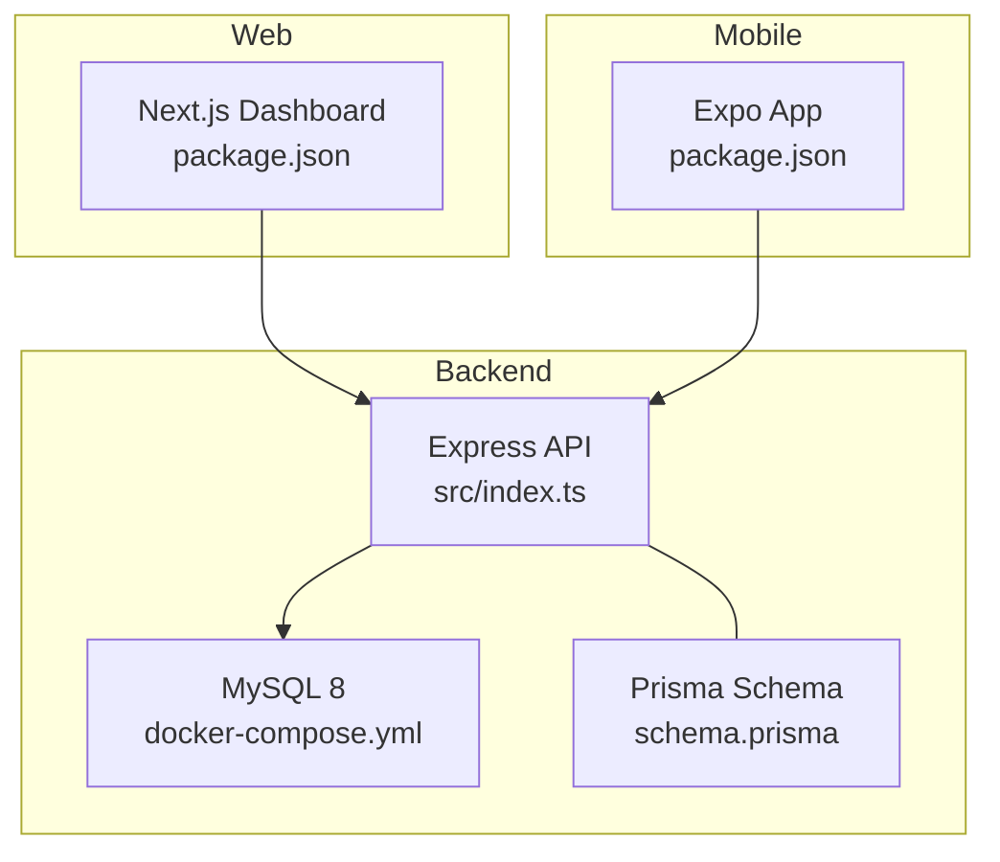
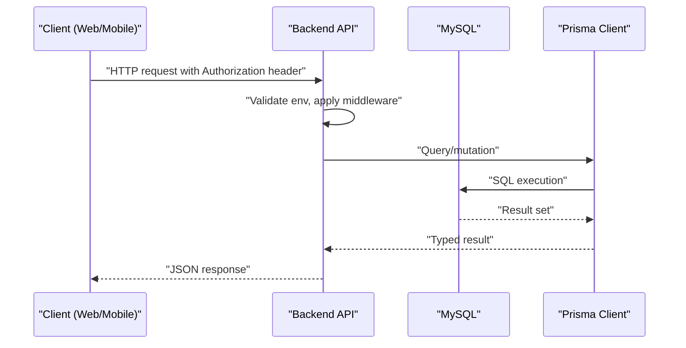
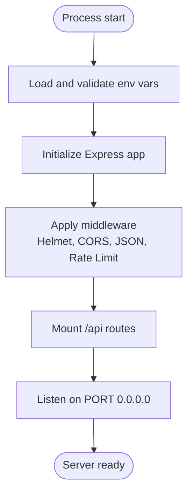
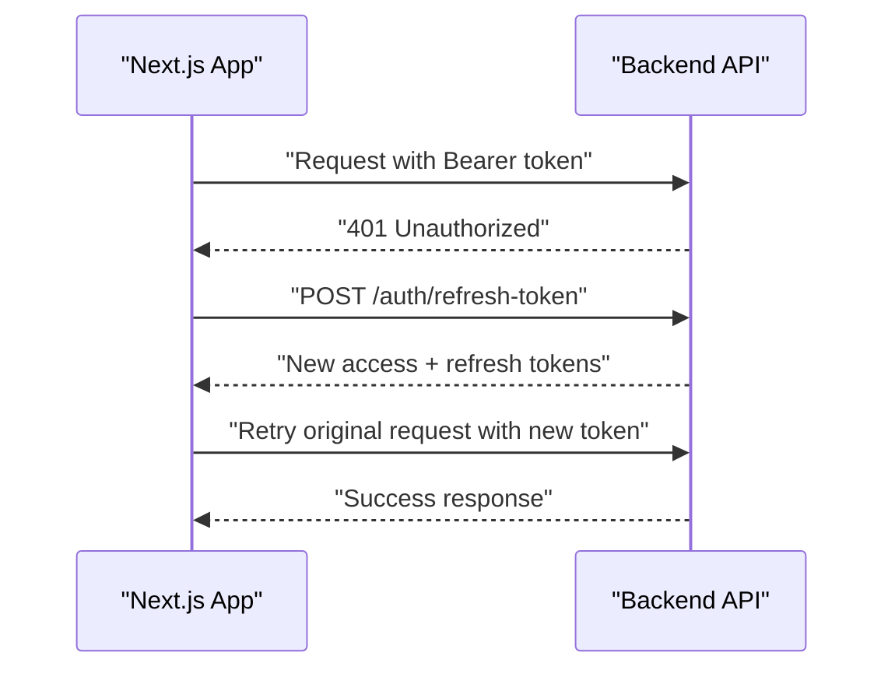
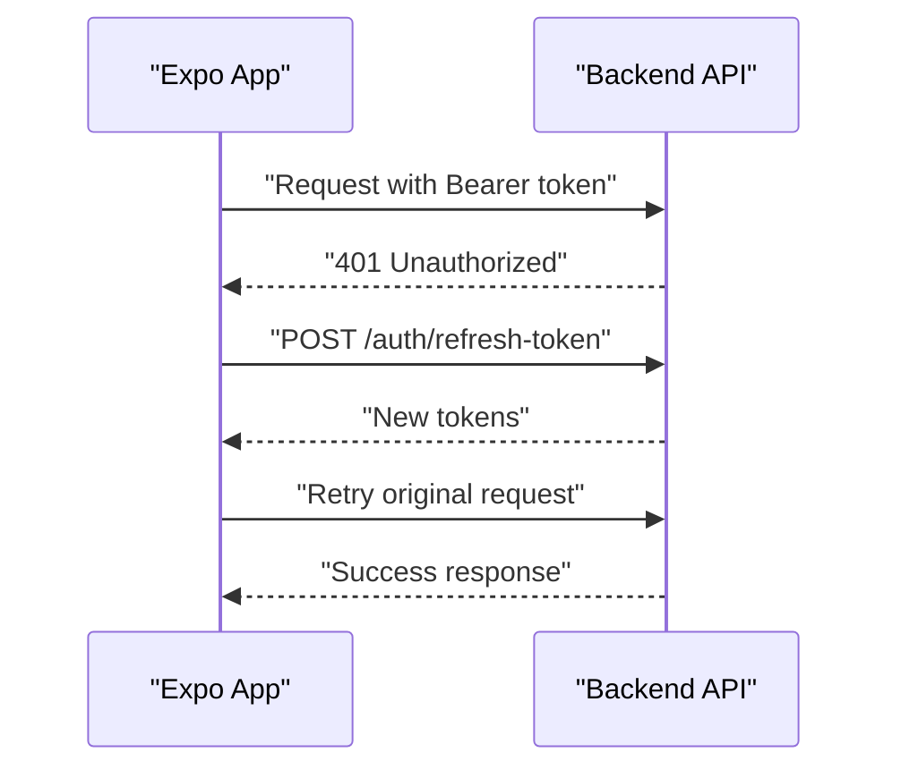
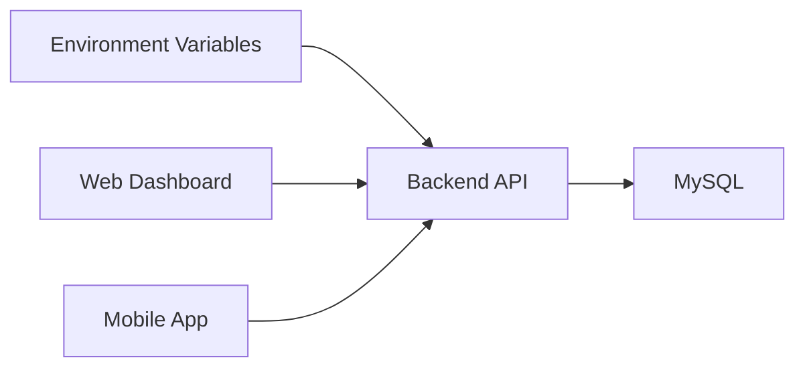

# Deployment Guide

<cite>
**Referenced Files in This Document**
- [README.md](file://README.md)
- [backend-api/docker-compose.yml](file://backend-api/docker-compose.yml)
- [backend-api/package.json](file://backend-api/package.json)
- [backend-api/src/index.ts](file://backend-api/src/index.ts)
- [backend-api/src/config/env.ts](file://backend-api/src/config/env.ts)
- [backend-api/src/config/database.ts](file://backend-api/src/config/database.ts)
- [backend-api/prisma/schema.prisma](file://backend-api/prisma/schema.prisma)
- [web-dashboard/package.json](file://web-dashboard/package.json)
- [web-dashboard/next.config.js](file://web-dashboard/next.config.js)
- [web-dashboard/src/lib/api.ts](file://web-dashboard/src/lib/api.ts)
- [mobile-app/package.json](file://mobile-app/package.json)
- [mobile-app/app.json](file://mobile-app/app.json)
- [mobile-app/src/services/api.ts](file://mobile-app/src/services/api.ts)
</cite>

## Table of Contents
1. Introduction
2. Project Structure
3. Core Components
4. Architecture Overview
5. Detailed Component Analysis
6. Dependency Analysis
7. Performance Considerations
8. Troubleshooting Guide
9. Conclusion
10. Appendices

## Introduction
This guide provides comprehensive deployment instructions for SafeProtect Cameroon across development and production environments. It covers environment setup with Docker Compose, configuration of environment variables, CI/CD pipeline recommendations, automated testing, build processes, deployment automation, scaling strategies, database backup and recovery, monitoring, SSL and reverse proxy configuration, and cloud platform options. The goal is to enable reliable, secure, and scalable operation of the Backend API, Web Dashboard, and Mobile App.

## Project Structure
SafeProtect Cameroon consists of three primary components:
- Backend API: Express.js + TypeScript + Prisma ORM with MySQL
- Web Dashboard: Next.js 14 application
- Mobile App: React Native + Expo

The repository includes scripts for building and running each component, a Docker Compose file for local database provisioning, and environment configuration files referenced by clients to connect to the API.

**Diagram sources**
- [backend-api/src/index.ts:1-34](file://backend-api/src/index.ts#L1-L34)
- [backend-api/docker-compose.yml:1-14](file://backend-api/docker-compose.yml#L1-L14)
- [backend-api/prisma/schema.prisma:1-208](file://backend-api/prisma/schema.prisma#L1-L208)
- [web-dashboard/package.json:1-40](file://web-dashboard/package.json#L1-L40)
- [mobile-app/package.json:1-45](file://mobile-app/package.json#L1-L45)

**Section sources**
- [README.md:9-18](file://README.md#L9-L18)
- [backend-api/docker-compose.yml:1-14](file://backend-api/docker-compose.yml#L1-L14)
- [backend-api/package.json:1-40](file://backend-api/package.json#L1-L40)
- [web-dashboard/package.json:1-40](file://web-dashboard/package.json#L1-L40)
- [mobile-app/package.json:1-45](file://mobile-app/package.json#L1-L45)

## Core Components
- Backend API
  - Entry point initializes middleware (security headers, CORS, JSON parsing, rate limiting), static uploads, routes, error handler, and listens on a configurable port.
  - Environment validation enforces required variables for runtime.
  - Database connection via Prisma client configured from environment.
- Web Dashboard
  - Next.js app with standard dev/build/start scripts.
  - API client uses an environment variable for base URL and handles token refresh flow.
- Mobile App
  - Expo-based app with scripts for starting on Android/iOS/web.
  - API client reads base URL from environment and implements token refresh with AsyncStorage.

Key environment variables:
- Backend: PORT, DATABASE_URL, JWT_SECRET, JWT_REFRESH_SECRET
- Web Dashboard: NEXT_PUBLIC_API_URL
- Mobile App: EXPO_PUBLIC_API_URL

**Section sources**
- [backend-api/src/index.ts:1-34](file://backend-api/src/index.ts#L1-L34)
- [backend-api/src/config/env.ts:1-14](file://backend-api/src/config/env.ts#L1-L14)
- [backend-api/src/config/database.ts:1-6](file://backend-api/src/config/database.ts#L1-L6)
- [web-dashboard/src/lib/api.ts:1-78](file://web-dashboard/src/lib/api.ts#L1-L78)
- [mobile-app/src/services/api.ts:1-103](file://mobile-app/src/services/api.ts#L1-L103)
- [README.md:106-113](file://README.md#L106-L113)

## Architecture Overview
The system follows a typical three-tier architecture:
- Presentation layer: Web Dashboard (Next.js) and Mobile App (Expo)
- Application layer: Backend API (Express)
- Data layer: MySQL managed via Prisma

Clients communicate with the API over HTTP(S). The API enforces security headers, rate limiting, and validates environment configuration at startup.

**Diagram sources**
- [backend-api/src/index.ts:1-34](file://backend-api/src/index.ts#L1-L34)
- [backend-api/src/config/database.ts:1-6](file://backend-api/src/config/database.ts#L1-L6)
- [backend-api/prisma/schema.prisma:1-208](file://backend-api/prisma/schema.prisma#L1-L208)

## Detailed Component Analysis

### Backend API Deployment
- Development
  - Use Docker Compose to run MySQL locally.
  - Generate Prisma client and run migrations before starting the server.
  - Start the development server using provided scripts.
- Production
  - Build the TypeScript code and run the compiled output.
  - Ensure all required environment variables are set.
  - Expose the API behind a reverse proxy with TLS termination.

Environment variables:
- PORT: Server listening port
- DATABASE_URL: MySQL connection string used by Prisma
- JWT_SECRET: Secret for access tokens
- JWT_REFRESH_SECRET: Secret for refresh tokens

Security and resilience:
- Security headers via Helmet
- CORS enabled
- Rate limiting applied globally
- Static upload directory mounted under /uploads

**Diagram sources**
- [backend-api/src/index.ts:1-34](file://backend-api/src/index.ts#L1-L34)
- [backend-api/src/config/env.ts:1-14](file://backend-api/src/config/env.ts#L1-L14)

**Section sources**
- [backend-api/docker-compose.yml:1-14](file://backend-api/docker-compose.yml#L1-L14)
- [backend-api/package.json:1-40](file://backend-api/package.json#L1-L40)
- [backend-api/src/index.ts:1-34](file://backend-api/src/index.ts#L1-L34)
- [backend-api/src/config/env.ts:1-14](file://backend-api/src/config/env.ts#L1-L14)
- [backend-api/src/config/database.ts:1-6](file://backend-api/src/config/database.ts#L1-L6)
- [backend-api/prisma/schema.prisma:1-208](file://backend-api/prisma/schema.prisma#L1-L208)

### Web Dashboard Deployment
- Development
  - Install dependencies and start the development server.
  - Configure NEXT_PUBLIC_API_URL to point to the backend API.
- Production
  - Build the Next.js app and serve the static output or use a Node runtime.
  - Set NEXT_PUBLIC_API_URL in the hosting environment.
  - Place behind a reverse proxy with HTTPS.

Token refresh behavior:
- Intercepts 401 responses and attempts to refresh tokens using stored refresh tokens.
- On successful refresh, retries the original request; otherwise redirects to login.

**Diagram sources**
- [web-dashboard/src/lib/api.ts:1-78](file://web-dashboard/src/lib/api.ts#L1-L78)

**Section sources**
- [web-dashboard/package.json:1-40](file://web-dashboard/package.json#L1-L40)
- [web-dashboard/next.config.js:1-6](file://web-dashboard/next.config.js#L1-L6)
- [web-dashboard/src/lib/api.ts:1-78](file://web-dashboard/src/lib/api.ts#L1-L78)
- [README.md:70-85](file://README.md#L70-L85)

### Mobile App Deployment
- Development
  - Start Expo and scan QR code with Expo Go.
  - Configure EXPO_PUBLIC_API_URL for your network address or emulator loopback.
- Production
  - Build signed APK/IPA using Expo EAS or native toolchains.
  - Distribute via stores or enterprise distribution.
  - Ensure EXPO_PUBLIC_API_URL points to production API.

Token refresh behavior:
- Stores tokens in AsyncStorage.
- On 401, attempts refresh once; clears auth state and triggers logout callback if refresh fails.

**Diagram sources**
- [mobile-app/src/services/api.ts:1-103](file://mobile-app/src/services/api.ts#L1-L103)

**Section sources**
- [mobile-app/package.json:1-45](file://mobile-app/package.json#L1-L45)
- [mobile-app/app.json:1-29](file://mobile-app/app.json#L1-L29)
- [mobile-app/src/services/api.ts:1-103](file://mobile-app/src/services/api.ts#L1-L103)
- [README.md:89-113](file://README.md#L89-L113)

## Dependency Analysis
- Backend depends on:
  - MySQL via Prisma
  - Environment variables validated at startup
- Web Dashboard depends on:
  - Backend API base URL configured via environment
- Mobile App depends on:
  - Backend API base URL configured via environment

**Diagram sources**
- [backend-api/src/config/env.ts:1-14](file://backend-api/src/config/env.ts#L1-L14)
- [web-dashboard/src/lib/api.ts:1-78](file://web-dashboard/src/lib/api.ts#L1-L78)
- [mobile-app/src/services/api.ts:1-103](file://mobile-app/src/services/api.ts#L1-L103)

**Section sources**
- [backend-api/src/config/env.ts:1-14](file://backend-api/src/config/env.ts#L1-L14)
- [web-dashboard/src/lib/api.ts:1-78](file://web-dashboard/src/lib/api.ts#L1-L78)
- [mobile-app/src/services/api.ts:1-103](file://mobile-app/src/services/api.ts#L1-L103)

## Performance Considerations
- Backend
  - Enable rate limiting to protect against abuse.
  - Use connection pooling for MySQL through Prisma and ensure adequate pool size based on workload.
  - Serve static assets efficiently via reverse proxy caching.
- Web Dashboard
  - Leverage Next.js build optimizations and static asset caching.
  - Configure CDN for static assets and API responses where appropriate.
- Mobile App
  - Minimize network calls; cache data locally when possible.
  - Implement retry logic with exponential backoff for transient errors.

[No sources needed since this section provides general guidance]

## Troubleshooting Guide
Common issues and resolutions:
- Missing environment variables
  - Ensure all required variables are set in the runtime environment.
  - Validate that the backend starts without errors due to missing config.
- Database connectivity
  - Verify DATABASE_URL points to a reachable MySQL instance.
  - Confirm Prisma schema matches the database state and migrations are applied.
- Token refresh failures
  - Check that refresh tokens are stored correctly and not expired.
  - Ensure the API’s refresh endpoint is accessible and secrets are consistent.
- Reverse proxy and SSL
  - Confirm TLS termination is configured and upstream requests are forwarded correctly.
  - Validate CORS settings allow the web domain and mobile app schemes.

Operational checks:
- Health endpoints: Add a simple health check route to verify service readiness.
- Logs: Centralize logs for API and reverse proxy to aid debugging.
- Metrics: Instrument key metrics (request rates, error rates, latency) for observability.

**Section sources**
- [backend-api/src/config/env.ts:1-14](file://backend-api/src/config/env.ts#L1-L14)
- [backend-api/src/config/database.ts:1-6](file://backend-api/src/config/database.ts#L1-L6)
- [web-dashboard/src/lib/api.ts:1-78](file://web-dashboard/src/lib/api.ts#L1-L78)
- [mobile-app/src/services/api.ts:1-103](file://mobile-app/src/services/api.ts#L1-L103)

## Conclusion
SafeProtect Cameroon can be deployed reliably across development and production by following the outlined steps for environment configuration, containerization, builds, and deployment automation. Adhering to security best practices, implementing robust token refresh flows, and planning for scaling, backups, and monitoring will ensure high availability and resilience.

[No sources needed since this section summarizes without analyzing specific files]

## Appendices

### Development Environment Setup with Docker Compose
- Run MySQL using the provided Docker Compose file.
- Initialize Prisma client and apply migrations.
- Seed the database with demo data if needed.
- Start the backend development server and configure client base URLs.

**Section sources**
- [backend-api/docker-compose.yml:1-14](file://backend-api/docker-compose.yml#L1-L14)
- [backend-api/package.json:1-40](file://backend-api/package.json#L1-L40)
- [README.md:30-58](file://README.md#L30-L58)

### Production Deployment Strategies
- Backend API
  - Build TypeScript to dist and run the compiled output.
  - Deploy behind a reverse proxy with TLS termination.
  - Configure environment variables securely via secret management.
- Web Dashboard
  - Build Next.js and deploy static output or Node runtime.
  - Set NEXT_PUBLIC_API_URL to production API endpoint.
- Mobile App
  - Build signed binaries using Expo EAS or native toolchains.
  - Configure EXPO_PUBLIC_API_URL to production API endpoint.

**Section sources**
- [backend-api/package.json:1-40](file://backend-api/package.json#L1-L40)
- [web-dashboard/package.json:1-40](file://web-dashboard/package.json#L1-L40)
- [mobile-app/package.json:1-45](file://mobile-app/package.json#L1-L45)
- [README.md:106-113](file://README.md#L106-L113)

### Environment Variable Configuration
- Backend
  - PORT: Listening port
  - DATABASE_URL: MySQL connection string
  - JWT_SECRET: Access token secret
  - JWT_REFRESH_SECRET: Refresh token secret
- Web Dashboard
  - NEXT_PUBLIC_API_URL: Base URL for API calls
- Mobile App
  - EXPO_PUBLIC_API_URL: Base URL for API calls

**Section sources**
- [backend-api/src/config/env.ts:1-14](file://backend-api/src/config/env.ts#L1-L14)
- [web-dashboard/src/lib/api.ts:1-78](file://web-dashboard/src/lib/api.ts#L1-L78)
- [mobile-app/src/services/api.ts:1-103](file://mobile-app/src/services/api.ts#L1-L103)
- [README.md:106-113](file://README.md#L106-L113)

### CI/CD Pipeline Setup
Recommended stages:
- Lint and type-check
- Unit and integration tests
- Build artifacts (backend dist, web dashboard build, mobile app binaries)
- Deploy to staging and production environments
- Notify team of build and deployment status

Automation tips:
- Cache dependencies to speed up builds
- Use parallel jobs for independent tasks
- Store secrets securely in CI/CD vaults
- Tag images and artifacts for traceability

[No sources needed since this section provides general guidance]

### Automated Testing
- Backend
  - Test controllers and services with mocked database and external dependencies.
  - Validate environment configuration parsing.
- Web Dashboard
  - Test API client interceptors and token refresh logic.
  - Snapshot UI components where applicable.
- Mobile App
  - Test navigation flows and API interactions with mocks.

[No sources needed since this section provides general guidance]

### Build Processes
- Backend
  - Compile TypeScript to dist and run the compiled output.
- Web Dashboard
  - Build Next.js for production and serve statically or via Node.
- Mobile App
  - Build signed APK/IPA using Expo EAS or native toolchains.

**Section sources**
- [backend-api/package.json:1-40](file://backend-api/package.json#L1-L40)
- [web-dashboard/package.json:1-40](file://web-dashboard/package.json#L1-L40)
- [mobile-app/package.json:1-45](file://mobile-app/package.json#L1-L45)

### Deployment Automation
- Use infrastructure-as-code templates for provisioning servers and databases.
- Automate environment variable injection from secret stores.
- Implement blue/green or rolling deployments for zero-downtime updates.
- Rollback procedures should be defined and tested.

[No sources needed since this section provides general guidance]

### Scaling and High Availability
- Horizontal scaling of Backend API instances behind a load balancer.
- Stateless design allows easy scaling; store sessions externally if needed.
- Database scaling via read replicas and connection pooling tuning.
- Caching layers (e.g., Redis) for frequently accessed data.

[No sources needed since this section provides general guidance]

### Load Balancing Strategies
- Layer 7 load balancing for routing and TLS termination.
- Health checks to remove unhealthy instances.
- Sticky sessions only if necessary; prefer stateless design.

[No sources needed since this section provides general guidance]

### Database Backup and Recovery
- Schedule regular backups of MySQL data volumes.
- Test restore procedures periodically.
- Consider point-in-time recovery with binary logs.
- Encrypt backups at rest and in transit.

[No sources needed since this section provides general guidance]

### Monitoring and Observability
- Collect metrics for request rates, error rates, and latency.
- Centralize logs for API and reverse proxy.
- Set up alerts for critical thresholds.
- Track uptime and performance trends.

[No sources needed since this section provides general guidance]

### SSL Certificate Configuration
- Terminate TLS at the reverse proxy using managed certificates.
- Rotate certificates automatically where supported.
- Enforce HTTPS and redirect HTTP to HTTPS.

[No sources needed since this section provides general guidance]

### Domain Setup
- Configure DNS records pointing to the load balancer or reverse proxy.
- Use separate domains or subdomains for web and API if desired.
- Validate domain ownership and certificate issuance.

[No sources needed since this section provides general guidance]

### Reverse Proxy Configuration
- Forward requests to Backend API on internal ports.
- Set proper headers (X-Forwarded-For, X-Forwarded-Proto).
- Enable gzip compression and caching for static assets.

[No sources needed since this section provides general guidance]

### Cloud Platform Deployment Options
- Container orchestration platforms (e.g., Kubernetes) for scalable deployments.
- Managed services for databases and caching.
- Use platform-native secrets management and CI/CD integrations.

[No sources needed since this section provides general guidance]

### Disaster Recovery Planning
- Define RTO and RPO targets.
- Maintain offsite backups and test restoration regularly.
- Document incident response procedures and communication plans.

[No sources needed since this section provides general guidance]