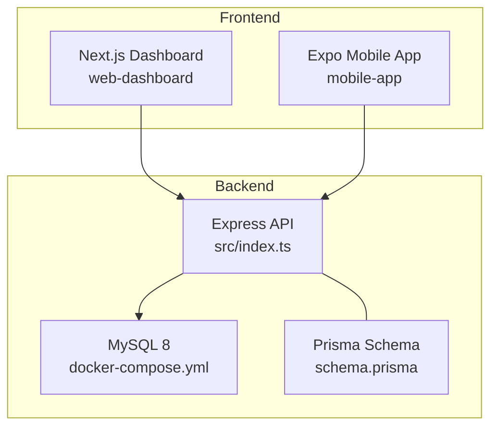
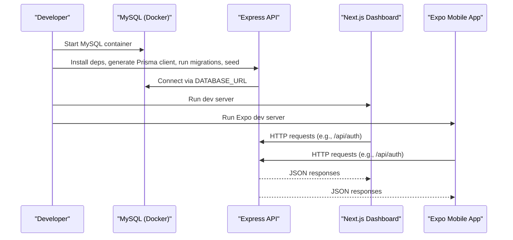
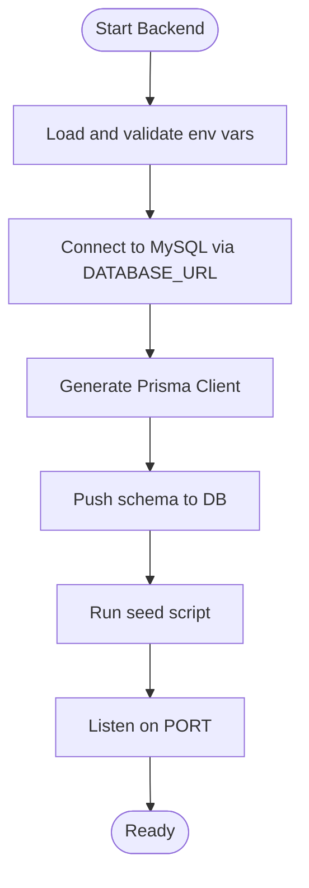
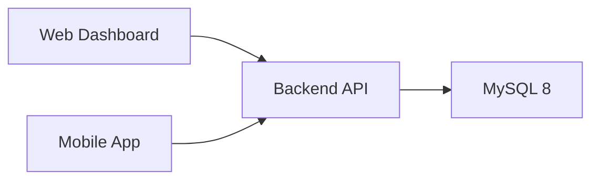

# Getting Started

<cite>
**Referenced Files in This Document**
- [README.md](file://README.md)
- [backend-api/package.json](file://backend-api/package.json)
- [backend-api/src/index.ts](file://backend-api/src/index.ts)
- [backend-api/src/config/env.ts](file://backend-api/src/config/env.ts)
- [backend-api/prisma/schema.prisma](file://backend-api/prisma/schema.prisma)
- [backend-api/prisma/seed.ts](file://backend-api/prisma/seed.ts)
- [backend-api/docker-compose.yml](file://backend-api/docker-compose.yml)
- [web-dashboard/package.json](file://web-dashboard/package.json)
- [mobile-app/package.json](file://mobile-app/package.json)
- [mobile-app/app.json](file://mobile-app/app.json)
</cite>

## Table of Contents
1. Introduction
2. Project Structure
3. Core Components
4. Architecture Overview
5. Detailed Component Analysis
6. Dependency Analysis
7. Performance Considerations
8. Troubleshooting Guide
9. Conclusion
10. Appendices

## Introduction
SafeProtect Cameroon is a secure digital ecosystem to protect children and support victims of gender-based violence. It connects victims with assistance services and enables social workers and organizations to manage protection cases efficiently. The system consists of three components:
- Backend API (Express.js + Prisma + TypeScript)
- Web Dashboard (Next.js 14 Admin Dashboard)
- Mobile App (React Native + Expo)

This guide helps you set up all three components locally, configure the environment, initialize the database, and verify that everything works end-to-end.

## Project Structure
The repository is organized into three main applications plus shared documentation:
- backend-api: REST API server, Prisma schema, seeding script, Docker Compose for MySQL
- web-dashboard: Next.js admin dashboard
- mobile-app: Expo-based mobile app for victims and social workers

**Diagram sources**
- [backend-api/src/index.ts:1-34](file://backend-api/src/index.ts#L1-L34)
- [backend-api/docker-compose.yml:1-14](file://backend-api/docker-compose.yml#L1-L14)
- [backend-api/prisma/schema.prisma:1-208](file://backend-api/prisma/schema.prisma#L1-L208)
- [web-dashboard/package.json:1-40](file://web-dashboard/package.json#L1-L40)
- [mobile-app/package.json:1-45](file://mobile-app/package.json#L1-L45)

**Section sources**
- [README.md:9-18](file://README.md#L9-L18)

## Core Components
- Backend API
  - Express server with security middleware (helmet, cors, rate limiting)
  - Prisma ORM connected to MySQL via DATABASE_URL
  - Environment validation using Zod
  - Seed script creates demo users and sample data
- Web Dashboard
  - Next.js 14 application for administrators
  - Reads API base URL from environment variables
- Mobile App
  - Expo-based React Native app
  - Reads API base URL from environment variables

Key scripts and configuration:
- Backend scripts include development, build, start, and Prisma tasks
- Database schema defines roles, case lifecycle, incidents, appointments, messaging, notifications, audit logs, and refresh tokens
- Docker Compose runs MySQL 8 with a persistent volume

**Section sources**
- [backend-api/package.json:6-13](file://backend-api/package.json#L6-L13)
- [backend-api/src/index.ts:10-33](file://backend-api/src/index.ts#L10-L33)
- [backend-api/src/config/env.ts:6-13](file://backend-api/src/config/env.ts#L6-L13)
- [backend-api/prisma/schema.prisma:10-208](file://backend-api/prisma/schema.prisma#L10-L208)
- [backend-api/prisma/seed.ts:6-79](file://backend-api/prisma/seed.ts#L6-L79)
- [web-dashboard/package.json:5-9](file://web-dashboard/package.json#L5-L9)
- [mobile-app/package.json:5-10](file://mobile-app/package.json#L5-L10)

## Architecture Overview
High-level flow:
- Clients (Web Dashboard and Mobile App) call the Backend API over HTTP
- Backend validates environment variables, applies security middleware, and routes requests
- Data persistence uses MySQL through Prisma
- Demo data is seeded to enable immediate testing

**Diagram sources**
- [backend-api/docker-compose.yml:1-14](file://backend-api/docker-compose.yml#L1-L14)
- [backend-api/src/index.ts:10-33](file://backend-api/src/index.ts#L10-L33)
- [backend-api/prisma/schema.prisma:1-8](file://backend-api/prisma/schema.prisma#L1-L8)
- [web-dashboard/package.json:5-9](file://web-dashboard/package.json#L5-L9)
- [mobile-app/package.json:5-10](file://mobile-app/package.json#L5-L10)

## Detailed Component Analysis

### Backend API Setup
- Install dependencies and start the development server
- Configure environment variables for port, database connection, and JWT secrets
- Use Docker Compose to run MySQL 8
- Generate Prisma client, push schema to the database, and seed demo data
- Server listens on port 5000 by default

Environment variables validated at runtime:
- PORT, DATABASE_URL, JWT_SECRET, JWT_REFRESH_SECRET

Database schema highlights:
- Roles: VICTIM, SOCIAL_WORKER, ORGANIZATION, ADMIN
- Case statuses: NEW, UNDER_INVESTIGATION, SUPPORT_PROVIDED, RESOLVED, CLOSED
- Incident categories and risk levels
- Entities: User, Victim, SocialWorker, Organization, Incident, Case, Appointment, Service, Message, Notification, AuditLog, RefreshToken

Seed data includes:
- Admin user
- Two social workers
- One victim profile
- A sample incident and case assigned to a social worker

**Diagram sources**
- [backend-api/src/config/env.ts:6-13](file://backend-api/src/config/env.ts#L6-L13)
- [backend-api/prisma/schema.prisma:1-8](file://backend-api/prisma/schema.prisma#L1-L8)
- [backend-api/prisma/seed.ts:6-79](file://backend-api/prisma/seed.ts#L6-L79)
- [backend-api/package.json:6-13](file://backend-api/package.json#L6-L13)

**Section sources**
- [backend-api/package.json:6-13](file://backend-api/package.json#L6-L13)
- [backend-api/src/index.ts:10-33](file://backend-api/src/index.ts#L10-L33)
- [backend-api/src/config/env.ts:6-13](file://backend-api/src/config/env.ts#L6-L13)
- [backend-api/prisma/schema.prisma:10-208](file://backend-api/prisma/schema.prisma#L10-L208)
- [backend-api/prisma/seed.ts:6-79](file://backend-api/prisma/seed.ts#L6-L79)

### Web Dashboard Setup
- Install dependencies and start the development server
- Configure NEXT_PUBLIC_API_URL to point to the running Backend API
- Access the dashboard at http://localhost:3000

Expected output:
- Development server starts and serves the Next.js app on port 3000

**Section sources**
- [web-dashboard/package.json:5-9](file://web-dashboard/package.json#L5-L9)
- [README.md:70-86](file://README.md#L70-L86)

### Mobile App Setup
- Install dependencies and start the Expo development server
- Configure EXPO_PUBLIC_API_URL to point to the running Backend API
- Scan the QR code with Expo Go on your phone or use the emulator

Expected output:
- Expo dev server starts and displays a QR code for scanning

**Section sources**
- [mobile-app/package.json:5-10](file://mobile-app/package.json#L5-L10)
- [mobile-app/app.json:1-29](file://mobile-app/app.json#L1-L29)
- [README.md:89-103](file://README.md#L89-L103)

## Dependency Analysis
- Backend depends on:
  - Express, CORS, Helmet, Rate Limiting
  - Prisma Client and Prisma CLI
  - bcryptjs, jsonwebtoken, zod, dotenv
- Web Dashboard depends on:
  - Next.js 14, React 18, Tailwind CSS, Recharts, Axios
- Mobile App depends on:
  - Expo, React Native, Navigation libraries, Axios, Location/Camera/Image Picker

**Diagram sources**
- [web-dashboard/package.json:11-27](file://web-dashboard/package.json#L11-L27)
- [mobile-app/package.json:11-35](file://mobile-app/package.json#L11-L35)
- [backend-api/package.json:14-38](file://backend-api/package.json#L14-L38)
- [backend-api/docker-compose.yml:1-14](file://backend-api/docker-compose.yml#L1-L14)

**Section sources**
- [backend-api/package.json:14-38](file://backend-api/package.json#L14-L38)
- [web-dashboard/package.json:11-27](file://web-dashboard/package.json#L11-L27)
- [mobile-app/package.json:11-35](file://mobile-app/package.json#L11-L35)

## Performance Considerations
- Enable HTTPS in production and restrict CORS to trusted origins
- Tune rate limits according to expected traffic patterns
- Use connection pooling and query optimization in Prisma
- Cache frequently accessed read-only data where appropriate
- Monitor database performance and index high-cardinality columns

[No sources needed since this section provides general guidance]

## Troubleshooting Guide
Common issues and resolutions:
- Cannot connect to MySQL
  - Ensure Docker Compose is running and the database service is healthy
  - Verify DATABASE_URL matches the container credentials and database name
- Prisma errors during migration or generation
  - Regenerate the Prisma client and re-run migrations
  - Confirm the database schema aligns with the current Prisma schema
- Port conflicts
  - Change the backend PORT if another process is using 5000
  - Adjust docker-compose ports if necessary
- API not reachable from mobile device
  - Set EXPO_PUBLIC_API_URL to your computer’s LAN IP or emulator address
  - Restart Expo after changing environment variables
- Web dashboard cannot reach API
  - Set NEXT_PUBLIC_API_URL to the correct backend base URL
  - Restart the Next.js dev server after changes

Verification steps:
- Confirm the API is listening on the configured port
- Test authentication endpoints to ensure login and token issuance work
- Validate that clients can fetch data from the API

**Section sources**
- [backend-api/docker-compose.yml:1-14](file://backend-api/docker-compose.yml#L1-L14)
- [backend-api/src/config/env.ts:6-13](file://backend-api/src/config/env.ts#L6-L13)
- [backend-api/src/index.ts:29-33](file://backend-api/src/index.ts#L29-L33)
- [README.md:106-113](file://README.md#L106-L113)

## Conclusion
You now have the full SafeProtect Cameroon stack running locally:
- Backend API serving secure endpoints backed by MySQL
- Web Dashboard for administrative management
- Mobile App for victims and social workers

Use the provided demo credentials to explore features and verify integrations across components.

[No sources needed since this section summarizes without analyzing specific files]

## Appendices

### Quick Start Commands
- Backend API
  - Install dependencies
  - Copy environment file and edit with your MySQL credentials
  - Start MySQL with Docker
  - Generate Prisma client
  - Push schema to database
  - Seed the database with demo data
  - Start the development server
  - Expected result: API running at http://localhost:5000

- Web Dashboard
  - Install dependencies
  - Start the development server
  - Expected result: Dashboard running at http://localhost:3000

- Mobile App
  - Install dependencies
  - Start Expo development server
  - Expected result: QR code displayed for scanning with Expo Go

**Section sources**
- [README.md:30-103](file://README.md#L30-L103)

### Environment Configuration
- Backend API
  - Required variables: PORT, DATABASE_URL, JWT_SECRET, JWT_REFRESH_SECRET
  - Validated at startup using Zod schema

- Web Dashboard
  - Set NEXT_PUBLIC_API_URL to the backend base URL

- Mobile App
  - Set EXPO_PUBLIC_API_URL to the backend base URL
  - For Android emulator, use the emulator-specific host; for physical devices, use your LAN IP

**Section sources**
- [backend-api/src/config/env.ts:6-13](file://backend-api/src/config/env.ts#L6-L13)
- [README.md:106-113](file://README.md#L106-L113)

### Database Initialization
- Use Docker Compose to run MySQL 8
- Generate Prisma client
- Push schema to the database
- Seed demo data including users and a sample case

**Section sources**
- [backend-api/docker-compose.yml:1-14](file://backend-api/docker-compose.yml#L1-L14)
- [backend-api/prisma/schema.prisma:1-8](file://backend-api/prisma/schema.prisma#L1-L8)
- [backend-api/prisma/seed.ts:6-79](file://backend-api/prisma/seed.ts#L6-L79)

### Demo Credentials
- Admin: email and password as documented
- Social Workers: two accounts with specified emails and passwords
- Victim: one account with specified email and password

These are created by the seed script and can be used to log in to the Web Dashboard and Mobile App.

**Section sources**
- [README.md:60-67](file://README.md#L60-L67)
- [backend-api/prisma/seed.ts:6-79](file://backend-api/prisma/seed.ts#L6-L79)

### API Endpoint Verification
- Base routes include modules for Auth, Users, Victims, Social Workers, Organizations, Incidents, Cases, Appointments, Services, Messages, Notifications, and Analytics
- After starting the backend, test endpoints such as authentication to confirm connectivity and response format

**Section sources**
- [README.md:127-143](file://README.md#L127-L143)