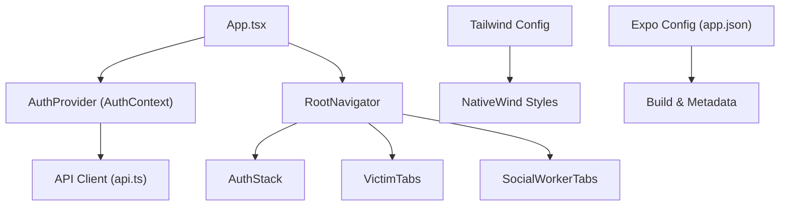
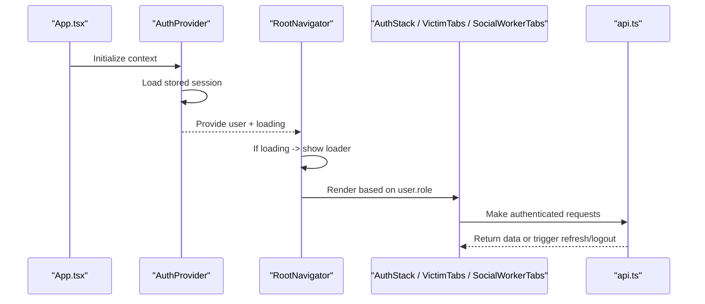
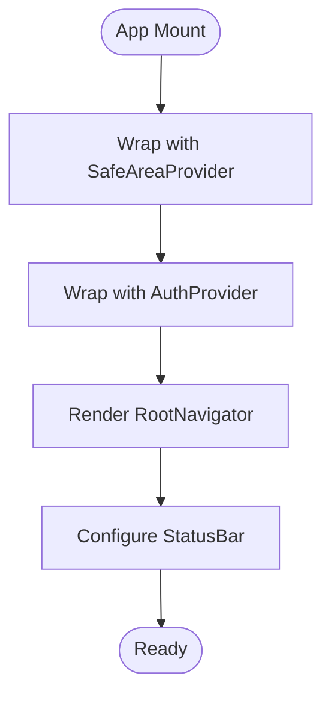
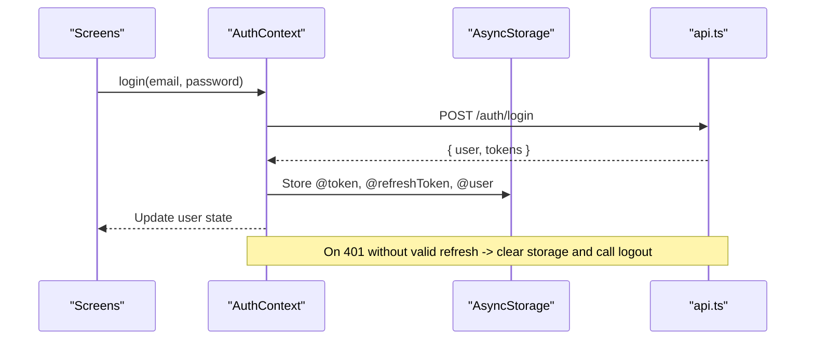
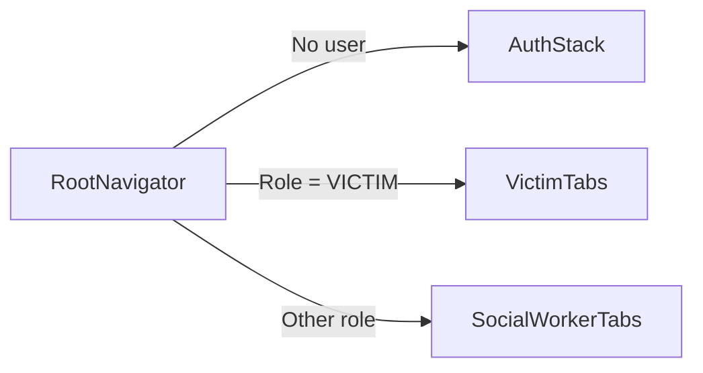
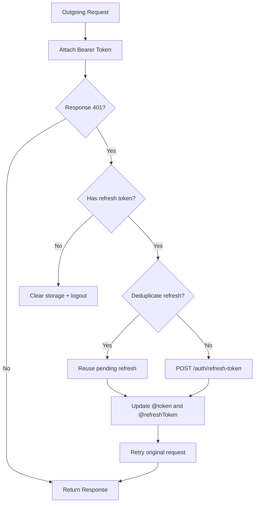
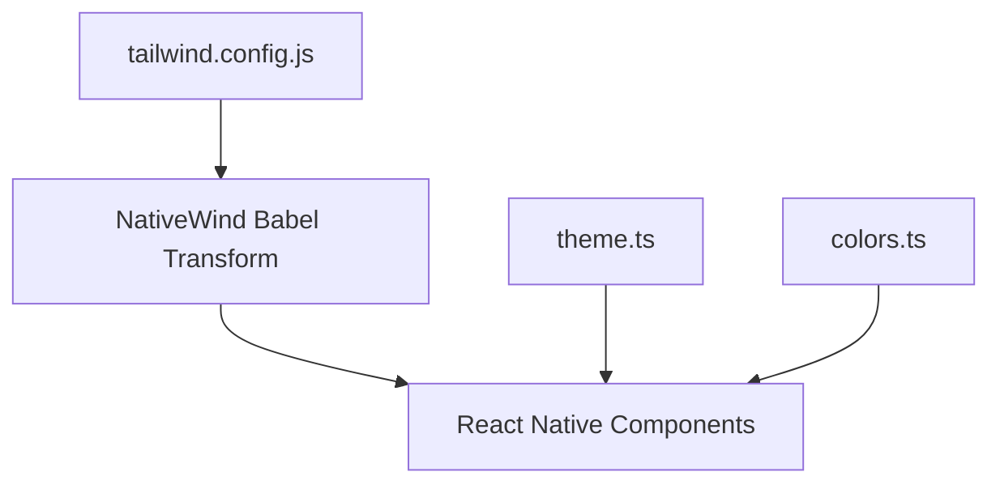
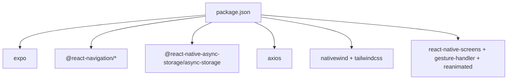

# App Architecture & Setup

<cite>
**Referenced Files in This Document**
- [App.tsx](file://mobile-app/App.tsx)
- [package.json](file://mobile-app/package.json)
- [app.json](file://mobile-app/app.json)
- [tailwind.config.js](file://mobile-app/tailwind.config.js)
- [babel.config.js](file://mobile-app/babel.config.js)
- [metro.config.js](file://mobile-app/metro.config.js)
- [AuthContext.tsx](file://mobile-app/src/contexts/AuthContext.tsx)
- [RootNavigator.tsx](file://mobile-app/src/navigation/RootNavigator.tsx)
- [AuthStack.tsx](file://mobile-app/src/navigation/AuthStack.tsx)
- [VictimTabs.tsx](file://mobile-app/src/navigation/VictimTabs.tsx)
- [SocialWorkerTabs.tsx](file://mobile-app/src/navigation/SocialWorkerTabs.tsx)
- [useAuth.ts](file://mobile-app/src/hooks/useAuth.ts)
- [api.ts](file://mobile-app/src/services/api.ts)
- [theme.ts](file://mobile-app/src/constants/theme.ts)
- [colors.ts](file://mobile-app/src/constants/colors.ts)
</cite>

## Table of Contents
1. Introduction
2. Project Structure
3. Core Components
4. Architecture Overview
5. Detailed Component Analysis
6. Dependency Analysis
7. Performance Considerations
8. Troubleshooting Guide
9. Conclusion
10. Appendices

## Introduction
This document explains the React Native mobile application architecture for SafeProtect, focusing on Expo setup, app initialization, Context-based state management with AuthContext, role-based navigation using React Navigation, and the styling system powered by NativeWind and Tailwind CSS. It also covers global configuration, dependency management, build configuration, development workflow, debugging setup, and platform-specific considerations for iOS and Android.

## Project Structure
The mobile app is an Expo project with a feature-oriented structure:
- Entry point and providers are defined at the root (App.tsx).
- Authentication state lives in a shared context (src/contexts/AuthContext.tsx).
- Navigation is organized into stacks and tabs based on user roles (src/navigation/*).
- Screens are grouped by role (victim, socialworker) and authentication flow (auth).
- Styling uses NativeWind/Tailwind with a centralized theme and color tokens.
- API client handles token injection and refresh logic.

**Diagram sources**
- [App.tsx:8-17](file://mobile-app/App.tsx#L8-L17)
- [RootNavigator.tsx:36-58](file://mobile-app/src/navigation/RootNavigator.tsx#L36-L58)
- [AuthStack.tsx:11-19](file://mobile-app/src/navigation/AuthStack.tsx#L11-L19)
- [VictimTabs.tsx:12-23](file://mobile-app/src/navigation/VictimTabs.tsx#L12-L23)
- [SocialWorkerTabs.tsx:12-23](file://mobile-app/src/navigation/SocialWorkerTabs.tsx#L12-L23)
- [api.ts:1-103](file://mobile-app/src/services/api.ts#L1-L103)
- [tailwind.config.js:1-26](file://mobile-app/tailwind.config.js#L1-L26)
- [app.json:1-29](file://mobile-app/app.json#L1-L29)

**Section sources**
- [App.tsx:8-17](file://mobile-app/App.tsx#L8-L17)
- [package.json:1-45](file://mobile-app/package.json#L1-L45)
- [app.json:1-29](file://mobile-app/app.json#L1-L29)

## Core Components
- App entry and providers: The root component wraps the app with safe area handling, authentication provider, and navigation container.
- Authentication context: Manages user session, login/logout flows, and persists tokens and user data to local storage.
- Role-based navigation: Root navigator renders different stacks/tabs based on authentication state and user role.
- API client: Centralized axios instance that injects Authorization headers and handles token refresh and logout on auth failures.
- Styling system: NativeWind integrates Tailwind classes; theme and colors are centralized for consistency.

**Section sources**
- [App.tsx:8-17](file://mobile-app/App.tsx#L8-L17)
- [AuthContext.tsx:22-93](file://mobile-app/src/contexts/AuthContext.tsx#L22-L93)
- [RootNavigator.tsx:36-58](file://mobile-app/src/navigation/RootNavigator.tsx#L36-L58)
- [api.ts:27-100](file://mobile-app/src/services/api.ts#L27-L100)
- [tailwind.config.js:1-26](file://mobile-app/tailwind.config.js#L1-L26)
- [theme.ts:1-17](file://mobile-app/src/constants/theme.ts#L1-L17)
- [colors.ts:1-12](file://mobile-app/src/constants/colors.ts#L1-L12)

## Architecture Overview
High-level runtime flow:
- App initializes with providers and navigation.
- AuthContext loads persisted session and sets loading state.
- RootNavigator decides which stack to show based on user presence and role.
- Victim and Social Worker tabs provide role-specific experiences.
- API calls automatically include tokens and handle refresh/logout.

**Diagram sources**
- [App.tsx:8-17](file://mobile-app/App.tsx#L8-L17)
- [AuthContext.tsx:22-93](file://mobile-app/src/contexts/AuthContext.tsx#L22-L93)
- [RootNavigator.tsx:36-58](file://mobile-app/src/navigation/RootNavigator.tsx#L36-L58)
- [api.ts:27-100](file://mobile-app/src/services/api.ts#L27-L100)

## Detailed Component Analysis

### App Initialization and Providers
- Wraps the app with SafeAreaProvider for consistent safe insets across platforms.
- Provides AuthContext to all screens for authentication state and actions.
- Renders RootNavigator and status bar configuration.

**Diagram sources**
- [App.tsx:8-17](file://mobile-app/App.tsx#L8-L17)

**Section sources**
- [App.tsx:8-17](file://mobile-app/App.tsx#L8-L17)

### Authentication Context (AuthContext)
- Persists and restores user session from AsyncStorage on launch.
- Exposes login, logout, and updateUser functions.
- Restricts certain roles from mobile access.
- Integrates with API client to auto-logout on auth failure.

**Diagram sources**
- [AuthContext.tsx:22-93](file://mobile-app/src/contexts/AuthContext.tsx#L22-L93)
- [api.ts:27-100](file://mobile-app/src/services/api.ts#L27-L100)

**Section sources**
- [AuthContext.tsx:22-93](file://mobile-app/src/contexts/AuthContext.tsx#L22-L93)
- [useAuth.ts:1-5](file://mobile-app/src/hooks/useAuth.ts#L1-L5)

### Navigation Structure and Role-Based Routing
- RootNavigator chooses between:
  - AuthStack when not authenticated
  - VictimTabs for VICTIM role
  - SocialWorkerTabs for other roles (e.g., SOCIAL_WORKER)
- Each tab stack defines its own bottom tabs and screen options.

**Diagram sources**
- [RootNavigator.tsx:36-58](file://mobile-app/src/navigation/RootNavigator.tsx#L36-L58)
- [AuthStack.tsx:11-19](file://mobile-app/src/navigation/AuthStack.tsx#L11-L19)
- [VictimTabs.tsx:12-23](file://mobile-app/src/navigation/VictimTabs.tsx#L12-L23)
- [SocialWorkerTabs.tsx:12-23](file://mobile-app/src/navigation/SocialWorkerTabs.tsx#L12-L23)

**Section sources**
- [RootNavigator.tsx:36-58](file://mobile-app/src/navigation/RootNavigator.tsx#L36-L58)
- [AuthStack.tsx:11-19](file://mobile-app/src/navigation/AuthStack.tsx#L11-L19)
- [VictimTabs.tsx:12-23](file://mobile-app/src/navigation/VictimTabs.tsx#L12-L23)
- [SocialWorkerTabs.tsx:12-23](file://mobile-app/src/navigation/SocialWorkerTabs.tsx#L12-L23)

### API Client and Token Refresh Flow
- Axios instance attaches Authorization header using stored token.
- On 401, attempts single refresh via dedicated instance; deduplicates concurrent refreshes.
- On successful refresh, updates tokens and retries original request.
- On failed refresh or missing refresh token, clears storage and triggers logout callback.

**Diagram sources**
- [api.ts:27-100](file://mobile-app/src/services/api.ts#L27-L100)

**Section sources**
- [api.ts:1-103](file://mobile-app/src/services/api.ts#L1-L103)

### Theme System and Styling Approach
- NativeWind transforms Tailwind classes at build time for React Native.
- Tailwind config extends theme with brand colors, radii, and content paths.
- JS constants define reusable spacing and border radius values for imperative styles.
- Colors are mirrored in both Tailwind theme and JS constants for consistency.

**Diagram sources**
- [tailwind.config.js:1-26](file://mobile-app/tailwind.config.js#L1-L26)
- [babel.config.js:1-11](file://mobile-app/babel.config.js#L1-L11)
- [theme.ts:1-17](file://mobile-app/src/constants/theme.ts#L1-L17)
- [colors.ts:1-12](file://mobile-app/src/constants/colors.ts#L1-L12)

**Section sources**
- [tailwind.config.js:1-26](file://mobile-app/tailwind.config.js#L1-L26)
- [babel.config.js:1-11](file://mobile-app/babel.config.js#L1-L11)
- [theme.ts:1-17](file://mobile-app/src/constants/theme.ts#L1-L17)
- [colors.ts:1-12](file://mobile-app/src/constants/colors.ts#L1-L12)

## Dependency Analysis
Key dependencies and their roles:
- Expo SDK and CLI scripts for development and builds.
- React Navigation for routing and navigation containers.
- Async Storage for persistent sessions.
- Axios for HTTP requests with interceptors.
- NativeWind and Tailwind for styling.
- Reanimated, Gesture Handler, Screens, Safe Area for native performance and UX.

**Diagram sources**
- [package.json:1-45](file://mobile-app/package.json#L1-L45)

**Section sources**
- [package.json:1-45](file://mobile-app/package.json#L1-L45)

## Performance Considerations
- Keep navigation stacks minimal and lazy-load heavy screens where possible.
- Avoid unnecessary re-renders by memoizing components and selectors.
- Use NativeWind classes judiciously; prefer static themes for critical paths.
- Prefer background tasks for long-running operations; avoid blocking the UI thread.
- Cache API responses where appropriate to reduce network calls.

[No sources needed since this section provides general guidance]

## Troubleshooting Guide
Common issues and resolutions:
- Stuck on loading screen: Ensure AuthContext finishes loading and check AsyncStorage integrity.
- Unexpected logout: Verify refresh token validity and server availability; inspect API interceptors for 401 handling.
- Navigation not switching by role: Confirm user.role value and RootNavigator branching logic.
- Styling not applied: Validate NativeWind Babel preset and Tailwind content paths.
- Platform-specific permissions: For camera, location, and media, ensure proper capability declarations and runtime prompts.

**Section sources**
- [AuthContext.tsx:22-93](file://mobile-app/src/contexts/AuthContext.tsx#L22-L93)
- [api.ts:27-100](file://mobile-app/src/services/api.ts#L27-L100)
- [RootNavigator.tsx:36-58](file://mobile-app/src/navigation/RootNavigator.tsx#L36-L58)
- [tailwind.config.js:1-26](file://mobile-app/tailwind.config.js#L1-L26)
- [babel.config.js:1-11](file://mobile-app/babel.config.js#L1-L11)

## Conclusion
The SafeProtect mobile app uses a clean, scalable architecture built on Expo with Context-based state management and role-based navigation. The API client centralizes authentication concerns, while NativeWind and Tailwind provide a consistent styling system. With thoughtful separation of concerns and robust error handling, the app supports both victim and social worker workflows effectively.

[No sources needed since this section summarizes without analyzing specific files]

## Appendices

### Development Workflow
- Start development server: use the provided script to launch Expo.
- Run on devices/emulators: use platform-specific scripts for Android and iOS.
- Web preview: run web target for quick iteration.

**Section sources**
- [package.json:5-10](file://mobile-app/package.json#L5-L10)

### Build Configuration
- Expo metadata: app name, slug, scheme, version, orientation, splash, and platform-specific settings are defined centrally.
- Metro bundler: default Expo configuration is used out of the box.

**Section sources**
- [app.json:1-29](file://mobile-app/app.json#L1-L29)
- [metro.config.js:1-3](file://mobile-app/metro.config.js#L1-L3)

### Platform-Specific Considerations
- iOS: Tablet support enabled; ensure capabilities for camera/location if used.
- Android: Adaptive icon configured; verify permissions for hardware features.
- Web: Favicon configured; consider responsive layouts for dashboard-like views.

**Section sources**
- [app.json:15-26](file://mobile-app/app.json#L15-L26)