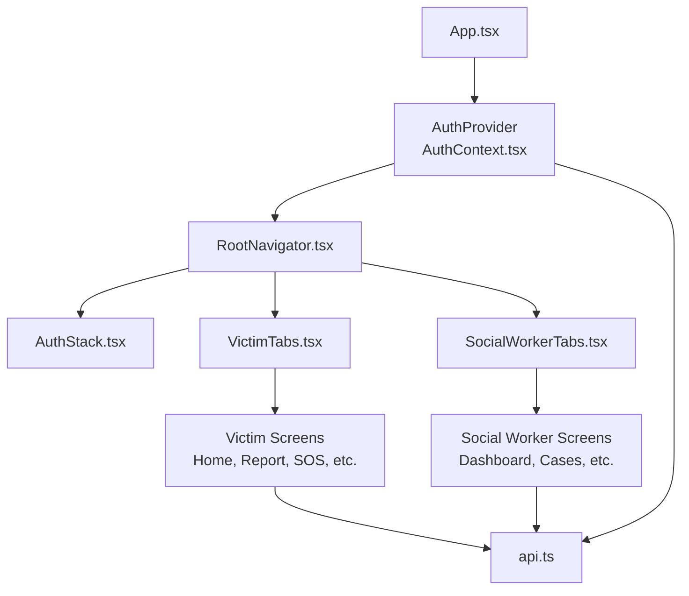
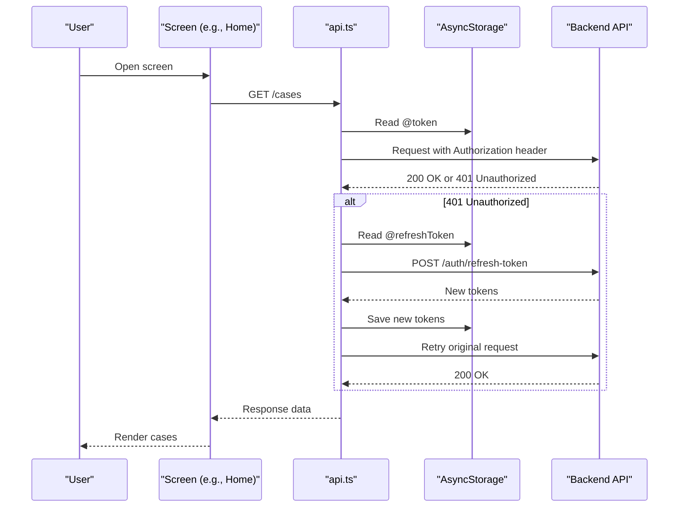
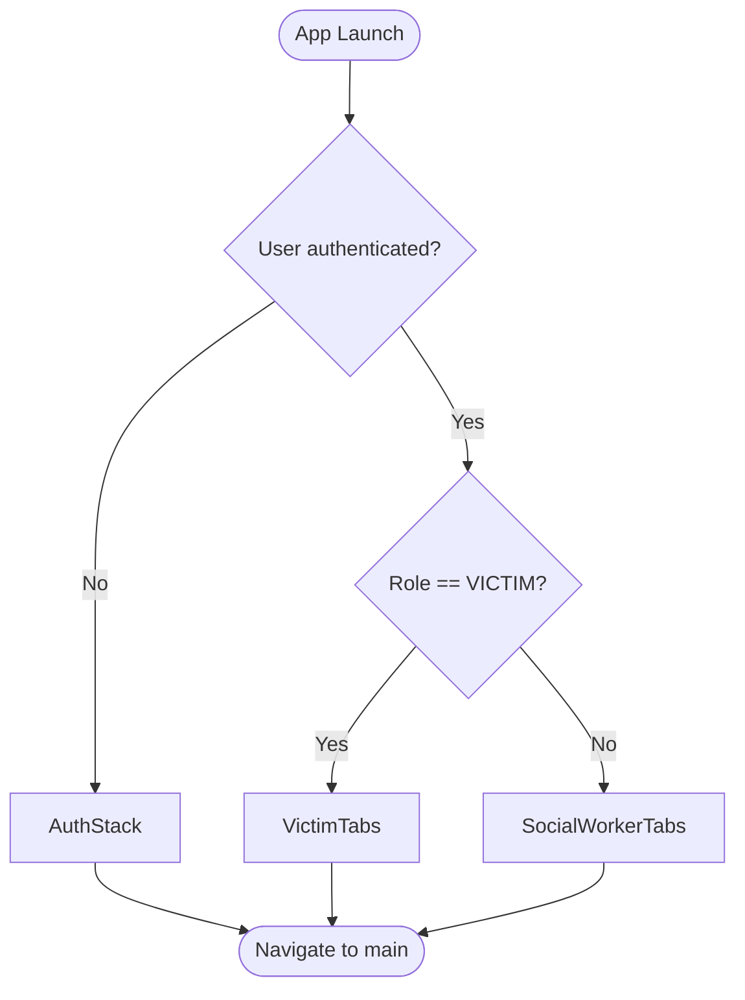
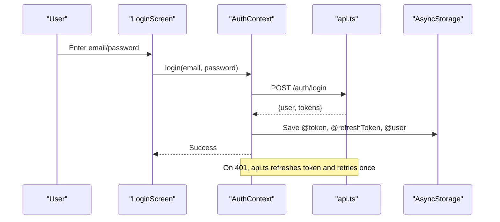
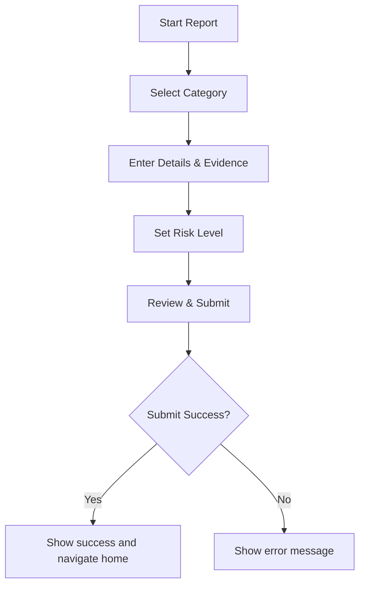
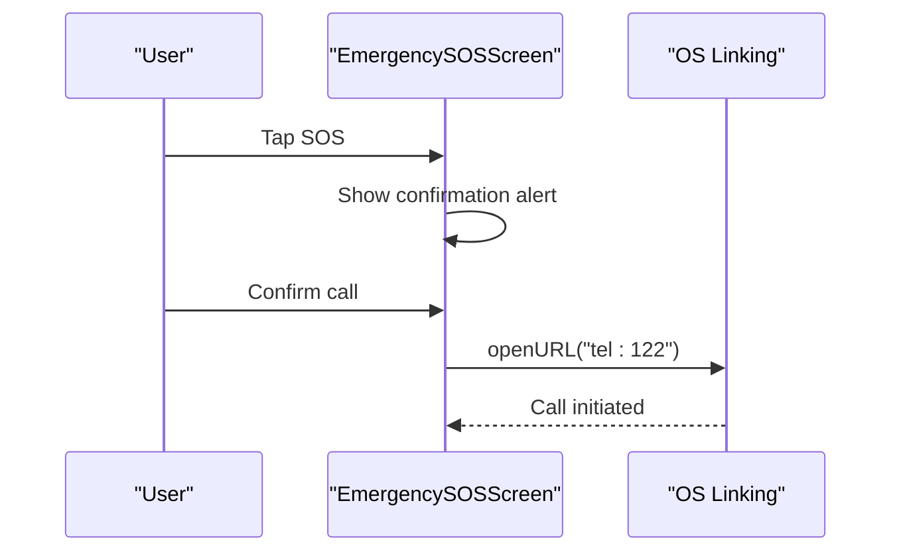
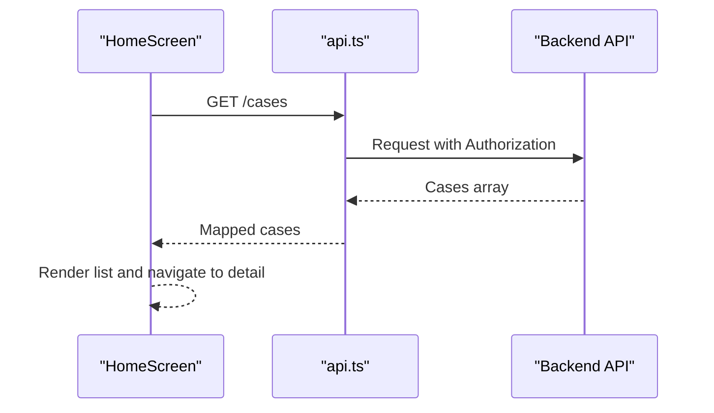
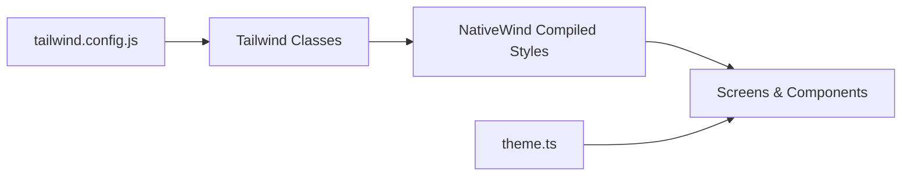
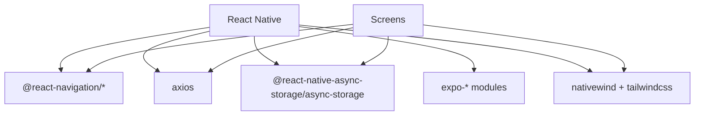

# Mobile Application

<cite>
**Referenced Files in This Document**
- [App.tsx](file://mobile-app/App.tsx)
- [package.json](file://mobile-app/package.json)
- [RootNavigator.tsx](file://mobile-app/src/navigation/RootNavigator.tsx)
- [AuthStack.tsx](file://mobile-app/src/navigation/AuthStack.tsx)
- [VictimTabs.tsx](file://mobile-app/src/navigation/VictimTabs.tsx)
- [SocialWorkerTabs.tsx](file://mobile-app/src/navigation/SocialWorkerTabs.tsx)
- [AuthContext.tsx](file://mobile-app/src/contexts/AuthContext.tsx)
- [useAuth.ts](file://mobile-app/src/hooks/useAuth.ts)
- [api.ts](file://mobile-app/src/services/api.ts)
- [HomeScreen.tsx](file://mobile-app/src/screens/victim/HomeScreen.tsx)
- [ReportIncidentScreen.tsx](file://mobile-app/src/screens/victim/ReportIncidentScreen.tsx)
- [EmergencySOSScreen.tsx](file://mobile-app/src/screens/victim/EmergencySOSScreen.tsx)
- [SOSButton.tsx](file://mobile-app/src/components/shared/SOSButton.tsx)
- [theme.ts](file://mobile-app/src/constants/theme.ts)
- [tailwind.config.js](file://mobile-app/tailwind.config.js)
</cite>

## Table of Contents
1. [Introduction](#introduction)
2. [Project Structure](#project-structure)
3. [Core Components](#core-components)
4. [Architecture Overview](#architecture-overview)
5. [Detailed Component Analysis](#detailed-component-analysis)
6. [Dependency Analysis](#dependency-analysis)
7. [Performance Considerations](#performance-considerations)
8. [Troubleshooting Guide](#troubleshooting-guide)
9. [Conclusion](#conclusion)
10. [Appendices](#appendices)

## Introduction
This document describes the React Native mobile application built with Expo that provides a dual-interface experience for victims and social workers. It covers navigation with React Navigation, state management via Context API, theming with NativeWind/Tailwind, and key screens including incident reporting, case tracking, emergency SOS, appointment scheduling, and communication features. It also documents API integration, authentication flow, offline considerations, push notifications readiness, UI/UX guidelines, accessibility, and cross-platform compatibility for iOS and Android.

## Project Structure
The mobile app is organized by feature areas:
- Entry point and providers wrap the app with safe area handling and authentication context.
- Navigation defines role-based stacks and tabs to route users after login.
- Screens implement victim and social worker flows (incident reporting, cases, appointments, messaging).
- Services encapsulate HTTP calls with token handling and refresh logic.
- Contexts manage global state such as user session.
- Shared components provide reusable UI elements like cards and buttons.
- Constants and Tailwind configuration define theme tokens and color system.

**Diagram sources**
- [App.tsx:8-17](file://mobile-app/App.tsx#L8-L17)
- [RootNavigator.tsx:36-58](file://mobile-app/src/navigation/RootNavigator.tsx#L36-L58)
- [AuthStack.tsx:11-19](file://mobile-app/src/navigation/AuthStack.tsx#L11-L19)
- [VictimTabs.tsx:12-23](file://mobile-app/src/navigation/VictimTabs.tsx#L12-L23)
- [SocialWorkerTabs.tsx:12-23](file://mobile-app/src/navigation/SocialWorkerTabs.tsx#L12-L23)
- [api.ts:1-103](file://mobile-app/src/services/api.ts#L1-L103)

**Section sources**
- [App.tsx:8-17](file://mobile-app/App.tsx#L8-L17)
- [package.json:11-35](file://mobile-app/package.json#L11-L35)

## Core Components
- Authentication Context: Stores user session, handles login/logout, persists tokens and user data, and triggers logout on auth failures from the API layer.
- API Service: Axios instance with request/response interceptors for attaching access tokens and refreshing tokens on 401 responses; includes deduplication of concurrent refresh requests.
- Navigation: Role-aware root navigator renders either an authentication stack or role-specific tab stacks (victim vs social worker).
- Theme System: Tailwind configuration extends colors and border radius; NativeWind compiles Tailwind classes at build time for React Native styling.

Key responsibilities:
- AuthContext manages user lifecycle and integrates with AsyncStorage for persistence.
- api.ts centralizes network concerns, error handling, and token refresh orchestration.
- RootNavigator routes based on authentication state and user role.
- Tailwind config standardizes visual tokens across screens.

**Section sources**
- [AuthContext.tsx:22-94](file://mobile-app/src/contexts/AuthContext.tsx#L22-L94)
- [api.ts:27-100](file://mobile-app/src/services/api.ts#L27-L100)
- [RootNavigator.tsx:36-58](file://mobile-app/src/navigation/RootNavigator.tsx#L36-L58)
- [tailwind.config.js:4-22](file://mobile-app/tailwind.config.js#L4-L22)

## Architecture Overview
The app follows a layered architecture:
- Presentation Layer: Screens and shared components render UI using React Native and NativeWind classes.
- Navigation Layer: React Navigation organizes screens into role-based stacks and tabs.
- State Layer: Context API holds user session and exposes actions for login/logout/update.
- Data Layer: Axios-based service handles API calls, token injection, and refresh flow.
- External Integrations: Location services, image picker, maps, and platform linking for emergency calls.

**Diagram sources**
- [api.ts:27-100](file://mobile-app/src/services/api.ts#L27-L100)
- [HomeScreen.tsx:26-113](file://mobile-app/src/screens/victim/HomeScreen.tsx#L26-L113)

## Detailed Component Analysis

### Navigation and Role-Based Routing
- RootNavigator selects between AuthStack, VictimTabs, and SocialWorkerTabs based on authentication state and user role.
- VictimTabs includes Home, Appointments, Emergency SOS, Services, Profile.
- SocialWorkerTabs includes Dashboard, Cases, Messages, Appointments, Profile.
- AuthStack includes Splash, Onboarding, Login, Register, ForgotPassword.

**Diagram sources**
- [RootNavigator.tsx:36-58](file://mobile-app/src/navigation/RootNavigator.tsx#L36-L58)
- [VictimTabs.tsx:12-23](file://mobile-app/src/navigation/VictimTabs.tsx#L12-L23)
- [SocialWorkerTabs.tsx:12-23](file://mobile-app/src/navigation/SocialWorkerTabs.tsx#L12-L23)
- [AuthStack.tsx:11-19](file://mobile-app/src/navigation/AuthStack.tsx#L11-L19)

**Section sources**
- [RootNavigator.tsx:36-58](file://mobile-app/src/navigation/RootNavigator.tsx#L36-L58)
- [VictimTabs.tsx:12-23](file://mobile-app/src/navigation/VictimTabs.tsx#L12-L23)
- [SocialWorkerTabs.tsx:12-23](file://mobile-app/src/navigation/SocialWorkerTabs.tsx#L12-L23)
- [AuthStack.tsx:11-19](file://mobile-app/src/navigation/AuthStack.tsx#L11-L19)

### Authentication Flow
- Login retrieves user and tokens, stores them in AsyncStorage, and sets user in context.
- Admin/Organization roles are blocked from mobile login.
- Logout clears stored credentials and resets context.
- API interceptor attaches Bearer token and handles 401 by refreshing tokens once; on failure, triggers logout callback.

**Diagram sources**
- [AuthContext.tsx:60-85](file://mobile-app/src/contexts/AuthContext.tsx#L60-L85)
- [api.ts:27-100](file://mobile-app/src/services/api.ts#L27-L100)

**Section sources**
- [AuthContext.tsx:22-94](file://mobile-app/src/contexts/AuthContext.tsx#L22-L94)
- [api.ts:27-100](file://mobile-app/src/services/api.ts#L27-L100)

### Incident Reporting Screen
- Multi-step form collects category, details, optional photo evidence, location (manual + GPS), and risk level.
- Uses expo-location for permissions and reverse geocoding; uses react-native-maps for pin selection.
- Submits multipart/form-data to backend incidents endpoint; displays success feedback and navigates back.

**Diagram sources**
- [ReportIncidentScreen.tsx:31-214](file://mobile-app/src/screens/victim/ReportIncidentScreen.tsx#L31-L214)

**Section sources**
- [ReportIncidentScreen.tsx:31-214](file://mobile-app/src/screens/victim/ReportIncidentScreen.tsx#L31-L214)

### Emergency SOS Screen
- Prominent SOS button triggers confirmation dialog and initiates phone call to helpline via Linking.
- Provides trusted contacts list and quick-dial helplines.
- Supports adding new trusted contacts within a modal.

**Diagram sources**
- [EmergencySOSScreen.tsx:39-63](file://mobile-app/src/screens/victim/EmergencySOSScreen.tsx#L39-L63)

**Section sources**
- [EmergencySOSScreen.tsx:24-494](file://mobile-app/src/screens/victim/EmergencySOSScreen.tsx#L24-L494)

### Case Tracking and Messaging
- Victim Home fetches and displays active cases mapped from backend response; navigates to detail screens.
- Social Worker Tabs include Cases and Messages for managing and communicating about cases.
- Both rely on the centralized API service for data retrieval and updates.

**Diagram sources**
- [HomeScreen.tsx:26-113](file://mobile-app/src/screens/victim/HomeScreen.tsx#L26-L113)
- [api.ts:27-35](file://mobile-app/src/services/api.ts#L27-L35)

**Section sources**
- [HomeScreen.tsx:26-113](file://mobile-app/src/screens/victim/HomeScreen.tsx#L26-L113)
- [SocialWorkerTabs.tsx:12-23](file://mobile-app/src/navigation/SocialWorkerTabs.tsx#L12-L23)

### Appointment Scheduling
- Victim and Social Worker tabs expose Appointments screens for scheduling and viewing appointments.
- While specific implementation details are not shown here, these screens integrate with the same API layer for CRUD operations on appointments.

**Section sources**
- [VictimTabs.tsx:12-23](file://mobile-app/src/navigation/VictimTabs.tsx#L12-L23)
- [SocialWorkerTabs.tsx:12-23](file://mobile-app/src/navigation/SocialWorkerTabs.tsx#L12-L23)

### Communication Features
- Chat and Messages screens enable victim–social worker communication.
- These screens use the API service to send/receive messages and update conversation state locally.

**Section sources**
- [RootNavigator.tsx:18-34](file://mobile-app/src/navigation/RootNavigator.tsx#L18-L34)

### Theme System with NativeWind
- Tailwind configuration defines primary, secondary, emergency, success, warning, background, card, and text colors, plus custom border radii.
- NativeWind compiles Tailwind classes to native styles at build time, enabling consistent theming across screens.
- Theme constants provide spacing and border radius tokens for consistency.

**Diagram sources**
- [tailwind.config.js:4-22](file://mobile-app/tailwind.config.js#L4-L22)
- [theme.ts:1-17](file://mobile-app/src/constants/theme.ts#L1-L17)

**Section sources**
- [tailwind.config.js:4-22](file://mobile-app/tailwind.config.js#L4-L22)
- [theme.ts:1-17](file://mobile-app/src/constants/theme.ts#L1-L17)

## Dependency Analysis
- The app depends on React Navigation for routing, Axios for networking, AsyncStorage for persistence, and Expo modules for location, image picking, and status bar.
- NativeWind relies on Tailwind CSS configuration to generate styles.
- Screens depend on the API service for all network interactions and on hooks/context for state.

**Diagram sources**
- [package.json:11-35](file://mobile-app/package.json#L11-L35)

**Section sources**
- [package.json:11-35](file://mobile-app/package.json#L11-L35)

## Performance Considerations
- Token refresh deduplication prevents multiple concurrent refresh calls, reducing unnecessary network traffic.
- Use focus effects to refresh data only when screens become visible, minimizing redundant requests.
- Limit uploaded images to a reasonable count and quality to reduce payload size.
- Prefer lazy loading and pagination for large lists (e.g., cases) to improve rendering performance.
- Keep navigation stacks minimal and avoid deep nesting to maintain smooth transitions.

[No sources needed since this section provides general guidance]

## Troubleshooting Guide
Common issues and resolutions:
- 401 Unauthorized: The API interceptor attempts a single token refresh; if it fails, the app logs out automatically. Ensure refresh token is present and valid.
- Network errors: Verify baseURL configuration and connectivity; check environment variables for API URL.
- Permission errors: Location and camera permissions must be granted before using map and image capture features.
- Auth restrictions: Mobile login is restricted for ADMIN and ORGANIZATION roles; use web dashboard for those accounts.

**Section sources**
- [api.ts:37-100](file://mobile-app/src/services/api.ts#L37-L100)
- [AuthContext.tsx:60-85](file://mobile-app/src/contexts/AuthContext.tsx#L60-L85)
- [ReportIncidentScreen.tsx:78-147](file://mobile-app/src/screens/victim/ReportIncidentScreen.tsx#L78-L147)

## Conclusion
The mobile application delivers a secure, role-based experience for victims and social workers with robust navigation, state management, and API integration. It supports critical workflows such as incident reporting, case tracking, emergency SOS, appointments, and messaging. The theme system ensures consistent UI across platforms, while token refresh and storage mechanisms provide resilient authentication. With careful attention to performance, accessibility, and cross-platform compatibility, the app offers a reliable foundation for safety and support services.

[No sources needed since this section summarizes without analyzing specific files]

## Appendices

### UI/UX Guidelines
- Use clear, high-contrast colors for critical actions (e.g., emergency SOS).
- Provide progressive disclosure in multi-step forms to reduce cognitive load.
- Offer immediate feedback for actions (loading indicators, alerts).
- Maintain consistent spacing and typography using theme tokens.

[No sources needed since this section provides general guidance]

### Accessibility Considerations
- Ensure sufficient color contrast for readability.
- Provide accessible labels for icons and buttons.
- Support dynamic type scaling where appropriate.
- Make touch targets large enough for easy interaction.

[No sources needed since this section provides general guidance]

### Cross-Platform Compatibility
- Built with Expo and React Native for iOS and Android.
- Uses platform-specific behaviors for keyboard handling and status bars.
- Leverages Expo modules for device capabilities (location, camera, image picker).

**Section sources**
- [package.json:11-35](file://mobile-app/package.json#L11-L35)
- [HomeScreen.tsx:1-20](file://mobile-app/src/screens/victim/HomeScreen.tsx#L1-L20)