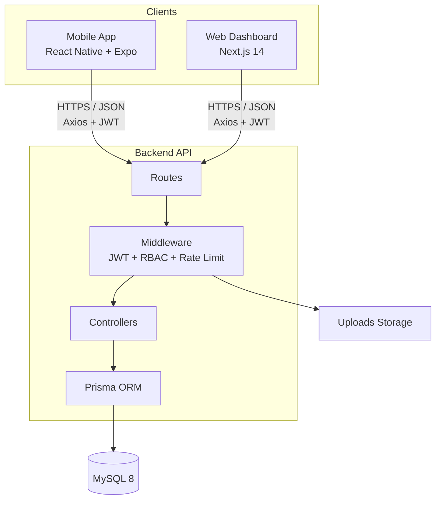
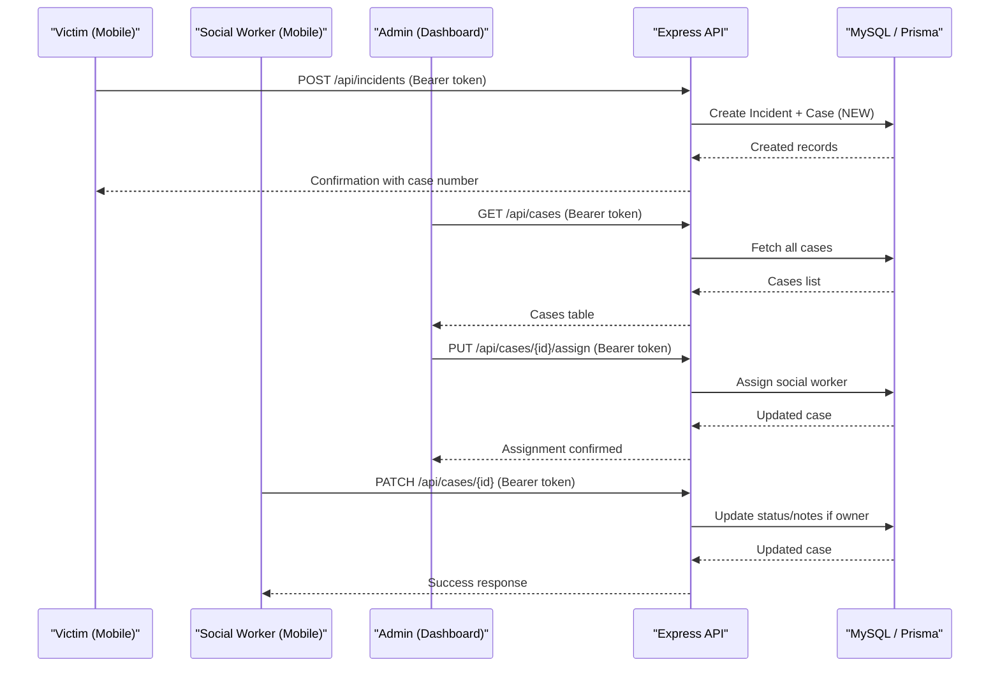
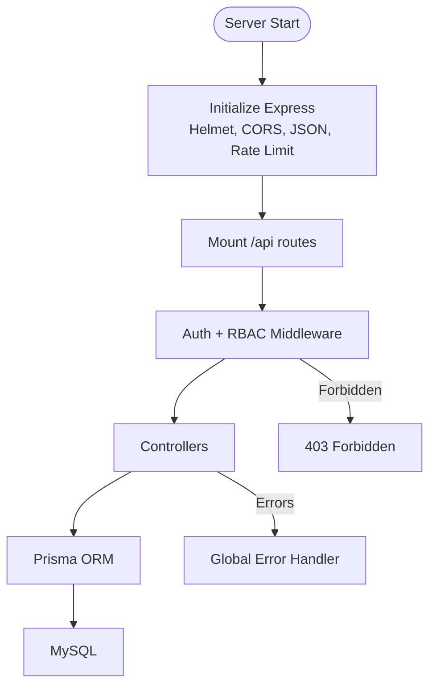
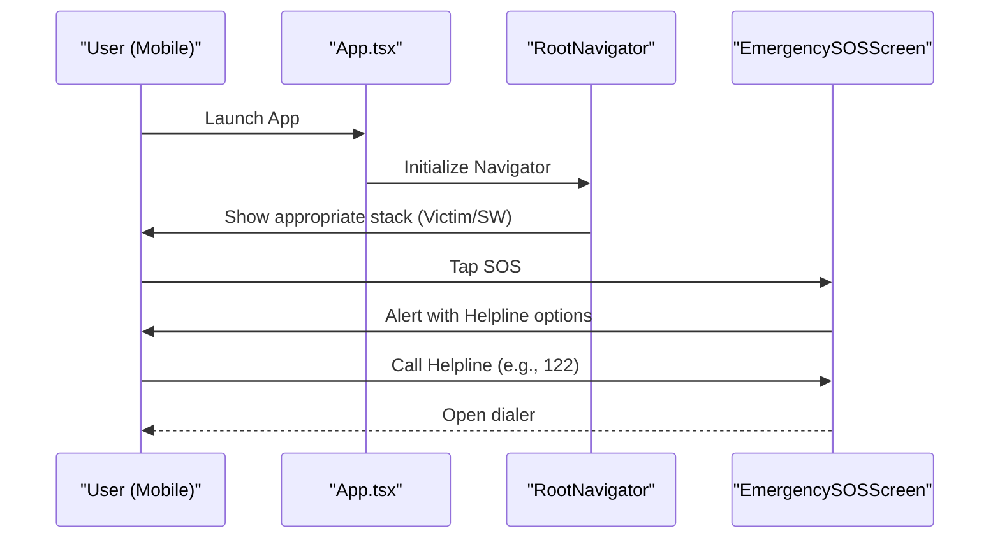
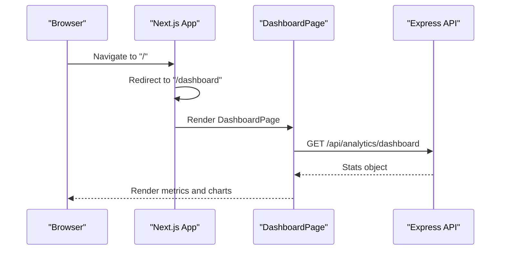
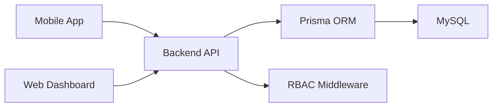

# Project Overview

<cite>
**Referenced Files in This Document**
- [README.md](file://README.md)
- [project_report.md](file://project_report.md)
- [backend-api/src/index.ts](file://backend-api/src/index.ts)
- [backend-api/src/middleware/rbac.ts](file://backend-api/src/middleware/rbac.ts)
- [backend-api/prisma/schema.prisma](file://backend-api/prisma/schema.prisma)
- [mobile-app/App.tsx](file://mobile-app/App.tsx)
- [mobile-app/src/screens/victim/EmergencySOSScreen.tsx](file://mobile-app/src/screens/victim/EmergencySOSScreen.tsx)
- [web-dashboard/src/app/page.tsx](file://web-dashboard/src/app/page.tsx)
- [web-dashboard/src/app/(dashboard)/dashboard/page.tsx](file://web-dashboard/src/app/(dashboard)/dashboard/page.tsx)
</cite>

## Table of Contents
1. [Introduction](#introduction)
2. [Project Structure](#project-structure)
3. [Core Components](#core-components)
4. [Architecture Overview](#architecture-overview)
5. [Detailed Component Analysis](#detailed-component-analysis)
6. [Dependency Analysis](#dependency-analysis)
7. [Performance Considerations](#performance-considerations)
8. [Troubleshooting Guide](#troubleshooting-guide)
9. [Conclusion](#conclusion)

## Introduction
SafeProtect Cameroon is a secure digital ecosystem designed to protect children and support victims of gender-based violence (GBV). Its mission is to connect victims with timely assistance services while enabling social workers and organizations to manage protection cases efficiently. The platform serves four primary audiences:
- Victims/Citizens: report incidents, track case progress, access emergency SOS, and find support services via the mobile app.
- Social Workers: manage assigned cases, schedule appointments, communicate securely, and update case status through the mobile app.
- Organizations: manage service catalogs, receive referrals, and coordinate appointments via the web dashboard.
- Administrators: oversee users, cases, analytics, and system configuration via the web dashboard.

The platform’s core purpose is to streamline incident reporting, case management, and communication between victims and support providers, ensuring privacy, safety, and accountability throughout the protection workflow.

**Section sources**
- [README.md:1-6](file://README.md#L1-L6)
- [README.md:116-124](file://README.md#L116-L124)
- [project_report.md:47-53](file://project_report.md#L47-L53)

## Project Structure
SafeProtect Cameroon is organized as a monorepo with three main layers:
- Backend API: Express.js + TypeScript + Prisma ORM backed by MySQL 8.
- Web Dashboard: Next.js 14 for administrators and organizations to manage cases, users, analytics, and services.
- Mobile App: React Native + Expo for victims and social workers to report incidents, track cases, use SOS, and communicate.

**Diagram sources**
- [backend-api/src/index.ts:10-33](file://backend-api/src/index.ts#L10-L33)
- [backend-api/src/middleware/rbac.ts:5-12](file://backend-api/src/middleware/rbac.ts#L5-L12)
- [backend-api/prisma/schema.prisma:5-8](file://backend-api/prisma/schema.prisma#L5-L8)

**Section sources**
- [README.md:9-18](file://README.md#L9-L18)
- [project_report.md:47-81](file://project_report.md#L47-L81)

## Core Components
- Backend API: Provides secure endpoints for authentication, incident/case management, appointments, messaging, notifications, and analytics. It enforces role-based access control and rate limiting, and persists data using Prisma with MySQL.
- Mobile App: Offers victim-facing features (incident reporting, case tracking, emergency SOS, services directory) and social worker capabilities (assigned cases, updates, appointments). Navigation adapts based on user roles.
- Web Dashboard: Delivers administrative oversight including metrics dashboards, case management tables, user/organization management, and analytics charts.

Key technology stack:
- Mobile: React Native, Expo, TypeScript, NativeWind
- Web: Next.js 14, TypeScript, Tailwind CSS, Shadcn UI, Recharts
- Backend: Node.js, Express.js, TypeScript
- Database: MySQL 8, Prisma ORM
- Auth: JWT, bcrypt
- Icons: Lucide React (web), Expo Vector Icons (mobile)

**Section sources**
- [README.md:208-218](file://README.md#L208-L218)
- [project_report.md:420-442](file://project_report.md#L420-L442)

## Architecture Overview
SafeProtect uses a three-tier architecture:
- Client Applications: Mobile app and web dashboard interact with the backend via HTTPS/JSON using authenticated requests.
- Backend API: Centralized Express server with middleware for security (helmet, CORS, rate limiting), routing, controllers, and Prisma integration.
- Data Layer: MySQL database managed by Prisma ORM, storing users, victims, social workers, organizations, incidents, cases, appointments, messages, notifications, audit logs, and refresh tokens.

**Diagram sources**
- [project_report.md:145-186](file://project_report.md#L145-L186)
- [backend-api/src/index.ts:25-27](file://backend-api/src/index.ts#L25-L27)
- [backend-api/prisma/schema.prisma:111-138](file://backend-api/prisma/schema.prisma#L111-L138)

## Detailed Component Analysis

### Backend API
- Entry point initializes Express with security headers, CORS, JSON parsing, rate limiting, static uploads, and error handling.
- Role-Based Access Control (RBAC): Middleware validates user roles before allowing access to protected routes.
- Data Model: Prisma schema defines entities for users, victims, social workers, organizations, incidents, cases, appointments, services, messages, notifications, audit logs, and refresh tokens.

**Diagram sources**
- [backend-api/src/index.ts:10-33](file://backend-api/src/index.ts#L10-L33)
- [backend-api/src/middleware/rbac.ts:5-12](file://backend-api/src/middleware/rbac.ts#L5-L12)
- [backend-api/prisma/schema.prisma:10-45](file://backend-api/prisma/schema.prisma#L10-L45)

**Section sources**
- [backend-api/src/index.ts:10-33](file://backend-api/src/index.ts#L10-L33)
- [backend-api/src/middleware/rbac.ts:5-12](file://backend-api/src/middleware/rbac.ts#L5-L12)
- [backend-api/prisma/schema.prisma:47-200](file://backend-api/prisma/schema.prisma#L47-L200)

### Mobile App
- Root component wraps navigation and authentication context.
- Emergency SOS Screen provides immediate access to helplines and trusted contacts, with an SOS trigger that initiates emergency calls and location sharing prompts.
- Role-aware navigation presents different stacks for victims and social workers.

**Diagram sources**
- [mobile-app/App.tsx:8-16](file://mobile-app/App.tsx#L8-L16)
- [mobile-app/src/screens/victim/EmergencySOSScreen.tsx:39-59](file://mobile-app/src/screens/victim/EmergencySOSScreen.tsx#L39-L59)

**Section sources**
- [mobile-app/App.tsx:8-16](file://mobile-app/App.tsx#L8-L16)
- [mobile-app/src/screens/victim/EmergencySOSScreen.tsx:39-59](file://mobile-app/src/screens/victim/EmergencySOSSScreen.tsx#L39-L59)

### Web Dashboard
- Redirects root route to dashboard.
- Dashboard page fetches analytics from the backend and displays metrics, charts, and recent incidents.

**Diagram sources**
- [web-dashboard/src/app/page.tsx:1-5](file://web-dashboard/src/app/page.tsx#L1-L5)
- [web-dashboard/src/app/(dashboard)/dashboard/page.tsx:21-40](file://web-dashboard/src/app/(dashboard)/dashboard/page.tsx#L21-L40)

**Section sources**
- [web-dashboard/src/app/page.tsx:1-5](file://web-dashboard/src/app/page.tsx#L1-L5)
- [web-dashboard/src/app/(dashboard)/dashboard/page.tsx:11-40](file://web-dashboard/src/app/(dashboard)/dashboard/page.tsx#L11-L40)

## Dependency Analysis
- Clients depend on the backend API for all data operations and must authenticate using JWT tokens.
- The backend depends on Prisma and MySQL for data persistence and enforces RBAC at the middleware layer.
- The dashboard and mobile app rely on environment variables for API base URLs, ensuring flexible deployment configurations.

**Diagram sources**
- [README.md:106-113](file://README.md#L106-L113)
- [backend-api/src/middleware/rbac.ts:5-12](file://backend-api/src/middleware/rbac.ts#L5-L12)
- [backend-api/prisma/schema.prisma:5-8](file://backend-api/prisma/schema.prisma#L5-L8)

**Section sources**
- [README.md:106-113](file://README.md#L106-L113)
- [backend-api/src/middleware/rbac.ts:5-12](file://backend-api/src/middleware/rbac.ts#L5-L12)

## Performance Considerations
- Rate limiting protects the API from excessive requests and potential abuse.
- JWT short-lived access tokens reduce exposure risk; refresh tokens enable seamless re-authentication.
- Prisma optimizes database queries and type safety, improving reliability and performance.
- Static assets and uploads are served directly to reduce backend load.

[No sources needed since this section provides general guidance]

## Troubleshooting Guide
- Authentication failures: Ensure clients set correct environment variables for API base URLs and include valid JWT tokens in requests.
- RBAC errors: Verify user roles match allowed roles for protected routes; unauthorized access returns 403 Forbidden.
- Dashboard redirects: If not logged in, the dashboard redirects to login; ensure tokens are stored and validated.
- Mobile SOS: Confirm device permissions for calling and location sharing; test helpline numbers and contact lists.

**Section sources**
- [README.md:161-173](file://README.md#L161-L173)
- [backend-api/src/middleware/rbac.ts:5-12](file://backend-api/src/middleware/rbac.ts#L5-L12)
- [web-dashboard/src/app/(dashboard)/dashboard/page.tsx:21-27](file://web-dashboard/src/app/(dashboard)/dashboard/page.tsx#L21-L27)
- [mobile-app/src/screens/victim/EmergencySOSScreen.tsx:39-59](file://mobile-app/src/screens/victim/EmergencySOSScreen.tsx#L39-L59)

## Conclusion
SafeProtect Cameroon delivers a comprehensive, secure platform for child protection and GBV management. By connecting victims with support services and empowering social workers and organizations to manage cases effectively, it addresses critical needs in Cameroon’s protection ecosystem. The three-tier architecture ensures scalability, security, and usability across mobile and web interfaces, supporting emergency response, anonymous reporting, and role-based access control.

[No sources needed since this section summarizes without analyzing specific files]