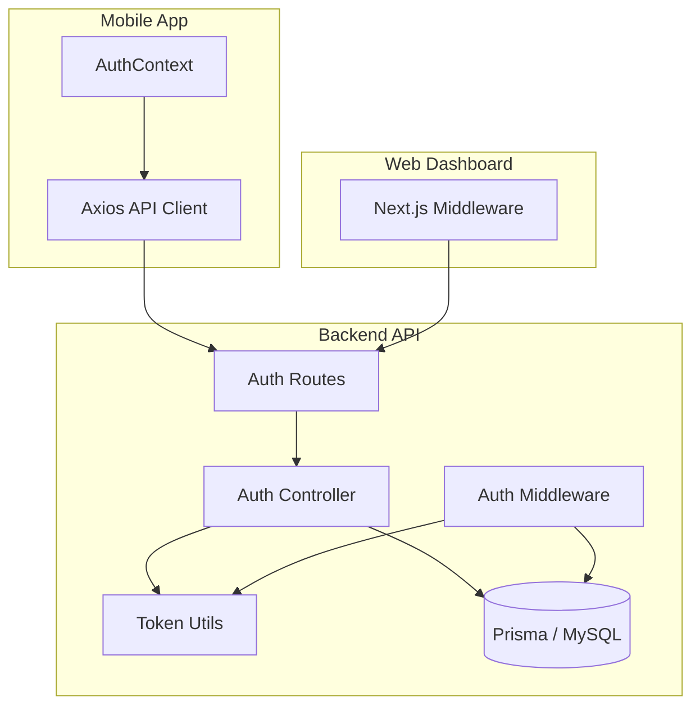
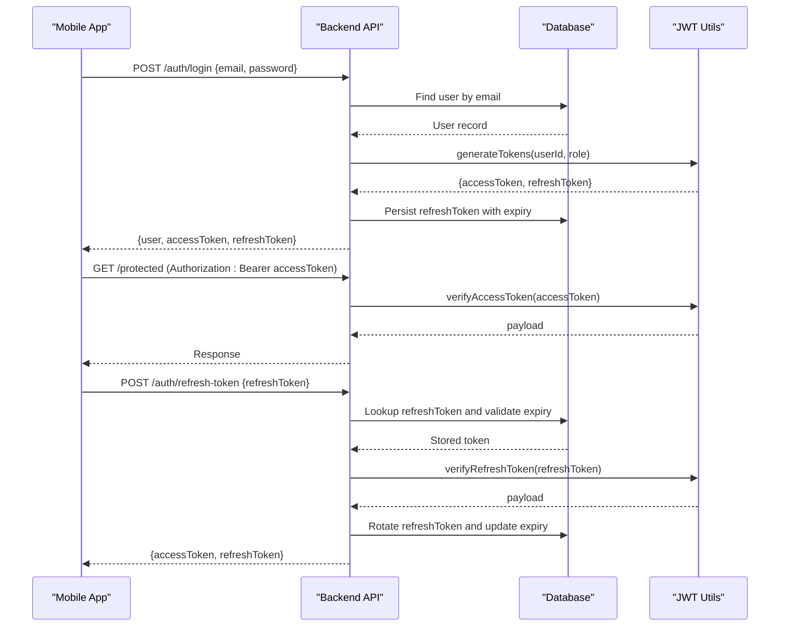
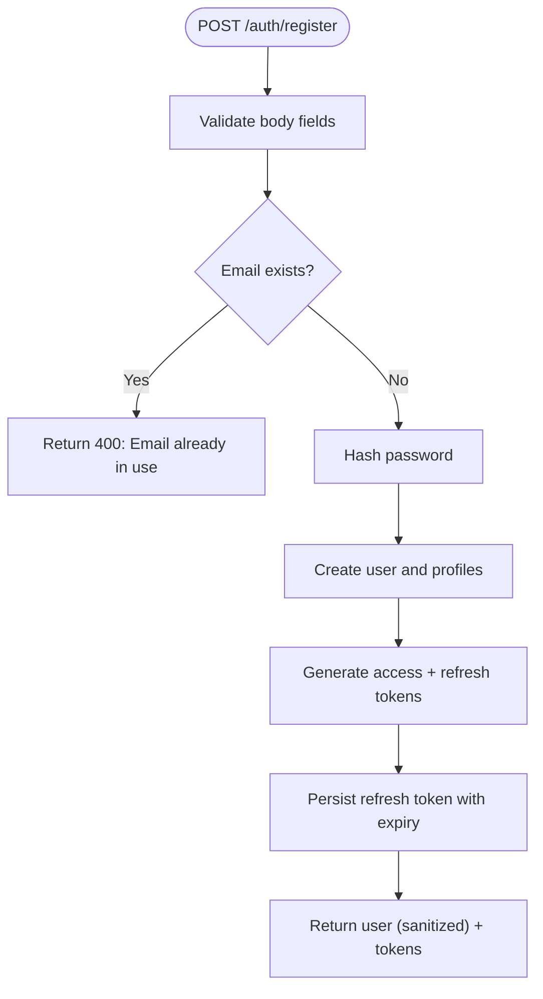
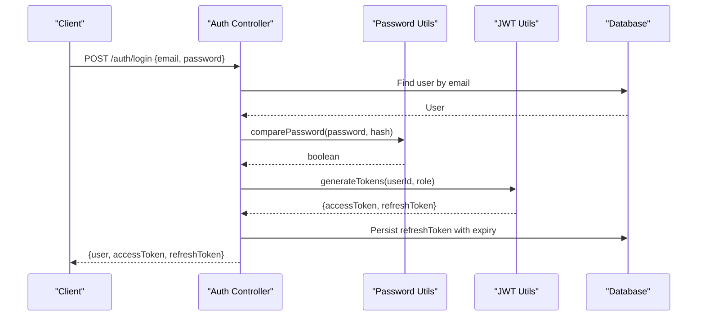
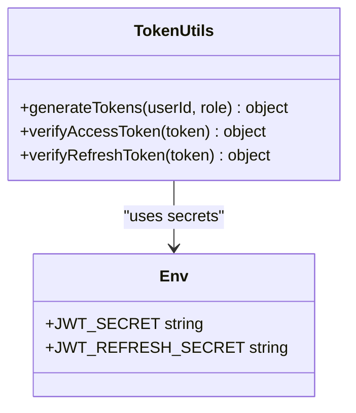
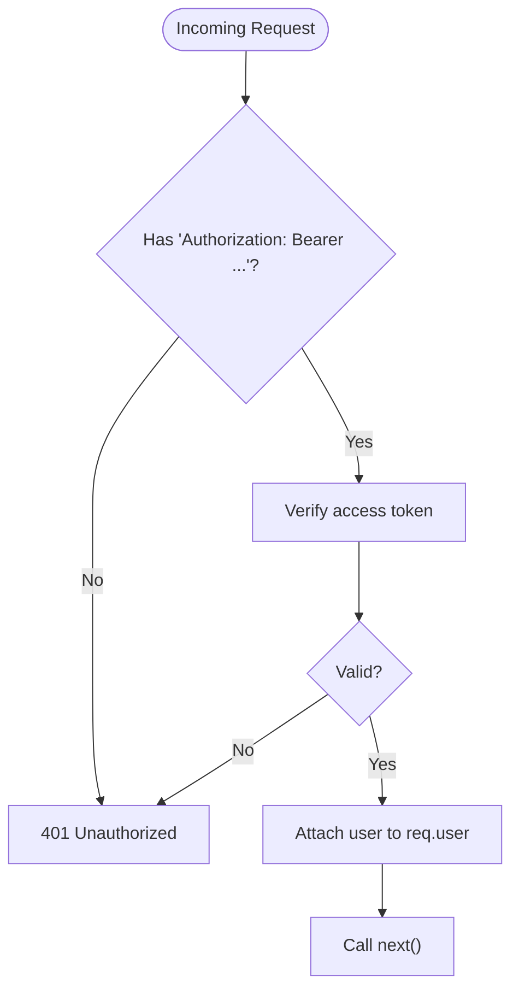
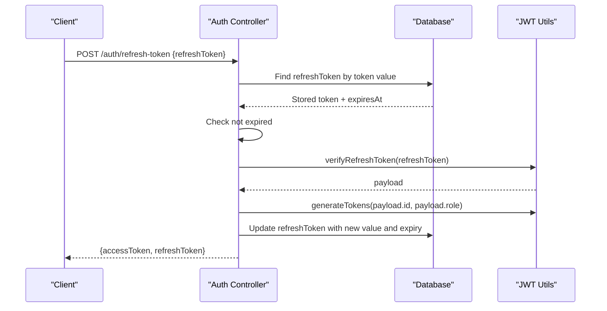
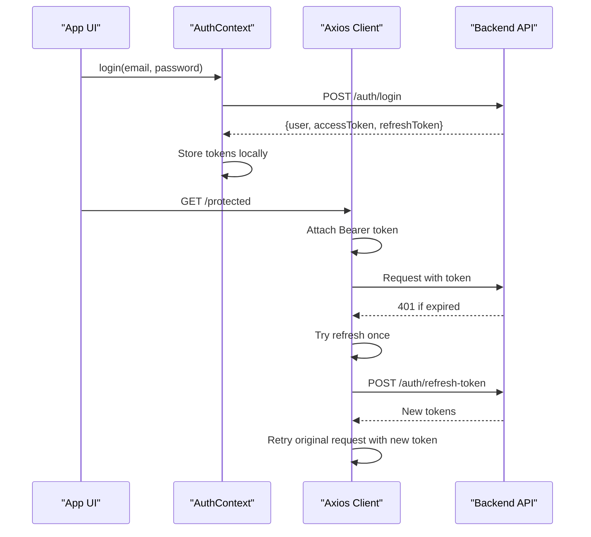
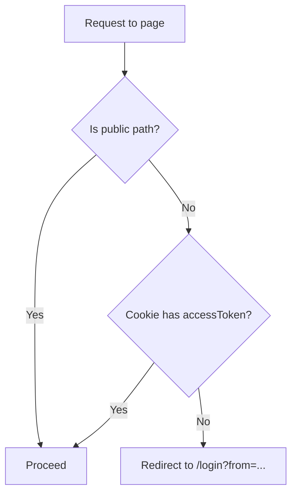
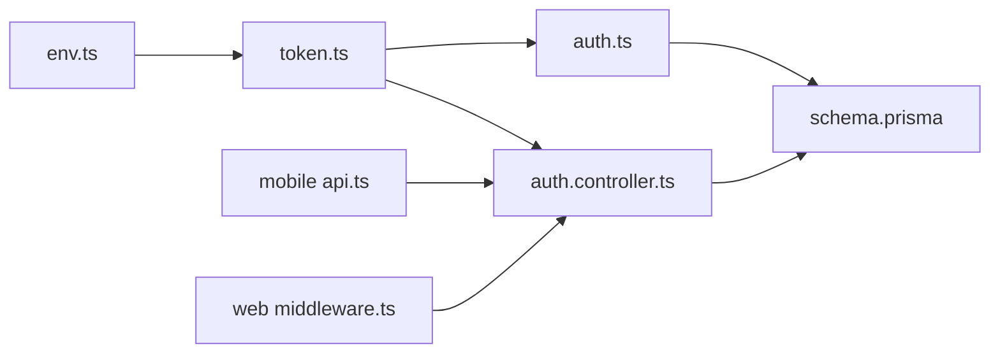

# Authentication System

<cite>
**Referenced Files in This Document**
- [auth.controller.ts](file://backend-api/src/controllers/auth.controller.ts)
- [auth.ts](file://backend-api/src/middleware/auth.ts)
- [token.ts](file://backend-api/src/utils/token.ts)
- [env.ts](file://backend-api/src/config/env.ts)
- [index.ts](file://backend-api/src/routes/index.ts)
- [auth.routes.ts](file://backend-api/src/routes/auth.routes.ts)
- [schema.prisma](file://backend-api/prisma/schema.prisma)
- [password.ts](file://backend-api/src/utils/password.ts)
- [AuthContext.tsx](file://mobile-app/src/contexts/AuthContext.tsx)
- [api.ts](file://mobile-app/src/services/api.ts)
- [middleware.ts](file://web-dashboard/src/middleware.ts)
</cite>

## Table of Contents
1. Introduction
2. Project Structure
3. Core Components
4. Architecture Overview
5. Detailed Component Analysis
6. Dependency Analysis
7. Performance Considerations
8. Troubleshooting Guide
9. Conclusion
10. Appendices

## Introduction
This document explains SafeProtect Cameroon’s JWT-based authentication system across the backend API, mobile app, and web dashboard. It covers user registration, login, token generation and refresh, protected route middleware, token extraction from headers, session storage, token structure and expiration handling, and security best practices for signing and secret management. It also provides guidance on implementing protected routes, handling authentication errors, and managing user sessions with concrete code references.

## Project Structure
The authentication system spans three layers:
- Backend API (Express + Prisma): handles registration, login, token issuance and refresh, and protects routes via middleware.
- Mobile App (React Native): stores tokens securely, attaches access tokens to requests, and manages refresh flows on 401 responses.
- Web Dashboard (Next.js): enforces route-level access control using cookies and redirects unauthenticated users.

**Diagram sources**
- [auth.routes.ts:1-12](file://backend-api/src/routes/auth.routes.ts#L1-L12)
- [auth.controller.ts:13-110](file://backend-api/src/controllers/auth.controller.ts#L13-L110)
- [auth.ts:5-19](file://backend-api/src/middleware/auth.ts#L5-L19)
- [token.ts:4-16](file://backend-api/src/utils/token.ts#L4-L16)
- [api.ts:27-99](file://mobile-app/src/services/api.ts#L27-L99)
- [AuthContext.tsx:60-76](file://mobile-app/src/contexts/AuthContext.tsx#L60-L76)
- [middleware.ts:6-25](file://web-dashboard/src/middleware.ts#L6-L25)

**Section sources**
- [auth.routes.ts:1-12](file://backend-api/src/routes/auth.routes.ts#L1-L12)
- [auth.controller.ts:13-110](file://backend-api/src/controllers/auth.controller.ts#L13-L110)
- [auth.ts:5-19](file://backend-api/src/middleware/auth.ts#L5-L19)
- [token.ts:4-16](file://backend-api/src/utils/token.ts#L4-L16)
- [api.ts:27-99](file://mobile-app/src/services/api.ts#L27-L99)
- [AuthContext.tsx:60-76](file://mobile-app/src/contexts/AuthContext.tsx#L60-L76)
- [middleware.ts:6-25](file://web-dashboard/src/middleware.ts#L6-L25)

## Core Components
- Registration and Login: Create users, hash passwords, issue short-lived access tokens and longer-lived refresh tokens, and persist refresh tokens in the database.
- Token Utilities: Sign and verify JWTs using separate secrets for access and refresh tokens.
- Route Protection: Extract Bearer token from Authorization header, verify it, and attach user identity to the request.
- Client Session Management: Store tokens in secure storage, attach access tokens to requests, and handle refresh on 401.
- Web Dashboard Guard: Enforce access by checking cookies and redirecting unauthenticated users.

**Section sources**
- [auth.controller.ts:13-110](file://backend-api/src/controllers/auth.controller.ts#L13-L110)
- [token.ts:4-16](file://backend-api/src/utils/token.ts#L4-L16)
- [auth.ts:5-19](file://backend-api/src/middleware/auth.ts#L5-L19)
- [api.ts:27-99](file://mobile-app/src/services/api.ts#L27-L99)
- [AuthContext.tsx:60-76](file://mobile-app/src/contexts/AuthContext.tsx#L60-L76)
- [middleware.ts:6-25](file://web-dashboard/src/middleware.ts#L6-L25)

## Architecture Overview
The authentication flow uses a two-token strategy:
- Access Token: Short-lived (e.g., 15 minutes), used to authorize API calls.
- Refresh Token: Longer-lived (e.g., 7 days), stored server-side and rotated on refresh; used only to obtain new access tokens.

**Diagram sources**
- [auth.controller.ts:54-110](file://backend-api/src/controllers/auth.controller.ts#L54-L110)
- [token.ts:4-16](file://backend-api/src/utils/token.ts#L4-L16)
- [schema.prisma:200-207](file://backend-api/prisma/schema.prisma#L200-L207)

## Detailed Component Analysis

### Registration Flow
- Validates input and checks for duplicate email.
- Hashes password before storing.
- Creates user with default role and profile relations.
- Generates access and refresh tokens and persists refresh token with an expiry.
- Returns sanitized user data and tokens.

**Diagram sources**
- [auth.controller.ts:13-52](file://backend-api/src/controllers/auth.controller.ts#L13-L52)
- [password.ts:3-10](file://backend-api/src/utils/password.ts#L3-L10)
- [token.ts:4-8](file://backend-api/src/utils/token.ts#L4-L8)
- [schema.prisma:47-68](file://backend-api/prisma/schema.prisma#L47-L68)
- [schema.prisma:200-207](file://backend-api/prisma/schema.prisma#L200-L207)

**Section sources**
- [auth.controller.ts:13-52](file://backend-api/src/controllers/auth.controller.ts#L13-L52)
- [password.ts:3-10](file://backend-api/src/utils/password.ts#L3-L10)
- [token.ts:4-8](file://backend-api/src/utils/token.ts#L4-L8)
- [schema.prisma:47-68](file://backend-api/prisma/schema.prisma#L47-L68)
- [schema.prisma:200-207](file://backend-api/prisma/schema.prisma#L200-L207)

### Login Flow
- Finds user by email and verifies password.
- Issues tokens and persists refresh token.
- Returns sanitized user and tokens.

**Diagram sources**
- [auth.controller.ts:54-83](file://backend-api/src/controllers/auth.controller.ts#L54-L83)
- [password.ts:3-10](file://backend-api/src/utils/password.ts#L3-L10)
- [token.ts:4-8](file://backend-api/src/utils/token.ts#L4-L8)
- [schema.prisma:200-207](file://backend-api/prisma/schema.prisma#L200-L207)

**Section sources**
- [auth.controller.ts:54-83](file://backend-api/src/controllers/auth.controller.ts#L54-L83)
- [password.ts:3-10](file://backend-api/src/utils/password.ts#L3-L10)
- [token.ts:4-8](file://backend-api/src/utils/token.ts#L4-L8)
- [schema.prisma:200-207](file://backend-api/prisma/schema.prisma#L200-L207)

### Token Generation and Verification
- Access tokens are signed with a dedicated secret and short expiry.
- Refresh tokens are signed with a different secret and longer expiry.
- Verification functions validate tokens against their respective secrets.

**Diagram sources**
- [token.ts:4-16](file://backend-api/src/utils/token.ts#L4-L16)
- [env.ts:6-13](file://backend-api/src/config/env.ts#L6-L13)

**Section sources**
- [token.ts:4-16](file://backend-api/src/utils/token.ts#L4-L16)
- [env.ts:6-13](file://backend-api/src/config/env.ts#L6-L13)

### Protected Routes Middleware
- Extracts Bearer token from Authorization header.
- Verifies access token and attaches user identity to the request.
- Returns 401 on missing or invalid tokens.

**Diagram sources**
- [auth.ts:5-19](file://backend-api/src/middleware/auth.ts#L5-L19)
- [token.ts:10-12](file://backend-api/src/utils/token.ts#L10-L12)

**Section sources**
- [auth.ts:5-19](file://backend-api/src/middleware/auth.ts#L5-L19)
- [token.ts:10-12](file://backend-api/src/utils/token.ts#L10-L12)

### Refresh Token Flow
- Client sends stored refresh token to the refresh endpoint.
- Server validates existence and expiry in the database.
- Server verifies the refresh token signature and issues new tokens.
- Server rotates the refresh token and updates its expiry.

**Diagram sources**
- [auth.controller.ts:85-110](file://backend-api/src/controllers/auth.controller.ts#L85-L110)
- [token.ts:4-16](file://backend-api/src/utils/token.ts#L4-L16)
- [schema.prisma:200-207](file://backend-api/prisma/schema.prisma#L200-L207)

**Section sources**
- [auth.controller.ts:85-110](file://backend-api/src/controllers/auth.controller.ts#L85-L110)
- [token.ts:4-16](file://backend-api/src/utils/token.ts#L4-L16)
- [schema.prisma:200-207](file://backend-api/prisma/schema.prisma#L200-L207)

### Mobile App Session Management
- Stores access and refresh tokens in secure local storage after login.
- Attaches access token to every outgoing request via interceptor.
- On 401, attempts a single refresh call; on success, retries the original request; on failure, clears session and triggers logout.

**Diagram sources**
- [AuthContext.tsx:60-76](file://mobile-app/src/contexts/AuthContext.tsx#L60-L76)
- [api.ts:27-99](file://mobile-app/src/services/api.ts#L27-L99)
- [auth.controller.ts:85-110](file://backend-api/src/controllers/auth.controller.ts#L85-L110)

**Section sources**
- [AuthContext.tsx:60-76](file://mobile-app/src/contexts/AuthContext.tsx#L60-L76)
- [api.ts:27-99](file://mobile-app/src/services/api.ts#L27-L99)
- [auth.controller.ts:85-110](file://backend-api/src/controllers/auth.controller.ts#L85-L110)

### Web Dashboard Route Guard
- Checks for an access token cookie on protected routes.
- Redirects to login if missing, preserving the intended destination.

**Diagram sources**
- [middleware.ts:4-25](file://web-dashboard/src/middleware.ts#L4-L25)

**Section sources**
- [middleware.ts:4-25](file://web-dashboard/src/middleware.ts#L4-L25)

## Dependency Analysis
- Controllers depend on Prisma client for user and refresh token persistence.
- Auth middleware depends on JWT verification utilities.
- Token utilities depend on environment configuration for secrets.
- Mobile app depends on axios interceptors and async storage for session state.
- Web dashboard middleware depends on Next.js request/response APIs and cookies.

**Diagram sources**
- [env.ts:6-13](file://backend-api/src/config/env.ts#L6-L13)
- [token.ts:4-16](file://backend-api/src/utils/token.ts#L4-L16)
- [auth.ts:5-19](file://backend-api/src/middleware/auth.ts#L5-L19)
- [auth.controller.ts:13-110](file://backend-api/src/controllers/auth.controller.ts#L13-L110)
- [schema.prisma:47-68](file://backend-api/prisma/schema.prisma#L47-L68)
- [schema.prisma:200-207](file://backend-api/prisma/schema.prisma#L200-L207)
- [api.ts:27-99](file://mobile-app/src/services/api.ts#L27-L99)
- [middleware.ts:6-25](file://web-dashboard/src/middleware.ts#L6-L25)

**Section sources**
- [env.ts:6-13](file://backend-api/src/config/env.ts#L6-L13)
- [token.ts:4-16](file://backend-api/src/utils/token.ts#L4-L16)
- [auth.ts:5-19](file://backend-api/src/middleware/auth.ts#L5-L19)
- [auth.controller.ts:13-110](file://backend-api/src/controllers/auth.controller.ts#L13-L110)
- [schema.prisma:47-68](file://backend-api/prisma/schema.prisma#L47-L68)
- [schema.prisma:200-207](file://backend-api/prisma/schema.prisma#L200-L207)
- [api.ts:27-99](file://mobile-app/src/services/api.ts#L27-L99)
- [middleware.ts:6-25](file://web-dashboard/src/middleware.ts#L6-L25)

## Performance Considerations
- Keep access tokens short-lived to limit exposure window and reduce server-side validation overhead.
- Use server-side refresh token rotation to minimize reuse risk and simplify revocation.
- Cache user payloads judiciously on the client side to avoid repeated lookups when safe.
- Ensure database indexes on frequently queried fields such as email and refresh token values.

[No sources needed since this section provides general guidance]

## Troubleshooting Guide
Common issues and resolutions:
- Missing or malformed Authorization header: Ensure clients send Authorization: Bearer <accessToken>.
- Invalid or expired access token: Trigger refresh flow; if refresh fails, clear session and log out.
- Expired or invalid refresh token: Force logout and require re-login.
- Duplicate email during registration: Handle conflict response and prompt user to use another email.
- Password mismatch: Return consistent error messages without revealing whether the user exists.

Relevant endpoints and behaviors:
- Registration returns 400 for validation errors and duplicates.
- Login returns 400 for invalid credentials.
- Refresh returns 401 for invalid or expired refresh tokens.
- Protected routes return 401 for unauthorized access.

**Section sources**
- [auth.controller.ts:13-110](file://backend-api/src/controllers/auth.controller.ts#L13-L110)
- [auth.ts:5-19](file://backend-api/src/middleware/auth.ts#L5-L19)
- [api.ts:37-99](file://mobile-app/src/services/api.ts#L37-L99)

## Conclusion
SafeProtect Cameroon implements a robust, two-token JWT authentication system with server-side refresh token rotation, secure password hashing, and layered protection across mobile and web clients. The design balances usability with security by keeping access tokens short-lived while enabling seamless renewal through refresh tokens. Following the provided patterns ensures consistent behavior, strong security posture, and maintainable code across platforms.

[No sources needed since this section summarizes without analyzing specific files]

## Appendices

### JWT Token Structure and Expiration
- Access Token: Contains user identifier and role; signed with a dedicated secret; short expiry (e.g., 15 minutes).
- Refresh Token: Contains user identifier and role; signed with a separate secret; longer expiry (e.g., 7 days); persisted server-side with an expiry timestamp and rotated on each refresh.

**Section sources**
- [token.ts:4-16](file://backend-api/src/utils/token.ts#L4-L16)
- [schema.prisma:200-207](file://backend-api/prisma/schema.prisma#L200-L207)

### Secure Storage Strategies
- Mobile: Store tokens in secure local storage; attach access token to all requests; handle refresh on 401; clear session on auth failures.
- Web Dashboard: Enforce access via cookies; redirect unauthenticated users to login.

**Section sources**
- [AuthContext.tsx:60-76](file://mobile-app/src/contexts/AuthContext.tsx#L60-L76)
- [api.ts:27-99](file://mobile-app/src/services/api.ts#L27-L99)
- [middleware.ts:6-25](file://web-dashboard/src/middleware.ts#L6-L25)

### Implementing Protected Routes
- Apply the authenticate middleware to any route that requires authorization.
- Ensure controllers rely on req.user populated by the middleware for identity and role checks.

**Section sources**
- [auth.ts:5-19](file://backend-api/src/middleware/auth.ts#L5-L19)

### Handling Authentication Errors
- Consistent 401 responses for unauthorized or invalid tokens.
- Clear error messages for invalid credentials and expired tokens.
- Client-side logout on persistent auth failures.

**Section sources**
- [auth.controller.ts:13-110](file://backend-api/src/controllers/auth.controller.ts#L13-L110)
- [auth.ts:5-19](file://backend-api/src/middleware/auth.ts#L5-L19)
- [api.ts:37-99](file://mobile-app/src/services/api.ts#L37-L99)

### Security Considerations
- Use separate secrets for access and refresh tokens to isolate compromise impact.
- Rotate refresh tokens on each use to prevent replay attacks.
- Hash passwords with a strong algorithm and appropriate cost factor.
- Enforce HTTPS in production to protect tokens in transit.
- Avoid logging sensitive tokens or credentials.
- Restrict high-privilege roles to appropriate clients (e.g., web dashboard only).

**Section sources**
- [token.ts:4-16](file://backend-api/src/utils/token.ts#L4-L16)
- [env.ts:6-13](file://backend-api/src/config/env.ts#L6-L13)
- [password.ts:3-10](file://backend-api/src/utils/password.ts#L3-L10)
- [AuthContext.tsx:60-76](file://mobile-app/src/contexts/AuthContext.tsx#L60-L76)