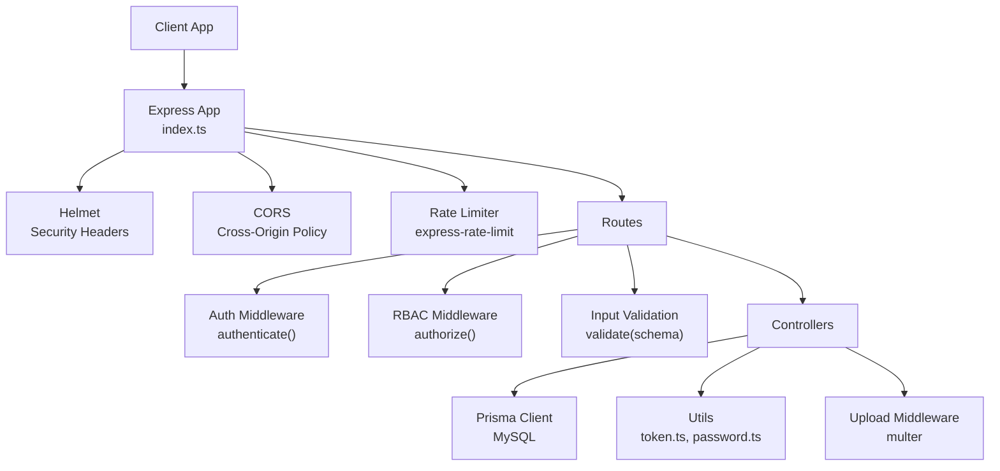
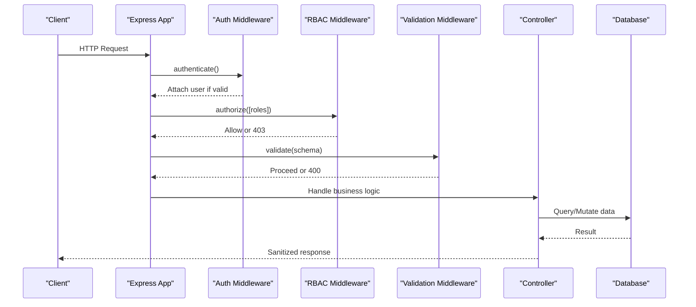
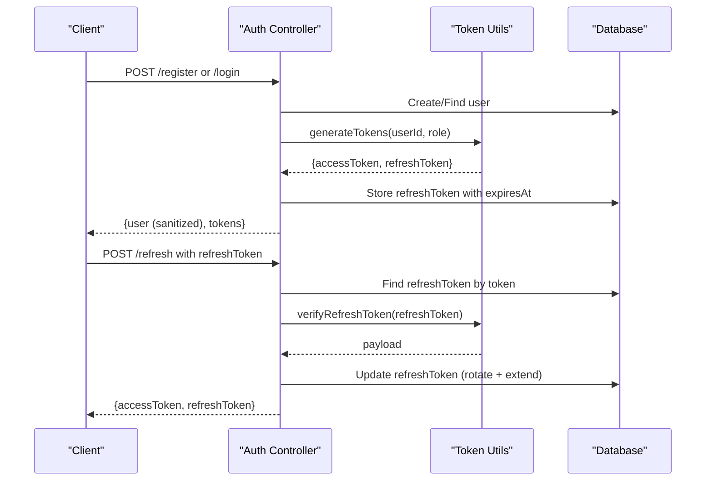
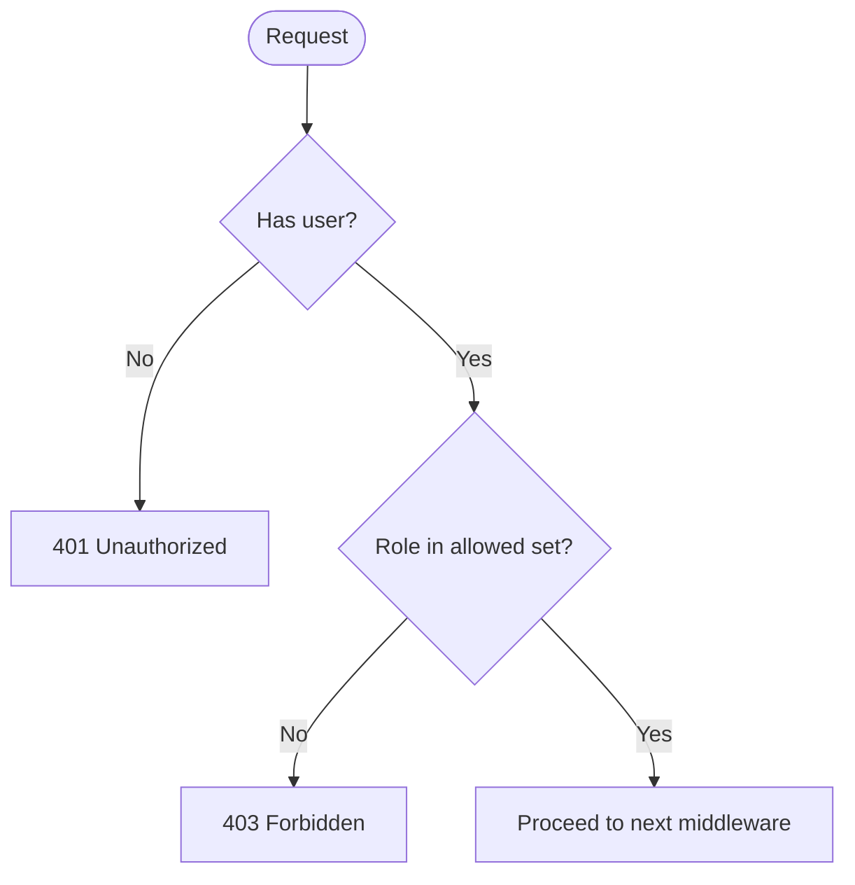
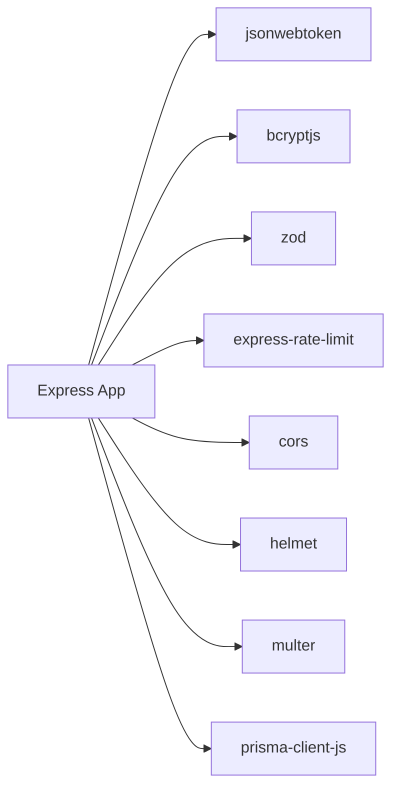
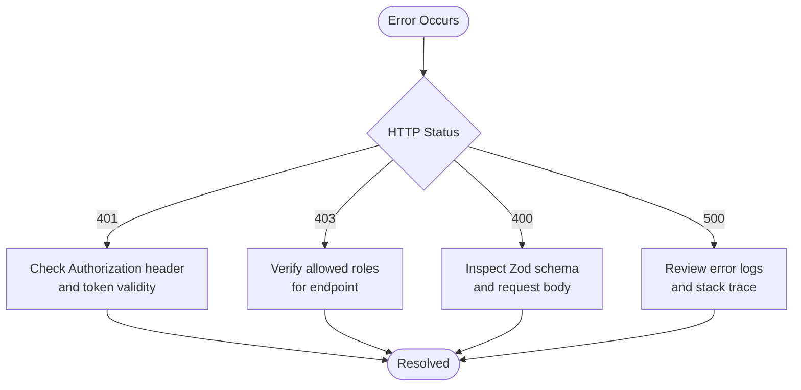

# Security Implementation

<cite>
**Referenced Files in This Document**
- [index.ts](file://backend-api/src/index.ts)
- [env.ts](file://backend-api/src/config/env.ts)
- [auth.controller.ts](file://backend-api/src/controllers/auth.controller.ts)
- [token.ts](file://backend-api/src/utils/token.ts)
- [password.ts](file://backend-api/src/utils/password.ts)
- [auth.ts](file://backend-api/src/middleware/auth.ts)
- [rbac.ts](file://backend-api/src/middleware/rbac.ts)
- [validate.ts](file://backend-api/src/middleware/validate.ts)
- [upload.ts](file://backend-api/src/middleware/upload.ts)
- [errorHandler.ts](file://backend-api/src/middleware/errorHandler.ts)
- [schema.prisma](file://backend-api/prisma/schema.prisma)
</cite>

## Table of Contents
1. [Introduction](#introduction)
2. [Project Structure](#project-structure)
3. [Core Components](#core-components)
4. [Architecture Overview](#architecture-overview)
5. [Detailed Component Analysis](#detailed-component-analysis)
6. [Dependency Analysis](#dependency-analysis)
7. [Performance Considerations](#performance-considerations)
8. [Troubleshooting Guide](#troubleshooting-guide)
9. [Conclusion](#conclusion)
10. [Appendices](#appendices)

## Introduction
This document provides a comprehensive security overview for SafeProtect Cameroon’s backend API. It covers JWT-based authentication, role-based access control (RBAC), password hashing, input validation, rate limiting, CORS and Helmet configuration, file upload safeguards, session management via refresh tokens, and audit logging foundations. The goal is to help developers and operators understand how the system protects sensitive victim data and enforces secure communication and access policies.

## Project Structure
The backend API is an Express application that centralizes security concerns through middleware and utilities:
- Application bootstrap configures security headers, CORS, JSON parsing, static uploads, and global rate limiting.
- Authentication and authorization are implemented as reusable middleware.
- Input validation uses Zod schemas via a generic validator middleware.
- File uploads use Multer with disk storage and randomized filenames.
- Passwords are hashed using bcryptjs.
- Tokens are generated and verified using jsonwebtoken with separate secrets for access and refresh tokens.
- Data models define roles, relationships, and audit logs for compliance.

**Diagram sources**
- [index.ts:1-34](file://backend-api/src/index.ts#L1-L34)
- [auth.ts:1-20](file://backend-api/src/middleware/auth.ts#L1-L20)
- [rbac.ts:1-13](file://backend-api/src/middleware/rbac.ts#L1-L13)
- [validate.ts:1-18](file://backend-api/src/middleware/validate.ts#L1-L18)
- [upload.ts:1-20](file://backend-api/src/middleware/upload.ts#L1-L20)

**Section sources**
- [index.ts:1-34](file://backend-api/src/index.ts#L1-L34)
- [schema.prisma:1-208](file://backend-api/prisma/schema.prisma#L1-L208)

## Core Components
- JWT Authentication: Access tokens for short-lived requests; refresh tokens stored in the database for long-lived sessions.
- RBAC: Role-based authorization middleware enforcing allowed roles per route.
- Password Security: Bcrypt hashing with a strong salt factor for all user passwords.
- Input Validation: Zod-based schema validation middleware to sanitize and validate request payloads.
- Rate Limiting: Global request throttling to mitigate abuse.
- CORS and Helmet: Cross-origin policy and security headers applied globally.
- File Uploads: Multer-based upload with randomized filenames and controlled storage location.
- Audit Logging: Database model for recording user actions for compliance and forensics.

**Section sources**
- [auth.controller.ts:13-115](file://backend-api/src/controllers/auth.controller.ts#L13-L115)
- [token.ts:1-17](file://backend-api/src/utils/token.ts#L1-L17)
- [password.ts:1-11](file://backend-api/src/utils/password.ts#L1-L11)
- [validate.ts:1-18](file://backend-api/src/middleware/validate.ts#L1-L18)
- [index.ts:12-21](file://backend-api/src/index.ts#L12-L21)
- [schema.prisma:189-208](file://backend-api/prisma/schema.prisma#L189-L208)

## Architecture Overview
The request lifecycle applies security controls in a layered fashion:
- Global layer: Helmet sets security headers; CORS restricts origins; rate limiter throttles requests; JSON and URL parsers parse bodies.
- Route layer: Authentication middleware validates JWTs; RBAC middleware checks roles; validation middleware ensures inputs conform to schemas.
- Controller layer: Business logic interacts with Prisma to read/write data; files are handled by upload middleware; responses are sanitized before sending.

**Diagram sources**
- [index.ts:12-25](file://backend-api/src/index.ts#L12-L25)
- [auth.ts:5-19](file://backend-api/src/middleware/auth.ts#L5-L19)
- [rbac.ts:5-11](file://backend-api/src/middleware/rbac.ts#L5-L11)
- [validate.ts:4-16](file://backend-api/src/middleware/validate.ts#L4-L16)

## Detailed Component Analysis

### JWT-Based Authentication and Session Management
- Token generation: Access tokens have short expiration; refresh tokens have longer expiration and are persisted in the database with expiry timestamps.
- Token verification: Access tokens are verified on each protected request; refresh tokens are validated against both signature and stored records.
- Session lifecycle: On login/register, new token pairs are issued and refresh tokens are stored; refreshing rotates the refresh token and updates expiry.
- Sensitive data handling: User responses strip passwords before returning to clients.

**Diagram sources**
- [auth.controller.ts:13-115](file://backend-api/src/controllers/auth.controller.ts#L13-L115)
- [token.ts:4-16](file://backend-api/src/utils/token.ts#L4-L16)
- [schema.prisma:200-208](file://backend-api/prisma/schema.prisma#L200-L208)

**Section sources**
- [auth.controller.ts:13-115](file://backend-api/src/controllers/auth.controller.ts#L13-L115)
- [token.ts:1-17](file://backend-api/src/utils/token.ts#L1-L17)
- [schema.prisma:200-208](file://backend-api/prisma/schema.prisma#L200-L208)

### Role-Based Access Control (RBAC)
- Roles: Victim, Social Worker, Organization, Admin defined in the data model.
- Authorization middleware: Checks the authenticated user’s role against an allowed list per route.
- Integration: Applied after authentication to ensure user context exists.

**Diagram sources**
- [rbac.ts:5-11](file://backend-api/src/middleware/rbac.ts#L5-L11)
- [schema.prisma:10-15](file://backend-api/prisma/schema.prisma#L10-L15)

**Section sources**
- [rbac.ts:1-13](file://backend-api/src/middleware/rbac.ts#L1-L13)
- [schema.prisma:10-15](file://backend-api/prisma/schema.prisma#L10-L15)

### Password Security
- Hashing: Uses bcrypt with a high salt factor to protect stored passwords.
- Comparison: Secure comparison function used during login.
- Storage: Only hashes are stored; plaintext never persisted.

**Section sources**
- [password.ts:1-11](file://backend-api/src/utils/password.ts#L1-L11)
- [auth.controller.ts:22-28](file://backend-api/src/controllers/auth.controller.ts#L22-L28)
- [auth.controller.ts:67-68](file://backend-api/src/controllers/auth.controller.ts#L67-L68)

### Input Validation with Zod
- Generic validator middleware parses and validates body, query, and params against provided schemas.
- Errors return structured validation errors to clients.

**Section sources**
- [validate.ts:1-18](file://backend-api/src/middleware/validate.ts#L1-L18)

### SQL Injection Prevention
- Parameterized queries: Prisma ORM generates parameterized SQL, preventing injection when used correctly.
- Best practice: Avoid raw string concatenation; rely on Prisma’s type-safe queries.

**Section sources**
- [schema.prisma:1-8](file://backend-api/prisma/schema.prisma#L1-L8)

### XSS Protection
- Output sanitization: Controllers sanitize user objects before responding (e.g., stripping sensitive fields).
- Security headers: Helmet configured globally to enforce safe defaults.

**Section sources**
- [auth.controller.ts:7-11](file://backend-api/src/controllers/auth.controller.ts#L7-L11)
- [index.ts:12-14](file://backend-api/src/index.ts#L12-L14)

### CSRF Protection
- Current state: No explicit CSRF protection middleware is present in the backend.
- Recommendation: If exposing browser-facing endpoints, consider adding CSRF protection for state-changing requests.

[No sources needed since this section provides general guidance]

### File Upload Security
- Storage: Multer writes files to a dedicated directory with randomized filenames to prevent path traversal and collisions.
- Type and size limits: Not enforced in the current upload middleware; recommend adding MIME/type checks and size limits at the middleware level.
- Malware scanning: Not implemented; recommend integrating antivirus scanning for uploaded files.

**Section sources**
- [upload.ts:1-20](file://backend-api/src/middleware/upload.ts#L1-L20)

### Rate Limiting
- Global limiter: Applies a time window and maximum request count to mitigate brute force and abuse.
- Scope: Applied across all routes under the Express app.

**Section sources**
- [index.ts:17-21](file://backend-api/src/index.ts#L17-L21)

### CORS Configuration
- CORS enabled globally; ensure production configurations restrict allowed origins, methods, and credentials appropriately.

**Section sources**
- [index.ts:13](file://backend-api/src/index.ts#L13)

### Security Headers with Helmet
- Helmet applied globally to set recommended security headers for safer HTTP responses.

**Section sources**
- [index.ts:12](file://backend-api/src/index.ts#L12)

### Audit Logging for Compliance
- Model: AuditLog entity captures user, action, entity, entity id, details, and timestamp.
- Usage: Integrate into controllers to log critical operations for compliance and forensics.

**Section sources**
- [schema.prisma:189-198](file://backend-api/prisma/schema.prisma#L189-L198)

## Dependency Analysis
Key dependencies and their roles:
- jsonwebtoken: Signs and verifies JWTs for access and refresh tokens.
- bcryptjs: Hashes and compares passwords securely.
- zod: Validates environment variables and request payloads.
- express-rate-limit: Enforces request rate limits.
- cors: Configures cross-origin policies.
- helmet: Sets security headers.
- multer: Handles file uploads to disk.
- prisma: Type-safe database client for MySQL.

**Diagram sources**
- [index.ts:1-8](file://backend-api/src/index.ts#L1-L8)
- [env.ts:1-14](file://backend-api/src/config/env.ts#L1-L14)
- [token.ts:1-2](file://backend-api/src/utils/token.ts#L1-L2)
- [password.ts:1-1](file://backend-api/src/utils/password.ts#L1-L1)

**Section sources**
- [index.ts:1-8](file://backend-api/src/index.ts#L1-L8)
- [env.ts:1-14](file://backend-api/src/config/env.ts#L1-L14)

## Performance Considerations
- Short-lived access tokens reduce exposure windows and minimize server-side token revocation complexity.
- Refresh token rotation improves security but adds database writes; balance frequency with security needs.
- Rate limiting protects resources; tune window and max based on expected traffic patterns.
- Avoid heavy processing in middleware; keep auth and validation lightweight.
- Use connection pooling and efficient queries in Prisma to reduce latency.

[No sources needed since this section provides general guidance]

## Troubleshooting Guide
Common issues and mitigations:
- 401 Unauthorized: Missing or invalid Authorization header; verify Bearer token format and validity.
- 403 Forbidden: Insufficient role; ensure route-level RBAC allows the user’s role.
- 400 Bad Request: Validation failures; check Zod schemas and request payloads.
- 500 Internal Server Error: Review error handler logs and stack traces; ensure consistent error formatting.

**Diagram sources**
- [auth.ts:5-19](file://backend-api/src/middleware/auth.ts#L5-L19)
- [rbac.ts:5-11](file://backend-api/src/middleware/rbac.ts#L5-L11)
- [validate.ts:4-16](file://backend-api/src/middleware/validate.ts#L4-L16)
- [errorHandler.ts:3-8](file://backend-api/src/middleware/errorHandler.ts#L3-L8)

**Section sources**
- [errorHandler.ts:1-9](file://backend-api/src/middleware/errorHandler.ts#L1-L9)

## Conclusion
SafeProtect’s backend implements a solid foundation for secure authentication, authorization, input validation, and protective headers. To further harden the system, consider adding explicit file type and size validation, malware scanning for uploads, CSRF protection for browser-based flows, and centralized audit logging for all sensitive operations. Environment configuration should be strictly validated and rotated regularly, especially secrets for JWT signing.

[No sources needed since this section summarizes without analyzing specific files]

## Appendices

### Data Models Relevant to Security
- Roles and entities: Victim, Social Worker, Organization, Admin roles; Incident, Case, Message, Notification, AuditLog, RefreshToken.
- Relationships: Users link to profiles and related entities; refresh tokens tied to users with expiry tracking.

**Section sources**
- [schema.prisma:10-15](file://backend-api/prisma/schema.prisma#L10-L15)
- [schema.prisma:47-68](file://backend-api/prisma/schema.prisma#L47-L68)
- [schema.prisma:189-208](file://backend-api/prisma/schema.prisma#L189-L208)