# Backend Architecture

<cite>
**Referenced Files in This Document**
- [index.ts](file://backend-api/src/index.ts)
- [routes/index.ts](file://backend-api/src/routes/index.ts)
- [auth.routes.ts](file://backend-api/src/routes/auth.routes.ts)
- [auth.controller.ts](file://backend-api/src/controllers/auth.controller.ts)
- [auth.ts](file://backend-api/src/middleware/auth.ts)
- [rbac.ts](file://backend-api/src/middleware/rbac.ts)
- [errorHandler.ts](file://backend-api/src/middleware/errorHandler.ts)
- [upload.ts](file://backend-api/src/middleware/upload.ts)
- [validate.ts](file://backend-api/src/middleware/validate.ts)
- [token.ts](file://backend-api/src/utils/token.ts)
- [database.ts](file://backend-api/src/config/database.ts)
- [env.ts](file://backend-api/src/config/env.ts)
- [schema.prisma](file://backend-api/prisma/schema.prisma)
- [package.json](file://backend-api/package.json)
</cite>

## Table of Contents
1. Introduction
2. Project Structure
3. Core Components
4. Architecture Overview
5. Detailed Component Analysis
6. Dependency Analysis
7. Performance Considerations
8. Troubleshooting Guide
9. Conclusion

## Introduction
This document describes the backend architecture for SafeProtect Cameroon’s Express.js API. It explains how the MVC pattern is implemented with controllers, middleware layers, and Prisma ORM integration. It also documents the authentication flow using JWT tokens, role-based access control (RBAC), database connection management, request-response lifecycle, error handling strategy, security middleware pipeline, file upload handling with Multer, input validation patterns, and API routing structure. Finally, it provides guidance on scalability, connection pooling, and performance optimization strategies.

## Project Structure
The backend follows a feature-oriented layout:
- Entry point initializes Express, global middleware, static assets, routes, and error handler.
- Routes group endpoints by domain (auth, users, victims, social workers, organizations, incidents, cases, appointments, services, messages, notifications, analytics).
- Controllers implement business logic and interact with Prisma.
- Middleware provides cross-cutting concerns: authentication, authorization (RBAC), validation, uploads, and error handling.
- Configuration centralizes environment variables and database client initialization.
- Utilities encapsulate token generation/verification and other helpers.
- Prisma schema defines the data model and relationships.

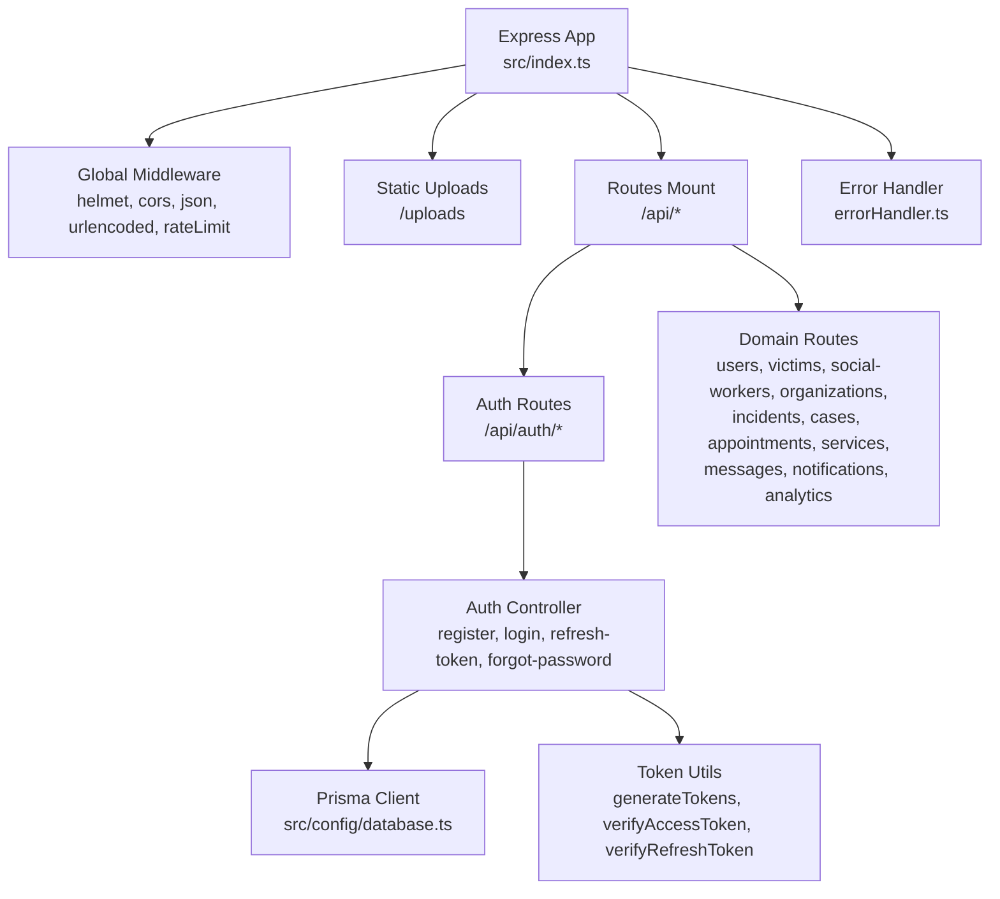

**Diagram sources**
- [index.ts:10-33](file://backend-api/src/index.ts#L10-L33)
- [routes/index.ts:15-37](file://backend-api/src/routes/index.ts#L15-L37)
- [auth.routes.ts:4-11](file://backend-api/src/routes/auth.routes.ts#L4-L11)
- [auth.controller.ts:13-114](file://backend-api/src/controllers/auth.controller.ts#L13-L114)
- [database.ts:1-6](file://backend-api/src/config/database.ts#L1-L6)
- [token.ts:1-17](file://backend-api/src/utils/token.ts#L1-L17)
- [errorHandler.ts:3-8](file://backend-api/src/middleware/errorHandler.ts#L3-L8)

**Section sources**
- [index.ts:10-33](file://backend-api/src/index.ts#L10-L33)
- [routes/index.ts:15-37](file://backend-api/src/routes/index.ts#L15-L37)

## Core Components
- Application bootstrap: Initializes Express, applies security and parsing middleware, sets up rate limiting, serves uploaded files statically, mounts API routes, and attaches the global error handler.
- Routing: Central router aggregates domain-specific routers under /api.
- Authentication: Middleware validates Bearer tokens; controller issues access and refresh tokens and persists refresh tokens.
- Authorization: RBAC middleware restricts endpoints to specific roles.
- Validation: Zod-based validator middleware enforces request schemas.
- File uploads: Multer disk storage writes files to an uploads directory with safe filenames.
- Database: Singleton Prisma client configured via environment variables.
- Environment: Schema-validated environment configuration using Zod.

**Section sources**
- [index.ts:10-33](file://backend-api/src/index.ts#L10-L33)
- [routes/index.ts:15-37](file://backend-api/src/routes/index.ts#L15-L37)
- [auth.ts:5-19](file://backend-api/src/middleware/auth.ts#L5-L19)
- [rbac.ts:5-12](file://backend-api/src/middleware/rbac.ts#L5-L12)
- [validate.ts:4-17](file://backend-api/src/middleware/validate.ts#L4-L17)
- [upload.ts:1-20](file://backend-api/src/middleware/upload.ts#L1-L20)
- [database.ts:1-6](file://backend-api/src/config/database.ts#L1-L6)
- [env.ts:1-14](file://backend-api/src/config/env.ts#L1-L14)

## Architecture Overview
The API uses a layered approach:
- HTTP layer: Express app with global middleware (security headers, CORS, JSON parsing, rate limiting).
- Routing layer: Domain routers compose endpoint handlers.
- Controller layer: Business logic, input processing, and orchestration of services/utilities.
- Data layer: Prisma ORM interacts with MySQL.
- Cross-cutting: Authentication, RBAC, validation, uploads, and error handling are applied as middleware.

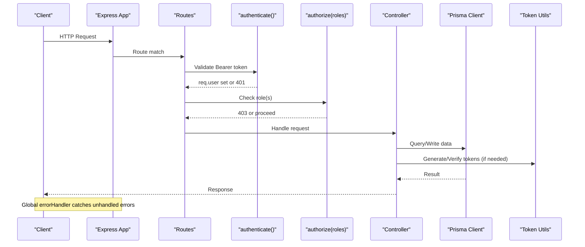

**Diagram sources**
- [index.ts:10-33](file://backend-api/src/index.ts#L10-L33)
- [routes/index.ts:15-37](file://backend-api/src/routes/index.ts#L15-L37)
- [auth.ts:5-19](file://backend-api/src/middleware/auth.ts#L5-L19)
- [rbac.ts:5-12](file://backend-api/src/middleware/rbac.ts#L5-L12)
- [auth.controller.ts:13-114](file://backend-api/src/controllers/auth.controller.ts#L13-L114)
- [token.ts:1-17](file://backend-api/src/utils/token.ts#L1-L17)
- [database.ts:1-6](file://backend-api/src/config/database.ts#L1-L6)

## Detailed Component Analysis

### Authentication Flow (JWT)
- Registration and login create short-lived access tokens and longer-lived refresh tokens. Refresh tokens are persisted and rotated on use.
- The authenticate middleware verifies the access token and attaches user context to the request.
- RBAC middleware checks the user’s role against allowed roles for protected endpoints.

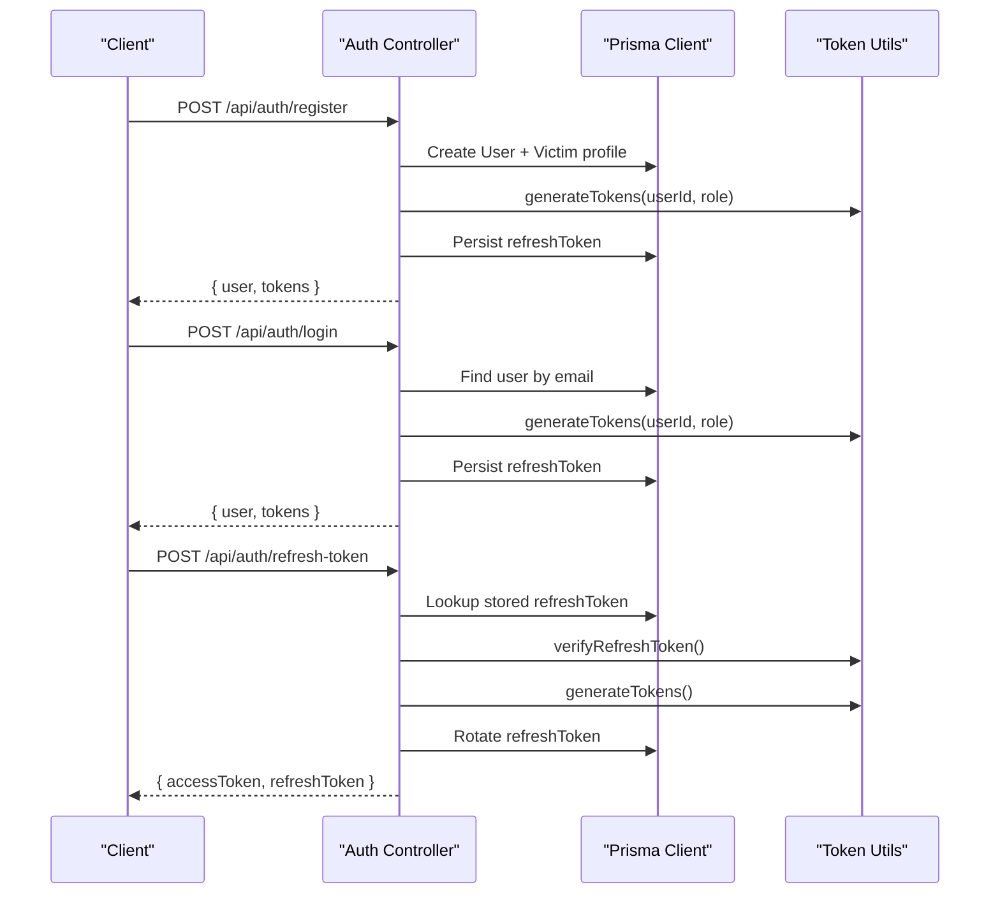

**Diagram sources**
- [auth.controller.ts:13-114](file://backend-api/src/controllers/auth.controller.ts#L13-L114)
- [token.ts:1-17](file://backend-api/src/utils/token.ts#L1-L17)
- [database.ts:1-6](file://backend-api/src/config/database.ts#L1-L6)

**Section sources**
- [auth.controller.ts:13-114](file://backend-api/src/controllers/auth.controller.ts#L13-L114)
- [auth.ts:5-19](file://backend-api/src/middleware/auth.ts#L5-L19)
- [token.ts:1-17](file://backend-api/src/utils/token.ts#L1-L17)

### Role-Based Access Control (RBAC)
- The authorize factory returns middleware that checks if the authenticated user’s role is included in the allowed roles array.
- Applied per route or grouped routes to enforce fine-grained permissions.

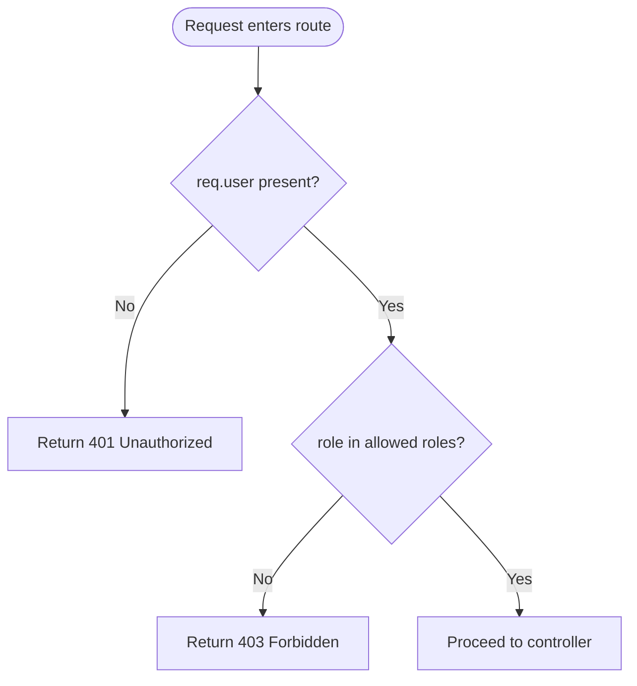

**Diagram sources**
- [rbac.ts:5-12](file://backend-api/src/middleware/rbac.ts#L5-L12)
- [auth.ts:5-19](file://backend-api/src/middleware/auth.ts#L5-L19)

**Section sources**
- [rbac.ts:5-12](file://backend-api/src/middleware/rbac.ts#L5-L12)

### Input Validation with Zod
- The validate middleware parses request body, query, and params against a provided Zod schema.
- On validation failure, returns 400 with structured error details.

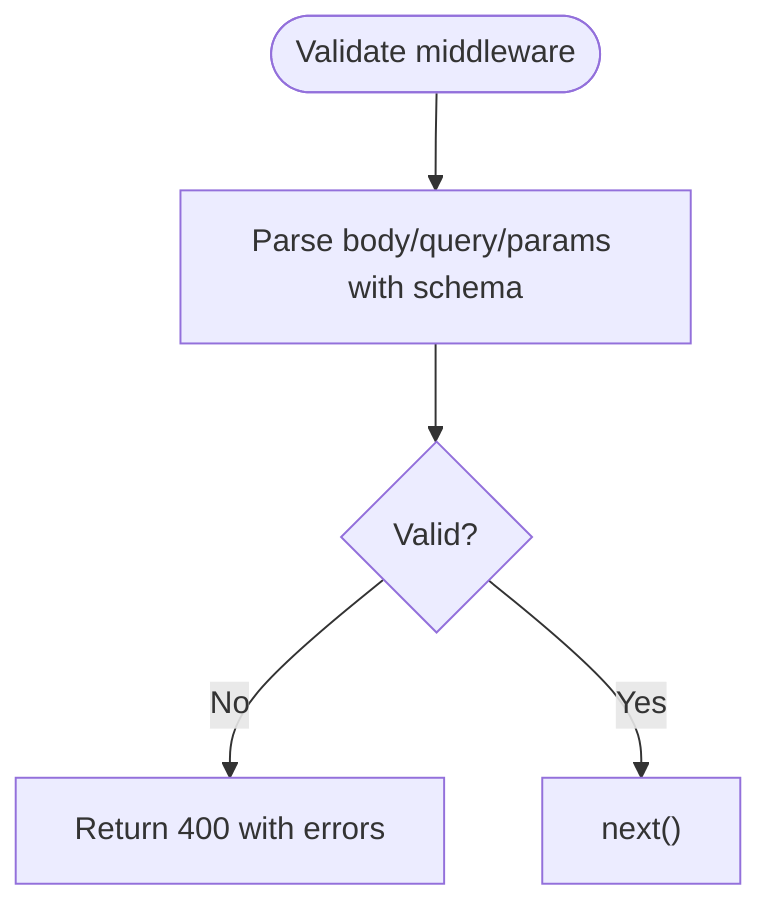

**Diagram sources**
- [validate.ts:4-17](file://backend-api/src/middleware/validate.ts#L4-L17)

**Section sources**
- [validate.ts:4-17](file://backend-api/src/middleware/validate.ts#L4-L17)

### File Upload Handling with Multer
- Multer stores files to a local uploads directory with unique filenames based on timestamp and random suffix.
- The directory is created automatically if missing.
- Static serving exposes files under /uploads.

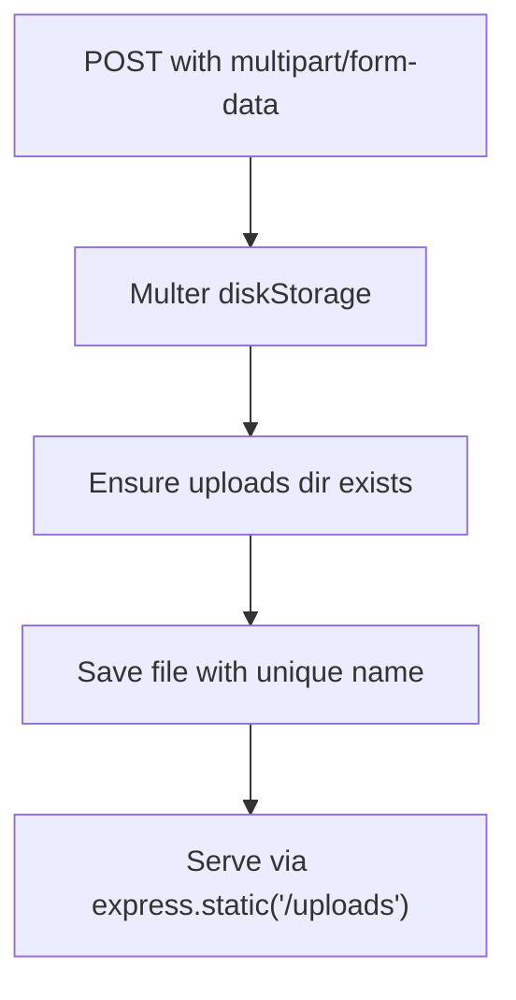

**Diagram sources**
- [upload.ts:1-20](file://backend-api/src/middleware/upload.ts#L1-L20)
- [index.ts:23-24](file://backend-api/src/index.ts#L23-L24)

**Section sources**
- [upload.ts:1-20](file://backend-api/src/middleware/upload.ts#L1-L20)
- [index.ts:23-24](file://backend-api/src/index.ts#L23-L24)

### Error Handling Strategy
- A centralized error handler catches unhandled exceptions and returns consistent JSON responses with appropriate status codes.
- Controllers should throw or return standardized errors to leverage this handler.

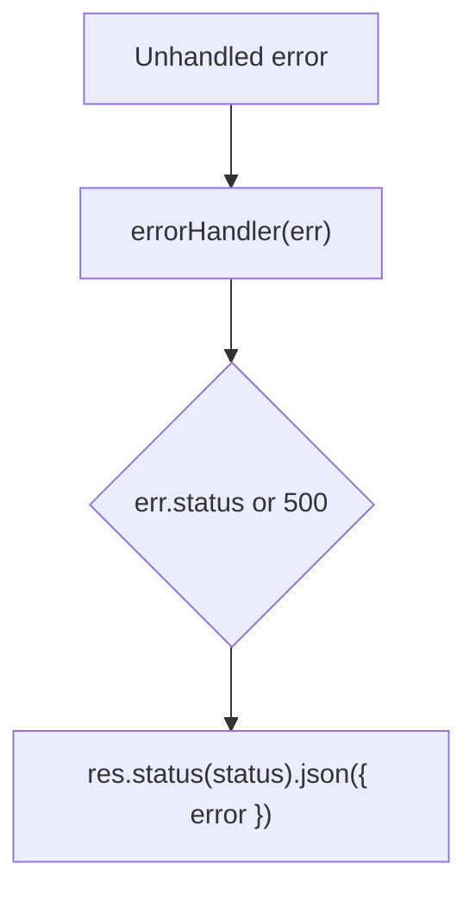

**Diagram sources**
- [errorHandler.ts:3-8](file://backend-api/src/middleware/errorHandler.ts#L3-L8)

**Section sources**
- [errorHandler.ts:3-8](file://backend-api/src/middleware/errorHandler.ts#L3-L8)

### Database Connection Management
- A singleton Prisma client is exported from a dedicated module and reused across controllers.
- Environment variables define the database URL and are validated at startup.

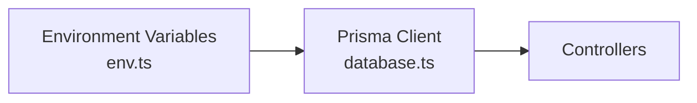

**Diagram sources**
- [database.ts:1-6](file://backend-api/src/config/database.ts#L1-L6)
- [env.ts:1-14](file://backend-api/src/config/env.ts#L1-L14)

**Section sources**
- [database.ts:1-6](file://backend-api/src/config/database.ts#L1-L6)
- [env.ts:1-14](file://backend-api/src/config/env.ts#L1-L14)

### API Routing Structure
- All endpoints are mounted under /api.
- Domain routers include auth, users, victims, social workers, organizations, incidents, cases, appointments, services, messages, notifications, and analytics.

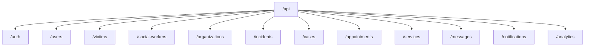

**Diagram sources**
- [routes/index.ts:15-37](file://backend-api/src/routes/index.ts#L15-L37)

**Section sources**
- [routes/index.ts:15-37](file://backend-api/src/routes/index.ts#L15-L37)

### Security Middleware Pipeline
- Helmet sets secure HTTP headers.
- CORS enables cross-origin requests.
- Rate limiting protects against abuse.
- Authentication and RBAC protect sensitive routes.
- Error handler ensures consistent error responses.

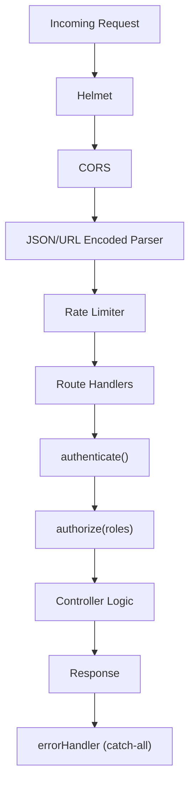

**Diagram sources**
- [index.ts:10-33](file://backend-api/src/index.ts#L10-L33)
- [auth.ts:5-19](file://backend-api/src/middleware/auth.ts#L5-L19)
- [rbac.ts:5-12](file://backend-api/src/middleware/rbac.ts#L5-L12)
- [errorHandler.ts:3-8](file://backend-api/src/middleware/errorHandler.ts#L3-L8)

**Section sources**
- [index.ts:10-33](file://backend-api/src/index.ts#L10-L33)

### Data Model Overview
- Core entities include User, Victim, SocialWorker, Organization, Incident, Case, Appointment, Service, Message, Notification, AuditLog, and RefreshToken.
- Relationships are defined via Prisma relations, enabling rich queries and referential integrity.

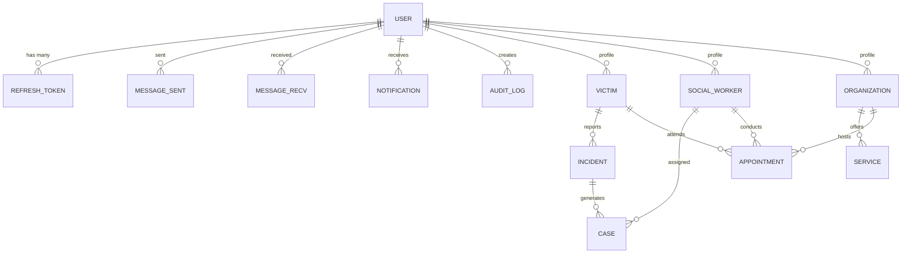

**Diagram sources**
- [schema.prisma:47-208](file://backend-api/prisma/schema.prisma#L47-L208)

**Section sources**
- [schema.prisma:47-208](file://backend-api/prisma/schema.prisma#L47-L208)

## Dependency Analysis
- Express application depends on security and parsing middleware, then mounts domain routers.
- Controllers depend on Prisma client and token utilities.
- Middleware depends on types and Prisma enums for role checks.
- Environment configuration is validated at startup to ensure required variables exist.

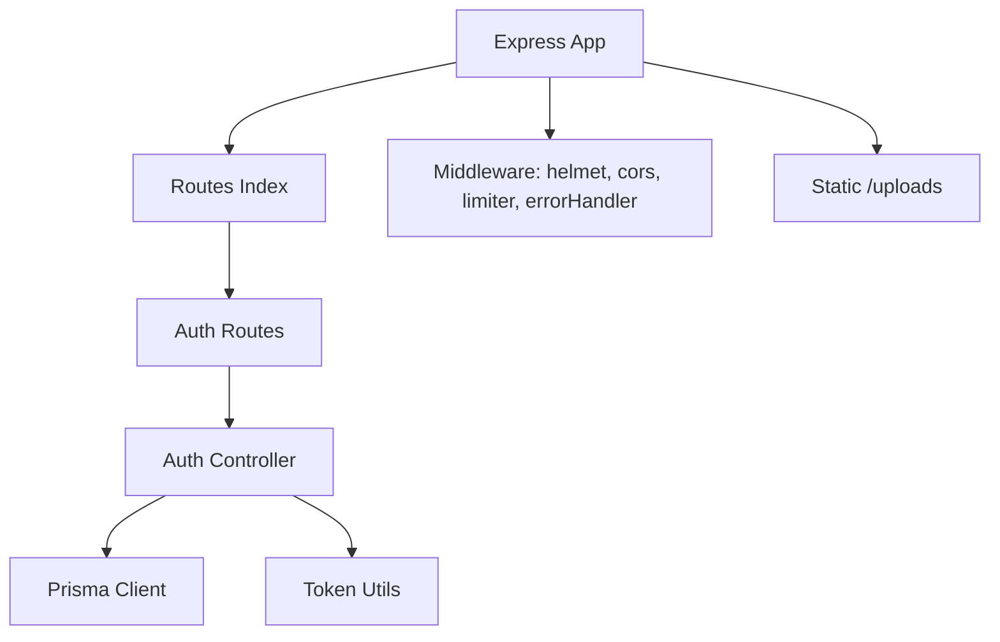

**Diagram sources**
- [index.ts:10-33](file://backend-api/src/index.ts#L10-L33)
- [routes/index.ts:15-37](file://backend-api/src/routes/index.ts#L15-L37)
- [auth.routes.ts:4-11](file://backend-api/src/routes/auth.routes.ts#L4-L11)
- [auth.controller.ts:13-114](file://backend-api/src/controllers/auth.controller.ts#L13-L114)
- [database.ts:1-6](file://backend-api/src/config/database.ts#L1-L6)
- [token.ts:1-17](file://backend-api/src/utils/token.ts#L1-L17)

**Section sources**
- [index.ts:10-33](file://backend-api/src/index.ts#L10-L33)
- [routes/index.ts:15-37](file://backend-api/src/routes/index.ts#L15-L37)
- [auth.controller.ts:13-114](file://backend-api/src/controllers/auth.controller.ts#L13-L114)
- [token.ts:1-17](file://backend-api/src/utils/token.ts#L1-L17)
- [database.ts:1-6](file://backend-api/src/config/database.ts#L1-L6)

## Performance Considerations
- Connection Pooling: Configure Prisma datasource options for connection pool size and timeouts to match expected concurrency and database capacity.
- Query Optimization: Use selective field projection and include only necessary relations to reduce payload size and query time.
- Caching: Introduce caching for read-heavy endpoints (e.g., services, organizations) using an in-memory cache or external cache like Redis.
- Rate Limiting: Tune windowMs and max values to balance protection and usability.
- File Storage: For high-volume uploads, consider object storage (e.g., cloud storage) instead of local disk to improve scalability and reliability.
- Concurrency: Monitor CPU and memory usage; consider horizontal scaling behind a reverse proxy and process manager when traffic grows.
- Logging: Add structured logging and metrics collection to identify bottlenecks and track performance trends.

[No sources needed since this section provides general guidance]

## Troubleshooting Guide
- Authentication failures:
  - Missing or malformed Authorization header results in 401.
  - Invalid or expired access tokens result in 401.
  - Expired or invalid refresh tokens result in 401 during token refresh.
- Authorization failures:
  - Insufficient role results in 403.
- Validation errors:
  - Mismatched request schema results in 400 with detailed errors.
- Database errors:
  - Connection or query errors propagate to the global error handler and return 500 unless handled explicitly.
- Upload issues:
  - Ensure uploads directory exists and has write permissions.
  - Verify content-type and payload size limits for multipart requests.

**Section sources**
- [auth.ts:5-19](file://backend-api/src/middleware/auth.ts#L5-L19)
- [rbac.ts:5-12](file://backend-api/src/middleware/rbac.ts#L5-L12)
- [validate.ts:4-17](file://backend-api/src/middleware/validate.ts#L4-L17)
- [errorHandler.ts:3-8](file://backend-api/src/middleware/errorHandler.ts#L3-L8)
- [upload.ts:1-20](file://backend-api/src/middleware/upload.ts#L1-L20)

## Conclusion
The SafeProtect Cameroon backend API implements a clean, modular Express architecture with clear separation of concerns across routing, controllers, middleware, and data access. JWT-based authentication combined with RBAC provides secure, role-aware access control. Prisma simplifies database interactions while allowing room for performance tuning. The design supports scalable growth through configurable rate limiting, robust error handling, and extensible middleware composition. Adopting the recommended performance and operational practices will further enhance reliability and responsiveness under load.