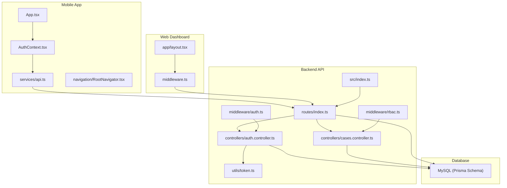
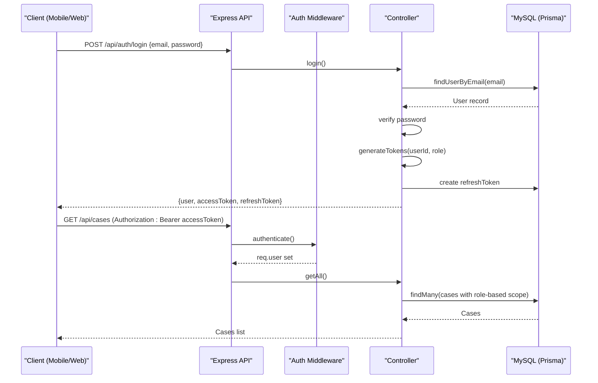
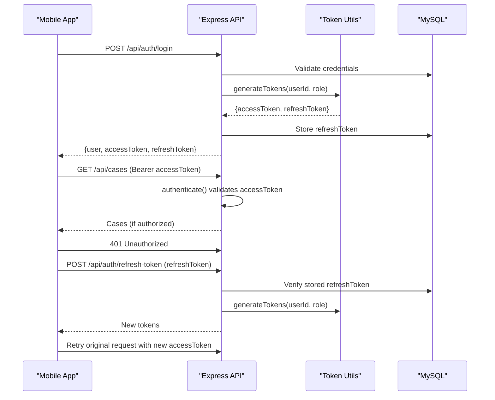
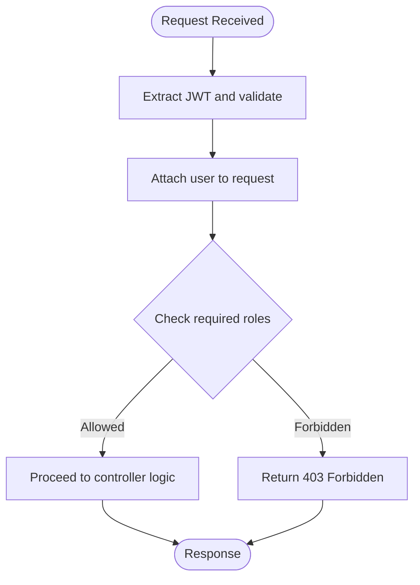
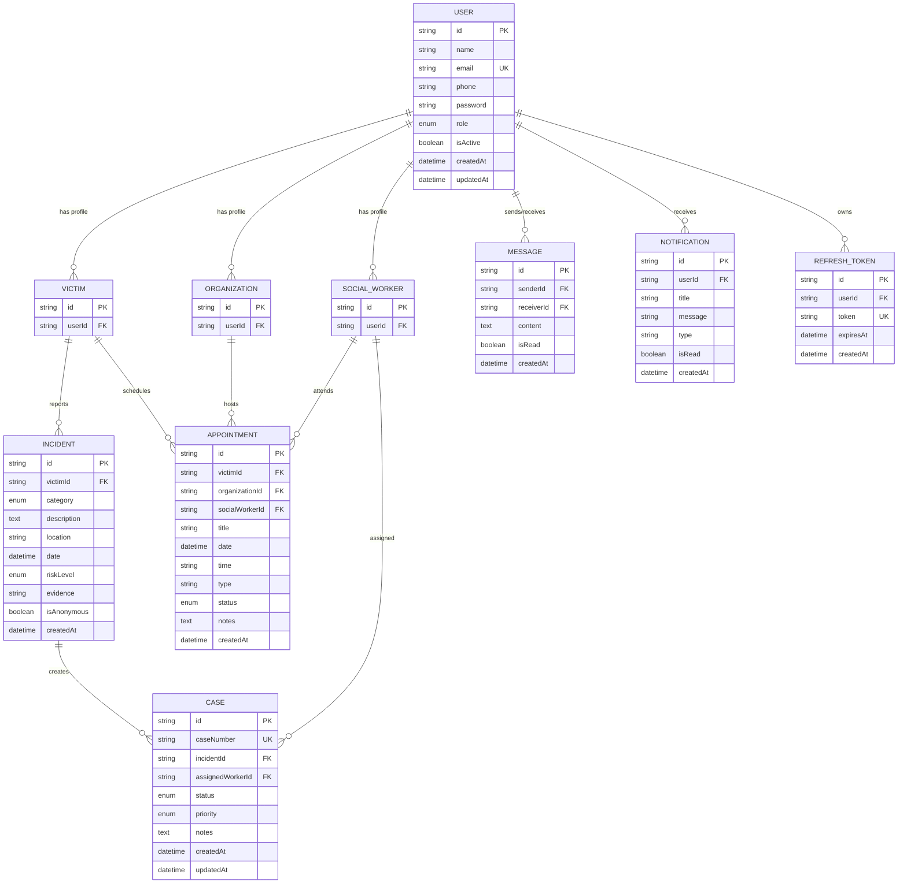
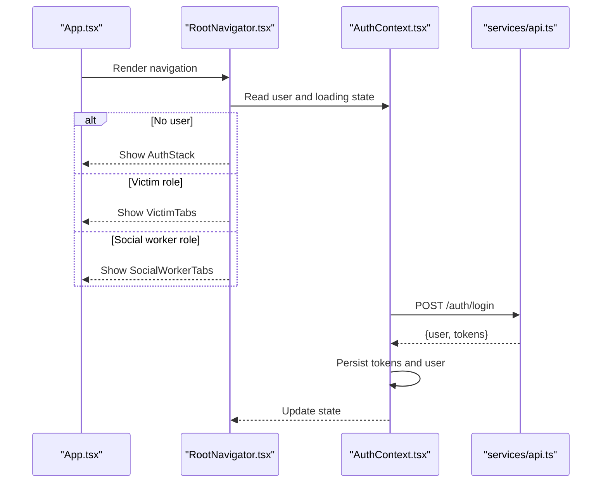
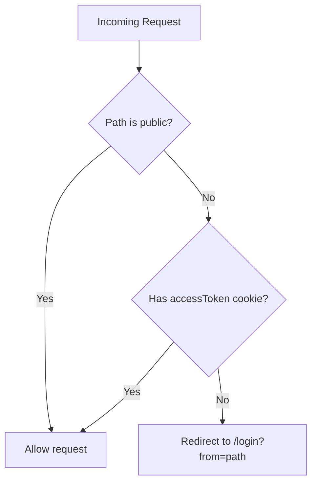
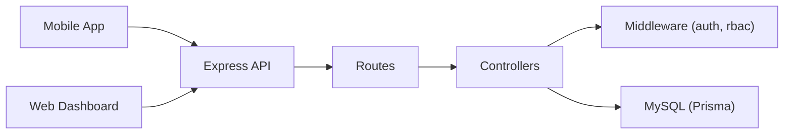

# System Architecture

<cite>
**Referenced Files in This Document**
- [index.ts](file://backend-api/src/index.ts)
- [schema.prisma](file://backend-api/prisma/schema.prisma)
- [auth.controller.ts](file://backend-api/src/controllers/auth.controller.ts)
- [token.ts](file://backend-api/src/utils/token.ts)
- [auth.ts](file://backend-api/src/middleware/auth.ts)
- [rbac.ts](file://backend-api/src/middleware/rbac.ts)
- [cases.controller.ts](file://backend-api/src/controllers/cases.controller.ts)
- [routes/index.ts](file://backend-api/src/routes/index.ts)
- [routes/auth.routes.ts](file://backend-api/src/routes/auth.routes.ts)
- [App.tsx](file://mobile-app/App.tsx)
- [AuthContext.tsx](file://mobile-app/src/contexts/AuthContext.tsx)
- [api.ts](file://mobile-app/src/services/api.ts)
- [RootNavigator.tsx](file://mobile-app/src/navigation/RootNavigator.tsx)
- [layout.tsx](file://web-dashboard/src/app/layout.tsx)
- [middleware.ts](file://web-dashboard/src/middleware.ts)
</cite>

## Table of Contents
1. [Introduction](#introduction)
2. [Project Structure](#project-structure)
3. [Core Components](#core-components)
4. [Architecture Overview](#architecture-overview)
5. [Detailed Component Analysis](#detailed-component-analysis)
6. [Dependency Analysis](#dependency-analysis)
7. [Performance Considerations](#performance-considerations)
8. [Troubleshooting Guide](#troubleshooting-guide)
9. [Conclusion](#conclusion)

## Introduction
This document describes the system architecture for SafeProtect Cameroon, a three-tier application composed of:
- Backend API (Express.js + TypeScript)
- Mobile App (React Native + Expo)
- Web Dashboard (Next.js 14)

The system supports role-based access control across Victim, Social Worker, Organization, and Admin roles, with secure authentication using JWT tokens. Data is persisted in a MySQL database via Prisma ORM. The architecture emphasizes separation of concerns between victim-facing features, social worker workflows, and administrative dashboards.

## Project Structure
The repository is organized into three primary tiers:
- backend-api: Express server with controllers, middleware, routes, Prisma schema, and utilities
- mobile-app: React Native app with navigation, auth context, and API client
- web-dashboard: Next.js dashboard with middleware-based route protection and UI components

**Diagram sources**
- [App.tsx:8-16](file://mobile-app/App.tsx#L8-L16)
- [AuthContext.tsx:22-76](file://mobile-app/src/contexts/AuthContext.tsx#L22-L76)
- [api.ts:28-99](file://mobile-app/src/services/api.ts#L28-L99)
- [layout.tsx:9-18](file://web-dashboard/src/app/layout.tsx#L9-L18)
- [middleware.ts:6-24](file://web-dashboard/src/middleware.ts#L6-L24)
- [index.ts:10-33](file://backend-api/src/index.ts#L10-L33)
- [routes/index.ts:15-37](file://backend-api/src/routes/index.ts#L15-L37)
- [auth.controller.ts:13-83](file://backend-api/src/controllers/auth.controller.ts#L13-L83)
- [token.ts:4-16](file://backend-api/src/utils/token.ts#L4-L16)
- [auth.ts:5-19](file://backend-api/src/middleware/auth.ts#L5-L19)
- [rbac.ts:5-12](file://backend-api/src/middleware/rbac.ts#L5-L12)
- [cases.controller.ts:48-78](file://backend-api/src/controllers/cases.controller.ts#L48-L78)
- [schema.prisma:47-207](file://backend-api/prisma/schema.prisma#L47-L207)

**Section sources**
- [index.ts:10-33](file://backend-api/src/index.ts#L10-L33)
- [schema.prisma:47-207](file://backend-api/prisma/schema.prisma#L47-L207)
- [App.tsx:8-16](file://mobile-app/App.tsx#L8-L16)
- [layout.tsx:9-18](file://web-dashboard/src/app/layout.tsx#L9-L18)

## Core Components
- Backend API: Express server with security middleware (helmet, cors, rate limiting), centralized error handling, and modular routes under /api
- Authentication: JWT-based access and refresh tokens; token generation and verification utilities; middleware to authenticate requests and enforce RBAC
- Data Layer: Prisma ORM with MySQL; models for User, Victim, SocialWorker, Organization, Incident, Case, Appointment, Service, Message, Notification, AuditLog, RefreshToken
- Mobile App: React Native app with AuthContext managing session state, Axios interceptors for token injection and refresh flow, and role-based navigation routing
- Web Dashboard: Next.js app with middleware protecting dashboard routes by checking cookies for an access token

Key responsibilities:
- Role-based scoping for data access (e.g., cases filtered by user role)
- Secure token lifecycle management (short-lived access tokens, longer-lived refresh tokens)
- Separation of victim and social worker interfaces through navigation and permissions
- Administrative capabilities via protected dashboard routes

**Section sources**
- [index.ts:10-33](file://backend-api/src/index.ts#L10-L33)
- [auth.controller.ts:13-83](file://backend-api/src/controllers/auth.controller.ts#L13-L83)
- [token.ts:4-16](file://backend-api/src/utils/token.ts#L4-L16)
- [auth.ts:5-19](file://backend-api/src/middleware/auth.ts#L5-L19)
- [rbac.ts:5-12](file://backend-api/src/middleware/rbac.ts#L5-L12)
- [cases.controller.ts:7-23](file://backend-api/src/controllers/cases.controller.ts#L7-L23)
- [AuthContext.tsx:22-76](file://mobile-app/src/contexts/AuthContext.tsx#L22-L76)
- [api.ts:28-99](file://mobile-app/src/services/api.ts#L28-L99)
- [middleware.ts:6-24](file://web-dashboard/src/middleware.ts#L6-L24)

## Architecture Overview
SafeProtect uses a three-tier architecture where clients communicate with the backend over REST APIs, and the backend persists data to MySQL. Authentication and authorization are enforced at both client and server layers.

**Diagram sources**
- [auth.controller.ts:54-83](file://backend-api/src/controllers/auth.controller.ts#L54-L83)
- [token.ts:4-16](file://backend-api/src/utils/token.ts#L4-L16)
- [auth.ts:5-19](file://backend-api/src/middleware/auth.ts#L5-L19)
- [cases.controller.ts:48-78](file://backend-api/src/controllers/cases.controller.ts#L48-L78)
- [schema.prisma:47-207](file://backend-api/prisma/schema.prisma#L47-L207)

## Detailed Component Analysis

### Authentication Flow (JWT Access + Refresh Tokens)
- Login registers or authenticates users, generates short-lived access tokens and longer-lived refresh tokens, and stores refresh tokens in the database
- Mobile app attaches access tokens to requests and handles 401 responses by refreshing tokens once before forcing logout if refresh fails
- Web dashboard protects routes by checking for an access token cookie and redirects unauthenticated users to login

**Diagram sources**
- [auth.controller.ts:54-110](file://backend-api/src/controllers/auth.controller.ts#L54-L110)
- [token.ts:4-16](file://backend-api/src/utils/token.ts#L4-L16)
- [api.ts:28-99](file://mobile-app/src/services/api.ts#L28-L99)
- [auth.ts:5-19](file://backend-api/src/middleware/auth.ts#L5-L19)

**Section sources**
- [auth.controller.ts:13-110](file://backend-api/src/controllers/auth.controller.ts#L13-L110)
- [token.ts:4-16](file://backend-api/src/utils/token.ts#L4-L16)
- [api.ts:28-99](file://mobile-app/src/services/api.ts#L28-L99)
- [AuthContext.tsx:22-76](file://mobile-app/src/contexts/AuthContext.tsx#L22-L76)
- [middleware.ts:6-24](file://web-dashboard/src/middleware.ts#L6-L24)

### Role-Based Access Control (RBAC)
- Roles defined in the database include VICTIM, SOCIAL_WORKER, ORGANIZATION, ADMIN
- Middleware extracts user from JWT and attaches it to the request
- Controllers implement role-based scoping to restrict data visibility and actions
- Example: case queries filter results based on user role (admin sees all, victims see their own, social workers see assigned cases)

**Diagram sources**
- [auth.ts:5-19](file://backend-api/src/middleware/auth.ts#L5-L19)
- [rbac.ts:5-12](file://backend-api/src/middleware/rbac.ts#L5-L12)
- [cases.controller.ts:7-23](file://backend-api/src/controllers/cases.controller.ts#L7-L23)

**Section sources**
- [schema.prisma:10-15](file://backend-api/prisma/schema.prisma#L10-L15)
- [auth.ts:5-19](file://backend-api/src/middleware/auth.ts#L5-L19)
- [rbac.ts:5-12](file://backend-api/src/middleware/rbac.ts#L5-L12)
- [cases.controller.ts:7-23](file://backend-api/src/controllers/cases.controller.ts#L7-L23)

### Data Models and Relationships
- User model centralizes identity and links to role-specific profiles (Victim, SocialWorker, Organization)
- Incident and Case models track reported events and their resolution workflow
- Appointment and Service models support scheduling and service offerings
- Message and Notification models enable communication and status updates
- RefreshToken and AuditLog support security and compliance

**Diagram sources**
- [schema.prisma:47-207](file://backend-api/prisma/schema.prisma#L47-L207)

**Section sources**
- [schema.prisma:47-207](file://backend-api/prisma/schema.prisma#L47-L207)

### Mobile App Navigation and Role Separation
- Root navigator selects victim or social worker tabs based on authenticated user role
- Auth context manages login, logout, and session persistence, including restrictions for admin/organization accounts on mobile
- API client injects access tokens and handles refresh flows automatically

**Diagram sources**
- [App.tsx:8-16](file://mobile-app/App.tsx#L8-L16)
- [RootNavigator.tsx:36-58](file://mobile-app/src/navigation/RootNavigator.tsx#L36-L58)
- [AuthContext.tsx:22-76](file://mobile-app/src/contexts/AuthContext.tsx#L22-L76)
- [api.ts:28-99](file://mobile-app/src/services/api.ts#L28-L99)

**Section sources**
- [RootNavigator.tsx:36-58](file://mobile-app/src/navigation/RootNavigator.tsx#L36-L58)
- [AuthContext.tsx:22-76](file://mobile-app/src/contexts/AuthContext.tsx#L22-L76)
- [api.ts:28-99](file://mobile-app/src/services/api.ts#L28-L99)

### Web Dashboard Route Protection
- Next.js middleware checks for an access token cookie and redirects to login if missing
- Public paths like login are allowed without authentication

**Diagram sources**
- [middleware.ts:6-24](file://web-dashboard/src/middleware.ts#L6-L24)

**Section sources**
- [middleware.ts:6-24](file://web-dashboard/src/middleware.ts#L6-L24)

## Dependency Analysis
The system exhibits clear layering and separation:
- Clients depend on the backend API via REST endpoints
- Backend depends on Prisma and MySQL for data operations
- Middleware provides cross-cutting concerns (authentication, validation, error handling)
- Controllers encapsulate business logic and coordinate with data models

**Diagram sources**
- [index.ts:10-33](file://backend-api/src/index.ts#L10-L33)
- [routes/index.ts:15-37](file://backend-api/src/routes/index.ts#L15-L37)
- [auth.controller.ts:13-83](file://backend-api/src/controllers/auth.controller.ts#L13-L83)
- [cases.controller.ts:48-78](file://backend-api/src/controllers/cases.controller.ts#L48-L78)
- [schema.prisma:47-207](file://backend-api/prisma/schema.prisma#L47-L207)

**Section sources**
- [routes/index.ts:15-37](file://backend-api/src/routes/index.ts#L15-L37)
- [auth.controller.ts:13-83](file://backend-api/src/controllers/auth.controller.ts#L13-L83)
- [cases.controller.ts:48-78](file://backend-api/src/controllers/cases.controller.ts#L48-L78)

## Performance Considerations
- Rate limiting is applied globally to protect the API from abuse
- Short-lived access tokens reduce exposure window; refresh tokens rotate securely
- Role-based scoping minimizes unnecessary data retrieval by filtering at query time
- Fire-and-forget notifications avoid blocking critical request/response cycles
- Static file serving for uploads reduces overhead on dynamic routes

[No sources needed since this section provides general guidance]

## Troubleshooting Guide
Common issues and resolutions:
- 401 Unauthorized: Ensure access token is present and valid; handle refresh flow if expired
- 403 Forbidden: Verify user role has permission for the requested resource
- Invalid credentials: Check email/password combination and account status
- Session persistence: Confirm tokens and user data are stored correctly in mobile storage
- Web dashboard redirects: Ensure access token cookie is set after login

**Section sources**
- [auth.ts:5-19](file://backend-api/src/middleware/auth.ts#L5-L19)
- [rbac.ts:5-12](file://backend-api/src/middleware/rbac.ts#L5-L12)
- [api.ts:28-99](file://mobile-app/src/services/api.ts#L28-L99)
- [AuthContext.tsx:22-76](file://mobile-app/src/contexts/AuthContext.tsx#L22-L76)
- [middleware.ts:6-24](file://web-dashboard/src/middleware.ts#L6-L24)

## Conclusion
SafeProtect Cameroon’s architecture cleanly separates concerns across three tiers, enforces secure authentication and role-based access control, and provides scalable patterns for future growth. The use of JWT tokens, Prisma-managed MySQL schema, and middleware-driven security ensures robustness and maintainability. Clear boundaries between victim, social worker, and administrative interfaces improve usability and safety for sensitive workflows.

[No sources needed since this section summarizes without analyzing specific files]