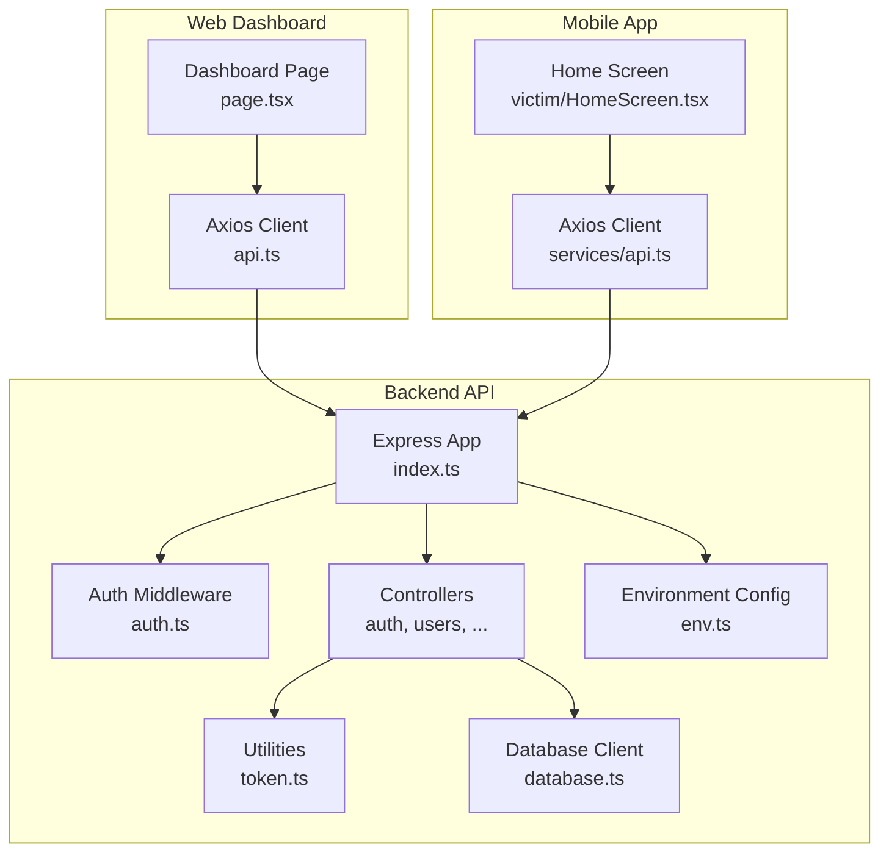
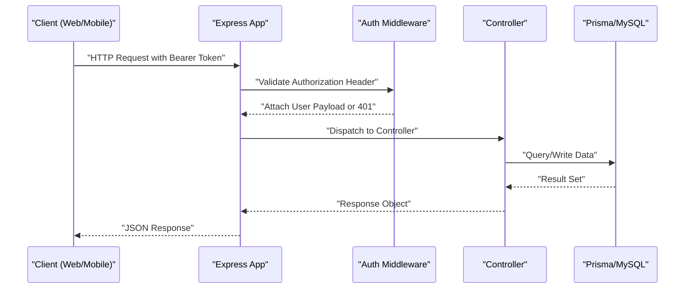
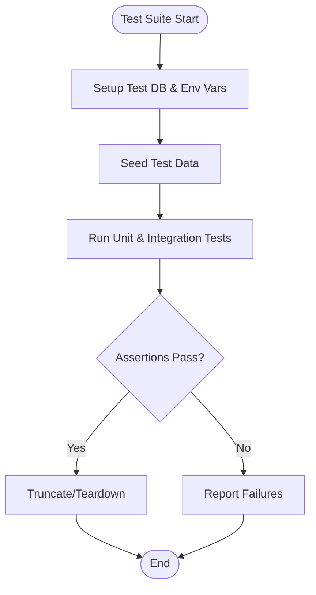
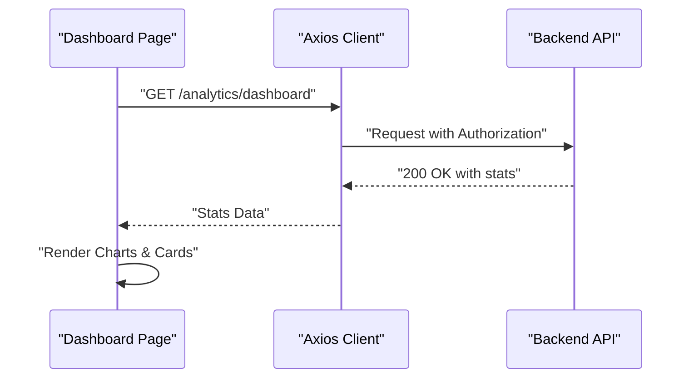
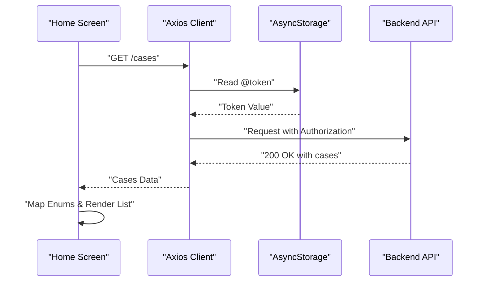
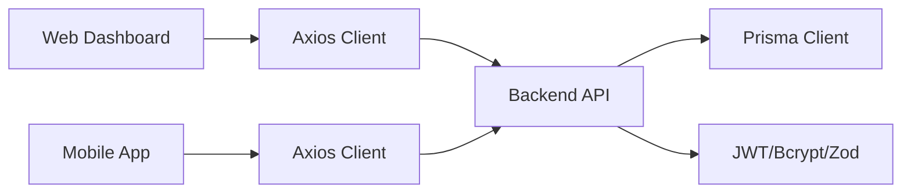

# Testing Strategy

<cite>
**Referenced Files in This Document**
- [README.md](file://README.md)
- [backend-api/package.json](file://backend-api/package.json)
- [web-dashboard/package.json](file://web-dashboard/package.json)
- [mobile-app/package.json](file://mobile-app/package.json)
- [backend-api/src/index.ts](file://backend-api/src/index.ts)
- [backend-api/src/config/database.ts](file://backend-api/src/config/database.ts)
- [backend-api/src/config/env.ts](file://backend-api/src/config/env.ts)
- [backend-api/src/middleware/auth.ts](file://backend-api/src/middleware/auth.ts)
- [backend-api/src/controllers/auth.controller.ts](file://backend-api/src/controllers/auth.controller.ts)
- [backend-api/src/controllers/users.controller.ts](file://backend-api/src/controllers/users.controller.ts)
- [backend-api/src/utils/token.ts](file://backend-api/src/utils/token.ts)
- [web-dashboard/src/lib/api.ts](file://web-dashboard/src/lib/api.ts)
- [web-dashboard/src/app/(dashboard)/dashboard/page.tsx](file://web-dashboard/src/app/(dashboard)/dashboard/page.tsx)
- [mobile-app/src/services/api.ts](file://mobile-app/src/services/api.ts)
- [mobile-app/src/screens/victim/HomeScreen.tsx](file://mobile-app/src/screens/victim/HomeScreen.tsx)
</cite>

## Table of Contents
1. Introduction
2. Project Structure
3. Core Components
4. Architecture Overview
5. Detailed Component Analysis
6. Dependency Analysis
7. Performance Considerations
8. Troubleshooting Guide
9. Conclusion

## Introduction
This document defines a comprehensive, multi-layered testing strategy for SafeProtect Cameroon across its three applications: the backend API (Express + Prisma), the web dashboard (Next.js), and the mobile app (React Native + Expo). It covers unit, integration, component, end-to-end, performance, security, and user acceptance testing, along with mock data strategies, environment setup, CI pipelines, coverage targets, and best practices tailored to this codebase.

## Project Structure
SafeProtect Cameroon is organized into three main application layers:
- Backend API: Express server with middleware, controllers, utilities, and Prisma-managed MySQL database.
- Web Dashboard: Next.js client that calls the backend via an Axios-based API client with token refresh logic.
- Mobile App: React Native/Expo client with its own Axios-based API client using AsyncStorage for tokens and a robust 401 retry flow.

**Diagram sources**
- [backend-api/src/index.ts:1-34](file://backend-api/src/index.ts#L1-L34)
- [backend-api/src/middleware/auth.ts:1-20](file://backend-api/src/middleware/auth.ts#L1-L20)
- [backend-api/src/controllers/auth.controller.ts:1-83](file://backend-api/src/controllers/auth.controller.ts#L1-L83)
- [backend-api/src/controllers/users.controller.ts:1-65](file://backend-api/src/controllers/users.controller.ts#L1-L65)
- [backend-api/src/utils/token.ts:1-16](file://backend-api/src/utils/token.ts#L1-L16)
- [backend-api/src/config/database.ts:1-6](file://backend-api/src/config/database.ts#L1-L6)
- [backend-api/src/config/env.ts:1-13](file://backend-api/src/config/env.ts#L1-L13)
- [web-dashboard/src/lib/api.ts:1-78](file://web-dashboard/src/lib/api.ts#L1-L78)
- [web-dashboard/src/app/(dashboard)/dashboard/page.tsx:1-156](file://web-dashboard/src/app/(dashboard)/dashboard/page.tsx#L1-L156)
- [mobile-app/src/services/api.ts:1-103](file://mobile-app/src/services/api.ts#L1-L103)
- [mobile-app/src/screens/victim/HomeScreen.tsx:1-800](file://mobile-app/src/screens/victim/HomeScreen.tsx#L1-L800)

**Section sources**
- [README.md:10-115](file://README.md#L10-L115)

## Core Components
- Backend API
  - Entry point configures security headers, CORS, JSON parsing, rate limiting, static uploads, routes, error handler, and listens on a configurable port from environment variables.
  - Authentication middleware validates Bearer tokens using JWT verification utilities.
  - Controllers implement business logic for auth and user management, interacting with Prisma and hashing utilities.
  - Utilities provide token generation and verification; environment validation ensures required configuration.
- Web Dashboard
  - Axios client attaches Authorization headers and implements automatic token refresh on 401 responses, redirecting to login when necessary.
  - Dashboard page fetches analytics stats and renders UI components.
- Mobile App
  - Axios client attaches Authorization headers from AsyncStorage and implements deduplicated token refresh on 401, clearing auth state and invoking an auth failure callback on persistent failures.
  - Home screen fetches cases, maps backend enums to display values, and manages local UI state.

Testing implications:
- Unit tests should cover pure functions and isolated controller/service logic.
- Integration tests should validate HTTP endpoints, authentication flows, and database interactions.
- Frontend tests should verify component rendering, API client behavior, and navigation guards.
- End-to-end tests should exercise full user journeys across platforms against a test backend.

**Section sources**
- [backend-api/src/index.ts:1-34](file://backend-api/src/index.ts#L1-L34)
- [backend-api/src/middleware/auth.ts:1-20](file://backend-api/src/middleware/auth.ts#L1-L20)
- [backend-api/src/controllers/auth.controller.ts:1-83](file://backend-api/src/controllers/auth.controller.ts#L1-L83)
- [backend-api/src/controllers/users.controller.ts:1-65](file://backend-api/src/controllers/users.controller.ts#L1-L65)
- [backend-api/src/utils/token.ts:1-16](file://backend-api/src/utils/token.ts#L1-L16)
- [backend-api/src/config/env.ts:1-13](file://backend-api/src/config/env.ts#L1-L13)
- [web-dashboard/src/lib/api.ts:1-78](file://web-dashboard/src/lib/api.ts#L1-L78)
- [web-dashboard/src/app/(dashboard)/dashboard/page.tsx:1-156](file://web-dashboard/src/app/(dashboard)/dashboard/page.tsx#L1-L156)
- [mobile-app/src/services/api.ts:1-103](file://mobile-app/src/services/api.ts#L1-L103)
- [mobile-app/src/screens/victim/HomeScreen.tsx:1-800](file://mobile-app/src/screens/victim/HomeScreen.tsx#L1-L800)

## Architecture Overview
The system follows a layered architecture where clients call REST endpoints secured by JWT-based authentication. The backend enforces RBAC via middleware and uses Prisma to interact with MySQL. Clients implement resilient token refresh strategies to handle expiration gracefully.

**Diagram sources**
- [backend-api/src/index.ts:1-34](file://backend-api/src/index.ts#L1-L34)
- [backend-api/src/middleware/auth.ts:1-20](file://backend-api/src/middleware/auth.ts#L1-L20)
- [backend-api/src/controllers/auth.controller.ts:1-83](file://backend-api/src/controllers/auth.controller.ts#L1-L83)
- [backend-api/src/config/database.ts:1-6](file://backend-api/src/config/database.ts#L1-L6)

## Detailed Component Analysis

### Backend API Testing
- Unit Testing
  - Focus areas:
    - Token utilities: generateTokens, verifyAccessToken, verifyRefreshToken.
    - Password hashing and comparison helpers.
    - Environment schema validation to ensure required variables are present.
  - Recommended frameworks: Jest with ts-jest for TypeScript support.
  - Mocking:
    - Mock Prisma client methods for database interactions.
    - Mock crypto/JWT libraries if needed for deterministic outputs.
- Integration Testing
  - Focus areas:
    - Authentication endpoints: register, login, refresh-token.
    - Protected routes requiring valid Bearer tokens.
    - Database operations via Prisma against a test database.
  - Recommended frameworks: Supertest for HTTP assertions; Testcontainers or Docker Compose for ephemeral MySQL instances.
  - Setup:
    - Use a separate test database URL configured via environment variables.
    - Seed test data before suites; truncate or rollback after each suite.
- Security Testing
  - Validate JWT secret handling and token expiration policies.
  - Ensure password hashing meets requirements and sensitive fields are stripped from responses.
  - Verify rate limiting and input validation with Zod schemas.

**Diagram sources**
- [backend-api/src/config/env.ts:1-13](file://backend-api/src/config/env.ts#L1-L13)
- [backend-api/src/config/database.ts:1-6](file://backend-api/src/config/database.ts#L1-L6)
- [backend-api/src/controllers/auth.controller.ts:1-83](file://backend-api/src/controllers/auth.controller.ts#L1-L83)

**Section sources**
- [backend-api/src/controllers/auth.controller.ts:1-83](file://backend-api/src/controllers/auth.controller.ts#L1-L83)
- [backend-api/src/controllers/users.controller.ts:1-65](file://backend-api/src/controllers/users.controller.ts#L1-L65)
- [backend-api/src/utils/token.ts:1-16](file://backend-api/src/utils/token.ts#L1-L16)
- [backend-api/src/config/env.ts:1-13](file://backend-api/src/config/env.ts#L1-L13)
- [backend-api/src/config/database.ts:1-6](file://backend-api/src/config/database.ts#L1-L6)

### Web Dashboard Testing
- Component Testing
  - Focus areas:
    - Dashboard page rendering and loading states.
    - Chart components and recent incidents list.
  - Recommended frameworks: Jest + React Testing Library.
  - Mocking:
    - Mock axios instance to simulate API responses and errors.
    - Mock localStorage for token checks and redirects.
- Integration Testing
  - Focus areas:
    - API client interceptors: request header injection and response 401 refresh flow.
    - Navigation guard behavior when tokens are missing.
  - Recommended frameworks: Jest + React Testing Library; optional Cypress for browser-level flows.
- End-to-End Testing
  - Focus areas:
    - Full login flow, dashboard load, and chart rendering.
  - Recommended frameworks: Cypress or Playwright.
  - Setup:
    - Configure NEXT_PUBLIC_API_URL to point at a test backend instance.

**Diagram sources**
- [web-dashboard/src/app/(dashboard)/dashboard/page.tsx:1-156](file://web-dashboard/src/app/(dashboard)/dashboard/page.tsx#L1-L156)
- [web-dashboard/src/lib/api.ts:1-78](file://web-dashboard/src/lib/api.ts#L1-L78)

**Section sources**
- [web-dashboard/src/lib/api.ts:1-78](file://web-dashboard/src/lib/api.ts#L1-L78)
- [web-dashboard/src/app/(dashboard)/dashboard/page.tsx:1-156](file://web-dashboard/src/app/(dashboard)/dashboard/page.tsx#L1-L156)

### Mobile App Testing
- Component Testing
  - Focus areas:
    - Home screen case fetching, mapping backend enums, and UI states (loading, empty, populated).
  - Recommended frameworks: Jest + React Native Testing Library.
  - Mocking:
    - Mock axios instance and AsyncStorage for token retrieval and storage.
- Integration Testing
  - Focus areas:
    - API client interceptors: Authorization header injection and 401 refresh flow.
    - Auth failure callback invocation when refresh fails.
  - Recommended frameworks: Detox for device-level flows; Jest for unit/integration.
- End-to-End Testing
  - Focus areas:
    - Login, home screen load, case list rendering, navigation to detail screens.
  - Recommended frameworks: Detox or Maestro.
  - Setup:
    - Configure EXPO_PUBLIC_API_URL to point at a test backend instance.

**Diagram sources**
- [mobile-app/src/screens/victim/HomeScreen.tsx:1-800](file://mobile-app/src/screens/victim/HomeScreen.tsx#L1-L800)
- [mobile-app/src/services/api.ts:1-103](file://mobile-app/src/services/api.ts#L1-L103)

**Section sources**
- [mobile-app/src/services/api.ts:1-103](file://mobile-app/src/services/api.ts#L1-L103)
- [mobile-app/src/screens/victim/HomeScreen.tsx:1-800](file://mobile-app/src/screens/victim/HomeScreen.tsx#L1-L800)

## Dependency Analysis
- Backend dependencies include Express, Prisma, bcryptjs, jsonwebtoken, zod, helmet, cors, express-rate-limit, multer, uuid, dotenv.
- Web dashboard depends on Next.js, React, Recharts, Tailwind CSS, and Axios for API calls.
- Mobile app depends on Expo, React Native, React Navigation, AsyncStorage, and Axios for API calls.

**Diagram sources**
- [backend-api/package.json:1-40](file://backend-api/package.json#L1-L40)
- [web-dashboard/package.json:1-40](file://web-dashboard/package.json#L1-L40)
- [mobile-app/package.json:1-45](file://mobile-app/package.json#L1-L45)

**Section sources**
- [backend-api/package.json:1-40](file://backend-api/package.json#L1-L40)
- [web-dashboard/package.json:1-40](file://web-dashboard/package.json#L1-L40)
- [mobile-app/package.json:1-45](file://mobile-app/package.json#L1-L45)

## Performance Considerations
- Backend
  - Profile database queries under load; add indexes for frequently filtered columns.
  - Validate rate limiting effectiveness and adjust thresholds based on expected traffic.
  - Use connection pooling and query batching where appropriate.
- Web Dashboard
  - Optimize chart rendering with memoization and virtualization for large datasets.
  - Debounce network requests and cache responses where safe.
- Mobile App
  - Minimize re-renders by memoizing derived data and avoiding unnecessary state updates.
  - Implement pagination and lazy loading for lists.
- Testing
  - Add load tests for critical endpoints using tools like k6 or Artillery.
  - Measure frontend performance with Lighthouse and React DevTools Profiler.

[No sources needed since this section provides general guidance]

## Troubleshooting Guide
- Common Issues
  - Missing environment variables: Ensure DATABASE_URL, JWT_SECRET, JWT_REFRESH_SECRET are set for backend tests.
  - Token refresh loops: Verify clients do not retry auth endpoints during refresh and handle 401 correctly.
  - Database connectivity: Confirm test database is reachable and migrations are applied before running tests.
- Debugging Tips
  - Enable verbose logging in test environments for API requests/responses.
  - Use snapshot tests for UI components to detect unexpected changes.
  - Inspect interceptor chains in both web and mobile clients to ensure proper header injection and error handling.

**Section sources**
- [backend-api/src/config/env.ts:1-13](file://backend-api/src/config/env.ts#L1-L13)
- [web-dashboard/src/lib/api.ts:1-78](file://web-dashboard/src/lib/api.ts#L1-L78)
- [mobile-app/src/services/api.ts:1-103](file://mobile-app/src/services/api.ts#L1-L103)

## Conclusion
Adopting a comprehensive testing strategy across backend, web, and mobile layers ensures reliability, security, and maintainability for SafeProtect Cameroon. By combining unit, integration, component, end-to-end, performance, and security tests—supported by robust mocking, environment configuration, and CI automation—the team can confidently deliver features while safeguarding sensitive victim data and maintaining high availability.

[No sources needed since this section summarizes without analyzing specific files]