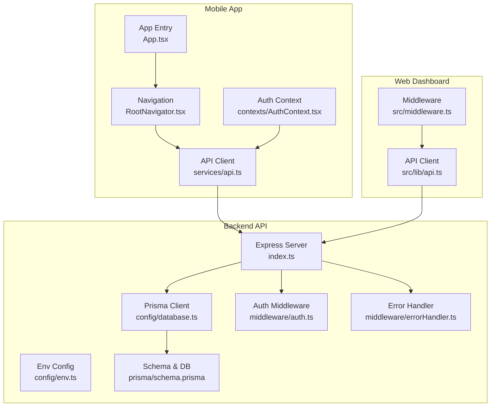
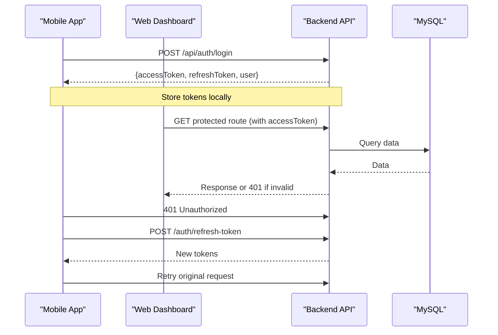
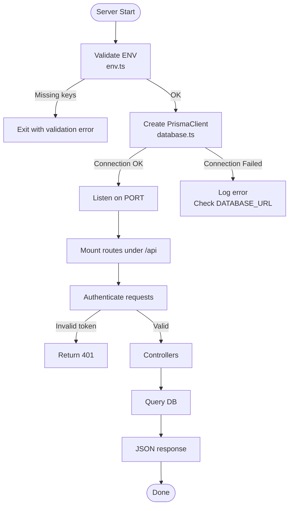
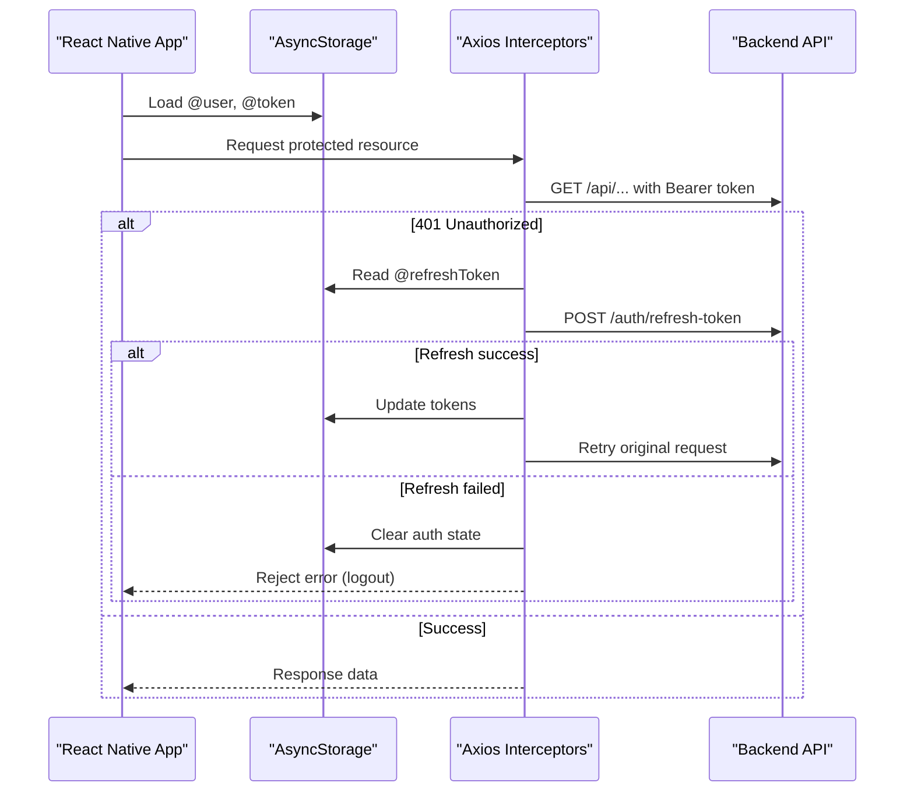
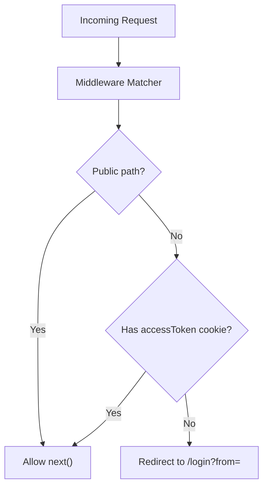
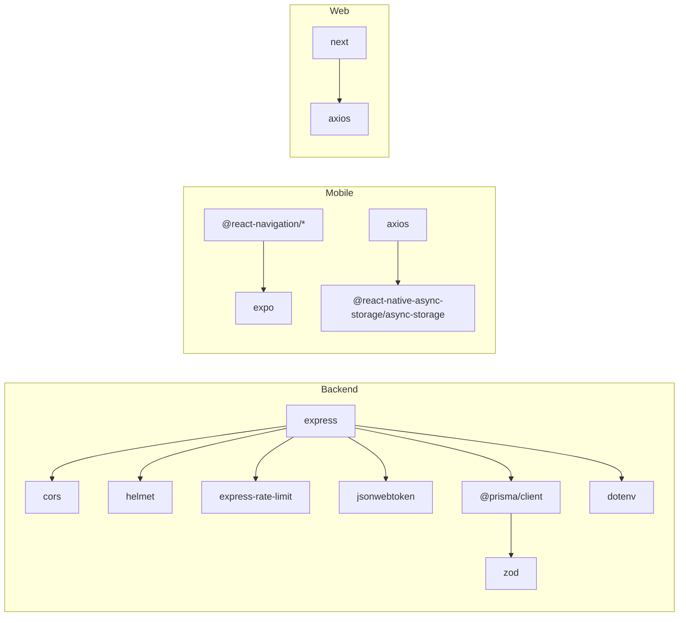

# Troubleshooting Guide

<cite>
**Referenced Files in This Document**
- [README.md](file://README.md)
- [backend-api/src/index.ts](file://backend-api/src/index.ts)
- [backend-api/src/config/env.ts](file://backend-api/src/config/env.ts)
- [backend-api/src/config/database.ts](file://backend-api/src/config/database.ts)
- [backend-api/prisma/schema.prisma](file://backend-api/prisma/schema.prisma)
- [backend-api/package.json](file://backend-api/package.json)
- [backend-api/src/middleware/auth.ts](file://backend-api/src/middleware/auth.ts)
- [backend-api/src/middleware/errorHandler.ts](file://backend-api/src/middleware/errorHandler.ts)
- [mobile-app/App.tsx](file://mobile-app/App.tsx)
- [mobile-app/src/navigation/RootNavigator.tsx](file://mobile-app/src/navigation/RootNavigator.tsx)
- [mobile-app/src/services/api.ts](file://mobile-app/src/services/api.ts)
- [mobile-app/src/contexts/AuthContext.tsx](file://mobile-app/src/contexts/AuthContext.tsx)
- [mobile-app/package.json](file://mobile-app/package.json)
- [web-dashboard/src/middleware.ts](file://web-dashboard/src/middleware.ts)
- [web-dashboard/src/lib/api.ts](file://web-dashboard/src/lib/api.ts)
</cite>

## Table of Contents
1. Introduction
2. Project Structure
3. Core Components
4. Architecture Overview
5. Detailed Component Analysis
6. Dependency Analysis
7. Performance Considerations
8. Troubleshooting Guide
9. Conclusion
10. Appendices

## Introduction
This guide provides comprehensive troubleshooting for SafeProtect Cameroon across all components: backend API, mobile app (Expo), and web dashboard (Next.js). It focuses on diagnosing database connectivity issues, authentication problems, middleware errors, performance bottlenecks, navigation issues, API connectivity problems, environment configuration errors, dependency conflicts, and deployment-related issues. Each section includes step-by-step resolution procedures, log analysis tips, and preventive measures.

## Project Structure
SafeProtect Cameroon consists of three main applications:
- Backend API: Express + Prisma + TypeScript
- Mobile App: React Native + Expo
- Web Dashboard: Next.js 14

**Diagram sources**
- [backend-api/src/index.ts:1-34](file://backend-api/src/index.ts#L1-L34)
- [backend-api/src/config/env.ts:1-14](file://backend-api/src/config/env.ts#L1-L14)
- [backend-api/src/config/database.ts:1-6](file://backend-api/src/config/database.ts#L1-L6)
- [backend-api/src/middleware/auth.ts:1-20](file://backend-api/src/middleware/auth.ts#L1-L20)
- [backend-api/src/middleware/errorHandler.ts:1-9](file://backend-api/src/middleware/errorHandler.ts#L1-L9)
- [backend-api/prisma/schema.prisma:1-208](file://backend-api/prisma/schema.prisma#L1-L208)
- [mobile-app/App.tsx:1-18](file://mobile-app/App.tsx#L1-L18)
- [mobile-app/src/navigation/RootNavigator.tsx:1-59](file://mobile-app/src/navigation/RootNavigator.tsx#L1-L59)
- [mobile-app/src/services/api.ts:1-103](file://mobile-app/src/services/api.ts#L1-L103)
- [mobile-app/src/contexts/AuthContext.tsx:1-94](file://mobile-app/src/contexts/AuthContext.tsx#L1-L94)
- [web-dashboard/src/middleware.ts:1-39](file://web-dashboard/src/middleware.ts#L1-L39)
- [web-dashboard/src/lib/api.ts:1-78](file://web-dashboard/src/lib/api.ts#L1-L78)

**Section sources**
- [README.md:9-18](file://README.md#L9-L18)

## Core Components
- Backend API server initializes security headers, CORS, JSON parsing, rate limiting, static uploads, routes, and error handling. It reads environment variables and starts listening on a configured port.
- Environment validation ensures required keys exist before the server runs.
- Prisma client is created once and used by controllers to access MySQL.
- Authentication middleware validates Bearer tokens and attaches user context.
- Error handler centralizes error responses.
- Mobile app bootstraps providers and navigation based on auth state.
- Web dashboard middleware enforces login via cookies; API client handles token refresh and redirects.

**Section sources**
- [backend-api/src/index.ts:1-34](file://backend-api/src/index.ts#L1-L34)
- [backend-api/src/config/env.ts:1-14](file://backend-api/src/config/env.ts#L1-L14)
- [backend-api/src/config/database.ts:1-6](file://backend-api/src/config/database.ts#L1-L6)
- [backend-api/src/middleware/auth.ts:1-20](file://backend-api/src/middleware/auth.ts#L1-L20)
- [backend-api/src/middleware/errorHandler.ts:1-9](file://backend-api/src/middleware/errorHandler.ts#L1-L9)
- [mobile-app/App.tsx:1-18](file://mobile-app/App.tsx#L1-L18)
- [mobile-app/src/navigation/RootNavigator.tsx:1-59](file://mobile-app/src/navigation/RootNavigator.tsx#L1-L59)
- [web-dashboard/src/middleware.ts:1-39](file://web-dashboard/src/middleware.ts#L1-L39)

## Architecture Overview
The system follows a client-server model with JWT-based authentication and role-aware routing.

**Diagram sources**
- [mobile-app/src/services/api.ts:27-100](file://mobile-app/src/services/api.ts#L27-L100)
- [web-dashboard/src/lib/api.ts:19-75](file://web-dashboard/src/lib/api.ts#L19-L75)
- [backend-api/src/middleware/auth.ts:5-19](file://backend-api/src/middleware/auth.ts#L5-L19)

## Detailed Component Analysis

### Backend API Troubleshooting
Common issues:
- Database connection failures
- Missing or invalid environment variables
- Authentication failures (missing/invalid Bearer token)
- Middleware errors and unhandled exceptions
- Rate limiting and performance bottlenecks

Resolution steps:
- Verify DATABASE_URL and other env vars are present and valid. The server validates required keys at startup.
- Ensure MySQL is running and reachable from the container or host. Confirm Prisma schema provider matches your database.
- Check that Prisma client is generated and migrations are applied before starting the server.
- For 401 errors, ensure requests include Authorization: Bearer <token>.
- Inspect global error handler logs for stack traces and status codes.
- If requests are blocked, review rate limiter settings and adjust thresholds if necessary.

**Diagram sources**
- [backend-api/src/config/env.ts:1-14](file://backend-api/src/config/env.ts#L1-L14)
- [backend-api/src/config/database.ts:1-6](file://backend-api/src/config/database.ts#L1-L6)
- [backend-api/src/index.ts:1-34](file://backend-api/src/index.ts#L1-L34)
- [backend-api/src/middleware/auth.ts:5-19](file://backend-api/src/middleware/auth.ts#L5-L19)

**Section sources**
- [backend-api/src/config/env.ts:1-14](file://backend-api/src/config/env.ts#L1-L14)
- [backend-api/src/config/database.ts:1-6](file://backend-api/src/config/database.ts#L1-L6)
- [backend-api/src/middleware/auth.ts:1-20](file://backend-api/src/middleware/auth.ts#L1-L20)
- [backend-api/src/middleware/errorHandler.ts:1-9](file://backend-api/src/middleware/errorHandler.ts#L1-L9)
- [backend-api/src/index.ts:1-34](file://backend-api/src/index.ts#L1-L34)
- [backend-api/prisma/schema.prisma:1-208](file://backend-api/prisma/schema.prisma#L1-L208)
- [backend-api/package.json:1-40](file://backend-api/package.json#L1-L40)

### Mobile App Troubleshooting
Common issues:
- Navigation not rendering or stuck on loading
- API connectivity errors (wrong base URL, CORS, network)
- Token refresh loops or forced logout
- Device-specific issues (Android emulator vs physical device)
- Expo development server problems

Resolution steps:
- Confirm EXPO_PUBLIC_API_URL points to the correct backend address for your environment (emulator uses a host IP; physical devices use LAN IP).
- Ensure AsyncStorage contains @token and @refreshToken after login.
- If you see repeated 401s, verify the refresh endpoint is reachable and tokens are valid.
- Check that react-native-gesture-handler is imported at the top of the app entry to avoid navigation crashes.
- For Expo issues, clear cache and restart the dev server; verify QR code scanning works on the device.

**Diagram sources**
- [mobile-app/src/services/api.ts:27-100](file://mobile-app/src/services/api.ts#L27-L100)
- [mobile-app/src/contexts/AuthContext.tsx:22-76](file://mobile-app/src/contexts/AuthContext.tsx#L22-L76)

**Section sources**
- [mobile-app/App.tsx:1-18](file://mobile-app/App.tsx#L1-L18)
- [mobile-app/src/navigation/RootNavigator.tsx:1-59](file://mobile-app/src/navigation/RootNavigator.tsx#L1-L59)
- [mobile-app/src/services/api.ts:1-103](file://mobile-app/src/services/api.ts#L1-L103)
- [mobile-app/src/contexts/AuthContext.tsx:1-94](file://mobile-app/src/contexts/AuthContext.tsx#L1-L94)
- [mobile-app/package.json:1-45](file://mobile-app/package.json#L1-L45)

### Web Dashboard Troubleshooting
Common issues:
- Redirect loops to login
- Middleware blocking legitimate requests
- Browser compatibility or cookie issues
- API connectivity and token refresh failures

Resolution steps:
- Ensure NEXT_PUBLIC_API_URL is set correctly in .env.local.
- Verify the browser has cookies enabled; the middleware checks an accessToken cookie.
- If redirected repeatedly, confirm the login flow sets the accessToken cookie and that the middleware matcher excludes static assets and API proxy paths.
- Use browser DevTools Network tab to inspect 401 flows and refresh attempts.

**Diagram sources**
- [web-dashboard/src/middleware.ts:1-39](file://web-dashboard/src/middleware.ts#L1-L39)

**Section sources**
- [web-dashboard/src/middleware.ts:1-39](file://web-dashboard/src/middleware.ts#L1-L39)
- [web-dashboard/src/lib/api.ts:1-78](file://web-dashboard/src/lib/api.ts#L1-L78)

## Dependency Analysis
Key runtime dependencies and their roles:
- Backend: express, cors, helmet, express-rate-limit, jsonwebtoken, prisma/client, zod, dotenv
- Mobile: expo, react-navigation, axios, async-storage, native modules (camera, location, maps)
- Web: Next.js, axios, Tailwind CSS

Potential conflicts:
- Node version mismatch between environments
- Prisma client generation against wrong DATABASE_URL
- Expo SDK and native module versions requiring specific iOS/Android toolchains

**Diagram sources**
- [backend-api/package.json:1-40](file://backend-api/package.json#L1-L40)
- [mobile-app/package.json:1-45](file://mobile-app/package.json#L1-L45)

**Section sources**
- [backend-api/package.json:1-40](file://backend-api/package.json#L1-L40)
- [mobile-app/package.json:1-45](file://mobile-app/package.json#L1-L45)

## Performance Considerations
- Rate limiting protects the API but can cause 429 errors under heavy load. Adjust windowMs and max values if needed.
- Avoid excessive synchronous operations in controllers; prefer async patterns and proper indexing in MySQL.
- Minimize payload sizes and paginate large datasets where applicable.
- Use caching strategies at the application layer for read-heavy endpoints.
- Monitor database query performance and add indexes for frequently filtered columns.

[No sources needed since this section provides general guidance]

## Troubleshooting Guide

### Backend API

#### Database Connection Issues
Symptoms:
- Server fails to start or throws connection errors
- Controllers fail with database timeouts or connection refused

Diagnostic steps:
- Validate DATABASE_URL in environment variables.
- Ensure MySQL service is running and accessible from the backend process.
- Confirm Prisma client is generated and migrations are applied.
- Check schema provider matches your database type.

Preventive measures:
- Centralize environment validation at startup.
- Use health checks for database connectivity during deployment.

**Section sources**
- [backend-api/src/config/env.ts:1-14](file://backend-api/src/config/env.ts#L1-L14)
- [backend-api/src/config/database.ts:1-6](file://backend-api/src/config/database.ts#L1-L6)
- [backend-api/prisma/schema.prisma:1-208](file://backend-api/prisma/schema.prisma#L1-L208)

#### Authentication Problems
Symptoms:
- 401 Unauthorized responses
- Repeated logout or redirect loops

Diagnostic steps:
- Verify Authorization header format: Bearer <token>.
- Confirm token validity and expiration.
- Ensure refresh token flow is working and tokens are stored correctly.

Preventive measures:
- Implement consistent token storage and retrieval across clients.
- Add explicit error messages for missing or malformed tokens.

**Section sources**
- [backend-api/src/middleware/auth.ts:1-20](file://backend-api/src/middleware/auth.ts#L1-L20)
- [mobile-app/src/services/api.ts:27-100](file://mobile-app/src/services/api.ts#L27-L100)
- [web-dashboard/src/lib/api.ts:19-75](file://web-dashboard/src/lib/api.ts#L19-L75)

#### Middleware Errors
Symptoms:
- Unhandled exceptions or generic error responses
- Requests failing before reaching controllers

Diagnostic steps:
- Inspect global error handler logs for stack traces and status codes.
- Validate input payloads using validation middleware to catch early errors.

Preventive measures:
- Wrap controller logic in try/catch blocks and throw structured errors.
- Standardize error responses across endpoints.

**Section sources**
- [backend-api/src/middleware/errorHandler.ts:1-9](file://backend-api/src/middleware/errorHandler.ts#L1-L9)

#### Performance Bottlenecks
Symptoms:
- Slow responses or high CPU usage
- Frequent rate limit hits

Diagnostic steps:
- Review rate limiter configuration and adjust thresholds if necessary.
- Profile database queries and optimize indexes.
- Reduce payload sizes and implement pagination.

Preventive measures:
- Set appropriate rate limits per route sensitivity.
- Cache frequent reads and batch operations where possible.

**Section sources**
- [backend-api/src/index.ts:17-21](file://backend-api/src/index.ts#L17-L21)

### Mobile App

#### Navigation Issues
Symptoms:
- App stuck on loading screen
- Navigation crashes or tabs not rendering

Diagnostic steps:
- Ensure react-native-gesture-handler is imported at the app entry.
- Verify RootNavigator renders based on auth state and user role.
- Check for missing screens or incorrect route names.

Preventive measures:
- Guard navigation with loading states and error boundaries.
- Keep route definitions centralized and validated.

**Section sources**
- [mobile-app/App.tsx:1-18](file://mobile-app/App.tsx#L1-L18)
- [mobile-app/src/navigation/RootNavigator.tsx:1-59](file://mobile-app/src/navigation/RootNavigator.tsx#L1-L59)

#### API Connectivity Problems
Symptoms:
- Network errors or CORS failures
- Wrong base URL causing 404s

Diagnostic steps:
- Confirm EXPO_PUBLIC_API_URL is set correctly for your environment.
- Test connectivity from the device/emulator to the backend.
- Check CORS settings on the backend if cross-origin requests fail.

Preventive measures:
- Centralize API base URL configuration and validate at runtime.
- Provide fallback URLs for different environments.

**Section sources**
- [mobile-app/src/services/api.ts:1-16](file://mobile-app/src/services/api.ts#L1-L16)
- [README.md:106-113](file://README.md#L106-L113)

#### Device-Specific Issues
Symptoms:
- Emulator cannot reach localhost
- Physical device shows network errors

Diagnostic steps:
- Use Android emulator host IP (e.g., 10.0.2.2) instead of localhost.
- For physical devices, use your computer’s LAN IP.
- Ensure firewall allows inbound connections on the backend port.

Preventive measures:
- Document environment-specific URLs clearly.
- Provide quick setup instructions for common devices.

**Section sources**
- [README.md:106-113](file://README.md#L106-L113)

#### Expo Development Server Problems
Symptoms:
- QR code not scanning
- Metro bundler errors

Diagnostic steps:
- Clear Expo cache and restart the dev server.
- Verify Node and Expo versions match project requirements.
- Check for port conflicts and kill processes using the same port.

Preventive measures:
- Pin Node and Expo versions in project scripts.
- Use lockfiles to prevent dependency drift.

**Section sources**
- [mobile-app/package.json:1-45](file://mobile-app/package.json#L1-L45)

### Web Dashboard

#### Routing Issues
Symptoms:
- Pages not found or redirect loops
- Protected pages redirecting to login unexpectedly

Diagnostic steps:
- Verify NEXT_PUBLIC_API_URL and cookie settings.
- Check middleware matcher to ensure it does not block static assets or API proxies.
- Confirm login sets accessToken cookie and subsequent requests include it.

Preventive measures:
- Centralize public paths and protect sensitive routes consistently.
- Log redirect reasons for easier debugging.

**Section sources**
- [web-dashboard/src/middleware.ts:1-39](file://web-dashboard/src/middleware.ts#L1-L39)

#### Authentication Middleware Problems
Symptoms:
- Immediate redirects to login
- Inconsistent session persistence

Diagnostic steps:
- Ensure cookies are enabled in the browser.
- Validate that login flow writes accessToken cookie and that middleware reads it.
- Inspect Network tab for failed refresh attempts.

Preventive measures:
- Implement robust token refresh with deduplication and safe retries.
- Provide user feedback when sessions expire.

**Section sources**
- [web-dashboard/src/lib/api.ts:19-75](file://web-dashboard/src/lib/api.ts#L19-L75)

#### Browser Compatibility Issues
Symptoms:
- Features not working in certain browsers
- Cookies or localStorage not available

Diagnostic checks:
- Confirm modern browser support for APIs used (localStorage, fetch/axios).
- Test across major browsers and update polyfills if necessary.

Preventive measures:
- Feature detection and graceful degradation for unsupported environments.
- Document supported browser versions.

[No sources needed since this section provides general guidance]

### Debugging Techniques and Log Analysis
- Backend:
  - Inspect console logs for error stacks and status codes from the error handler.
  - Validate environment variables at startup to catch misconfiguration early.
- Mobile:
  - Use React Native Debugger or Flipper to inspect AsyncStorage contents and network calls.
  - Verify token presence and refresh flow in the API interceptors.
- Web:
  - Use browser DevTools Network and Application tabs to inspect cookies and API responses.
  - Check middleware matcher and redirect behavior.

[No sources needed since this section provides general guidance]

### Error Message Interpretation
- 401 Unauthorized: Missing or invalid Bearer token; check Authorization header and token validity.
- 404 Not Found: Incorrect route or base URL; verify API endpoints and environment configuration.
- 5xx Internal Server Error: Server-side exception; inspect error handler logs and stack traces.
- Rate Limit Exceeded: Too many requests; adjust rate limiter or reduce request frequency.

[No sources needed since this section provides general guidance]

### Step-by-Step Resolution Guides

#### Database Connection Failure
1. Validate DATABASE_URL in environment variables.
2. Ensure MySQL is running and reachable.
3. Generate Prisma client and apply migrations.
4. Restart the backend and test a simple query.

**Section sources**
- [backend-api/src/config/env.ts:1-14](file://backend-api/src/config/env.ts#L1-L14)
- [backend-api/src/config/database.ts:1-6](file://backend-api/src/config/database.ts#L1-L6)
- [backend-api/prisma/schema.prisma:1-208](file://backend-api/prisma/schema.prisma#L1-L208)

#### Authentication Loop or Forced Logout
1. Confirm tokens are stored after login.
2. Verify refresh endpoint is reachable and returns new tokens.
3. Check interceptor retry logic and ensure no infinite loops.
4. Clear stale tokens if refresh fails and force re-login.

**Section sources**
- [mobile-app/src/services/api.ts:27-100](file://mobile-app/src/services/api.ts#L27-L100)
- [web-dashboard/src/lib/api.ts:19-75](file://web-dashboard/src/lib/api.ts#L19-L75)

#### Navigation Stuck on Loading
1. Ensure auth context loads stored session correctly.
2. Verify RootNavigator renders based on user state.
3. Check for missing dependencies or imports.
4. Clear app cache and reinstall if necessary.

**Section sources**
- [mobile-app/src/contexts/AuthContext.tsx:22-76](file://mobile-app/src/contexts/AuthContext.tsx#L22-L76)
- [mobile-app/src/navigation/RootNavigator.tsx:1-59](file://mobile-app/src/navigation/RootNavigator.tsx#L1-L59)

#### Expo Dev Server Issues
1. Clear cache and restart the server.
2. Verify Node and Expo versions.
3. Check for port conflicts and kill conflicting processes.
4. Scan QR code with Expo Go on the device.

**Section sources**
- [mobile-app/package.json:1-45](file://mobile-app/package.json#L1-L45)

### Environment Configuration Problems
- Backend: Ensure all required env keys exist; server will fail fast if missing.
- Mobile: Set EXPO_PUBLIC_API_URL appropriately for emulator vs physical device.
- Web: Set NEXT_PUBLIC_API_URL in .env.local; ensure cookies are allowed.

**Section sources**
- [backend-api/src/config/env.ts:1-14](file://backend-api/src/config/env.ts#L1-L14)
- [README.md:106-113](file://README.md#L106-L113)

### Dependency Conflicts
- Pin Node and package versions to avoid drift.
- Regenerate Prisma client after schema changes.
- Use lockfiles and consistent CI environments.

**Section sources**
- [backend-api/package.json:1-40](file://backend-api/package.json#L1-L40)
- [mobile-app/package.json:1-45](file://mobile-app/package.json#L1-L45)

### Deployment-Related Issues
- Ensure environment variables are set in production.
- Verify database connectivity from the deployment environment.
- Configure CORS and rate limits appropriately for production traffic.
- Monitor logs and set up alerting for critical errors.

[No sources needed since this section provides general guidance]

## Conclusion
This guide consolidates diagnostic steps and resolutions for SafeProtect Cameroon across backend, mobile, and web layers. By validating environment configuration, ensuring robust authentication flows, monitoring middleware behavior, and optimizing performance, teams can quickly identify and resolve common issues. Adopting preventive measures such as strict environment validation, centralized logging, and consistent token management will reduce downtime and improve reliability.

[No sources needed since this section summarizes without analyzing specific files]

## Appendices

### Quick Reference: Key Files and Responsibilities
- Backend server entry and middleware: [backend-api/src/index.ts](file://backend-api/src/index.ts)
- Environment validation: [backend-api/src/config/env.ts](file://backend-api/src/config/env.ts)
- Database client: [backend-api/src/config/database.ts](file://backend-api/src/config/database.ts)
- Schema and models: [backend-api/prisma/schema.prisma](file://backend-api/prisma/schema.prisma)
- Auth middleware: [backend-api/src/middleware/auth.ts](file://backend-api/src/middleware/auth.ts)
- Error handler: [backend-api/src/middleware/errorHandler.ts](file://backend-api/src/middleware/errorHandler.ts)
- Mobile app entry and navigation: [mobile-app/App.tsx](file://mobile-app/App.tsx), [mobile-app/src/navigation/RootNavigator.tsx](file://mobile-app/src/navigation/RootNavigator.tsx)
- Mobile API client and auth context: [mobile-app/src/services/api.ts](file://mobile-app/src/services/api.ts), [mobile-app/src/contexts/AuthContext.tsx](file://mobile-app/src/contexts/AuthContext.tsx)
- Web middleware and API client: [web-dashboard/src/middleware.ts](file://web-dashboard/src/middleware.ts), [web-dashboard/src/lib/api.ts](file://web-dashboard/src/lib/api.ts)

[No sources needed since this section lists references already cited above]