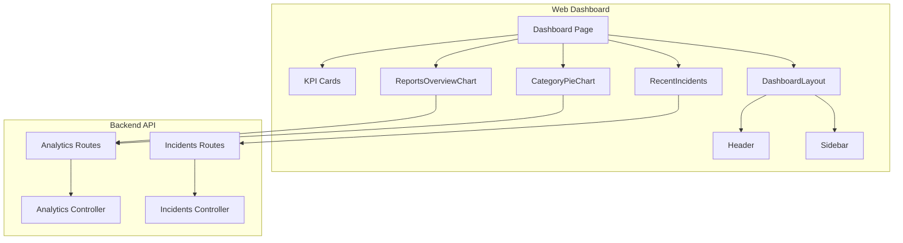
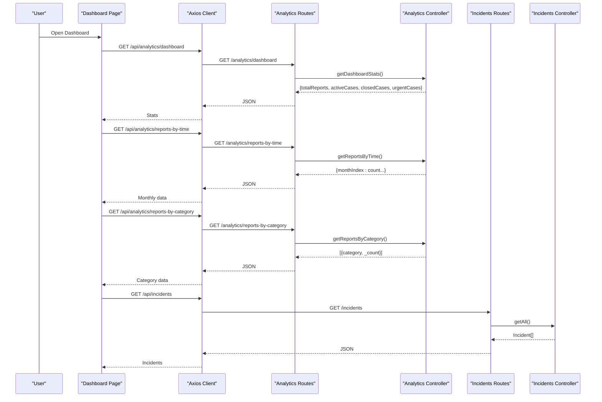
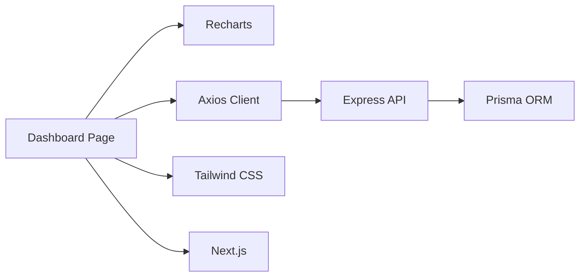

# Dashboard Overview & Analytics

<cite>
**Referenced Files in This Document**
- [page.tsx](file://web-dashboard/src/app/(dashboard)/dashboard/page.tsx)
- [ReportsOverviewChart.tsx](file://web-dashboard/src/components/charts/ReportsOverviewChart.tsx)
- [CategoryPieChart.tsx](file://web-dashboard/src/components/charts/CategoryPieChart.tsx)
- [RecentIncidents.tsx](file://web-dashboard/src/components/dashboard/RecentIncidents.tsx)
- [api.ts](file://web-dashboard/src/lib/api.ts)
- [analytics.controller.ts](file://backend-api/src/controllers/analytics.controller.ts)
- [analytics.routes.ts](file://backend-api/src/routes/analytics.routes.ts)
- [incidents.controller.ts](file://backend-api/src/controllers/incidents.controller.ts)
- [incidents.routes.ts](file://backend-api/src/routes/incidents.routes.ts)
- [DashboardLayout.tsx](file://web-dashboard/src/components/layout/DashboardLayout.tsx)
- [Header.tsx](file://web-dashboard/src/components/layout/Header.tsx)
- [Sidebar.tsx](file://web-dashboard/src/components/layout/Sidebar.tsx)
- [index.ts](file://web-dashboard/src/types/index.ts)
- [package.json](file://web-dashboard/package.json)
</cite>

## Table of Contents
1. [Introduction](#introduction)
2. [Project Structure](#project-structure)
3. [Core Components](#core-components)
4. [Architecture Overview](#architecture-overview)
5. [Detailed Component Analysis](#detailed-component-analysis)
6. [Dependency Analysis](#dependency-analysis)
7. [Performance Considerations](#performance-considerations)
8. [Troubleshooting Guide](#troubleshooting-guide)
9. [Conclusion](#conclusion)
10. [Appendices](#appendices)

## Introduction
This document explains the dashboard overview and analytics system for the SafeProtect web application. It covers the dashboard layout, key performance indicators (KPIs), real-time statistics display, chart implementations using Recharts, data fetching patterns, API integration for analytics endpoints, state management for metrics, recent incidents feed, trend visualization, and export considerations. It also addresses responsive design, loading states, error handling, accessibility, customization options for charts, adding new metrics, and integrating additional data sources.

## Project Structure
The dashboard is implemented as a Next.js client-side page that composes reusable components:
- KPI cards for total reports, active cases, closed cases, and urgent cases
- A line chart for monthly report trends
- A donut/pie chart for category distribution
- A recent incidents table with status badges
- Layout shell with sidebar navigation and header

**Diagram sources**
- [page.tsx:1-156](file://web-dashboard/src/app/(dashboard)/dashboard/page.tsx#L1-L156)
- [ReportsOverviewChart.tsx:1-48](file://web-dashboard/src/components/charts/ReportsOverviewChart.tsx#L1-L48)
- [CategoryPieChart.tsx:1-67](file://web-dashboard/src/components/charts/CategoryPieChart.tsx#L1-L67)
- [RecentIncidents.tsx:1-103](file://web-dashboard/src/components/dashboard/RecentIncidents.tsx#L1-L103)
- [analytics.routes.ts:1-20](file://backend-api/src/routes/analytics.routes.ts#L1-L20)
- [analytics.controller.ts:1-59](file://backend-api/src/controllers/analytics.controller.ts#L1-L59)
- [incidents.routes.ts:1-23](file://backend-api/src/routes/incidents.routes.ts#L1-L23)
- [incidents.controller.ts:1-149](file://backend-api/src/controllers/incidents.controller.ts#L1-L149)
- [DashboardLayout.tsx:1-17](file://web-dashboard/src/components/layout/DashboardLayout.tsx#L1-L17)
- [Header.tsx:1-48](file://web-dashboard/src/components/layout/Header.tsx#L1-L48)
- [Sidebar.tsx:1-68](file://web-dashboard/src/components/layout/Sidebar.tsx#L1-L68)

**Section sources**
- [page.tsx:1-156](file://web-dashboard/src/app/(dashboard)/dashboard/page.tsx#L1-L156)
- [DashboardLayout.tsx:1-17](file://web-dashboard/src/components/layout/DashboardLayout.tsx#L1-L17)
- [Header.tsx:1-48](file://web-dashboard/src/components/layout/Header.tsx#L1-L48)
- [Sidebar.tsx:1-68](file://web-dashboard/src/components/layout/Sidebar.tsx#L1-L68)

## Core Components
- Dashboard Page: Renders KPI cards, charts, and recent incidents; fetches dashboard stats from the backend and handles loading/error states.
- ReportsOverviewChart: Displays monthly report counts as a line chart using Recharts.
- CategoryPieChart: Displays incident categories as a donut/pie chart with mapped labels and colors.
- RecentIncidents: Fetches and displays the latest incidents with formatted dates, statuses, and assigned worker names.
- API Client: Centralized Axios instance with token injection and automatic refresh-token flow on 401 responses.

Key responsibilities:
- Data fetching via REST endpoints under /api/analytics and /api/incidents
- State management using React hooks for loading and data
- Responsive layout using Tailwind CSS grid/flex utilities
- Error handling with fallback UI for empty or failed data loads

**Section sources**
- [page.tsx:11-41](file://web-dashboard/src/app/(dashboard)/dashboard/page.tsx#L11-L41)
- [ReportsOverviewChart.tsx:8-25](file://web-dashboard/src/components/charts/ReportsOverviewChart.tsx#L8-L25)
- [CategoryPieChart.tsx:24-41](file://web-dashboard/src/components/charts/CategoryPieChart.tsx#L24-L41)
- [RecentIncidents.tsx:26-50](file://web-dashboard/src/components/dashboard/RecentIncidents.tsx#L26-L50)
- [api.ts:1-78](file://web-dashboard/src/lib/api.ts#L1-L78)

## Architecture Overview
The dashboard follows a client-server architecture:
- The Next.js dashboard page requests analytics and incidents data from the backend Express API.
- The backend uses Prisma to query database models (Incident, Case) and returns aggregated results.
- Authentication and authorization are enforced by middleware on routes.

**Diagram sources**
- [page.tsx:21-41](file://web-dashboard/src/app/(dashboard)/dashboard/page.tsx#L21-L41)
- [ReportsOverviewChart.tsx:11-25](file://web-dashboard/src/components/charts/ReportsOverviewChart.tsx#L11-L25)
- [CategoryPieChart.tsx:27-41](file://web-dashboard/src/components/charts/CategoryPieChart.tsx#L27-L41)
- [RecentIncidents.tsx:30-50](file://web-dashboard/src/components/dashboard/RecentIncidents.tsx#L30-L50)
- [analytics.routes.ts:9-17](file://backend-api/src/routes/analytics.routes.ts#L9-L17)
- [analytics.controller.ts:4-59](file://backend-api/src/controllers/analytics.controller.ts#L4-L59)
- [incidents.routes.ts:10-16](file://backend-api/src/routes/incidents.routes.ts#L10-L16)
- [incidents.controller.ts:75-86](file://backend-api/src/controllers/incidents.controller.ts#L75-L86)

## Detailed Component Analysis

### Dashboard Page
- Loads authentication token from local storage and redirects if missing.
- Fetches dashboard stats from /api/analytics/dashboard and updates KPI state.
- Renders a responsive grid of KPI cards with icons and trend badges.
- Embeds ReportsOverviewChart and CategoryPieChart within card containers.
- Includes a link to view all incidents.

Responsibilities:
- State: stats object with totalReports, activeCases, closedCases, urgentCases; loading flag
- Effects: fetch stats once on mount
- UI: Tailwind grid for responsiveness across breakpoints

**Section sources**
- [page.tsx:11-41](file://web-dashboard/src/app/(dashboard)/dashboard/page.tsx#L11-L41)
- [page.tsx:43-153](file://web-dashboard/src/app/(dashboard)/dashboard/page.tsx#L43-L153)

### ReportsOverviewChart
- Fetches monthly report counts from /api/analytics/reports-by-time.
- Maps month indices to readable names and renders a Recharts LineChart inside a responsive container.
- Handles errors by showing an empty dataset placeholder.

Customization points:
- Colors, stroke width, dot radius, and axis visibility can be adjusted in the Line component and axes.
- Tooltip formatting can be customized via the Tooltip component props.

**Section sources**
- [ReportsOverviewChart.tsx:8-47](file://web-dashboard/src/components/charts/ReportsOverviewChart.tsx#L8-L47)

### CategoryPieChart
- Fetches incident category counts from /api/analytics/reports-by-category.
- Maps raw categories to friendly labels and assigns consistent colors.
- Renders a donut-style pie chart with legend and tooltip.

Customization points:
- innerRadius and outerRadius define the donut shape.
- CATEGORY_COLORS and CATEGORY_LABELS can be extended for new categories.

**Section sources**
- [CategoryPieChart.tsx:6-66](file://web-dashboard/src/components/charts/CategoryPieChart.tsx#L6-L66)

### RecentIncidents
- Fetches incidents from /api/incidents and limits to the most recent entries.
- Formats date strings and maps backend status values to user-friendly labels.
- Displays a table with ID, type, location, date, status badge, assigned worker, and actions menu.

Accessibility and UX:
- Uses semantic table elements for screen readers.
- Provides clear status badges with contrasting colors.
- Shows loading and empty states.

**Section sources**
- [RecentIncidents.tsx:8-103](file://web-dashboard/src/components/dashboard/RecentIncidents.tsx#L8-L103)

### API Integration and Auth Flow
- Axios instance sets base URL and attaches Authorization Bearer token from localStorage.
- Interceptor automatically refreshes tokens on 401 responses using /auth/refresh-token and retries the original request.
- If refresh fails, clears session and redirects to login.

Security considerations:
- Token stored in localStorage; ensure HTTPS in production.
- Route-level authorization protects sensitive analytics endpoints.

**Section sources**
- [api.ts:1-78](file://web-dashboard/src/lib/api.ts#L1-L78)
- [analytics.routes.ts:9-17](file://backend-api/src/routes/analytics.routes.ts#L9-L17)

### Backend Analytics Endpoints
- /api/analytics/dashboard: Returns KPIs by counting incidents and cases with filters.
- /api/analytics/reports-by-time: Groups incidents by creation month index.
- /api/analytics/reports-by-category: Groups incidents by category with counts.
- /api/analytics/cases-by-status: Groups cases by status with counts.

Authorization:
- All analytics routes require authentication.
- Detailed analytics restricted to ADMIN and SOCIAL_WORKER roles.

**Section sources**
- [analytics.controller.ts:4-59](file://backend-api/src/controllers/analytics.controller.ts#L4-L59)
- [analytics.routes.ts:9-17](file://backend-api/src/routes/analytics.routes.ts#L9-L17)

### Backend Incidents Endpoint
- /api/incidents: Lists incidents with related case and worker information, ordered by creation date.
- Protected by authentication and role-based authorization for read operations.

**Section sources**
- [incidents.controller.ts:75-86](file://backend-api/src/controllers/incidents.controller.ts#L75-L86)
- [incidents.routes.ts:10-16](file://backend-api/src/routes/incidents.routes.ts#L10-L16)

## Dependency Analysis
The dashboard depends on:
- Recharts for visualizations
- Axios for HTTP requests
- Tailwind CSS for styling
- Next.js routing and client components

**Diagram sources**
- [package.json:11-28](file://web-dashboard/package.json#L11-L28)
- [api.ts:1-78](file://web-dashboard/src/lib/api.ts#L1-L78)
- [analytics.controller.ts:1-59](file://backend-api/src/controllers/analytics.controller.ts#L1-L59)

**Section sources**
- [package.json:11-28](file://web-dashboard/package.json#L11-L28)
- [api.ts:1-78](file://web-dashboard/src/lib/api.ts#L1-L78)

## Performance Considerations
- Chart data fetching occurs on component mount; consider caching strategies like SWR or React Query for repeated requests.
- Debounce or throttle any interactive filters added later to reduce network calls.
- Use server-side aggregation where possible (already done in controllers) to minimize client processing.
- Keep chart datasets small; paginate or aggregate further if needed.
- Ensure images and assets are optimized; avoid heavy dependencies.

[No sources needed since this section provides general guidance]

## Troubleshooting Guide
Common issues and resolutions:
- 401 Unauthorized: Ensure valid token exists in localStorage; the interceptor will attempt refresh. If refresh fails, user is redirected to login.
- Empty charts: Verify backend endpoints return expected payloads; check network tab for errors.
- Incorrect category labels: Confirm mapping keys match backend category values.
- Missing incidents: Check authorization roles; some endpoints require ADMIN or SOCIAL_WORKER.

Error handling locations:
- Dashboard page catches fetch errors and logs them while still setting loading to false.
- Charts catch errors and render fallback placeholders.
- Recent incidents logs errors and shows a loading message until resolved.

**Section sources**
- [page.tsx:29-41](file://web-dashboard/src/app/(dashboard)/dashboard/page.tsx#L29-L41)
- [ReportsOverviewChart.tsx:11-25](file://web-dashboard/src/components/charts/ReportsOverviewChart.tsx#L11-L25)
- [CategoryPieChart.tsx:27-41](file://web-dashboard/src/components/charts/CategoryPieChart.tsx#L27-L41)
- [RecentIncidents.tsx:30-50](file://web-dashboard/src/components/dashboard/RecentIncidents.tsx#L30-L50)
- [api.ts:29-75](file://web-dashboard/src/lib/api.ts#L29-L75)

## Conclusion
The dashboard provides a clear, responsive overview of child protection and GBV case metrics with actionable insights through charts and recent incidents. It integrates securely with a role-protected backend API, manages state efficiently, and offers extensibility for adding new metrics and customizing visualizations.

[No sources needed since this section summarizes without analyzing specific files]

## Appendices

### Customizing Chart Configurations
- ReportsOverviewChart: Adjust line color, stroke width, dot sizes, and axis visibility in the Line and Axis components. Customize tooltip content via Tooltip props.
- CategoryPieChart: Extend CATEGORY_COLORS and CATEGORY_LABELS for new categories. Modify innerRadius/outerRadius to change donut appearance. Update Legend and Tooltip formatter as needed.

**Section sources**
- [ReportsOverviewChart.tsx:27-47](file://web-dashboard/src/components/charts/ReportsOverviewChart.tsx#L27-L47)
- [CategoryPieChart.tsx:6-66](file://web-dashboard/src/components/charts/CategoryPieChart.tsx#L6-L66)

### Adding New Metrics
- Define a new backend endpoint in analytics.controller.ts to compute the metric using Prisma queries.
- Add a route in analytics.routes.ts with appropriate authorization.
- Create or update a KPI card in the dashboard page to display the new metric.
- Optionally add a chart component to visualize the metric over time or by category.

**Section sources**
- [analytics.controller.ts:4-59](file://backend-api/src/controllers/analytics.controller.ts#L4-L59)
- [analytics.routes.ts:9-17](file://backend-api/src/routes/analytics.routes.ts#L9-L17)
- [page.tsx:43-117](file://web-dashboard/src/app/(dashboard)/dashboard/page.tsx#L43-L117)

### Integrating Additional Data Sources
- For external APIs, create a service layer in the frontend to fetch and transform data before rendering.
- For backend integrations, add new controllers and routes following existing patterns, ensuring authentication and authorization are applied.
- Update types in index.ts to reflect new data structures used across components.

**Section sources**
- [index.ts:1-111](file://web-dashboard/src/types/index.ts#L1-L111)
- [analytics.routes.ts:9-17](file://backend-api/src/routes/analytics.routes.ts#L9-L17)

### Export Capabilities
- Current implementation does not include built-in export functionality. To add exports:
  - For tables: Implement CSV/Excel generation on the client or server side.
  - For charts: Use Recharts’ built-in export features or capture canvas/SVG and download as image.
  - For analytics: Provide filtered endpoints that return downloadable formats.

[No sources needed since this section proposes enhancements not present in current code]

### Responsive Design and Accessibility
- Responsive: Grid layouts adapt across md/lg breakpoints; charts use ResponsiveContainer for fluid sizing.
- Accessibility: Semantic HTML elements (table, headings), descriptive labels, and sufficient color contrast for status badges. Keyboard navigable links and buttons.

**Section sources**
- [page.tsx:43-153](file://web-dashboard/src/app/(dashboard)/dashboard/page.tsx#L43-L153)
- [RecentIncidents.tsx:70-101](file://web-dashboard/src/components/dashboard/RecentIncidents.tsx#L70-L101)