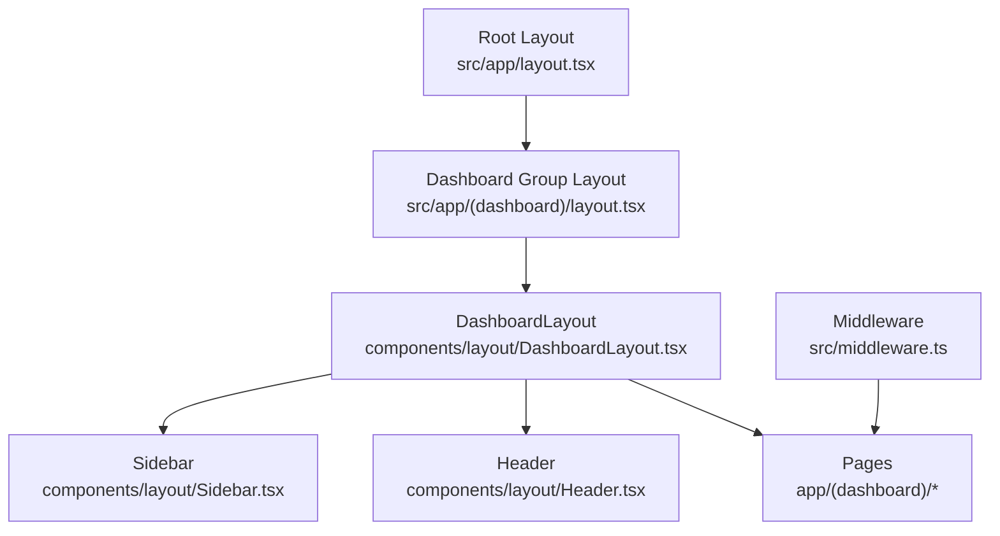
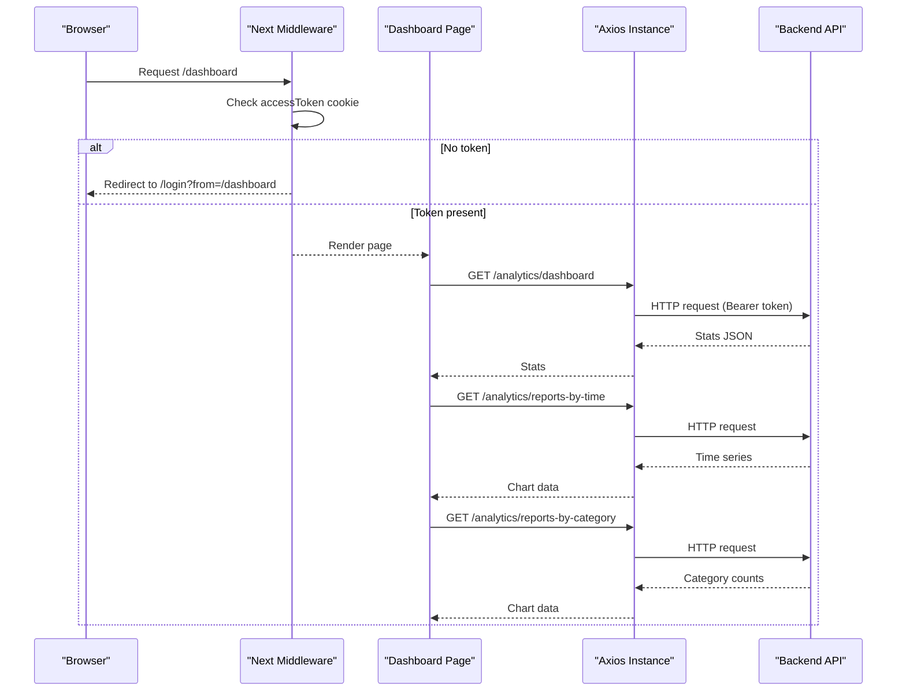
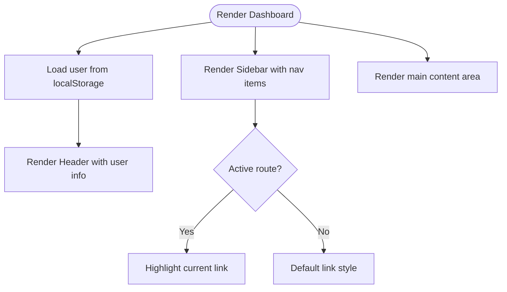
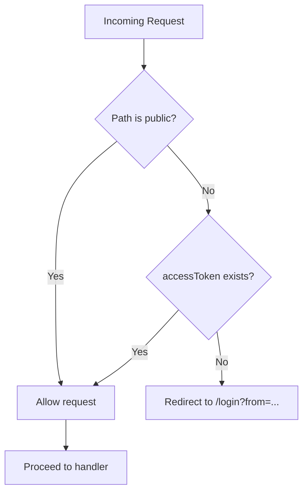
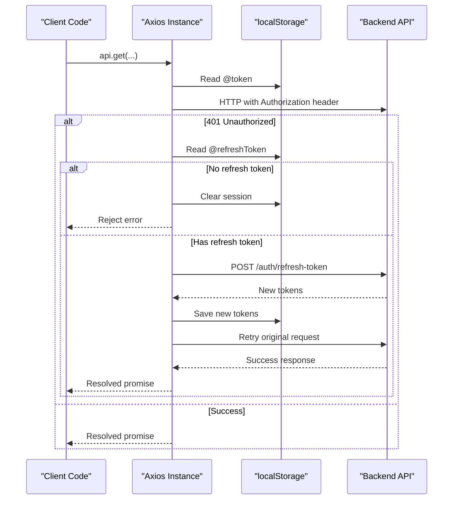
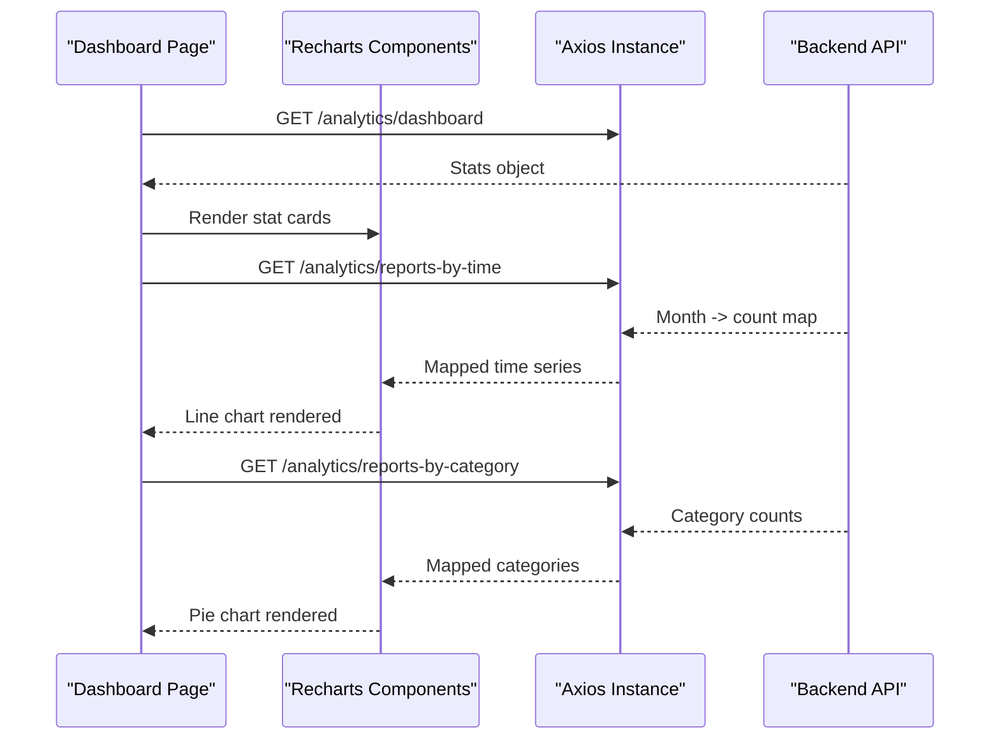
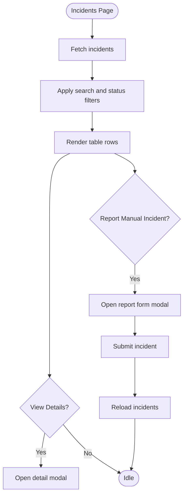
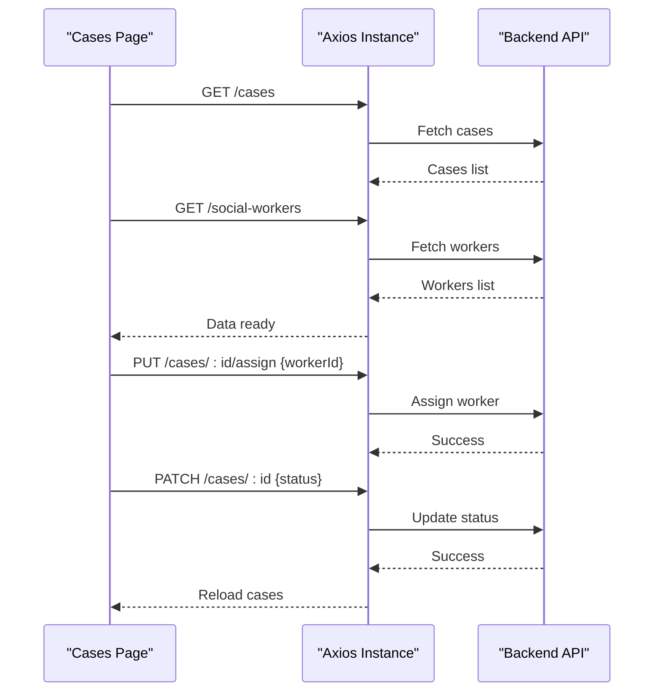
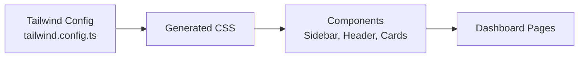
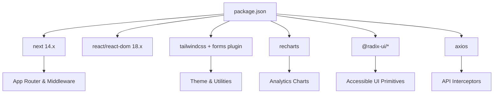

# Web Dashboard

<cite>
**Referenced Files in This Document**
- [layout.tsx](file://web-dashboard/src/app/layout.tsx)
- [layout.tsx](file://web-dashboard/src/app/(dashboard)/layout.tsx)
- [DashboardLayout.tsx](file://web-dashboard/src/components/layout/DashboardLayout.tsx)
- [Sidebar.tsx](file://web-dashboard/src/components/layout/Sidebar.tsx)
- [Header.tsx](file://web-dashboard/src/components/layout/Header.tsx)
- [middleware.ts](file://web-dashboard/src/middleware.ts)
- [api.ts](file://web-dashboard/src/lib/api.ts)
- [tailwind.config.ts](file://web-dashboard/src/tailwind.config.ts)
- [package.json](file://web-dashboard/package.json)
- [page.tsx](file://web-dashboard/src/app/(dashboard)/dashboard/page.tsx)
- [ReportsOverviewChart.tsx](file://web-dashboard/src/components/charts/ReportsOverviewChart.tsx)
- [CategoryPieChart.tsx](file://web-dashboard/src/components/charts/CategoryPieChart.tsx)
- [incidents/page.tsx](file://web-dashboard/src/app/(dashboard)/incidents/page.tsx)
- [cases/page.tsx](file://web-dashboard/src/app/(dashboard)/cases/page.tsx)
- [mock-data.ts](file://web-dashboard/src/lib/mock-data.ts)
</cite>

## Table of Contents
1. [Introduction](#introduction)
2. [Project Structure](#project-structure)
3. [Core Components](#core-components)
4. [Architecture Overview](#architecture-overview)
5. [Detailed Component Analysis](#detailed-component-analysis)
6. [Dependency Analysis](#dependency-analysis)
7. [Performance Considerations](#performance-considerations)
8. [Troubleshooting Guide](#troubleshooting-guide)
9. [Conclusion](#conclusion)
10. [Appendices](#appendices)

## Introduction
This document provides comprehensive documentation for the Next.js 14 web dashboard designed for administrators and organization managers. It covers the app router structure, server-side rendering approach, component architecture, dashboard layout with sidebar navigation and header, responsive design using Tailwind CSS, analytics and reporting features with Recharts, case management interface, user administration tools, organization management, communication oversight, authentication middleware, API integration, real-time data updates, styling system, component library usage, and accessibility considerations.

## Project Structure
The dashboard uses the Next.js App Router with a root layout and a protected dashboard group layout that wraps all admin pages. The layout composes a Sidebar and Header around a main content area. Authentication is enforced via middleware that checks for an access token cookie and redirects unauthenticated users to login.

**Diagram sources**
- [layout.tsx:1-20](file://web-dashboard/src/app/layout.tsx#L1-L20)
- [layout.tsx:1-6](file://web-dashboard/src/app/(dashboard)/layout.tsx#L1-L6)
- [DashboardLayout.tsx:1-17](file://web-dashboard/src/components/layout/DashboardLayout.tsx#L1-L17)
- [Sidebar.tsx:1-68](file://web-dashboard/src/components/layout/Sidebar.tsx#L1-L68)
- [Header.tsx:1-48](file://web-dashboard/src/components/layout/Header.tsx#L1-L48)
- [middleware.ts:1-39](file://web-dashboard/src/middleware.ts#L1-L39)

**Section sources**
- [layout.tsx:1-20](file://web-dashboard/src/app/layout.tsx#L1-L20)
- [layout.tsx:1-6](file://web-dashboard/src/app/(dashboard)/layout.tsx#L1-L6)
- [DashboardLayout.tsx:1-17](file://web-dashboard/src/components/layout/DashboardLayout.tsx#L1-L17)
- [middleware.ts:1-39](file://web-dashboard/src/middleware.ts#L1-L39)

## Core Components
- Root layout sets metadata and global HTML/body shell.
- Dashboard group layout injects the shared DashboardLayout wrapper for all protected routes.
- DashboardLayout arranges Sidebar, Header, and main content with responsive flex layout.
- Sidebar renders navigation links with active state based on current pathname and includes emergency contact actions.
- Header displays notifications and user profile info loaded from local storage.

Key responsibilities:
- Routing and layout composition: root and dashboard layouts.
- Navigation and branding: Sidebar.
- User context and notifications: Header.
- Access control: Middleware enforces token presence.

**Section sources**
- [layout.tsx:1-20](file://web-dashboard/src/app/layout.tsx#L1-L20)
- [layout.tsx:1-6](file://web-dashboard/src/app/(dashboard)/layout.tsx#L1-L6)
- [DashboardLayout.tsx:1-17](file://web-dashboard/src/components/layout/DashboardLayout.tsx#L1-L17)
- [Sidebar.tsx:1-68](file://web-dashboard/src/components/layout/Sidebar.tsx#L1-L68)
- [Header.tsx:1-48](file://web-dashboard/src/components/layout/Header.tsx#L1-L48)
- [middleware.ts:1-39](file://web-dashboard/src/middleware.ts#L1-L39)

## Architecture Overview
The dashboard follows a client-driven data model with server-rendered layouts and route-level components. Protected routes are guarded by middleware; authenticated clients fetch data from the backend via an Axios instance that attaches tokens and handles refresh flows. Analytics charts consume dedicated endpoints and render with Recharts.

**Diagram sources**
- [middleware.ts:1-39](file://web-dashboard/src/middleware.ts#L1-L39)
- [api.ts:1-78](file://web-dashboard/src/lib/api.ts#L1-L78)
- [page.tsx:1-156](file://web-dashboard/src/app/(dashboard)/dashboard/page.tsx#L1-L156)
- [ReportsOverviewChart.tsx:1-48](file://web-dashboard/src/components/charts/ReportsOverviewChart.tsx#L1-L48)
- [CategoryPieChart.tsx:1-67](file://web-dashboard/src/components/charts/CategoryPieChart.tsx#L1-L67)

## Detailed Component Analysis

### Dashboard Layout and Navigation
- Layout composes Sidebar and Header with a flexible main area.
- Sidebar highlights the active route and provides quick navigation to key modules: Dashboard, Incidents, Cases, Victims, Appointments, Organizations, Reports, Users, Messages, Settings.
- Header shows notifications and user details sourced from local storage.

**Diagram sources**
- [DashboardLayout.tsx:1-17](file://web-dashboard/src/components/layout/DashboardLayout.tsx#L1-L17)
- [Sidebar.tsx:1-68](file://web-dashboard/src/components/layout/Sidebar.tsx#L1-L68)
- [Header.tsx:1-48](file://web-dashboard/src/components/layout/Header.tsx#L1-L48)

**Section sources**
- [DashboardLayout.tsx:1-17](file://web-dashboard/src/components/layout/DashboardLayout.tsx#L1-L17)
- [Sidebar.tsx:1-68](file://web-dashboard/src/components/layout/Sidebar.tsx#L1-L68)
- [Header.tsx:1-48](file://web-dashboard/src/components/layout/Header.tsx#L1-L48)

### Authentication Middleware
- Public paths are allowed without token checks.
- For other routes, the middleware reads the access token from cookies and redirects to login if missing.
- Matcher excludes static assets and favicon.

**Diagram sources**
- [middleware.ts:1-39](file://web-dashboard/src/middleware.ts#L1-L39)

**Section sources**
- [middleware.ts:1-39](file://web-dashboard/src/middleware.ts#L1-L39)

### API Integration and Token Refresh
- Axios instance sets base URL and default headers.
- Request interceptor attaches Bearer token from localStorage when available.
- Response interceptor handles 401 by refreshing tokens using a refresh token stored in localStorage; on failure, it clears session and redirects to login.

**Diagram sources**
- [api.ts:1-78](file://web-dashboard/src/lib/api.ts#L1-L78)

**Section sources**
- [api.ts:1-78](file://web-dashboard/src/lib/api.ts#L1-L78)

### Analytics and Reporting
- Dashboard page loads overview stats and renders charts.
- ReportsOverviewChart fetches monthly report counts and renders a line chart.
- CategoryPieChart fetches category counts and renders a donut/pie chart with legend and tooltips.

**Diagram sources**
- [page.tsx:1-156](file://web-dashboard/src/app/(dashboard)/dashboard/page.tsx#L1-L156)
- [ReportsOverviewChart.tsx:1-48](file://web-dashboard/src/components/charts/ReportsOverviewChart.tsx#L1-L48)
- [CategoryPieChart.tsx:1-67](file://web-dashboard/src/components/charts/CategoryPieChart.tsx#L1-L67)
- [api.ts:1-78](file://web-dashboard/src/lib/api.ts#L1-L78)

**Section sources**
- [page.tsx:1-156](file://web-dashboard/src/app/(dashboard)/dashboard/page.tsx#L1-L156)
- [ReportsOverviewChart.tsx:1-48](file://web-dashboard/src/components/charts/ReportsOverviewChart.tsx#L1-L48)
- [CategoryPieChart.tsx:1-67](file://web-dashboard/src/components/charts/CategoryPieChart.tsx#L1-L67)

### Incident Management Interface
- Lists incidents with search and status filters.
- Provides modal to view incident details and a form to manually report incidents.
- Displays summary cards for different statuses and risk levels.

**Diagram sources**
- [incidents/page.tsx:1-339](file://web-dashboard/src/app/(dashboard)/incidents/page.tsx#L1-L339)

**Section sources**
- [incidents/page.tsx:1-339](file://web-dashboard/src/app/(dashboard)/incidents/page.tsx#L1-L339)

### Case Management Interface
- Loads cases and social workers concurrently.
- Allows assigning workers and updating case status inline.
- Supports search across case number, incident type, victim name, and assigned worker.

**Diagram sources**
- [cases/page.tsx:1-190](file://web-dashboard/src/app/(dashboard)/cases/page.tsx#L1-L190)
- [api.ts:1-78](file://web-dashboard/src/lib/api.ts#L1-L78)

**Section sources**
- [cases/page.tsx:1-190](file://web-dashboard/src/app/(dashboard)/cases/page.tsx#L1-L190)

### Styling System and Responsive Design
- Tailwind CSS configured with custom colors, border radius, and container settings.
- Uses utility-first classes for layout, spacing, typography, and responsive breakpoints.
- Integrates Radix UI primitives for accessible components like Avatar and Dialog.

**Diagram sources**
- [tailwind.config.ts:1-71](file://web-dashboard/src/tailwind.config.ts#L1-L71)
- [Sidebar.tsx:1-68](file://web-dashboard/src/components/layout/Sidebar.tsx#L1-L68)
- [Header.tsx:1-48](file://web-dashboard/src/components/layout/Header.tsx#L1-L48)

**Section sources**
- [tailwind.config.ts:1-71](file://web-dashboard/src/tailwind.config.ts#L1-L71)
- [package.json:1-40](file://web-dashboard/package.json#L1-L40)

### Accessibility Compliance
- Uses semantic HTML elements (header, aside, main).
- Leverages Radix UI primitives which provide keyboard navigation and ARIA attributes.
- Ensures color contrast and readable text sizes through consistent theme tokens.

[No sources needed since this section provides general guidance]

## Dependency Analysis
The dashboard depends on React, Next.js, Tailwind CSS, Recharts, and Radix UI primitives. Axios is used for API calls with interceptors for token handling.

**Diagram sources**
- [package.json:1-40](file://web-dashboard/package.json#L1-L40)

**Section sources**
- [package.json:1-40](file://web-dashboard/package.json#L1-L40)

## Performance Considerations
- Use client-side fetching for dynamic data to keep initial payload small.
- Debounce search inputs and filter locally where possible to reduce network calls.
- Cache chart data briefly in component state or use SWR/React Query for deduplication and background refetching.
- Optimize images and avoid heavy libraries beyond necessary dependencies.
- Ensure middleware runs only for relevant routes to minimize overhead.

[No sources needed since this section provides general guidance]

## Troubleshooting Guide
- Unauthenticated access: If redirected to login, verify that the access token cookie is set after login and that middleware matcher does not block required routes.
- Token expiration: When encountering 401 errors, ensure refresh token exists; otherwise, the session is cleared and user is redirected to login.
- API connectivity: Confirm NEXT_PUBLIC_API_URL environment variable points to the correct backend endpoint.
- Chart data issues: If charts show “No data,” check backend endpoints for analytics and handle empty datasets gracefully.

**Section sources**
- [middleware.ts:1-39](file://web-dashboard/src/middleware.ts#L1-L39)
- [api.ts:1-78](file://web-dashboard/src/lib/api.ts#L1-L78)
- [ReportsOverviewChart.tsx:1-48](file://web-dashboard/src/components/charts/ReportsOverviewChart.tsx#L1-L48)
- [CategoryPieChart.tsx:1-67](file://web-dashboard/src/components/charts/CategoryPieChart.tsx#L1-L67)

## Conclusion
The dashboard provides a robust, secure, and responsive admin interface built with Next.js 14 App Router, Tailwind CSS, and Recharts. It integrates authentication middleware, token-based API calls with automatic refresh, and offers comprehensive analytics, incident and case management, and communication oversight features. The modular component architecture and accessible UI primitives support maintainability and scalability.

[No sources needed since this section summarizes without analyzing specific files]

## Appendices

### App Router Structure Summary
- Root layout defines metadata and global shell.
- Dashboard group layout wraps protected routes with shared layout.
- Feature pages live under app/(dashboard)/* and compose reusable UI components.

**Section sources**
- [layout.tsx:1-20](file://web-dashboard/src/app/layout.tsx#L1-L20)
- [layout.tsx:1-6](file://web-dashboard/src/app/(dashboard)/layout.tsx#L1-L6)

### Mock Data Usage
- Mock data module provides sample entities for development and testing scenarios.

**Section sources**
- [mock-data.ts:1-349](file://web-dashboard/src/lib/mock-data.ts#L1-L349)