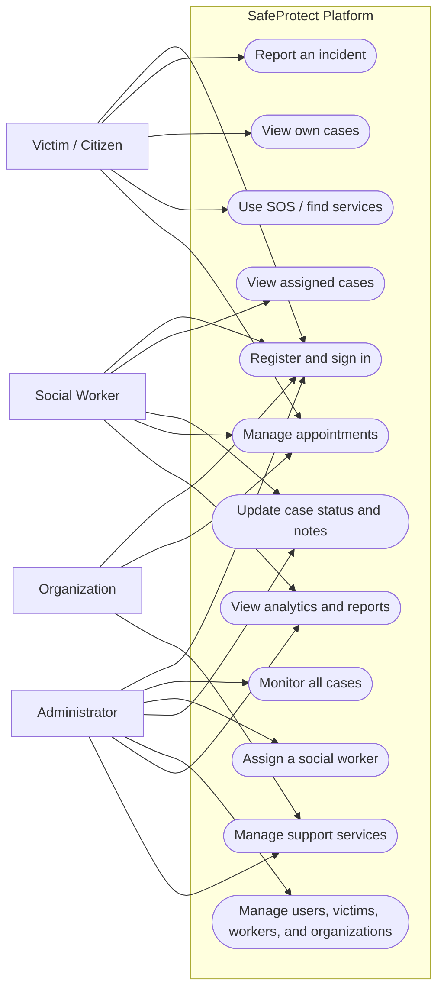
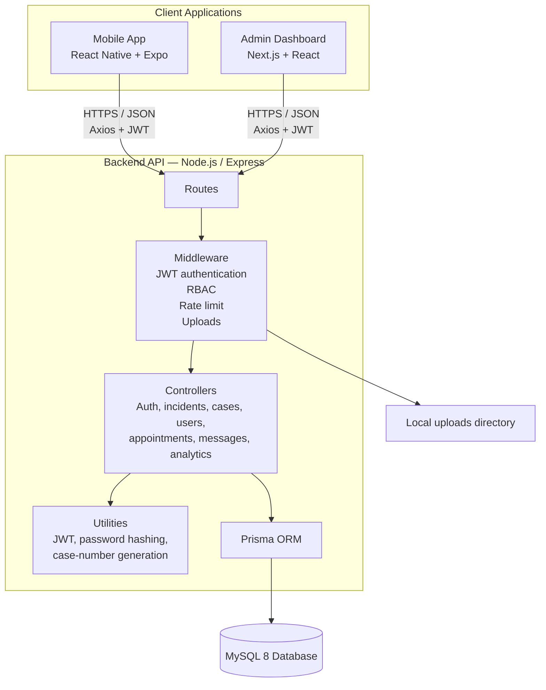
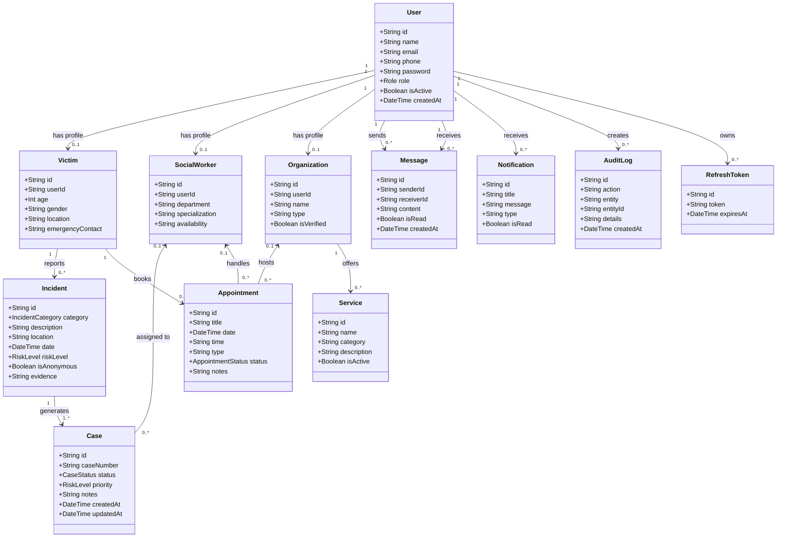
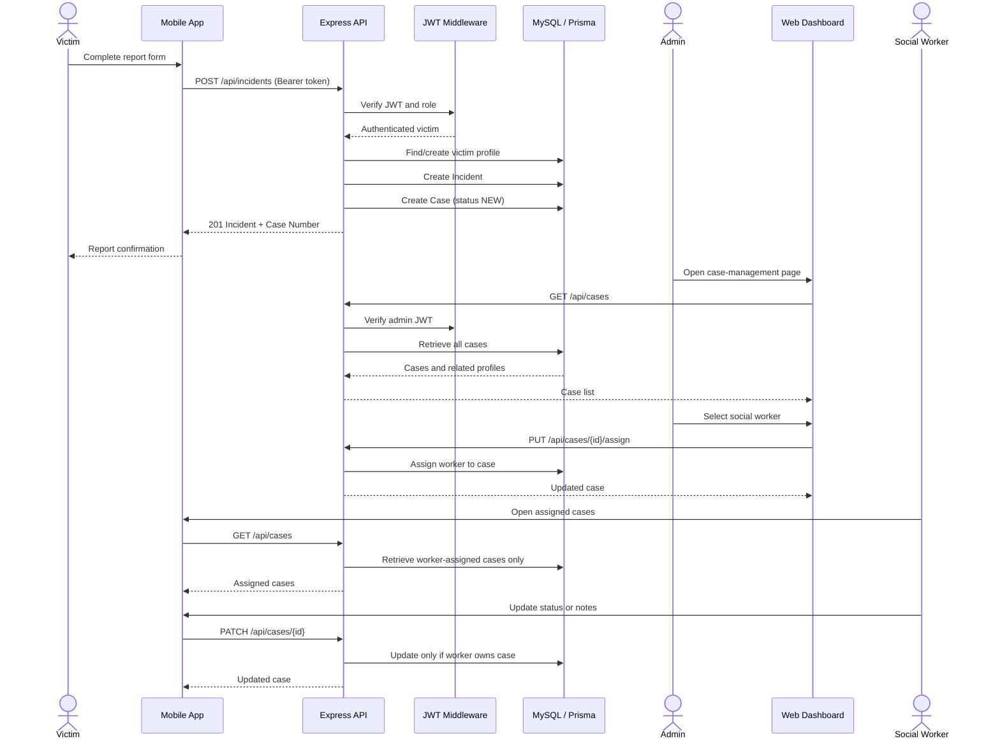
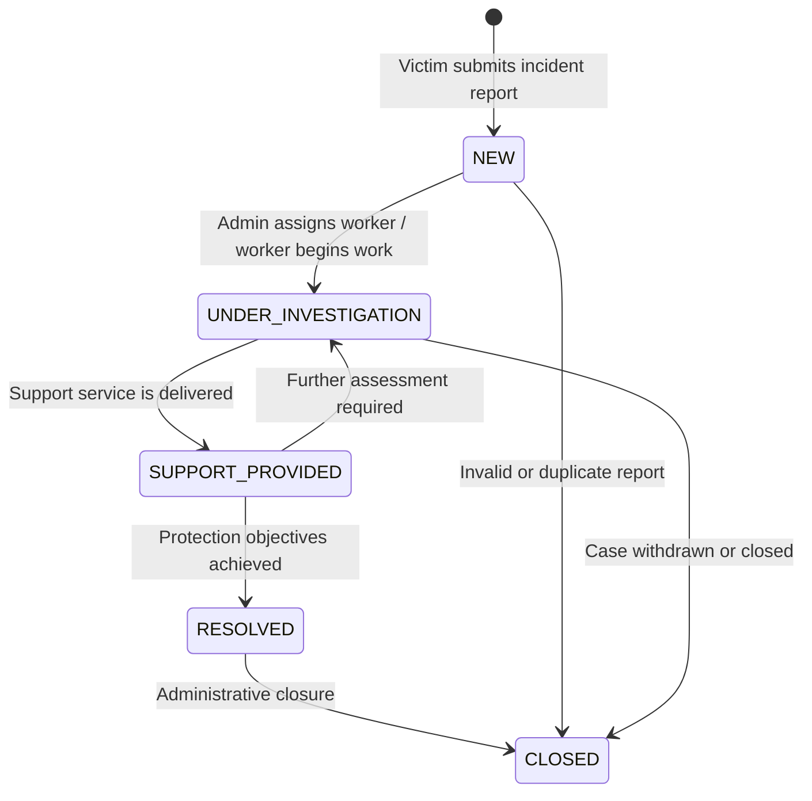

# SafeProtect Cameroon — UML Analysis Pack

## 1. System scope

SafeProtect is a child-protection and gender-based-violence case-management platform with three deployable applications:

- **Mobile application:** used primarily by victims and social workers.
- **Web dashboard:** used by administrators to monitor, assign, and update cases.
- **REST API:** Express/TypeScript service that applies authentication, authorization, business rules, and persistence through Prisma.

The diagrams below describe the codebase as implemented in August 2026. They are suitable for project analysis, reports, or presentation material.

---

## 2. Use-case diagram

### Main business rule

A victim creates an incident report. The API automatically creates a related case in the `NEW` state. An administrator assigns the case to a social worker. The assigned worker progresses the case through its permitted lifecycle.

---

## 3. Component diagram

### Layer responsibilities

| Layer | Responsibility |
|---|---|
| Mobile app | Victim reporting, personal case tracking, social-worker case updates, SOS and service screens. |
| Dashboard | Administrative case assignment, case-status updates, management views, analytics. |
| Routes | Maps `/api/*` HTTP endpoints to controller operations. |
| Middleware | Validates JWTs, applies role checks, rate limits requests, and receives evidence uploads. |
| Controllers | Implement the application use cases and ownership checks. |
| Prisma / MySQL | Stores users, role profiles, incidents, cases, appointments, communications, and audit data. |

---

## 4. Domain class diagram

### Enumerations

| Enumeration | Values |
|---|---|
| `Role` | `VICTIM`, `SOCIAL_WORKER`, `ORGANIZATION`, `ADMIN` |
| `CaseStatus` | `NEW`, `UNDER_INVESTIGATION`, `SUPPORT_PROVIDED`, `RESOLVED`, `CLOSED` |
| `RiskLevel` | `LOW`, `MEDIUM`, `HIGH`, `CRITICAL` |
| `IncidentCategory` | `PHYSICAL_ABUSE`, `SEXUAL_ABUSE`, `DOMESTIC_VIOLENCE`, `EMOTIONAL_ABUSE`, `NEGLECT`, `OTHER` |
| `AppointmentStatus` | `SCHEDULED`, `COMPLETED`, `CANCELLED` |

---

## 5. Sequence diagram — victim report to social-worker action

---

## 6. State diagram — case lifecycle

---

## 7. Authorization matrix

| Capability | Victim | Social worker | Admin | Organization |
|---|:---:|:---:|:---:|:---:|
| Register / login | Yes | Seeded/admin-created account | Seeded/admin-created account | Seeded/admin-created account |
| Submit incident report | Yes | Supported by API | Supported by API | Not a primary flow |
| See own cases | Yes | — | All cases | — |
| See assigned cases | — | Yes | All cases | — |
| Update case status / notes | No | Assigned cases only | All cases | No |
| Assign social worker | No | No | Yes | No |
| Manage users / workers / victims | No | No | Yes | No |
| View analytics | No | Yes | Yes | No |
| Manage services | No | No | Yes | Yes |

---

## 8. Key analysis observations

1. **Case ownership is enforced on the API.** Victims are scoped to cases tied to their own victim profile; social workers are scoped to cases assigned to their own profile; administrators can access all cases.
2. **A report creates both an `Incident` and a `Case`.** This avoids a manual creation step after a victim report.
3. **Assignment is an explicit admin responsibility.** A new case remains visible to administrators until it is assigned to a valid social-worker profile.
4. **The dashboard case-management page now consumes the live API.** It retrieves cases and workers, assigns a worker, and changes case status.
5. **Mobile navigation currently treats every non-victim role as the social-worker flow.** For a production system, add dedicated mobile navigation or deny mobile access for `ADMIN` and `ORGANIZATION` roles.
6. **Some appointment, profile, organization, and service controller operations are broader than the case ownership model.** Before production deployment, apply equivalent resource-ownership checks to those modules.

---

## 9. Suggested presentation order

1. Use-case diagram — explain project actors and objectives.
2. Component diagram — explain the architecture and technologies.
3. Class diagram — explain persistent data and relationships.
4. Sequence diagram — demonstrate the central victim-to-worker workflow.
5. State diagram — present the case-management lifecycle.
6. Authorization matrix — defend security and role separation.