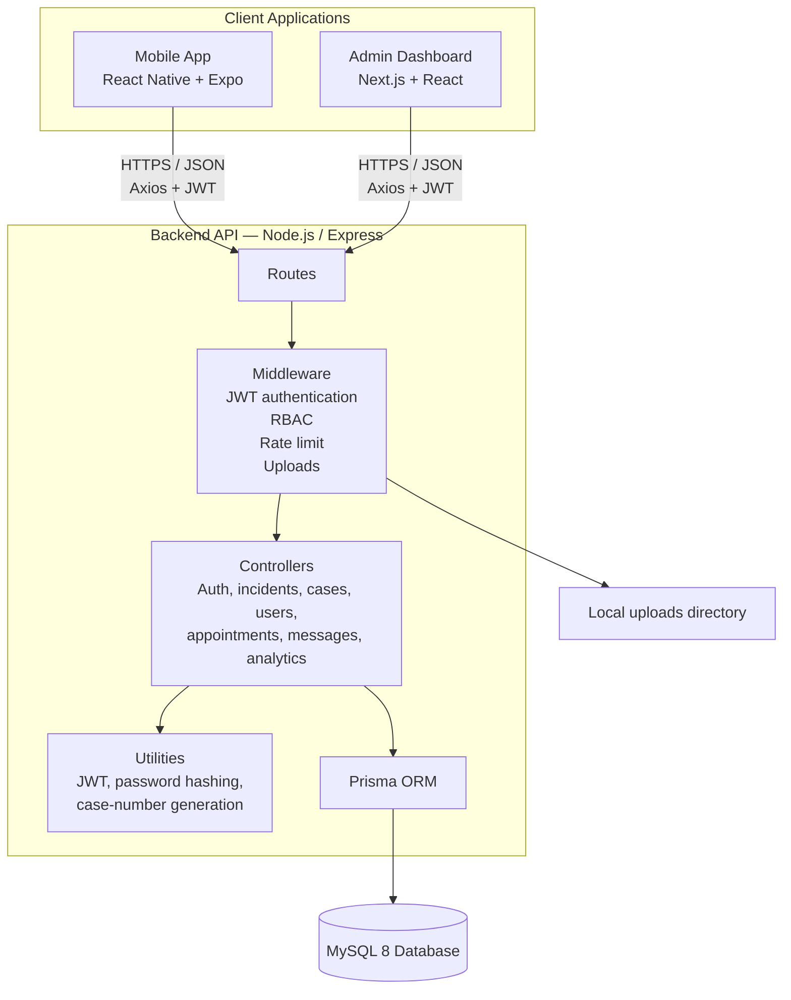
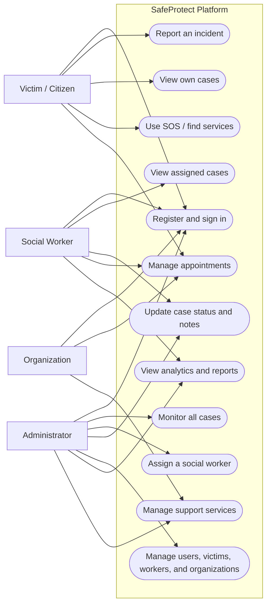
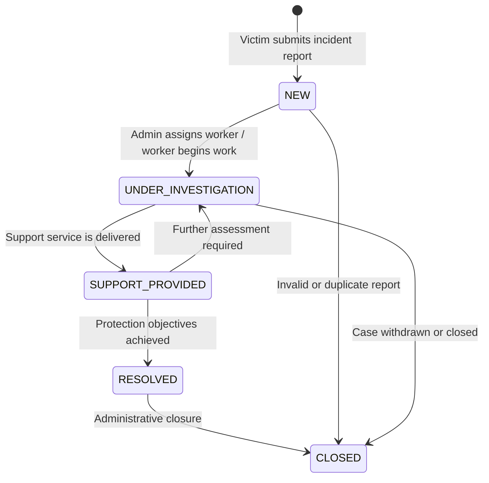
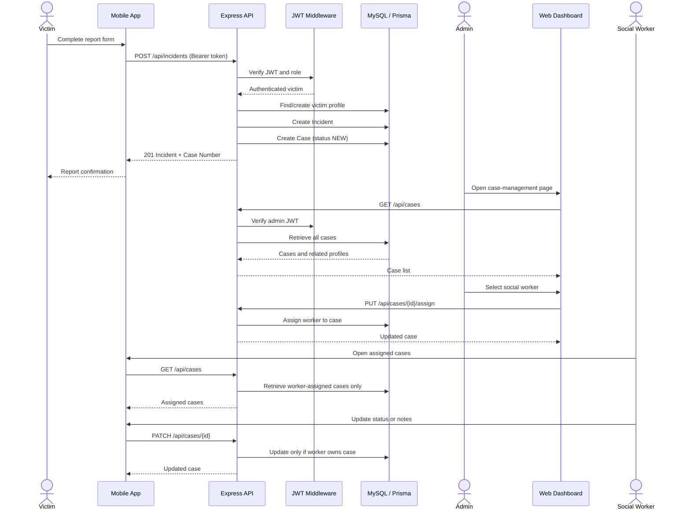

Checking where chat and login credentials are defined in code and seed data.

Searched for regex `email|password|admin|victim|social_worker|login|register` (`**/*.{ts,tsx,js,jsx,json,md}`), 326 results

Confirming the exact credential values from the repo docs and seed data.

Read [](file:///c%3A/Users/jasam/OneDrive/Desktop/SafeProtect/README.md#50-50), lines 50 to 80

## Chatbot location

- The chat UI is implemented at the mobile app level.
- File: ChatScreen.tsx
- It is currently just a placeholder screen:
  - `Header title="Chat"`
  - `Text` says `Chat functionality here`

There is also a message list screen in:
- MessagesScreen.tsx

> This means the chatbot/message feature lives in the mobile client, not in the backend API.

## Demo credentials

From README.md:

- Admin
  - Email: `admin@safeprotect.cm`
  - Password: `Admin@123`

- Social Worker
  - Email: `aline.ndey@safeprotect.cm`
  - Password: `Worker@123`

- Social Worker
  - Email: `eric.tchana@safeprotect.cm`
  - Password: `Worker@123`

- Victim
  - Email: `marie.dupont@email.cm`
  - Password: `Victim@123`
# SafeProtect Cameroon — Project Status Report

This document outlines the technical architecture, database schema, implemented features, and pending tasks for the SafeProtect Cameroon platform. It is designed to give another AI agent or developer a complete, self-contained overview of the codebase.

---

## 🏗️ 1. Technical Architecture & Component Diagrams

SafeProtect Cameroon is structured as a monorepo containing:
- **Backend API:** Express.js + Prisma ORM (MySQL 8) + TypeScript
- **Web Dashboard:** Next.js 14 + Shadcn UI + Tailwind CSS (for admins & service organizations)
- **Mobile App:** React Native + Expo + NativeWind (for victims & social workers)

### A. Component Layout


### B. Use-Case Diagram


### C. Case Lifecycle State Diagram


### D. Incident Reporting to Worker Assignment Sequence


### E. Authorization Matrix

| Capability | Victim | Social worker | Admin | Organization |
|---|:---:|:---:|:---:|:---:|
| Register / login | Yes | Seeded/admin-created | Seeded/admin-created | Seeded/admin-created |
| Submit incident report | Yes | Supported by API | Supported by API | No |
| See own cases | Yes | — | All cases | — |
| See assigned cases | — | Yes | All cases | — |
| Update case status / notes | No | Assigned cases only | All cases | No |
| Assign social worker | No | No | Yes | No |
| Manage users / workers | No | No | Yes | No |
| View analytics | No | Yes | Yes | No |
| Manage services | No | No | Yes | Yes |

---

## 🗄️ 2. Database Schema (Prisma Definition)

The database schema, implemented in **[schema.prisma](file:///c:/Users/jasam/OneDrive/Desktop/SafeProtect/backend-api/prisma/schema.prisma)**, models all profiles, logging, security tokens, and relationships:

```prisma
generator client {
  provider = "prisma-client-js"
}

datasource db {
  provider = "mysql"
  url      = env("DATABASE_URL")
}

enum Role {
  VICTIM
  SOCIAL_WORKER
  ORGANIZATION
  ADMIN
}

enum CaseStatus {
  NEW
  UNDER_INVESTIGATION
  SUPPORT_PROVIDED
  RESOLVED
  CLOSED
}

enum RiskLevel {
  LOW
  MEDIUM
  HIGH
  CRITICAL
}

enum IncidentCategory {
  PHYSICAL_ABUSE
  SEXUAL_ABUSE
  DOMESTIC_VIOLENCE
  EMOTIONAL_ABUSE
  NEGLECT
  OTHER
}

enum AppointmentStatus {
  SCHEDULED
  COMPLETED
  CANCELLED
}

model User {
  id        String   @id @default(uuid())
  name      String
  email     String   @unique
  phone     String?
  password  String
  role      Role     @default(VICTIM)
  avatar    String?
  isActive  Boolean  @default(true)
  createdAt DateTime @default(now())
  updatedAt DateTime @updatedAt

  victimProfile       Victim?
  socialWorkerProfile SocialWorker?
  organizationProfile Organization?

  sentMessages     Message[]      @relation("SentMessages")
  receivedMessages Message[]      @relation("ReceivedMessages")
  notifications    Notification[]
  auditLogs        AuditLog[]
  refreshTokens    RefreshToken[]
}

model Victim {
  id               String   @id @default(uuid())
  userId           String   @unique
  user             User     @relation(fields: [userId], references: [id])
  age              Int?
  gender           String?
  location         String?
  emergencyContact String?
  address          String?
  incidents        Incident[]
  appointments     Appointment[]
}

model SocialWorker {
  id                 String   @id @default(uuid())
  userId             String   @unique
  user               User     @relation(fields: [userId], references: [id])
  department         String?
  specialization     String?
  availability       String?
  assignedCasesCount Int      @default(0)
  cases              Case[]
  appointments       Appointment[]
}

model Organization {
  id          String   @id @default(uuid())
  userId      String   @unique
  user        User     @relation(fields: [userId], references: [id])
  name        String
  type        String?
  location    String?
  phone       String?
  email       String?
  description String?  @db.Text
  isVerified  Boolean  @default(false)
  createdAt   DateTime @default(now())
  services    Service[]
  appointments Appointment[]
}

model Incident {
  id          String           @id @default(uuid())
  victimId    String
  victim      Victim           @relation(fields: [victimId], references: [id])
  category    IncidentCategory
  description String           @db.Text
  location    String?
  date        DateTime
  riskLevel   RiskLevel
  evidence    String?
  isAnonymous Boolean          @default(false)
  createdAt   DateTime         @default(now())
  cases       Case[]
}

model Case {
  id               String       @id @default(uuid())
  caseNumber       String       @unique
  incidentId       String
  incident         Incident     @relation(fields: [incidentId], references: [id])
  assignedWorkerId String?
  assignedWorker   SocialWorker? @relation(fields: [assignedWorkerId], references: [id])
  status           CaseStatus   @default(NEW)
  priority         RiskLevel    @default(MEDIUM)
  notes            String?      @db.Text
  createdAt        DateTime     @default(now())
  updatedAt        DateTime     @updatedAt
}

model Appointment {
  id               String       @id @default(uuid())
  victimId         String
  victim           Victim       @relation(fields: [victimId], references: [id])
  organizationId   String?
  organization     Organization? @relation(fields: [organizationId], references: [id])
  socialWorkerId   String?
  socialWorker     SocialWorker? @relation(fields: [socialWorkerId], references: [id])
  title            String
  date             DateTime
  time             String
  type             String
  status           AppointmentStatus @default(SCHEDULED)
  notes            String?      @db.Text
  createdAt        DateTime     @default(now())
}

model Service {
  id             String       @id @default(uuid())
  organizationId String
  organization   Organization @relation(fields: [organizationId], references: [id])
  name           String
  category       String
  description    String?      @db.Text
  isActive       Boolean      @default(true)
}

model Message {
  id         String   @id @default(uuid())
  senderId   String
  sender     User     @relation("SentMessages", fields: [senderId], references: [id])
  receiverId String
  receiver   User     @relation("ReceivedMessages", fields: [receiverId], references: [id])
  content    String   @db.Text
  isRead     Boolean  @default(false)
  createdAt  DateTime @default(now())
}

model Notification {
  id        String   @id @default(uuid())
  userId    String
  user      User     @relation(fields: [userId], references: [id])
  title     String
  message   String
  type      String
  isRead    Boolean  @default(false)
  createdAt  DateTime @default(now())
}

model AuditLog {
  id        String   @id @default(uuid())
  userId    String
  user      User     @relation(fields: [userId], references: [id])
  action    String
  entity    String
  entityId  String
  details   String?  @db.Text
  createdAt DateTime @default(now())
}

model RefreshToken {
  id        String   @id @default(uuid())
  userId    String
  user      User     @relation(fields: [userId], references: [id])
  token     String   @unique
  expiresAt DateTime
  createdAt DateTime @default(now())
}
```

---

## ✅ 3. What Has Been Done (Implemented Features)

### A. Backend API (Express + TS)
- **Auth & Guard Middleware:** Token authentication using JWTs (15 min access, 7-day refresh token rotation) and Role-Based Access Control (RBAC).
- **Incident & Case Creation:** Creating an incident automatically spawns a corresponding Case in the `NEW` state with a custom formatted case number (`SPC-2026-XXXXX`).
- **Assignment & Lifecycle Controller:** Admin endpoints to update status and assign social workers to cases.
- **Analytics Endpoint:** Service calculations fetching dashboard statistics (total reports, active cases, closed cases, risk-level distributions).

### B. Web Dashboard (Next.js 14)
- **Client Auth:** LocalStorage token storage with route guarding.
- **Main Metrics Dashboard:** Live fetch of database metrics and charts using Recharts.
- **Case Management Table:** Displaying cases, dynamic search, status updates, and interactive dropdowns for social-worker assignment.

### C. Mobile App (React Native + Expo)
- **Navigation & Guarding:** Dynamic navigator checks user roles (`VICTIM` vs `SOCIAL_WORKER`) to present the appropriate interface stack.
- **Victim Features:**
  - **Incident Reporting Wizard:** Multi-step form (Category selection -> Details -> Review -> Submit) which calls the live backend API `/incidents`.
  - **Case Tracking:** Live fetch and status progression for cases owned by the authenticated victim.
  - **Emergency SOS Screen:** Quick triggers for SOS state and hotlines.
- **Social Worker Features:**
  - **SW Dashboard:** Lists cases assigned specifically to that social worker.
  - **SW Case Update:** Form to append progress notes or move case status (e.g., `UNDER_INVESTIGATION` to `SUPPORT_PROVIDED`).

---

## 🚧 4. What is Still To Do (Pending Checklist)

### 📱 A. Mobile Client API Integrations (Currently Mocked)
Many screens on the React Native mobile app currently display hardcoded UI components or static mock lists. These need to be connected to backend routes:
- [ ] **Appointments Screen:** Fetch and book appointments from the backend endpoints instead of using `upcomingAppointments` static array.
- [ ] **Services Directory:** Replace `servicesData` in the screen with a dynamic `api.get('/services')` call.
- [ ] **Messages & Conversations List:** Update `MessagesScreen` to query live messages between victims and assigned workers.
- [ ] **Chat Screen:** Bind the `ChatScreen` sending flow to hit `POST /api/messages` and implement polling/WebSockets instead of appending to local React state.

### 🛡️ B. Security, Access Controls & Enhancements
- [ ] **Mobile Route Guarding for Admins/Orgs:** If an administrator or organization logs into the mobile app, the navigator defaults to the Social Worker stack, causing potential errors. Add custom flows or restrict mobile login strictly to Victims & Workers.
- [ ] **Controller-level Case Ownership Enforcement:** While case assignment is secure, other controllers (appointments, profiles, services) need equivalent ownership validations to ensure one victim cannot view/modify another user's records.
- [ ] **Live File Evidence Upload on Mobile:** The incident report form defaults `evidence` to a simple payload. Integrate Expo Image Picker and rewrite the API post as `multipart/form-data` to support photo evidence attachments.
- [ ] **Push Notification Delivery:** Set up dynamic push notification alerts via FCM/Expo Notifications (the table schema exists, but triggers are not fully active in database events).
